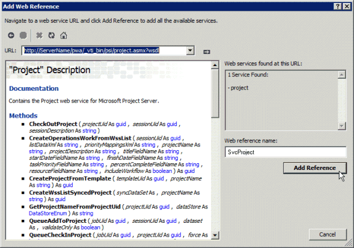

# <a name="prerequisites-for-asmx-based-code-samples-in-project"></a>Project 中基于 ASMX 的代码示例的先决条件

了解可帮助您通过使用 Project Server Interface (PSI) 参考主题中包含的基于 ASMX 的代码示例在 Visual Studio 创建项目的信息。
  
[Project Server 2013](https://msdn.microsoft.com/library/ef1830e0-3c9a-4f98-aa0a-5556c298e7d1%28Office.15%29.aspx)类库和 Web 服务引用中包含的许多代码示例最初是为 Office Project 2007 SDK 创建的，并使用 ASMX Web 服务的标准格式。 示例仍适用于 Project Server 2013，旨在复制到控制台应用程序并作为完整单元运行。 示例中注明了例外情况。 
  
Project 2013 SDK 中的新 PSI 示例符合使用 Communication Foundation Windows WCF (服务) 的格式。 此外，可以修改基于 ASMX 的示例以使用 WCF 服务。 本文演示如何将示例与 ASMX Web 服务一同使用。 有关将示例与 WCF 服务一同使用的信息，请参阅 Project 中的基于 WCF 的代码[示例的先决条件](prerequisites-for-wcf-based-code-samples-in-project.md)。
  
> [!NOTE]
> 在 Project Server 2013 中，已弃用 PSI 的 ASMX Web 服务接口，但它仍受支持。 如果客户端对象模型 (CSOM) 包括您的应用程序所需的方法，则应使用 CSOM 开发新的应用程序。 CSOM 使应用程序能够与 Project Online Server 2013 Project本地安装一起工作。 否则，如果您的应用程序使用 PSI，则应使用我们为网络通信推荐的 WCF 接口技术。 使用 ASMX 接口或 WCF 接口的应用程序仅适用于 Project Server 2013 本地安装。 有关 CSOM 详细信息，请参阅[Project Server 2013](project-server-2013-architecture.md)体系结构和客户端对象模型[ (CSOM) for Project 2013。](client-side-object-model-csom-for-project-2013.md) 
  
在运行代码示例之前，必须先设置开发环境、配置应用程序并更改泛型常量值以匹配您的环境。
  
## <a name="setting-up-the-development-environment"></a>设置开发环境
<a name="pj15_PrerequisitesASMX_Setup"> </a>

1. **设置测试 Project Server 系统**。
    
   在进行开发或测试时，请使用测试 Project Server 系统。即使您的代码正常运行，项目间的相关性、报告或其他环境因素也会导致意想不到的结果。 
    
   > [!NOTE]
   > 确保您是服务器上的有效用户，并检查您是否具有足够的权限调用您的应用程序使用的 PSI。 每个 PSI 方法的参考主题均包括一个 Project Server 权限表。 例如 [，Project。QueueCreateProject](https://msdn.microsoft.com/library/WebSvcProject.Project.QueueCreateProject.aspx)方法需要全局 **NewProject** 权限和 **SaveProjectTemplate** 权限。 
  
   在某些情况中，您可能必须在服务器上执行远程调试。 您可能还必须设置事件处理程序，方法为：在 SharePoint 场中的每台 Project Server 计算机上安装事件处理程序程序集，然后使用 SharePoint 管理中心常规应用程序 设置 中的 Project Server 设置 页配置 Project Web App 实例的事件处理程序。
    
2. **设置开发计算机。**
    
   通常，您会通过网络访问 PSI。代码示例设计为在独立于服务器的客户端上运行，除非另有说明。
    
   1. **安装正确版本的 Visual Studio。** 除非另有说明，否则将用 Visual C# 编写代码示例。 它们可用于 2010 Visual Studio 2012 Visual Studio 2012。 确保您已安装最新的 Service Pack。 
        
   2. **将 Project Server DLL 复制到开发计算机。** 将以下程序集从 `[Program Files]\Microsoft Office Servers\15.0\Bin` Project 服务器计算机上复制到开发计算机： 
        
      - Microsoft.Office.Project.Server.Events.Receivers.dll
      - Microsoft.Office.Project.Server.Library.dll
        
   3. 有关如何为 PSI 中的 ASMX Web 服务编译和使用 ProjectServerServices.dll 代理程序集的信息，请参阅[使用 PSI 代理程序集和 IntelliSense 说明](#pj15_PrerequisitesASMX_BuildingProxy)。
    
3. **安装 IntelliSense 文件。**
    
    若要对 Project Server 程序集中的类和成员使用 IntelliSense 说明，请从 Project 2013 SDK 下载将更新的 IntelliSense XML 文件复制到 Project Server 程序集所在的同一目录中。 例如，将 Microsoft.Office.Project.Server.Library.xml 文件复制到您的应用程序将在其中设置对 Microsoft.Office.Project.Server.Library.dll 程序集的引用的目录中。
    
    IntelliSense PSI Web 服务的说明要求在 Project 2013 SDK 下载的子目录中使用 CompileASMXProxyAssembly.cmd 脚本 `Documentation\IntelliSense\WSDL` 创建 PSI 代理程序集。 该脚本将创建基于 ASMX 的 ProjectServerServices.dll 代理程序集。 有关详细信息，请参阅 SDK 下载中的 [ReadMe_IntelliSense] 文件。 
    
## <a name="creating-the-application-and-adding-a-web-service-reference"></a>创建应用程序并添加 Web 服务引用
<a name="pj15_PrerequisitesASMX_Configure"> </a>

1. **创建控制台应用程序**。
    
   创建控制台应用程序时，请在“新建项目”对话框的下拉列表中，选择“.NET Framework 4”。可以将 PSI 示例代码复制到新的应用程序中。
    
2. **添加 ASMX 所需的引用。**
    
   在解决方案资源管理器中，添加对 **System.Web.Services** 的引用（见图 1）。 
    
   **图 1. 在 Visual Studio 中添加引用**

   
  
3. **复制代码**。
    
   将完整的代码示例复制到控制台应用程序的 Program.cs 文件中。
    
4. **设置示例应用程序的命名空间**。
    
   您可将示例顶部列出的命名空间更改为应用程序的默认命名空间，或更改默认的应用程序命名空间以与示例匹配。可以通过更改应用程序属性来更改默认应用程序命名空间。
    
   例如 [，QueueRenameProject](https://msdn.microsoft.com/library/WebSvcProject.Project.QueueRenameProject.aspx)的代码示例具有 **命名空间 Microsoft.SDK.Project。Samples.RenameProject**。 如果 Visual Studio 项目的名称为 **RenameProject**，请从 Program.cs 文件复制命名空间，然后在 Project 菜单上打开项目属性窗格 (，选择 **RenameProject 属性** **) 。** 在“应用程序”选项卡上，将命名空间复制到“默认命名空间”文本框中。 
    
5. **设置 Web 引用**。
    
   大多数示例都需要对一个或多个 PSI Web 服务的引用。它们将在示例本身中或示例前面的注释中列出。若要获取 Web 引用的正确命名空间，请确保您先设置默认应用程序命名空间。
    
   可通过三种方式添加 PSI 的 ASMX Web 服务引用：
    
   - 生成一个名为 ProjectServerServices.dll 的 PSI 代理程序集，然后设置对该程序集的引用。 若要获取 IntelliSense，建议通过此方式添加 PSI 引用。 请参阅[使用 PSI 代理程序集和 IntelliSense 说明](#pj15_PrerequisitesASMX_BuildingProxy)。
    
   - 将 wsdl.exe 输出中的代理文件添加到 Visual Studio 解决方案。请参阅[添加 PSI 代理文件](#pj15_PrerequisitesASMX_AddingProxyFile)。
    
   - 通过使用 Visual Studio 添加 Web 服务引用。请参阅[添加 Web 服务引用](#pj15_PrerequisitesASMX_AddingServiceReference)。

<a name="pj15_PrerequisitesASMX_BuildingProxy"> </a>

### <a name="using-a-psi-proxy-assembly-and-intellisense-descriptions"></a>使用 PSI 代理程序集和 IntelliSense 说明

您可以使用 Project 2013 SDK 下载文件夹中的 CompileASMXProxyAssembly.cmd 脚本为 PSI 中所有基于 ASMX 的 Web 服务构建和使用 ProjectServerServices.dll 代理程序集。 `Documentation\IntelliSense\WSDL` 有关下载的链接，请参阅 Project [2013 开发人员文档](project-2013-developer-documentation.md)。
  
> [!NOTE]
> 从 Source.zip 文件中提取代理源文件时，文件夹中的文件是自 `Documentation\IntelliSense\WSDL\Source` Project 2013 SDK 下载发布之日起的当前文件。 若要生成更新的 PSI 代理源文件，请在 Project Server 计算机上运行 GenASMXProxyAssembly.cmd 脚本。 文件夹中的  `Documentation\IntelliSense\WCF` 脚本对基于 ASMX 的应用程序不起作用。 GenWCFProxyAssembly.cmd 脚本调用 SvcUtil.exe，后者将为 WCF 服务生成源代码文件。 WCF 代理文件包括不同的属性、通道接口以及每个 PSI 服务的客服端类。 例如，基于 WCF 的 Resource 服务包括 **ResourceChannel** 接口、**Resource** 接口和 **ResourceClient** 类。 基于 ASMX 的 Resource Web 包括具有一些不同属性的 **Resource** 类。 
  
以下是 GenASMXProxyAssembly.cmd 脚本，该脚本为 PSI Web 服务生成 WSDL 输出文件，然后编译程序集。
  
```MS-DOS
@echo off
@ECHO ---------------------------------------------------
@ECHO Creating C# files for the ASMX-based proxy assembly
@ECHO ---------------------------------------------------
REM Replace ServerName with the name of the server and 
REM the instance name of Project Web App. Do not use localhost.
(set VDIR=https://ServerName/pwa/_vti_bin/psi)
(set OUTDIR=.\Source)
REM ** Wsdl.exe is the same version in the v6.0A and v7.0A subdirectories. 
(set WSDL="C:\Program Files (x86)\Microsoft SDKs\Windows\v7.0A\Bin\x64\wsdl.exe")
if not exist %OUTDIR% (
md %OUTDIR%
)
for /F %%i in (Classlist_asmx.txt) do %WSDL% /nologo /l:CS /namespace:Svc%%i /out:%OUTDIR%\wsdl.%%i.cs %VDIR%/%%i.asmx?wsdl 
@ECHO ----------------------------
@ECHO Compiling the proxy assembly
@ECHO ----------------------------
(set SOURCE=%OUTDIR%\wsdl)
(set CSC=%WINDIR%\Microsoft.NET\Framework64\v4.0.30319\csc.exe)
(set ASSEMBLY_NAME=ProjectServerServices.dll)
%CSC% /t:library /out:%ASSEMBLY_NAME% %SOURCE%*.cs
```

该脚本使用 ClassList_asmx.txt 文件，此文件包含可供第三方开发人员使用的 Web 服务的列表。
  
```text
Admin
Archive
Calendar
CubeAdmin
CustomFields
Driver
Events
LoginForms
LoginWindows
LookupTable
Notifications
ObjectLinkProvider
PortfolioAnalyses
Project
QueueSystem
ResourcePlan
Resource
Security
Statusing
TimeSheet
Workflow
WssInterop
```

该脚本创建一个名为 ProjectServerServices.dll 的程序集。请避免将该程序集与基于 WCF 的程序集的 ProjectServerServices.dll 混淆。这两个程序集的名称相同，若要启用任一程序集，请将其与 ProjectServerServices.xml IntelliSense 文件一起使用。
  
由于 ASMX Web 服务和 WCF 服务的脚本所创建的任意命名空间都是相同的，因此，ProjectServerServices.xml IntelliSense 文件将使用任一程序集。例如，基于 WCF 的代理程序集和基于 ASMX 的代理程序集中的 Resource 服务的命名空间为 **SvcResource**。当然，您可以更改命名空间名称 - 如果您确保它们在代理程序集和 ProjectServerServices.xml IntelliSense 文件中匹配。
  
如果代码示例为 PSI Web 服务命名空间使用其他名称（如 **ProjectWebSvc**），则若要让 IntelliSense 正常工作，您必须将示例更改为使用 **SvcProject**，以使命名空间与代理程序集匹配。 
  
使用基于 ASMX 的代理程序集的一个好处是，它包括所有 PSI Web 服务命名空间；您无需创建多个 Web 引用。 另一个好处是，如果您将 ProjectServerServices.xml 文件添加到您在其中设置对 ProjectServerServices.dll 代理程序集的引用的目录中，则可以获取 PSI 类和成员的 IntelliSense 说明。 图 2 显示了 **Project.QueueCreateProject** 方法的 IntelliSense 文本。 有关详细信息，请参阅 Project 2013 SDK 下载的 IntelliSense 文件夹中的 [ReadMe_IntelliSense] 文件。 
  
**图 2. 对 Project Web 服务中的方法使用 IntelliSense**

对 PSI 服务中的方法使用![Intellisense]对 PSI 服务中的方法(media/pj15_PrerequisitesASMX_Intellisense.gif "使用 Intellisense")
  
使用代理程序集的缺点是，解决方案更大并且您必须使用解决方案来分发和安装代理程序集。除非您将脚本和 ProjectServerServices.xml IntelliSense 文件更改为使用其他命名空间，否则还必须使用代理程序集和 IntelliSense 文件中的相同命名空间。
  
### <a name="adding-a-psi-proxy-file"></a>添加 PSI 代理文件
<a name="pj15_PrerequisitesASMX_AddingProxyFile"> </a>

the Project 2013 SDK download includes the source files generated by the Wsdl.exe command for the proxy assembly. 源文件在子Source.zip  `Documentation\IntelliSense\ASMX` 中。 您可以将一个或多个源文件添加到应用程序解决方案，而不是设置对代理程序集Visual Studio。 例如，运行 GenASMXProxyAssembly.cmd 脚本后，添加 wsdl。Project.cs 文件提交到解决方案。 可以运行以下命令来生成单个源文件，而不是运行脚本，例如： 
  
```MS-DOS
set VDIR=https://ServerName/ProjectServerName/_vti_bin/psi
set WSDL="C:\Program Files (x86)\Microsoft SDKs\Windows\v7.0A\Bin\x64\wsdl.exe"
%WSDL% /nologo /l:cs /namespace:SvcProject /out:wsdl.Project.cs %VDIR%/Project.asmx?wsdl
```

若要将 **Project** 对象定义为一个名为 **project** 的类变量，请使用以下代码。**AddContextInfo** 方法将上下文信息添加到 **project** 对象中以进行 Windows 身份验证和基于表单的身份验证。 
  
```cs
private static SvcProject.Project project;
private static SvcLoginForms.LoginForms loginForms =
            new SvcLoginForms.LoginForms();
. . .
public void AddContextInfo()
{
    // Add the Url property.
    project.Url = "https://ServerName /ProjectServerName /_vti_bin/psi/project.asmx";
    // Add Windows credentials.
    project.Credentials = CredentialCache.DefaultCredentials;
    // If Forms authentication is used, add the Project Server cookie.
    project.CookieContainer = loginForms.CookieContainer;
}
```

> [!NOTE]
> 无论您是使用 PSI 代理程序集还是添加名为 **SvcProject** 的 Project 服务引用的代理文件，都应使用相同的代码来创建 **project** 对象。 
  
### <a name="adding-a-web-service-reference"></a>添加 Web 服务引用
<a name="pj15_PrerequisitesASMX_AddingServiceReference"> </a>

如果您未使用基于 ASMX 的代理程序集或添加 WSDL 输出文件，则可以设置一个或多个单独的 Web 引用。 以下步骤显示如何使用 Visual Studio 2012 设置 Web 引用。
  
1. 在“解决方案资源管理器”中，右键单击“引用”文件夹，然后选择“添加服务引用”。 
    
2. 在“添加服务引用”对话框中，选择“高级”。
    
3. 在“服务引用设置”对话框中，选择“添加 Web 引用”。
    
4. 在 **"URL"** 文本框中，键入 `https:// _ServerName_/ _ProjectServerName_/_vti_bin/psi/ _ServiceName_.asmx?wsdl` ，然后按 **Enter** 或选择 **"转到"** 图标。 如果已安装安全套接字层 (SSL)，则应使用 HTTPS 协议而不是 HTTP 协议。 

   例如，对网站中的 Project 服务使用以下 `https://MyServer/pwa` URL，Project Web App：`https://MyServer/pwa/_vti_bin/psi/project.asmx?wsdl`
    
   或者，打开 Web 浏览器，然后导航到 `https://ServerName/ProjectServerName/_vti_bin/psi/ServiceName.asmx?wsdl` 。 将文件保存到本地目录，例如 `C:\Project\WebServices\ServiceName.wsdl` 。 在“添加 Web 引用”对话框中，对于“URL”，键入文件协议和该文件的路径。 例如，键入 `file://C:\Project\WebServices\Project.wsdl`。 
    
5. 解析引用后，在“Web 引用名称”文本框中键入引用名称。 Project 2013 开发人员文档中的代码示例使用任意标准引用名称 **Svc _ServiceName_**。 例如，将 Project Web 服务命名为 **SvcProject**（见图 3）。 
    
   **图 3. 添加 ASMX Web 服务引用**

   
  
对于必须在 Project Server 计算机上运行的应用程序组件，使用模拟，如果拥有提升的权限，则使用 WCF 服务引用而不是 ASMX Web 引用。 有关详细信息，请参阅中基于 WCF 的代码[示例的先决条件Project。](prerequisites-for-wcf-based-code-samples-in-project.md)
  
## <a name="setting-other-references"></a>设置其他引用
<a name="pj15_PrerequisitesASMX_OtherReferences"> </a>

Project服务器应用程序通常使用其他服务，如 SharePoint Server 2013 Web 服务。 如果需要其他服务，则将在示例中进行注明。
  
代码示例的本地引用将在位于该示例的顶部的 **using** 语句中列出： 
  
1. 在“解决方案资源管理器”中，右键单击“引用”文件夹，然后选择“添加引用”。
    
2. 选择“浏览”，然后浏览到之前复制的 Project Server DLL 的存储位置。选择您所需的 DLL，然后选择“确定”。
    
> [!NOTE]
> 确保您的开发计算机上的程序集版本与目标 Project Server 计算机上的程序集版本完全匹配。 
  
## <a name="using-multiple-authentication"></a>使用多身份验证
<a name="pj15_PrerequisitesASMX_ClaimsMultiAuth"> </a>

内部部署 Project Server 用户的身份验证（无论是通过 Windows 身份验证还是表单身份验证）都通过 SharePoint Server 2013 中的声明处理完成。 多身份验证意味着设置Project Web App Web 应用程序支持Windows身份验证和基于表单的身份验证。 如果是这样的话，对使用 Windows 身份验证的 ASMX Web 服务的调用将失败，并会出现以下错误，这是因为声明过程无法确定要对哪一类用户进行身份验证：
  
`The server was unable to process the request due to an internal error. . . .`

若要为 ASMX 解决此问题，对 PSI 方法的所有调用都应成为针对每个 PSI Web 服务定义的派生类。该派生类还必须使用 **SvcLoginWindows.LoginWindows** 类获取派生 PSI 服务类的 cookie。在下面的示例中，**ProjectDerived** 类从 **SvcProject.Project** 类派生。派生的类会添加 **EnforceWindowsAuth** 属性，并为对 **Project** 类中的方法的每个调用重写 Web 请求标头。如果 **EnforceWindowsAuth** 属性为 **true**，则 **GetWebRequest** 方法将添加禁用表单身份验证的标头。如果 **EnforceWindowsAuth** 属性为 **false**，则可以继续进行表单身份验证。
  
若要使用下面的 **ASMXLogon_MultiAuth** 示例，请创建一个控制台应用程序，按照 [创建应用程序并添加 Web 服务引用](#pj15_PrerequisitesASMX_Configure)中的步骤进行操作，然后添加 wsdl.LoginWindows.cs 代理文件和 wsdl.Project.cs 代理文件。**Main** 方法将创建 **ProjectDerived** 类的 **project** 实例。该示例必须使用派生的 **LoginWindowsDerived** 类获取 **project.CookieContainer** 属性的 **CookieContainer** 对象，从而区分表单身份验证和 Windows 身份验证。随后，可使用 **project** 对象调用 **SvcProject.Project** 类中的任何方法。 
  
> [!NOTE]
> **LoginWindows** 服务仅对于多身份验证环境中的 ASMX 应用程序是必需的。在 **ASMXLogon_MultiAuth** 示例中，**GetLogonCookie** 方法将获取 **loginWindows** 对象的 cookie。**project.CookieContainer** 属性将设置为 **loginWindows.CookieContainer** 值。 
  
```cs
using System;
using System.Net;
using PSLibrary = Microsoft.Office.Project.Server.Library;
namespace ASMXLogon_MultiAuth
{
    class Program
    {
        private const string PROJECT_SERVER_URL = 
            "https://ServerName/ProjectServerName/_vti_bin/psi/";
        static void Main(string[] args)
        {
            bool isWindowsUser = true;
            // Create an instance of the project object.
            ProjectDerived project = new ProjectDerived();
            project.Url = PROJECT_SERVER_URL + "Project.asmx";
            project.Credentials = CredentialCache.DefaultCredentials;
            try
            {
                // The program works on a Windows-auth-only computer if you comment-out the
                // following line. The line is required for multiple authentication.
                project.CookieContainer = GetLogonCookie();
                project.EnforceWindowsAuth = isWindowsUser;
                // Get a list of all published projects. 
                // Use ReadProjectStatus instead of ReadProjectList,
                // because the permission requirements are lower.
                SvcProject.ProjectDataSet projectDs =
                    project.ReadProjectStatus(Guid.Empty,
                        SvcProject.DataStoreEnum.PublishedStore,
                        string.Empty,
                        (int)PSLibrary.Project.ProjectType.Project);
                Console.WriteLine(string.Format(
                    "There are {0} published projects.", 
                    projectDs.Project.Rows.Count));
            }
            catch (UnauthorizedAccessException ex)
            {
                Console.WriteLine(ex.Message);
            }
            catch (WebException ex)
            {
                Console.WriteLine(ex.Message);
            }
            finally
            {
                Console.Write("Press any key to continue...");
                Console.ReadKey(false);
            }
        }
        private static CookieContainer GetLogonCookie()
        {
            // Create an instance of the loginWindows object.
            LoginWindowsDerived loginWindows = new LoginWindowsDerived();
            loginWindows.EnforceWindowsAuth = true;
            loginWindows.Url = PROJECT_SERVER_URL + "LoginWindows.asmx";
            loginWindows.Credentials = CredentialCache.DefaultCredentials;
            loginWindows.CookieContainer = new CookieContainer();
            if (!loginWindows.Login())
            {
                // Login failed; throw an exception.
                throw new UnauthorizedAccessException("Login failed.");
            }
            return loginWindows.CookieContainer;
        }
    }
    // Derive from LoginWindows class; include additional property and 
    // override the web request header.
    class LoginWindowsDerived : SvcLoginWindows.LoginWindows
    {
        public bool EnforceWindowsAuth { get; set; }
        protected override WebRequest GetWebRequest(Uri uri)
        {
            WebRequest request = base.GetWebRequest(uri);
            if (this.EnforceWindowsAuth)
            {
                request.Headers.Add("X-FORMS_BASED_AUTH_ACCEPTED", "f");
            }
            return request;
        }
    }
    // Derive from Project class; include additional property and 
    // override the web request header.
    class ProjectDerived : SvcProject.Project
    {
        public bool EnforceWindowsAuth { get; set; }
        protected override WebRequest GetWebRequest(Uri uri)
        {
            WebRequest request = base.GetWebRequest(uri);
            if (this.EnforceWindowsAuth)
            {
                request.Headers.Add("X-FORMS_BASED_AUTH_ACCEPTED", "f");
            }
            return request;
        }
    }
}
```

对于在多身份验证环境中运行的应用程序，要求使用派生的 **LoginWindows** 类，并使用禁用表单身份验证的 Web 请求标头来调用 PSI。如果 Project Server 仅使用声明身份验证，则无需派生将添加 Web 请求标头的类。上一个示例在两种环境中均可运行。 
  
针对基于 WCF 的应用程序的修复有所不同。 有关详细信息，请参阅[Prerequisites for WCF-based code samples in Project 中的"使用多个身份验证"部分](prerequisites-for-wcf-based-code-samples-in-project.md)。
  
## <a name="changing-the-values-of-generic-constants"></a>更改泛型常量的值
<a name="pj15_PrerequisitesASMX_ChangeValues"> </a>

大多数示例都包含一个或多个变量，为了让示例在您的环境中正常工作，您必须更新这些变量。 在下面的示例中，如果已安装 SSL，请使用 HTTPS 协议而不是 HTTP 协议。 将  _ServerName_ 替换为您当前使用的服务器的名称。 将 _ProjectServerName_ 替换为您的 Project Server 网站的虚拟目录名称，例如PWA。 
  
```cs
const string PROJECT_SERVER_URI = "https://ServerName/ProjectServerName/";
```

您必须更改的所有其他变量或其他先决条件均已在代码示例的顶部注明。
  
## <a name="verifying-the-results"></a>验证结果
<a name="pj15_PrerequisitesASMX_Verify"> </a>

从代码示例中获取并解释结果并不总是一项简单的工作。 例如，如果您创建了一个项目，则必须先发布该项目，然后该项目才能显示在 Project 中心页上Project Web App。
  
可以通过多种方式验证代码示例结果，例如：
  
- 使用 Project Professional 2013 客户端从 Project Server 计算机打开项目，并查看您需要的项目。
    
- 在"网站中心"Project查看已发布 `https://ServerName/ProjectServerName/projects.aspx` Project Web App () 。
    
- 查看队列日志中的Project Web App。 打开"服务器设置" (选择右上角) 中的 **设置** 图标，然后选择"个人 设置"部分下的"我的排队作业 `https://ServerName/ProjectServerName/MyJobs.aspx` () 。 在“视图”下拉列表中，可以按作业的状态进行排序。 默认状态为“上周进行中的以及失败的作业”。 
    
- 使用 设置中的"服务器Project Web App () 管理所有队列作业，并删除或强制 `https://ServerName/ProjectServerName/_layouts/15/pwa/admin/admin.aspx` 签入企业对象。 您必须具有管理权限才能访问“服务器设置”页上的这些链接。
    
- 使用“Microsoft SQL Server Management Studio”对 Project 数据库中的表运行查询。例如，使用下列查询可选择 pub.MSP_WORKFLOW_STAGE_PDPS 表的前 200 行以显示有关工作流容器中的项目详细信息页 (PDP) 的信息。 
    
   ```sql
    SELECT TOP 200 [STAGE_UID]
            ,[PDP_UID]
            ,[PDP_NAME]
            ,[PDP_POSITION]
            ,[PDP_ID]
            ,[PDP_STAGE_DESCRIPTION]
            ,[PDP_REQUIRES_ATTENTION]
        FROM [ProjectService].[pub].[MSP_WORKFLOW_STAGE_PDPS]
   ```

## <a name="cleaning-up"></a>清理
<a name="pj15_PrerequisitesASMX_Cleanup"> </a>

测试一些代码示例之后，有一些企业对象和设置应进行删除或重置。 可以使用 设置 中的"服务器Project Web App"页来管理企业 `https://ServerName/ProjectServerName/_layouts/15/pwa/admin/admin.aspx` () 。 利用“服务器设置”页上的链接，您可以删除旧项目、强制签入项目、管理所有用户的作业队列和执行其他管理任务。
  
以下是“服务器设置”页上的一些链接，可在运行完代码示例后使用这些链接进行典型的清理活动：
  
- **企业自定义域和查阅表格**
    
- **管理队列作业**
    
- **删除企业对象**
    
- **强制签入企业对象**
    
- **企业项目类型**
    
- **工作流阶段**
    
- **工作流容器**
    
- **项目详细信息页**
    
- **时间报告阶段**
    
- **时间表设置和默认值**
    
- **行分类**
    
其他设置由 SharePoint Server 2013 针对每个 Project Web App 实例进行管理，而不是通过特定的 Project Web App Server 设置 页面进行管理。 在 SharePoint 管理中心应用程序中，选择"一般应用程序 设置"，选择 **"Project Server 设置"下的"管理"，** 然后在"服务器"设置 页上的下拉列表中选择 Project Web App 实例。 例如，选择 **"服务器端事件处理程序**"为所选事件实例添加或删除Project Web App处理程序。 
  
## <a name="see-also"></a>另请参阅
<a name="pj15_PrerequisitesASMX_AR"> </a>

- [Project 中基于 WCF 的代码示例的先决条件](prerequisites-for-wcf-based-code-samples-in-project.md)
- [将模拟与 WCF 一同使用](https://msdn.microsoft.com/library/e3597901-2f02-44a2-8076-d32aae540b38%28Office.15%29.aspx)
- [Project PSI 参考概述](project-psi-reference-overview.md)
- [SharePoint 开发中心](https://msdn.microsoft.com/sharepoint/default.aspx)
    

