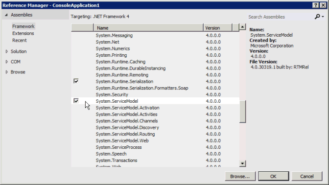

# <a name="prerequisites-for-wcf-based-code-samples-in-project"></a><span data-ttu-id="10388-103">Project 中基于 WCF 的代码示例的先决条件</span><span class="sxs-lookup"><span data-stu-id="10388-103">Prerequisites for WCF-based code samples in Project</span></span>

<span data-ttu-id="10388-104">了解可帮助您在 Visual Studio 中创建项目的信息, 方法是使用 Project Server Interface (PSI) 参考主题中包含的基于 WCF 的代码示例。</span><span class="sxs-lookup"><span data-stu-id="10388-104">Learn information to help you create projects in Visual Studio by using the WCF-based code samples that are included in the Project Server Interface (PSI) reference topics.</span></span>
   
<span data-ttu-id="10388-105">[project Server 2013 类库和 web 服务引用](https://msdn.microsoft.com/library/ef1830e0-3c9a-4f98-aa0a-5556c298e7d1%28Office.15%29.aspx)中包含的许多基于 WCF 的代码示例最初都是为 project 2010 开发人员文档创建的, 并对 WCF web 服务使用标准格式。</span><span class="sxs-lookup"><span data-stu-id="10388-105">Many of the WCF-based code samples included in the [Project Server 2013 class library and web service reference](https://msdn.microsoft.com/library/ef1830e0-3c9a-4f98-aa0a-5556c298e7d1%28Office.15%29.aspx) were originally created for the Project 2010 developer documentation, and use a standard format for WCF web services.</span></span> <span data-ttu-id="10388-106">该示例仍适用于 Project Server 2013, 并设计为将其复制到控制台应用程序中并作为一个完整的单元运行。</span><span class="sxs-lookup"><span data-stu-id="10388-106">The samples still work in Project Server 2013 and are designed to be copied into a console application and run as a complete unit.</span></span> <span data-ttu-id="10388-107">示例中注明了例外情况。</span><span class="sxs-lookup"><span data-stu-id="10388-107">Exceptions are noted in the sample.</span></span> 
  
<span data-ttu-id="10388-108">project 2013 开发人员文档中的代码示例在为 Office Project Server 2007 开发的示例中保持不变。使用 .asmx Web 服务。</span><span class="sxs-lookup"><span data-stu-id="10388-108">Code samples in the Project 2013 developer documentation that are unchanged from the samples developed for Office Project Server 2007 use ASMX Web services.</span></span> <span data-ttu-id="10388-109">此外，可以修改基于 ASMX 的示例以使用 WCF 服务。</span><span class="sxs-lookup"><span data-stu-id="10388-109">The ASMX-based samples can also be adapted to use WCF services.</span></span> <span data-ttu-id="10388-110">本文演示如何使用使用 WCF 服务的示例。</span><span class="sxs-lookup"><span data-stu-id="10388-110">This article shows how to use the samples with WCF services.</span></span> <span data-ttu-id="10388-111">有关如何将示例与 .asmx web 服务一起使用的信息, 请参阅[Project 中基于 .asmx 的代码示例的先决条件](prerequisites-for-asmx-based-code-samples-in-project.md)。</span><span class="sxs-lookup"><span data-stu-id="10388-111">For information about how to use the samples with ASMX web services, see [Prerequisites for ASMX-based code samples in Project](prerequisites-for-asmx-based-code-samples-in-project.md).</span></span>
  
> [!NOTE]
> <span data-ttu-id="10388-112">如果客户端对象模型 (CSOM) 包括您的应用程序所需的方法，则应使用 CSOM 开发新的应用程序。</span><span class="sxs-lookup"><span data-stu-id="10388-112">If the client-side object model (CSOM) includes the methods that your application requires, new applications should be developed with the CSOM.</span></span> <span data-ttu-id="10388-113">CSOM 使应用程序能够使用 project Online 或 project Server 2013 的本地安装。</span><span class="sxs-lookup"><span data-stu-id="10388-113">The CSOM enables applications to work with Project Online or an on-premises installation of Project Server 2013.</span></span> <span data-ttu-id="10388-114">否则，如果您的应用程序使用 PSI，则应使用我们为网络通信推荐的 WCF 接口技术。</span><span class="sxs-lookup"><span data-stu-id="10388-114">Otherwise, if your application uses the PSI, it should use the WCF interface, which is the technology that we recommend for network communications.</span></span> <span data-ttu-id="10388-115">使用 .asmx 接口或 WCF 接口的应用程序只能在本地安装的 Project Server 2013 中运行。</span><span class="sxs-lookup"><span data-stu-id="10388-115">Applications that use the ASMX interface or the WCF interface can work only for on-premises installations of Project Server 2013.</span></span> 
>
> <span data-ttu-id="10388-116">有关 CSOM 的详细信息, 请参阅 project 2013 的[project Server 2013 体系结构](project-server-2013-architecture.md)和[客户端对象模型 (CSOM)](client-side-object-model-csom-for-project-2013.md)。</span><span class="sxs-lookup"><span data-stu-id="10388-116">For more information about the CSOM, see [Project Server 2013 architecture](project-server-2013-architecture.md) and [Client-side object model (CSOM) for Project 2013](client-side-object-model-csom-for-project-2013.md).</span></span> 
  
<span data-ttu-id="10388-117">在运行代码示例之前，您必须设置开发环境、配置应用程序、添加服务配置文件（或以编程方式配置 WCF 服务）并更改泛型常量值以与您的环境匹配。</span><span class="sxs-lookup"><span data-stu-id="10388-117">Before running the code samples, you must set up the development environment, configure the application, add a service configuration file (or configure the WCF services programmatically), and change generic constant values to match your environment.</span></span>
  
## <a name="setting-up-the-development-environment"></a><span data-ttu-id="10388-118">设置开发环境</span><span class="sxs-lookup"><span data-stu-id="10388-118">Setting up the development environment</span></span>
<span data-ttu-id="10388-119"><a name="pj15_PrerequisitesWCF_Setup"> </a></span><span class="sxs-lookup"><span data-stu-id="10388-119"></span></span>

1. <span data-ttu-id="10388-120">**设置测试 Project Server 系统。**</span><span class="sxs-lookup"><span data-stu-id="10388-120">**Set up a test Project Server system.**</span></span>
    
    <span data-ttu-id="10388-p104">在进行开发或测试时，请使用测试 Project Server 系统。即使您的代码正常运行，项目间的相关性、报告或其他环境因素也会导致意想不到的结果。</span><span class="sxs-lookup"><span data-stu-id="10388-p104">Use a test Project Server system whenever you are developing or testing. Even when your code works perfectly, interproject dependencies, reporting, or other environmental factors can cause unintended consequences.</span></span> 
    
    > [!NOTE]
    > <span data-ttu-id="10388-123">确保您是服务器上的有效用户，并检查您是否具有足够的权限调用您的应用程序使用的 PSI。</span><span class="sxs-lookup"><span data-stu-id="10388-123">Ensure that you are a valid user on the server, and check that you have sufficient permissions for the PSI calls that your application uses.</span></span> <span data-ttu-id="10388-124">开发人员文档中针对每个 PSI 方法的主题均包含一个 Project Server 权限表。</span><span class="sxs-lookup"><span data-stu-id="10388-124">The developer documentation topic for each PSI method includes a Project Server Permissions table.</span></span> <span data-ttu-id="10388-125">例如, [QueueCreateProject](https://msdn.microsoft.com/library/WebSvcProject.Project.QueueCreateProject.aspx)方法需要全局**NewProject**权限和**SaveProjectTemplate**权限。</span><span class="sxs-lookup"><span data-stu-id="10388-125">For example, the [Project.QueueCreateProject](https://msdn.microsoft.com/library/WebSvcProject.Project.QueueCreateProject.aspx) method requires the global **NewProject** permission and the **SaveProjectTemplate** permission.</span></span> 
  
    <span data-ttu-id="10388-126">在某些情况中，您可能必须在服务器上执行远程调试。</span><span class="sxs-lookup"><span data-stu-id="10388-126">In some cases, you may have to do remote debugging on the server.</span></span> <span data-ttu-id="10388-127">您可能还需要通过在 SharePoint 场中的每台 Project server 计算机上安装事件处理程序程序集来设置事件处理程序, 然后使用 project Server Settings page in General 为 project Web App 实例配置事件处理程序。SharePoint 管理中心的应用程序设置。</span><span class="sxs-lookup"><span data-stu-id="10388-127">You may also have to set up an event handler by installing an event handler assembly on each Project Server computer in the SharePoint farm, and then configuring the event handler for the Project Web App instance by using the Project Server Settings page in the General Application Settings of SharePoint Central Administration.</span></span>
    
2. <span data-ttu-id="10388-128">**设置开发计算机。**</span><span class="sxs-lookup"><span data-stu-id="10388-128">**Set up a development computer.**</span></span>
    
    <span data-ttu-id="10388-p107">通常，您会通过网络访问 PSI。代码示例设计为在独立于服务器的客户端上运行，除非另有说明。</span><span class="sxs-lookup"><span data-stu-id="10388-p107">You usually access the PSI through a network. The code samples are designed to be run on a client that is separate from the server, except where noted.</span></span>
    
    1. <span data-ttu-id="10388-131">**安装正确版本的 Visual Studio。**</span><span class="sxs-lookup"><span data-stu-id="10388-131">**Install the correct version of Visual Studio.**</span></span> <span data-ttu-id="10388-132">除非另有说明，否则将用 Visual C# 编写代码示例。</span><span class="sxs-lookup"><span data-stu-id="10388-132">Except where noted, the code samples are written in Visual C#.</span></span> <span data-ttu-id="10388-133">它们可用于 Visual studio 2010 或 visual studio 2012。</span><span class="sxs-lookup"><span data-stu-id="10388-133">They can be used with Visual Studio 2010 or Visual Studio 2012.</span></span> <span data-ttu-id="10388-134">确保您已安装最新的 Service Pack。</span><span class="sxs-lookup"><span data-stu-id="10388-134">Ensure that you have the most recent service pack installed.</span></span> 
    
    2. <span data-ttu-id="10388-135">**将 Project Server DLL 复制到开发计算机。**</span><span class="sxs-lookup"><span data-stu-id="10388-135">**Copy Project Server DLLs to the development computer.**</span></span> <span data-ttu-id="10388-136">将以下程序集从`[Program Files]\Microsoft Office Servers\15.0\Bin` Project Server 计算机上复制到开发计算机:</span><span class="sxs-lookup"><span data-stu-id="10388-136">Copy the following assemblies from  `[Program Files]\Microsoft Office Servers\15.0\Bin` on the Project Server computer to the development computer:</span></span> 
    
       - <span data-ttu-id="10388-137">Microsoft.Office.Project.Server.Events.Receivers.dll</span><span class="sxs-lookup"><span data-stu-id="10388-137">Microsoft.Office.Project.Server.Events.Receivers.dll</span></span>
    
       - <span data-ttu-id="10388-138">Microsoft.Office.Project.Server.Library.dll</span><span class="sxs-lookup"><span data-stu-id="10388-138">Microsoft.Office.Project.Server.Library.dll</span></span>
    
    3. <span data-ttu-id="10388-139">有关如何在 PSI 中编译 ProjectServerServices.dll 代理程序集并将其用于 WCF 服务的信息，请参阅[使用 PSI 代理程序集和 IntelliSense 说明](#pj15_PrerequisitesWCF_BuildingProxy)。</span><span class="sxs-lookup"><span data-stu-id="10388-139">For information about how to compile and use the ProjectServerServices.dll proxy assembly for the WCF services in the PSI, see [Using a PSI proxy assembly and IntelliSense descriptions](#pj15_PrerequisitesWCF_BuildingProxy).</span></span>
    
3. <span data-ttu-id="10388-140">**安装 IntelliSense 文件。**</span><span class="sxs-lookup"><span data-stu-id="10388-140">**Install the IntelliSense files.**</span></span>
    
    <span data-ttu-id="10388-141">若要在 project server 程序集中使用类和成员的智能感知说明, 请将更新后的智能感知 XML 文件从 project 2013 SDK 下载中复制到 project server 程序集所在的同一目录中。</span><span class="sxs-lookup"><span data-stu-id="10388-141">To use IntelliSense descriptions for classes and members in Project Server assemblies, copy the updated IntelliSense XML files from the Project 2013 SDK download to the same directory where the Project Server assemblies are located.</span></span> <span data-ttu-id="10388-142">例如，将 Microsoft.Office.Project.Server.Library.xml 文件复制到您的应用程序将在其中设置对 Microsoft.Office.Project.Server.Library.dll 程序集的引用的目录中。</span><span class="sxs-lookup"><span data-stu-id="10388-142">For example, copy the Microsoft.Office.Project.Server.Library.xml file to the directory where your application will set a reference to the Microsoft.Office.Project.Server.Library.dll assembly.</span></span>
    
    <span data-ttu-id="10388-143">psi 服务的智能感知说明要求您使用 Project 2013 SDK 下载中的`Documentation\IntelliSense\WCF`子目录中的 CompileWCFProxyAssembly 脚本创建 psi 代理程序集。</span><span class="sxs-lookup"><span data-stu-id="10388-143">IntelliSense descriptions for the PSI services require that you create a PSI proxy assembly by using the CompileWCFProxyAssembly.cmd script in the  `Documentation\IntelliSense\WCF` subdirectory in the Project 2013 SDK download.</span></span> <span data-ttu-id="10388-144">此脚本将创建基于 WCF 的 ProjectServerServices.dll 代理程序集。</span><span class="sxs-lookup"><span data-stu-id="10388-144">The script creates the WCF-based ProjectServerServices.dll proxy assembly.</span></span> <span data-ttu-id="10388-145">有关详细信息，请参阅 SDK 下载中的 [ReadMe_IntelliSense].mht 文件。</span><span class="sxs-lookup"><span data-stu-id="10388-145">For more information, see the [ReadMe_IntelliSense].mht file in the SDK download.</span></span> 
    
## <a name="creating-the-application-and-adding-a-service-reference"></a><span data-ttu-id="10388-146">创建应用程序并添加服务引用</span><span class="sxs-lookup"><span data-stu-id="10388-146">Creating the application and adding a service reference</span></span>
<span data-ttu-id="10388-147"><a name="pj15_PrerequisitesWCF_Configure"> </a></span><span class="sxs-lookup"><span data-stu-id="10388-147"></span></span>

1. <span data-ttu-id="10388-148">**创建控制台应用程序。**</span><span class="sxs-lookup"><span data-stu-id="10388-148">**Create a console application.**</span></span>
    
    <span data-ttu-id="10388-p112">创建控制台应用程序时，请在“新建项目”\*\*\*\* 对话框的下拉列表中，选择“.NET Framework 4”\*\*\*\*。可以将 PSI 示例代码复制到新的应用程序中。</span><span class="sxs-lookup"><span data-stu-id="10388-p112">When you create a console application, in the drop-down list of the **New Project** dialog box, select **.NET Framework 4**. You can copy the PSI example code into the new application.</span></span>
    
2. <span data-ttu-id="10388-151">**添加 WCF 所需的引用。**</span><span class="sxs-lookup"><span data-stu-id="10388-151">**Add references required for WCF.**</span></span>
    
    <span data-ttu-id="10388-152">在解决方案资源管理器中，添加对 **System.ServiceModel** 的引用（见图 1）。</span><span class="sxs-lookup"><span data-stu-id="10388-152">In Solution Explorer, add a reference to **System.ServiceModel** (see Figure 1).</span></span> <span data-ttu-id="10388-153">Web 应用程序将使用 **System.ServiceModel.Web**。</span><span class="sxs-lookup"><span data-stu-id="10388-153">A web application would use **System.ServiceModel.Web**.</span></span>
    
    <span data-ttu-id="10388-154">此外，添加对 **System.Runtime.Serialization** 的引用。</span><span class="sxs-lookup"><span data-stu-id="10388-154">Also add a reference to **System.Runtime.Serialization**.</span></span>
    
    <span data-ttu-id="10388-155">**图 1. 在 Visual Studio 中添加对基于 WCF 的应用程序的引用**</span><span class="sxs-lookup"><span data-stu-id="10388-155">**Figure 1. Adding the references in Visual Studio for a WCF-based application**</span></span>

    <span data-ttu-id="10388-156"></span><span class="sxs-lookup"><span data-stu-id="10388-156"></span></span>
  
3. <span data-ttu-id="10388-157">**复制代码**。</span><span class="sxs-lookup"><span data-stu-id="10388-157">**Copy the code**.</span></span>
    
    <span data-ttu-id="10388-158">将完整的代码示例复制到控制台应用程序的 Program.cs 文件中。</span><span class="sxs-lookup"><span data-stu-id="10388-158">Copy the complete code example into the Program.cs file of the console application.</span></span>
    
4. <span data-ttu-id="10388-159">**设置示例应用程序的命名空间。**</span><span class="sxs-lookup"><span data-stu-id="10388-159">**Set the namespace for the sample application.**</span></span>
    
    <span data-ttu-id="10388-p114">您可将示例顶部列出的命名空间更改为应用程序的默认命名空间，或更改默认的应用程序命名空间以与示例匹配。可以通过更改应用程序属性来更改默认应用程序命名空间。</span><span class="sxs-lookup"><span data-stu-id="10388-p114">You can either change the namespace listed at the top of the sample to the application default namespace, or change the default application namespace to match the sample. You can change the default application namespace by changing the application properties.</span></span> 
    
    <span data-ttu-id="10388-162">例如, [ReadResource](https://msdn.microsoft.com/library/WebSvcResource.Resource.ReadResource.aspx)的代码示例具有命名空间 " **CreateResourceTest**"。</span><span class="sxs-lookup"><span data-stu-id="10388-162">For example, the code sample for [ReadResource](https://msdn.microsoft.com/library/WebSvcResource.Resource.ReadResource.aspx) has the namespace **Microsoft.SDK.Project.Samples.CreateResourceTest**.</span></span> <span data-ttu-id="10388-163">如果 Visual Studio 项目的名称为**ResourceTest**, 请从 Program.cs 文件复制命名空间, 然后打开项目**属性**窗格 (在 "**项目**" 菜单上, 选择 " **ResourceTest 属性**")。</span><span class="sxs-lookup"><span data-stu-id="10388-163">If the name of the Visual Studio project is **ResourceTest**, copy the namespace from the Program.cs file, and then open the project **Properties** pane (on the **Project** menu, choose **ResourceTest Properties**).</span></span> <span data-ttu-id="10388-164">在“应用程序”\*\*\*\* 选项卡上，将此命名空间复制到“默认命名空间”\*\*\*\* 文本框中。</span><span class="sxs-lookup"><span data-stu-id="10388-164">On the **Application** tab, copy the namespace into the **Default namespace** text box.</span></span> 
    
5. <span data-ttu-id="10388-165">**设置服务引用。**</span><span class="sxs-lookup"><span data-stu-id="10388-165">**Set the service references.**</span></span>
    
    <span data-ttu-id="10388-p116">许多示例都需要对一个或多个 PSI 服务的引用。它们将在示例本身中或示例前面的注释中列出。若要获取正确的服务引用的命名空间，请确保您先设置了默认应用程序命名空间。</span><span class="sxs-lookup"><span data-stu-id="10388-p116">Many examples require a reference to one or more of the PSI services. These are listed in the sample itself or in comments that precede the sample. To get the correct namespace of the service references, ensure that you first set the default application namespace.</span></span>
    
    <span data-ttu-id="10388-169">添加 WCF 服务引用的方法有下列三种：</span><span class="sxs-lookup"><span data-stu-id="10388-169">There are three ways to add a WCF service reference:</span></span>
    
    - <span data-ttu-id="10388-p117">生成一个名为 ProjectServerServices.dll 的 PSI 代理程序集，然后设置对该程序集的引用。请参阅[使用 PSI 代理程序集和 IntelliSense 说明](#pj15_PrerequisitesWCF_BuildingProxy)。</span><span class="sxs-lookup"><span data-stu-id="10388-p117">Build a PSI proxy assembly named ProjectServerServices.dll, and then set a reference to the assembly. See [Using a PSI proxy assembly and IntelliSense descriptions](#pj15_PrerequisitesWCF_BuildingProxy).</span></span>
    
    - <span data-ttu-id="10388-172">将 svcutil.exe 输出中的代理文件添加到 Visual Studio 解决方案。</span><span class="sxs-lookup"><span data-stu-id="10388-172">Add a proxy file from the svcutil.exe output to the Visual Studio solution.</span></span> <span data-ttu-id="10388-173">请参阅[添加 PSI 代理文件](#pj15_PrerequisitesWCF_AddingProxyFile)。</span><span class="sxs-lookup"><span data-stu-id="10388-173">See [Adding a PSI proxy file](#pj15_PrerequisitesWCF_AddingProxyFile).</span></span>
    
    - <span data-ttu-id="10388-174">使用 Visual Studio 添加服务引用。</span><span class="sxs-lookup"><span data-stu-id="10388-174">Add a service reference by using Visual Studio.</span></span> <span data-ttu-id="10388-175">请参阅[添加服务引用](#pj15_PrerequisitesWCF_AddingServiceReference)。</span><span class="sxs-lookup"><span data-stu-id="10388-175">See [Adding a service reference](#pj15_PrerequisitesWCF_AddingServiceReference).</span></span>
    
### <a name="using-a-psi-proxy-assembly-and-intellisense-descriptions"></a><span data-ttu-id="10388-176">使用 PSI 代理程序集和 IntelliSense 说明</span><span class="sxs-lookup"><span data-stu-id="10388-176">Using a PSI proxy assembly and IntelliSense descriptions</span></span>
<span data-ttu-id="10388-177"><a name="pj15_PrerequisitesWCF_BuildingProxy"> </a></span><span class="sxs-lookup"><span data-stu-id="10388-177"></span></span>

<span data-ttu-id="10388-178">您可将一个代理程序集用于 PSI 中的所有公共 WCF 服务。</span><span class="sxs-lookup"><span data-stu-id="10388-178">You can use a proxy assembly for all public WCF services in the PSI.</span></span> <span data-ttu-id="10388-179">使用 Project 2013 SDK 下载中的`Documentation\IntelliSense\WCF\CompileWCFProxyAssembly.cmd`脚本编译 projectserverservices.dll 代理程序集, 然后将代理程序集复制到开发计算机上。</span><span class="sxs-lookup"><span data-stu-id="10388-179">Compile the ProjectServerServices.dll proxy assembly by using the  `Documentation\IntelliSense\WCF\CompileWCFProxyAssembly.cmd` script in the Project 2013 SDK download, and then copy the proxy assembly to your development computer.</span></span> <span data-ttu-id="10388-180">将 IntelliSense 的 ProjectServerServices.xml 文件复制到同一位置。</span><span class="sxs-lookup"><span data-stu-id="10388-180">Copy the ProjectServerServices.xml file for IntelliSense to the same location.</span></span> <span data-ttu-id="10388-181">在 Visual Studio 中，设置对 ProjectServerServices.dll 代理程序集的引用。</span><span class="sxs-lookup"><span data-stu-id="10388-181">In Visual Studio, set a reference to the ProjectServerServices.dll proxy assembly.</span></span> 
  
<span data-ttu-id="10388-182">对于 Project Server Service Pack 和更新，您可更新代理源文件并使用同一 SDK 下载文件夹中的 GenWCFProxyAssembly.cmd 脚本创建新的代理程序集。</span><span class="sxs-lookup"><span data-stu-id="10388-182">For Project Server service packs and updates, you can update the proxy source files and create a new proxy assembly by using the GenWCFProxyAssembly.cmd script in the same SDK download folder.</span></span> <span data-ttu-id="10388-183">有关指向 SDK 下载的链接, 请参阅[Project 2013 开发人员文档](project-2013-developer-documentation.md)。</span><span class="sxs-lookup"><span data-stu-id="10388-183">For a link to the SDK download, see [Project 2013 developer documentation](project-2013-developer-documentation.md).</span></span> <span data-ttu-id="10388-184">有关详细信息，请参阅[添加服务引用](#pj15_PrerequisitesWCF_AddingServiceReference)部分。</span><span class="sxs-lookup"><span data-stu-id="10388-184">For more information, see the [Adding a service reference](#pj15_PrerequisitesWCF_AddingServiceReference) section.</span></span> 
  
> [!NOTE]
> <span data-ttu-id="10388-185">从源 .zip 文件中提取代理源文件时, 该`Documentation\IntelliSense\WCF\Source`文件夹中的文件在项目 2013 SDK 下载的发布日期是最新的。</span><span class="sxs-lookup"><span data-stu-id="10388-185">When you extract the proxy source files from the Source.zip file, the files in the  `Documentation\IntelliSense\WCF\Source` folder are current as of the publication date of the Project 2013 SDK download.</span></span> <span data-ttu-id="10388-186">若要生成更新的 PSI 代理源文件，请在 Project Server 计算机上运行 GenASMXProxyAssembly.cmd 脚本。</span><span class="sxs-lookup"><span data-stu-id="10388-186">To generate updated PSI proxy source files, run the GenASMXProxyAssembly.cmd script on the Project Server computer.</span></span> <span data-ttu-id="10388-187">有关详细信息，请参阅[添加服务引用](#pj15_PrerequisitesWCF_AddingServiceReference)。</span><span class="sxs-lookup"><span data-stu-id="10388-187">For more information, see [Adding a service reference](#pj15_PrerequisitesWCF_AddingServiceReference).</span></span> 
> 
> <span data-ttu-id="10388-188">`Documentation\IntelliSense\ASMX`文件夹中的脚本对基于 WCF 的应用程序不起作用。</span><span class="sxs-lookup"><span data-stu-id="10388-188">The scripts in the  `Documentation\IntelliSense\ASMX` folder do not work for WCF-based applications.</span></span> <span data-ttu-id="10388-189">GenASMXProxyAssembly.cmd 脚本调用将为 ASMX 服务生成源代码文件的 Wsdl.exe。</span><span class="sxs-lookup"><span data-stu-id="10388-189">The GenASMXProxyAssembly.cmd script calls Wsdl.exe, which generates source code files for the ASMX services.</span></span> <span data-ttu-id="10388-190">ASMX 代理文件包括各种类和属性。</span><span class="sxs-lookup"><span data-stu-id="10388-190">The ASMX proxy files include different classes and properties.</span></span> <span data-ttu-id="10388-191">例如，基于 ASMX 的资源 Web 服务包含 **Resource** 类，而基于 WCF 的资源服务包含 **Resource** 接口、**ResourceChannel** 接口和 **ResourceClient** 类。</span><span class="sxs-lookup"><span data-stu-id="10388-191">For example, the ASMX-based Resource web service includes the **Resource** class, whereas the WCF-based Resource service includes the **Resource** interface, the **ResourceChannel** interface, and the **ResourceClient** class.</span></span> 
  
<span data-ttu-id="10388-192">为 ASMX Web 服务和 WCF 服务创建的任意命名空间都是相同的，以便 IntelliSense 的 ProjectServerServices.xml 文件可用于任一程序集。</span><span class="sxs-lookup"><span data-stu-id="10388-192">The arbitrary namespaces created for both the ASMX web services and the WCF services are the same, so that the ProjectServerServices.xml file for IntelliSense works with either assembly.</span></span> <span data-ttu-id="10388-193">例如，基于 WCF 的代理程序集和基于 ASMX 的代理程序集中的 Resource 服务的命名空间为 **SvcResource**。</span><span class="sxs-lookup"><span data-stu-id="10388-193">For example, the namespace of the Resource service in the WCF-based proxy assembly and in the ASMX-based proxy assembly is **SvcResource**.</span></span> <span data-ttu-id="10388-194">当然，如果您确保命名空间名称在代理程序集和 ProjectServerServices.xml IntelliSense 文件中是匹配的，则可更改它们。</span><span class="sxs-lookup"><span data-stu-id="10388-194">You can, of course, change the namespace names— if you ensure that they match in the proxy assembly and in the ProjectServerServices.xml IntelliSense file.</span></span>
  
<span data-ttu-id="10388-195">如果代码示例的 PSI 服务命名空间使用的名称不同，例如 **ProjectWebSvc**，若要 IntelliSense 起作用，您必须更改示例才能使用 **SvcProject**，以便命名空间与代理程序集匹配。</span><span class="sxs-lookup"><span data-stu-id="10388-195">If a code sample uses a different name for a PSI service namespace, for example **ProjectWebSvc**, for IntelliSense to work you must change the sample to use **SvcProject** so that the namespace matches the proxy assembly.</span></span> 
  
<span data-ttu-id="10388-196">使用基于 WCF 的代理程序集的优势如下：</span><span class="sxs-lookup"><span data-stu-id="10388-196">Advantages to using the WCF-based proxy assembly include the following:</span></span>
  
- <span data-ttu-id="10388-p125">您可在 Project Server 计算机之外的其他计算机上使用代理程序集开发大多数解决方案。设置独立服务引用需要在 Project Server 计算机上进行开发。</span><span class="sxs-lookup"><span data-stu-id="10388-p125">You can develop most solutions with the proxy assembly on a different computer than the Project Server computer. Setting an individual service reference requires development on the Project Server computer.</span></span>
    
- <span data-ttu-id="10388-199">代理程序集包含所有 PSI 服务命名空间，因此您无需添加多个代理文件。</span><span class="sxs-lookup"><span data-stu-id="10388-199">The proxy assembly includes all PSI service namespaces, so you do not have to add multiple proxy files.</span></span>
    
- <span data-ttu-id="10388-200">如果将 ProjectServerServices.xml 文件添加到其中设置了对 ProjectServerServices.dll 代理程序集的引用的同一目录中，则可获取 PSI 类和成员的 IntelliSense 说明。</span><span class="sxs-lookup"><span data-stu-id="10388-200">If you add the ProjectServerServices.xml file to the same directory where you set a reference to the ProjectServerServices.dll proxy assembly, you can get IntelliSense descriptions for the PSI classes and members.</span></span> <span data-ttu-id="10388-201">有关详细信息, 请参阅 Project 2013 SDK 下载的`Documentation\IntelliSense`文件夹中的 [ReadMe_IntelliSense] 文件。</span><span class="sxs-lookup"><span data-stu-id="10388-201">For more information, see the [ReadMe_IntelliSense] file in the  `Documentation\IntelliSense` folder of the Project 2013 SDK download.</span></span> 
    
<span data-ttu-id="10388-202">**图 2. 将 IntelliSense 用于 Resource 服务中的方法**</span><span class="sxs-lookup"><span data-stu-id="10388-202">**Figure 2. Using IntelliSense for a method in the Resource service**</span></span>

<span data-ttu-id="10388-203"></span><span class="sxs-lookup"><span data-stu-id="10388-203"></span></span>
  
<span data-ttu-id="10388-p127">使用代理程序集的缺点是，解决方案更大并且您必须使用解决方案来分发和安装代理程序集。还必须使用同位于代理程序集和 IntelliSense 文件的命名空间，除非您将脚本更改为生成代理程序集并将 ProjectServerServices.xml IntelliSense 文件更改为使用其他命名空间。</span><span class="sxs-lookup"><span data-stu-id="10388-p127">Disadvantages to using the proxy assembly are that the solution is larger and you must distribute and install the proxy assembly with the solution. You must also use the same namespaces that are in the proxy assembly and IntelliSense files, unless you change the script to build a proxy assembly and change the ProjectServerServices.xml IntelliSense file to use different namespaces.</span></span>
  
### <a name="adding-a-psi-proxy-file"></a><span data-ttu-id="10388-206">添加 PSI 代理文件</span><span class="sxs-lookup"><span data-stu-id="10388-206">Adding a PSI proxy file</span></span>
<span data-ttu-id="10388-207"><a name="pj15_PrerequisitesWCF_AddingProxyFile"> </a></span><span class="sxs-lookup"><span data-stu-id="10388-207"></span></span>

<span data-ttu-id="10388-208">项目 2013 SDK 下载包括由代理程序程序集的 svcutil.exe 命令生成的源文件。</span><span class="sxs-lookup"><span data-stu-id="10388-208">The Project 2013 SDK download includes the source files that are generated by the SvcUtil.exe command for the proxy assembly.</span></span> <span data-ttu-id="10388-209">源文件位于`Documentation\IntelliSense\WCF`子目录中的源 .zip 文件中。</span><span class="sxs-lookup"><span data-stu-id="10388-209">The source files are in the Source.zip file in the  `Documentation\IntelliSense\WCF` subdirectory.</span></span> <span data-ttu-id="10388-210">您可以将一个或多个源文件添加到 Visual Studio 解决方案中, 而不是设置对代理程序集的引用。</span><span class="sxs-lookup"><span data-stu-id="10388-210">Instead of setting a reference to the proxy assembly, you can add one or more of the source files to a Visual Studio solution.</span></span> <span data-ttu-id="10388-211">例如, 若要使用 Project service 和资源服务, 请添加 wcf。Project.cs 和 wcf。Resource.cs 文件到解决方案。</span><span class="sxs-lookup"><span data-stu-id="10388-211">For example, to use the Project service and the Resource service, add the wcf.Project.cs and wcf.Resource.cs files to the solution.</span></span> 
  
<span data-ttu-id="10388-212">在 WCF 中，每个 PSI 服务中的主类都是由接口定义的，并且在客户端类中实现，以获取对成员的访问权限。</span><span class="sxs-lookup"><span data-stu-id="10388-212">In WCF, the primary class in each PSI service is defined by an interface and implemented in a client class for access to the members.</span></span> <span data-ttu-id="10388-213">例如，**SvcProject.Resource** 接口是在 **SvcProject.ResourceClient** 类中实现的。</span><span class="sxs-lookup"><span data-stu-id="10388-213">For example, the **SvcProject.Resource** interface is implemented in the **SvcProject.ResourceClient** class.</span></span> <span data-ttu-id="10388-214">例如，若要将 **ResourceClient** 对象定义为名为 **resourceClient** 的类变量，请使用下列代码。</span><span class="sxs-lookup"><span data-stu-id="10388-214">To define a **ResourceClient** object as a class variable named **resourceClient**, for example, use the following code.</span></span> <span data-ttu-id="10388-215">在此示例中，**SetClientEndpoints** 方法将创建一个使用 **basicHttp_Project** 终结点（其是在 app.config 文件中定义的）的 **resourceClient** 对象。</span><span class="sxs-lookup"><span data-stu-id="10388-215">In the example, the **SetClientEndpoints** method creates a **resourceClient** object that uses the **basicHttp_Project** endpoint, which is defined in the app.config file.</span></span> <span data-ttu-id="10388-216">有关 app.config 文件的详细信息，请参阅[添加服务配置文件](#pj15_PrerequisitesWCF_AddConfig)部分。</span><span class="sxs-lookup"><span data-stu-id="10388-216">For more information about the app.config file, see the [Adding a service configuration file](#pj15_PrerequisitesWCF_AddConfig) section.</span></span> 
  
```cs
private static SvcResource.ResourceClient resourceClient;
. . .
private static void SetClientEndpoints()
{
  resourceClient = new SvcResource.ResourceClient("basicHttp_Resource");
  . . .
}
public void DisposeClients()
{
  resourceClient.Close();
  . . .
}
```

> [!NOTE]
> <span data-ttu-id="10388-217">无论您为名为 **SvcResource** 的 Project 服务引用使用 PSI 代理程序集还是添加代理文件，都将使用相同的代码创建和释放 **resourceClient** 对象。</span><span class="sxs-lookup"><span data-stu-id="10388-217">Whether you use a PSI proxy assembly or add a proxy file for a Project service reference named **SvcResource**, you would use the same code to create and dispose a **resourceClient** object.</span></span> 
  
### <a name="adding-a-service-reference"></a><span data-ttu-id="10388-218">添加服务引用</span><span class="sxs-lookup"><span data-stu-id="10388-218">Adding a service reference</span></span>
<span data-ttu-id="10388-219"><a name="pj15_PrerequisitesWCF_AddingServiceReference"> </a></span><span class="sxs-lookup"><span data-stu-id="10388-219"></span></span>

<span data-ttu-id="10388-220">如果您未为 PSI 服务使用基于 WCF 的代理程序集或添加代理文件，则可直接在 Visual Studio 中设置一个或多个独立的服务引用。</span><span class="sxs-lookup"><span data-stu-id="10388-220">If you do not use the WCF-based proxy assembly or add a proxy file for a PSI service, you can set one or more individual service references directly in Visual Studio.</span></span> <span data-ttu-id="10388-221">您还可以使用以下过程的步骤1来创建更新后的代理文件, 以便为项目`Documentation\IntelliSense\WCF\GenWCFProxyAssembly.cmd` 2013 SDK 下载中包含的脚本做准备。</span><span class="sxs-lookup"><span data-stu-id="10388-221">You can also use step 1 of the following procedure to create updated proxy files, to prepare for the  `Documentation\IntelliSense\WCF\GenWCFProxyAssembly.cmd` script that is included in the Project 2013 SDK download.</span></span> 
  
> [!NOTE]
> <span data-ttu-id="10388-p131">若要设置服务引用，您必须在 Project Server 计算机上使用 Visual Studio。建议您使用 ProjectServerServices.dll 代理程序集或添加代理源文件，而不是直接在 Visual Studio 中添加服务引用。</span><span class="sxs-lookup"><span data-stu-id="10388-p131">To set a service reference, you must use Visual Studio on the Project Server computer. We recommend that you use the ProjectServerServices.dll proxy assembly or add proxy source files, instead of directly adding service references in Visual Studio.</span></span> 
  
<span data-ttu-id="10388-224">下面的步骤演示如何使用 Visual Studio 2012 在运行 Project Server 的测试安装的计算机上设置服务引用:</span><span class="sxs-lookup"><span data-stu-id="10388-224">The following steps show how to set a service reference by using Visual Studio 2012 on a computer running a test installation of Project Server:</span></span>
  
1. <span data-ttu-id="10388-225">若要获取对后端 WCF 服务的访问权限，请在 Project Server 计算机上运行 Visual Studio。</span><span class="sxs-lookup"><span data-stu-id="10388-225">To get access to the back-end WCF services, run Visual Studio on the Project Server computer.</span></span>
    
2. <span data-ttu-id="10388-226">在“解决方案资源管理器”\*\*\*\* 中，右键单击“引用”\*\*\*\* 文件夹，然后选择“添加服务引用”\*\*\*\*。</span><span class="sxs-lookup"><span data-stu-id="10388-226">In **Solution Explorer**, right-click the **References** folder, and then choose **Add Service Reference**.</span></span> 
    
3. <span data-ttu-id="10388-227">在 "**添加服务引用**" 对话框中的 "**地址**" 文本框中, https://localhost:32843/键入_GUID_/psi/ _ServiceName_.svc, 然后按**enter**。</span><span class="sxs-lookup"><span data-stu-id="10388-227">In the **Add Service Reference** dialog box, in the **Address** text box, type https://localhost:32843/ _GUID_/psi/ _ServiceName_.svc, and then press **Enter**.</span></span> <span data-ttu-id="10388-228">将_GUID_替换为 Project Server service 应用程序的虚拟目录名称, 例如534c37eb00d74ccfadcecf9827e95239。</span><span class="sxs-lookup"><span data-stu-id="10388-228">Replace  _GUID_ with the virtual directory name of the Project Server service application, such as 534c37eb00d74ccfadcecf9827e95239.</span></span> <span data-ttu-id="10388-229">将_ServiceName_替换为服务名称, 例如 "资源" (参见图 3)。</span><span class="sxs-lookup"><span data-stu-id="10388-229">Replace  _ServiceName_ with the name of the service, such as Resource (see Figure 3).</span></span> 
    
   <span data-ttu-id="10388-230">您可通过下列方式之一获取 Project Server Service 虚拟目录的名称：</span><span class="sxs-lookup"><span data-stu-id="10388-230">You can get the name of the Project Server Service virtual directory in one of the following ways:</span></span>
    
   - <span data-ttu-id="10388-231">在浏览器中打开 SharePoint 2013 管理中心应用程序。</span><span class="sxs-lookup"><span data-stu-id="10388-231">Open the SharePoint 2013 Central Administration application in your browser.</span></span> <span data-ttu-id="10388-232">选择“管理服务应用程序”\*\*\*\*，然后选择所需的 Project Server PSI Service 应用程序。</span><span class="sxs-lookup"><span data-stu-id="10388-232">Choose **Manage service applications**, and then choose the Project Server PSI Service application that you want.</span></span> <span data-ttu-id="10388-233">例如，选择“ProjectServerService”\*\*\*\*。</span><span class="sxs-lookup"><span data-stu-id="10388-233">For example, choose **ProjectServerService**.</span></span> <span data-ttu-id="10388-234">"管理 Project Web App 网站" 页的 URL 包含虚拟目录名称。</span><span class="sxs-lookup"><span data-stu-id="10388-234">The URL of the Manage Project Web App Sites page contains the virtual directory name.</span></span> <span data-ttu-id="10388-235">例如, 在中`https://ServerName:8080/_admin/pwa/managepwa.aspx?appid=534c37eb-00d7-4ccf-adce-cf9827e95239`, 虚拟目录名称为`534c37eb00d74ccfadcecf9827e95239` (目录名中不包含短划线)。</span><span class="sxs-lookup"><span data-stu-id="10388-235">For example, in  `https://ServerName:8080/_admin/pwa/managepwa.aspx?appid=534c37eb-00d7-4ccf-adce-cf9827e95239`, the virtual directory name is  `534c37eb00d74ccfadcecf9827e95239` (the directory name contains no dashes).</span></span> 
    
   - <span data-ttu-id="10388-p134">在 Project Server 计算机上打开“Internet Information Services (IIS) 管理器”\*\*\*\* 对话框。在“连接”\*\*\*\* 窗格的“SharePoint Web 服务”\*\*\*\* 节点，然后展开该节点下的服务虚拟目录，直到您发现目录包含 PSI 文件夹。选择目录，然后选择“操作”\*\*\*\* 窗格中的“高级设置”\*\*\*\*，然后将目录名称复制在“虚拟路径”\*\*\*\* 字段中。</span><span class="sxs-lookup"><span data-stu-id="10388-p134">Open the **Internet Information Services (IIS) Manager** dialog box on the Project Server computer. Expand the **SharePoint Web Services** node in the **Connections** pane, and then expand the service virtual directories below that, until you find the directory that includes a PSI folder. Select the directory, choose **Advanced Settings** in the **Actions** pane, and then copy the directory name in the **Virtual Path** field.</span></span> 
    
      > [!NOTE]
      > <span data-ttu-id="10388-239">存在多个 Project Server Service 虚拟目录。</span><span class="sxs-lookup"><span data-stu-id="10388-239">There can be more than one Project Server Service virtual directory.</span></span> <span data-ttu-id="10388-240">确保选择包含您所需的 Project Web App 实例的虚拟目录。</span><span class="sxs-lookup"><span data-stu-id="10388-240">Ensure that you choose the virtual directory that contains the Project Web App instance that you want.</span></span> 
  
   - <span data-ttu-id="10388-241">在随 SharePoint 2013 一起安装的 Windows PowerShell 中使用**SPServiceApplication** cmdlet。</span><span class="sxs-lookup"><span data-stu-id="10388-241">Use the **get-SPServiceApplication** cmdlet in Windows PowerShell that is installed with SharePoint 2013.</span></span> <span data-ttu-id="10388-242">在任务栏“开始”\*\*\*\* 菜单上，先后选择“所有程序”\*\*\*\*、“Microsoft SharePoint 2013 产品”\*\*\*\* 和“SharePoint 2013 Management Shell”\*\*\*\*。</span><span class="sxs-lookup"><span data-stu-id="10388-242">On the taskbar **Start** menu, choose **All Programs**, choose **Microsoft SharePoint 2013 Products**, and then choose **SharePoint 2013 Management Shell**.</span></span> <span data-ttu-id="10388-243">下面是“SharePoint 2013get- Management Shell”\*\*\*\* 窗口中的已定义服务应用程序的命令和结果（您的 GUID 将不同）。</span><span class="sxs-lookup"><span data-stu-id="10388-243">Following is the command and the results in the **SharePoint 2013get- Management Shell** window for the defined service applications (your GUIDs will be different).</span></span> <span data-ttu-id="10388-244">复制 Project Server Service Application 的 GUID。</span><span class="sxs-lookup"><span data-stu-id="10388-244">Copy the GUID for the Project Server service application.</span></span> 
    
        ```powershell
            PS > get-SPServiceApplication
            DisplayName          TypeName             Id
            -----------          --------             --
            State Service        State Service        04041cfa-4ab3-4473-8bc8-3967b02eff39
            ProjectServerSer...  Project Server PS... 534c37eb-00d7-4ccf-adce-cf9827e95239
            Security Token Se... Security Token Se... 7243732e-edea-405d-8cc8-1716b99faef5
            Application Disco... Application Disco... 3bfbdeb0-bc20-4a21-801c-cc6f1ce6c643
            SharePoint Server... SharePoint Server... 09912f49-3b72-462f-a44c-6533b578286a  
        ```

      <span data-ttu-id="10388-245">如果您知道 Project Server Service Application 的全名，则可使用它获取 GUID 值，例如：</span><span class="sxs-lookup"><span data-stu-id="10388-245">If you know the full name of the Project Server Service application, you can use it to get the GUID value, for example:</span></span>
    
        ```powershell
        PS > $projectService = "ProjectServerService"
        PS > (get-SPServiceApplication -Name $projectService).Id
        Guid
        ----
        534c37eb-00d7-4ccf-adce-cf9827e95239
       ```

      > [!NOTE]
      > <span data-ttu-id="10388-246">删除 GUID 中的短划线以获取虚拟目录名称。</span><span class="sxs-lookup"><span data-stu-id="10388-246">Remove the dashes in the GUID to get the virtual directory name.</span></span> 
  
   <span data-ttu-id="10388-247">url ( `https://localhost:32843/534c37eb00d74ccfadcecf9827e95239/PSI/Resource.svc`例如 Project Server 服务的标准 url)。</span><span class="sxs-lookup"><span data-stu-id="10388-247">URLs such as  `https://localhost:32843/534c37eb00d74ccfadcecf9827e95239/PSI/Resource.svc` are standard for Project Server services.</span></span> 
    
4. <span data-ttu-id="10388-248">解析服务引用之后，在“命名空间”\*\*\*\* 文本框中键入引用名称。</span><span class="sxs-lookup"><span data-stu-id="10388-248">After the service reference resolves, type the reference name in the **Namespace** text box.</span></span> <span data-ttu-id="10388-249">Project 2013 开发人员文档中的代码示例使用任意命名空间名称**Svc _ServiceName_**。</span><span class="sxs-lookup"><span data-stu-id="10388-249">Code examples in the Project 2013 developer documentation use the arbitrary namespace name **Svc _ServiceName_**.</span></span> <span data-ttu-id="10388-250">例如，Resource 服务在代码示例中名为 **SvcResource**。</span><span class="sxs-lookup"><span data-stu-id="10388-250">For example, the Resource service in the code examples is named **SvcResource**.</span></span>
    
    <span data-ttu-id="10388-251">**图 3. 添加基于 WCF 的 Resource 服务引用**</span><span class="sxs-lookup"><span data-stu-id="10388-251">**Figure 3. Adding the WCF-based Resource service reference**</span></span>

    <span data-ttu-id="10388-252"></span><span class="sxs-lookup"><span data-stu-id="10388-252"></span></span>
  
5. <span data-ttu-id="10388-253">将项目服务目录中的临时 web.config 文件替换为原始文件 (重命名为 web.config), 然后重新运行`iisreset`。</span><span class="sxs-lookup"><span data-stu-id="10388-253">Replace the temporary web.config file in the Project Service directory with the original (renamed to web.config), and then rerun  `iisreset`.</span></span>
    
## <a name="setting-other-references"></a><span data-ttu-id="10388-254">设置其他引用</span><span class="sxs-lookup"><span data-stu-id="10388-254">Setting other references</span></span>
<span data-ttu-id="10388-255"><a name="pj15_PrerequisitesWCF_OtherReferences"> </a></span><span class="sxs-lookup"><span data-stu-id="10388-255"></span></span>

<span data-ttu-id="10388-256">Project Server 应用程序通常使用其他服务, 如 SharePoint 2013 web 服务。</span><span class="sxs-lookup"><span data-stu-id="10388-256">Project Server applications often use other services, such as SharePoint 2013 web services.</span></span> <span data-ttu-id="10388-257">如果需要其他服务或引用，将在代码示例中记录它们。</span><span class="sxs-lookup"><span data-stu-id="10388-257">If other services or references are required, they are noted in the code example.</span></span>
  
<span data-ttu-id="10388-258">代码示例的本地引用列出在示例顶部的 **using** 语句中。</span><span class="sxs-lookup"><span data-stu-id="10388-258">Local references for the code sample are listed in **using** statements at the top of the sample.</span></span> 
  
1. <span data-ttu-id="10388-259">在“解决方案资源管理器”\*\*\*\* 中，右键单击“引用”\*\*\*\* 文件夹，然后选择“添加引用”\*\*\*\*。</span><span class="sxs-lookup"><span data-stu-id="10388-259">In **Solution Explorer**, right-click the **References** folder, and then choose **Add Reference**.</span></span>
    
2. <span data-ttu-id="10388-p139">选择“浏览”\*\*\*\*，然后浏览到之前复制的 Project Server DLL 的存储位置。选择所需 DLL，然后选择“确定”\*\*\*\*。</span><span class="sxs-lookup"><span data-stu-id="10388-p139">Choose **Browse**, and then browse to the location where you stored the Project Server DLLs that you copied previously. Choose the DLLs that you want, and then choose **OK**.</span></span>
    
> [!NOTE]
> <span data-ttu-id="10388-262">确保您的开发计算机上的程序集版本与目标 Project Server 计算机上的程序集版本完全匹配。</span><span class="sxs-lookup"><span data-stu-id="10388-262">Ensure that the assembly versions on your development computer exactly match those on the target Project Server computer.</span></span> 
  
## <a name="adding-a-service-configuration-file"></a><span data-ttu-id="10388-263">添加服务配置文件</span><span class="sxs-lookup"><span data-stu-id="10388-263">Adding a service configuration file</span></span>
<span data-ttu-id="10388-264"><a name="pj15_PrerequisitesWCF_AddConfig"> </a></span><span class="sxs-lookup"><span data-stu-id="10388-264"></span></span>

<span data-ttu-id="10388-265">如果应用程序以编程方式配置 WCF 服务，则将不会使用服务配置文件。</span><span class="sxs-lookup"><span data-stu-id="10388-265">If an application programmatically configures the WCF services, it does not use a service configuration file.</span></span> <span data-ttu-id="10388-266">否则, Windows 应用程序或控制台应用程序将使用 app.config 文件中的**system.servicemodel**元素;web 应用程序在 web.config 中包括**system.servicemodel** 。有关使用 app.config 文件或以编程方式配置 WCF 服务的详细信息, 请参阅[演练: 使用 WCF 开发 PSI 应用程序](https://msdn.microsoft.com/library/65707234-c3da-44e4-8364-32a6be28f645%28Office.15%29.aspx)。</span><span class="sxs-lookup"><span data-stu-id="10388-266">Otherwise, a Windows application or console application uses the **system.serviceModel** element in an app.config file; a web application includes **system.serviceModel** in web.config. For more information about using an app.config file or programmatically configuring the WCF services, see [Walkthrough: Developing PSI applications using WCF](https://msdn.microsoft.com/library/65707234-c3da-44e4-8364-32a6be28f645%28Office.15%29.aspx).</span></span>
  
<span data-ttu-id="10388-267">当它生成服务代理源文件时, svcutil.exe 命令还会创建一个输出 .config 文件, 该文件是 app.config 文件或 web.config 文件中的默认**system.servicemodel**元素的基础。</span><span class="sxs-lookup"><span data-stu-id="10388-267">When it generates a service proxy source file, the SvcUtil.exe command also creates an output.config file that is the basis for the default **system.serviceModel** element in an app.config file or web.config file.</span></span> <span data-ttu-id="10388-268">Project 2013 SDK 下载在中`Documentation\IntelliSense\WCF\Source.zip`包含一个示例输出文件。</span><span class="sxs-lookup"><span data-stu-id="10388-268">The Project 2013 SDK download includes a sample output.config file in  `Documentation\IntelliSense\WCF\Source.zip`.</span></span> <span data-ttu-id="10388-269">例如, svcutil.exe 为资源服务创建的默认输出 .config 文件包括名为**BasicHttpBinding_Resource**和**BasicHttpBinding_Resource1**的两个绑定。</span><span class="sxs-lookup"><span data-stu-id="10388-269">For example, the default output.config file that SvcUtil.exe creates for the Resource service includes two bindings, named **BasicHttpBinding_Resource** and **BasicHttpBinding_Resource1**.</span></span> <span data-ttu-id="10388-270">**客户端**元素包含两个默认终结点。</span><span class="sxs-lookup"><span data-stu-id="10388-270">The **client** element includes two default endpoints.</span></span> <span data-ttu-id="10388-271">一个终结点用于对端口32843上的 HTTP 地址进行安全访问, 另一个终结点用于在端口32843上进行正常访问, 如下所示:</span><span class="sxs-lookup"><span data-stu-id="10388-271">One endpoint is for the secure access to the HTTP address on port 32843 and the other is for normal access on port 32843, as follows:</span></span> 
  
```XML
<client>
    <endpoint address="https://ServerName.domain:32843/GUID/PSI/Resource.svc/secure"
        binding="basicHttpBinding" bindingConfiguration="BasicHttpBinding_Resource"
        contract="SvcResource.Resource" name="BasicHttpBinding_Resource" />
address="https://ServerName.domain:32843/GUID/PSI/Resource.svc"
        binding="basicHttpBinding" bindingConfiguration="BasicHttpBinding_Resource1"
        contract="SvcResource.Resource" name="BasicHttpBinding_Resource1" />
</client>
```

<span data-ttu-id="10388-p142">PSI 服务配置不会使用默认绑定和终结点。Project Server 需要应用程序通过前端 ProjectServer.svc（其充当用于调用后端服务的传送器）访问 PSI 服务。若要创建 app.config 文件，请执行下列步骤：</span><span class="sxs-lookup"><span data-stu-id="10388-p142">PSI service configuration does not use the default bindings and endpoints. Project Server requires that applications access PSI services through the front-end ProjectServer.svc, which acts as a router for calls to the back-end services. To create the app.config file, do the following steps:</span></span>
  
1. <span data-ttu-id="10388-275">如果设置对 ProjectServerServices.dll 代理程序集的引用，或为服务添加代理资源文件，则应用程序将不包含 app.config 文件。</span><span class="sxs-lookup"><span data-stu-id="10388-275">If you set a reference to the ProjectServerServices.dll proxy assembly, or add the proxy source file for a service, the application does not contain an app.config file.</span></span> <span data-ttu-id="10388-276">将新项目添加到 Visual Studio 项目。</span><span class="sxs-lookup"><span data-stu-id="10388-276">Add a new item to the Visual Studio project.</span></span> <span data-ttu-id="10388-277">在 "**添加新项**" 对话框中, 选择 "**应用程序配置文件**" 模板, 将其命名为 app.config, 然后选择 "**添加**"。</span><span class="sxs-lookup"><span data-stu-id="10388-277">In the **Add New Item** dialog box, choose the **Application Configuration File** template, name it app.config, and then choose **Add**.</span></span>
    
2. <span data-ttu-id="10388-278">删除 app.config 文件中的所有文本，然后将下列代码复制到文件。</span><span class="sxs-lookup"><span data-stu-id="10388-278">Delete all text in the app.config file, and then copy the following code into the file.</span></span> <span data-ttu-id="10388-279">例如`basicHttpConf`, 您可以为每个服务终结点使用相同的绑定。</span><span class="sxs-lookup"><span data-stu-id="10388-279">You can use the same binding, for example  `basicHttpConf`, for each service endpoint.</span></span> <span data-ttu-id="10388-280">如果要使用多个绑定，例如，若要绑定 HTTP 和 HTTPS 协议，您必须为每个协议创建一个绑定。</span><span class="sxs-lookup"><span data-stu-id="10388-280">If you want to use more than one binding, for example, to bind both HTTP and HTTPS protocols, you must create a binding for each protocol.</span></span>
    
    ```XML
        <?xml version="1.0" encoding="utf-8" ?>
        <configuration>
            <system.serviceModel>
                <behaviors>
                    <endpointBehaviors>
                        <behavior name="basicHttpBehavior">
                            <clientCredentials>
                                <windows allowedImpersonationLevel="Impersonation" />
                            </clientCredentials>
                        </behavior>
                    </endpointBehaviors>
                </behaviors>
                <bindings>
                    <basicHttpBinding>
                        <binding name="basicHttpConf" sendTimeout="01:00:00" 
                            maxBufferSize="500000000" maxReceivedMessageSize="500000000">
                            <readerQuotas maxDepth="32" maxStringContentLength="8192" 
                                maxArrayLength="16384" maxBytesPerRead="4096" 
                                maxNameTableCharCount="500000000" />
                            <security mode="TransportCredentialOnly">
                                <transport clientCredentialType="Ntlm" realm="https://SecurityDomain" />
                            </security>
                        </binding>
                    </basicHttpBinding>
                </bindings>
                <client>
                    <endpoint address="https://ServerName/ProjectServerName/_vti_bin/PSI/ProjectServer.svc"
                        behaviorConfiguration="basicHttpBehavior" binding="basicHttpBinding"
                        bindingConfiguration="basicHttpConf" 
                        contract="SvcServiceName.ServiceName"
                        name="basicHttp_ServiceName" />
                </client>
            </system.serviceModel>
        </configuration>
    ```

3. <span data-ttu-id="10388-281">将`ServerName/ProjectServerName`客户端终结点地址替换为您的服务器和 Project Web App 实例的名称。</span><span class="sxs-lookup"><span data-stu-id="10388-281">Replace  `ServerName/ProjectServerName` in the client endpoint address with the name of your server and Project Web App instance.</span></span> 
    
4. <span data-ttu-id="10388-282">将`ServiceName`替换为 PSI 服务的名称, 例如 Resource。</span><span class="sxs-lookup"><span data-stu-id="10388-282">Replace  `ServiceName` with the name of the PSI service, such as Resource.</span></span> <span data-ttu-id="10388-283">确保替换服务名称的所有三个实例，例如：</span><span class="sxs-lookup"><span data-stu-id="10388-283">Ensure that you replace all three instances of the service name, for example:</span></span>
    
    ```XML
        <endpoint address="https://myserver/pwa/_vti_bin/PSI/ProjectServer.svc"
            behaviorConfiguration="basicHttpBehavior" binding="basicHttpBinding"
            bindingConfiguration="basicHttpConf" 
            contract="SvcResource.Resource"
            name="basicHttp_Resource" />
    ```

5. <span data-ttu-id="10388-284">若要使用多个 PSI 服务，请为每个服务以及服务使用的每个 **binding** 元素创建一个 **endpoint** 元素。</span><span class="sxs-lookup"><span data-stu-id="10388-284">To use more than one PSI service, create one **endpoint** element for each service, and for each **binding** element that service uses.</span></span> <span data-ttu-id="10388-285">例如，下列终结点将客户端配置为对 Project 服务和 QueueSystem 服务使用 HTTP 绑定。</span><span class="sxs-lookup"><span data-stu-id="10388-285">For example, the following endpoints configure the client to use the basic HTTP binding for the Project service and the QueueSystem service.</span></span> 
    
    > [!NOTE]
    > <span data-ttu-id="10388-286">如果运行应用程序时收到“服务器太忙”或“HTTP 请求未经授权”的错误，请确保 app.config 文件中的终结点地址正确。</span><span class="sxs-lookup"><span data-stu-id="10388-286">If you run an application and get an error that the server is too busy, or that the HTTP request is unauthorized, ensure that the endpoint addresses are correct in the app.config file.</span></span> 
  
    ```XML
        <client>
        <endpoint address="https://ServerName/pwa/_vti_bin/PSI/ProjectServer.svc"
            behaviorConfiguration="basicHttpBehavior" binding="basicHttpBinding"
            bindingConfiguration="basicHttpConf" 
            contract="SvcProject.Project"
            name="basicHttp_Project" />
        <endpoint address="https://ServerName/pwa/_vti_bin/PSI/ProjectServer.svc"
            behaviorConfiguration="basicHttpBehavior" binding="basicHttpBinding"
            bindingConfiguration="basicHttpConf" 
            contract="SvcQueueSystem.QueueSystem"
            name="basicHttp_QueueSystem" />
        </client>
    ```

<span data-ttu-id="10388-287">您可使用 Visual Studio 中的“WCF 服务配置编辑器”\*\*\*\* 编辑 app.config 文件（位于“工具”\*\*\*\* 菜单上）。</span><span class="sxs-lookup"><span data-stu-id="10388-287">You can edit an app.config file by using the **WCF Service Configuration Editor** in Visual Studio (on the **Tools** menu).</span></span> <span data-ttu-id="10388-288">图4显示了如何在 " **Microsoft 服务配置编辑器**" 对话框中设置**contract**元素。</span><span class="sxs-lookup"><span data-stu-id="10388-288">Figure 4 shows how to set the **contract** element in the **Microsoft Service Configuration Editor** dialog box.</span></span> <span data-ttu-id="10388-289">如果解决方案使用的是 PSI 代理程序集, 则在 Visual Studio 解决方案的`bin\debug`目录中打开 projectserverservices.dll。</span><span class="sxs-lookup"><span data-stu-id="10388-289">If the solution is using the PSI proxy assembly, open ProjectServerServices.dll in the  `bin\debug` directory of the Visual Studio solution.</span></span> <span data-ttu-id="10388-290">“合同类型浏览器”\*\*\*\* 对话框将显示所有 WCF 服务联系人（见图 5）。</span><span class="sxs-lookup"><span data-stu-id="10388-290">The **Contract Type Browser** dialog box shows all of the WCF service contracts (see Figure 5).</span></span> 
  
<span data-ttu-id="10388-291">**图 4. 使用 WCF 服务配置编辑器**</span><span class="sxs-lookup"><span data-stu-id="10388-291">**Figure 4. Using the WCF Service Configuration Editor**</span></span>

<span data-ttu-id="10388-292"></span><span class="sxs-lookup"><span data-stu-id="10388-292"></span></span>
  
<span data-ttu-id="10388-293">如果解决方案使用的是服务代理文件 (如 wcfResource.cs), 则编译该应用程序, 然后在`bin\debug`目录中打开该可执行文件。</span><span class="sxs-lookup"><span data-stu-id="10388-293">If the solution is using a service proxy file, such as wcfResource.cs, compile the application and then open the executable file in the  `bin\debug` directory.</span></span> <span data-ttu-id="10388-294">有关编辑 app.config 文件的详细信息，请参阅[演练：使用 WCF 开发 PSI 应用程序](https://msdn.microsoft.com/library/65707234-c3da-44e4-8364-32a6be28f645%28Office.15%29.aspx)。</span><span class="sxs-lookup"><span data-stu-id="10388-294">For more information about editing the app.config file, see [Walkthrough: Developing PSI applications using WCF](https://msdn.microsoft.com/library/65707234-c3da-44e4-8364-32a6be28f645%28Office.15%29.aspx).</span></span>
  
<span data-ttu-id="10388-295">**图 5. 使用 WCF 服务配置编辑器中的合同类型浏览器**</span><span class="sxs-lookup"><span data-stu-id="10388-295">**Figure 5. Using the Contract Type Browser in the WCF Service Configuration Editor**</span></span>

<span data-ttu-id="10388-296"></span><span class="sxs-lookup"><span data-stu-id="10388-296"></span></span>
  
## <a name="using-multiple-authentication"></a><span data-ttu-id="10388-297">使用多身份验证</span><span class="sxs-lookup"><span data-stu-id="10388-297">Using multiple authentication</span></span>
<span data-ttu-id="10388-298"><a name="pj15_PrerequisitesWCF_ClaimsMultiAuth"> </a></span><span class="sxs-lookup"><span data-stu-id="10388-298"></span></span>

<span data-ttu-id="10388-299">Project Server 用户的身份验证，无论是通过 Windows 身份验证还是表单身份验证，均是通过 SharePoint 中的声明处理完成的。</span><span class="sxs-lookup"><span data-stu-id="10388-299">Authentication of on-premises Project Server users, whether by Windows authentication or Forms authentication, is done through claims processing in SharePoint.</span></span> <span data-ttu-id="10388-300">多身份验证意味着, 在其上预配 Project web App 的 web 应用程序支持 Windows 身份验证和基于表单的身份验证。</span><span class="sxs-lookup"><span data-stu-id="10388-300">Multiple authentication means that the web application on which Project Web App is provisioned supports both Windows authentication and Forms-based authentication.</span></span> <span data-ttu-id="10388-301">如果属于这种情况，则对使用 Windows 身份验证的 WCF 服务的任何调用将因以下错误失败，因为声明处理无法确定要进行身份验证的用户类型：</span><span class="sxs-lookup"><span data-stu-id="10388-301">If that is the case, any call to a WCF service that uses Windows authentication will fail with the following error, because the claims process cannot determine which type of user to authenticate:</span></span>
  
`The server was unable to process the request due to an internal error. For more information about the error, either turn on Include ExceptionDetailInFaults (either from ServiceBehaviorAttribute or from the <serviceDebug> configuration behavior) on the server in order to send the exception information back to the client, or turn on tracing as per the Microsoft .NET Framework 3.0 SDK documentation and inspect the server trace logs.`

<span data-ttu-id="10388-302">若要修复此 WCF 问题，对 PSI 方法的任何调用因位于为每个 PSI 服务定义的 **OperationContextScope** 中。</span><span class="sxs-lookup"><span data-stu-id="10388-302">To fix the problem for WCF, all calls to PSI methods should be within an **OperationContextScope** that is defined for each PSI service.</span></span> <span data-ttu-id="10388-303">请勿嵌套多个服务的域；例如，对 Resource 服务和 Project 服务使用调用时，每组呼叫应位于其自己的域中。</span><span class="sxs-lookup"><span data-stu-id="10388-303">Do not nest scopes for multiple services; for example, when using calls to the Resource and Project services, each set of calls should be within its own scope.</span></span> 
  
<span data-ttu-id="10388-304">在以下示例中，**DisableFormsAuth** 方法可通过应用程序中的每个 **OperationContextScope** 部分进行调用。</span><span class="sxs-lookup"><span data-stu-id="10388-304">In the following example, the **DisableFormsAuth** method can be called from every **OperationContextScope** section in an application.</span></span> <span data-ttu-id="10388-305">该方法将删除任何以前禁用的窗体身份验证的头值, 以便在_isWindowsAuth_参数为**false**时可以继续进行表单身份验证。</span><span class="sxs-lookup"><span data-stu-id="10388-305">The method removes any header value that previously disabled Forms authentication, so that Forms authentication can proceed if the  _isWindowsAuth_ parameter is **false**.</span></span> <span data-ttu-id="10388-306">如果_isWindowsAuth_为**true**, 则**DisableFormsAuth**方法将禁用表单身份验证。</span><span class="sxs-lookup"><span data-stu-id="10388-306">If  _isWindowsAuth_ is **true**, the **DisableFormsAuth** method disables Forms authentication.</span></span> 
  
<span data-ttu-id="10388-307">在 **WcfSample** 方法中，**projectClient** 对象是 PSI **SvcProject.ProjectClient** 类的一个实例。</span><span class="sxs-lookup"><span data-stu-id="10388-307">In the **WcfSample** method, the **projectClient** object is an instance of the PSI **SvcProject.ProjectClient** class.</span></span> 
  
```cs
// Class variable that determines whether to disable Forms authentication.
private bool isWindowsUser = true;
public void DisableFormsAuth(bool isWindowsAuth)
{
    WebOperationContext.Current.OutgoingRequest.Headers.Remove(
        "X-FORMS_BASED_AUTH_ACCEPTED");
    if (isWindowsAuth)
    {
        // Disable Forms authentication, to enable Windows authentication.
        WebOperationContext.Current.OutgoingRequest.Headers.Add(
            "X-FORMS_BASED_AUTH_ACCEPTED", "f");
    }
}
private void WcfSample()
{
    // Limit the scope of WCF calls to the client channel. 
    using (OperationContextScope scope = new OperationContextScope(projectClient.InnerChannel))
    {
        // Add a web request header to enable Windows authentication in 
        // multiple authentication installations.
        DisableFormsAuth(isWindowsUser);
        // Add calls to the projectClient methods here:
        // . . .
    }
}
```

> [!NOTE]
> <span data-ttu-id="10388-308">在 **OperationContextScope** 中调用 PSI 只需在多身份验证环境中运行的应用程序。</span><span class="sxs-lookup"><span data-stu-id="10388-308">Making PSI calls within an **OperationContextScope** is required only for applications that run in a multiple authentication environment.</span></span> <span data-ttu-id="10388-309">如果 Project Server 仅使用 Windows 身份验证，则无需设置域和添加禁用表单身份验证的 Web 请求头。</span><span class="sxs-lookup"><span data-stu-id="10388-309">If Project Server uses only Windows authentication, it is not necessary to set a scope and add a web request header that disables Forms authentication.</span></span> 
> 
> <span data-ttu-id="10388-310">对于基于 ASMX 的应用程序的修复则不同。</span><span class="sxs-lookup"><span data-stu-id="10388-310">The fix for an ASMX-based application is different.</span></span> <span data-ttu-id="10388-311">有关详细信息, 请参阅 Project 中的[针对基于 .asmx 的代码示例的先决条件](prerequisites-for-asmx-based-code-samples-in-project.md)中的 "*使用多重身份验证*" 部分。</span><span class="sxs-lookup"><span data-stu-id="10388-311">For more information, see the  *Using multiple-authentication*  section in [Prerequisites for ASMX-based code samples in Project](prerequisites-for-asmx-based-code-samples-in-project.md).</span></span> 
  
## <a name="changing-values-of-generic-constants"></a><span data-ttu-id="10388-312">更改泛型常量值</span><span class="sxs-lookup"><span data-stu-id="10388-312">Changing values of generic constants</span></span>
<span data-ttu-id="10388-313"><a name="pj15_PrerequisitesWCF_ChangeValues"> </a></span><span class="sxs-lookup"><span data-stu-id="10388-313"></span></span>

<span data-ttu-id="10388-314">大多数示例都包含一个或多个变量，为了让示例在您的环境中正常工作，您必须更新这些变量。</span><span class="sxs-lookup"><span data-stu-id="10388-314">Most samples have one or more variables that you must update for the sample to work properly in your environment.</span></span> <span data-ttu-id="10388-315">在下面的示例中，如果已安装 SSL，请使用 HTTPS 协议而不是 HTTP 协议。</span><span class="sxs-lookup"><span data-stu-id="10388-315">In the following example, if you have SSL installed, use the HTTPS protocol instead of the HTTP protocol.</span></span> <span data-ttu-id="10388-316">将_ServerName_替换为您正在使用的服务器的名称。</span><span class="sxs-lookup"><span data-stu-id="10388-316">Replace  _ServerName_ with the name of the server that you are using.</span></span> <span data-ttu-id="10388-317">将_ProjectServerName_替换为 project server 网站的虚拟目录名称, 如 PWA。</span><span class="sxs-lookup"><span data-stu-id="10388-317">Replace  _ProjectServerName_ with the virtual directory name of your project server site, such as PWA.</span></span> 
  
```cs
const string PROJECT_SERVER_URI = "https://ServerName/ProjectServerName/";
```

<span data-ttu-id="10388-318">代码示例顶部记录了必须更改的其他变量。</span><span class="sxs-lookup"><span data-stu-id="10388-318">Any other variables that you must change are noted at the top of the code example.</span></span>
  
## <a name="verifying-the-results"></a><span data-ttu-id="10388-319">验证结果</span><span class="sxs-lookup"><span data-stu-id="10388-319">Verifying the results</span></span>
<span data-ttu-id="10388-320"><a name="pj15_PrerequisitesWCF_Verify"> </a></span><span class="sxs-lookup"><span data-stu-id="10388-320"></span></span>

<span data-ttu-id="10388-321">从代码示例中获取并解释结果并不总是一项简单的工作。</span><span class="sxs-lookup"><span data-stu-id="10388-321">Getting and interpreting results from a code sample is not always straightforward.</span></span> <span data-ttu-id="10388-322">例如, 如果您创建一个项目, 则必须发布该项目, 然后它才能显示在 project Web App 中的 "项目中心" 页上。</span><span class="sxs-lookup"><span data-stu-id="10388-322">For example, if you create a project, you must publish the project before it can appear on the Project Center page in Project Web App.</span></span>
  
<span data-ttu-id="10388-323">可以通过多种方式验证代码示例结果，例如：</span><span class="sxs-lookup"><span data-stu-id="10388-323">You can verify code sample results in several ways, for example:</span></span>
  
- <span data-ttu-id="10388-324">使用 project Professional 2013 客户端从 project Server 计算机打开项目, 并查看所需的项目。</span><span class="sxs-lookup"><span data-stu-id="10388-324">Use the Project Professional 2013 client to open the project from the Project Server computer, and view the items that you want.</span></span>
    
- <span data-ttu-id="10388-325">在 project Web App 的 "项目中心" 页上查看已`https://ServerName/ProjectServerName/projects.aspx`发布的项目 ()。</span><span class="sxs-lookup"><span data-stu-id="10388-325">View published projects on the Project Center page of Project Web App ( `https://ServerName/ProjectServerName/projects.aspx`).</span></span>
    
- <span data-ttu-id="10388-326">在 Project Web App 中查看队列日志。</span><span class="sxs-lookup"><span data-stu-id="10388-326">View the Queue log in Project Web App.</span></span> <span data-ttu-id="10388-327">打开 "服务器设置" 页 (选择右上角的 "**设置**" 图标), 然后选择 "**个人设置**" 部分下的`https://ServerName/ProjectServerName/MyJobs.aspx` **"我的排队作业**" ()。</span><span class="sxs-lookup"><span data-stu-id="10388-327">Open the Server Settings page (choose the **Settings** icon in the top-right corner), and then choose **My Queued Jobs** under the **Personal Settings** section (  `https://ServerName/ProjectServerName/MyJobs.aspx`).</span></span> <span data-ttu-id="10388-328">在“视图”\*\*\*\* 下拉列表中，可以按作业的状态进行排序。</span><span class="sxs-lookup"><span data-stu-id="10388-328">In the **View** drop-down list, you can sort by the job status.</span></span> <span data-ttu-id="10388-329">默认状态为“上周进行中的以及失败的作业”\*\*\*\*。</span><span class="sxs-lookup"><span data-stu-id="10388-329">The default status is **In Progress and Failed Jobs in the Past Week**.</span></span> 
    
- <span data-ttu-id="10388-330">使用 Project Web App ( `https://ServerName/ProjectServerName/_layouts/15/pwa/admin/admin.aspx`) 中的 "服务器设置" 页来管理所有队列作业, 并删除或强制签入企业对象。</span><span class="sxs-lookup"><span data-stu-id="10388-330">Use the Server Settings page in Project Web App ( `https://ServerName/ProjectServerName/_layouts/15/pwa/admin/admin.aspx`) to manage all queue jobs and delete or force check-in enterprise objects.</span></span> <span data-ttu-id="10388-331">您必须具有管理权限才能访问“服务器设置”页上的这些链接。</span><span class="sxs-lookup"><span data-stu-id="10388-331">You must have administrative permissions to access those links on the Server Settings page.</span></span>
    
- <span data-ttu-id="10388-p158">使用“Microsoft SQL Server Management Studio”\*\*\*\* 运行针对 Project Server 数据库的表的查询。例如，使用以下查询选择 MSP_WORKFLOW_STAGE_PDPS 表的前 200 行来显示有关工作流容器中项目详细信息页 (PDP) 的信息。</span><span class="sxs-lookup"><span data-stu-id="10388-p158">Use **Microsoft SQL Server Management Studio** to run a query on a table of a Project Server database. For example, use the following query to select the top 200 rows of the MSP_WORKFLOW_STAGE_PDPS table to show information about the project detail pages (PDPs) in workflow stages.</span></span> 
    
```sql
        SELECT TOP 200 [STAGE_UID]
                ,[PDP_UID]
                ,[PDP_NAME]
                ,[PDP_POSITION]
                ,[PDP_ID]
                ,[PDP_STAGE_DESCRIPTION]
                ,[PDP_REQUIRES_ATTENTION]
        FROM [ProjectService].[pub].[MSP_WORKFLOW_STAGE_PDPS]
```

## <a name="cleaning-up"></a><span data-ttu-id="10388-334">清理</span><span class="sxs-lookup"><span data-stu-id="10388-334">Cleaning up</span></span>
<span data-ttu-id="10388-335"><a name="pj15_PrerequisitesWCF_Cleanup"> </a></span><span class="sxs-lookup"><span data-stu-id="10388-335"></span></span>

<span data-ttu-id="10388-336">测试一些代码示例之后，有一些企业对象和设置应进行删除或重置。</span><span class="sxs-lookup"><span data-stu-id="10388-336">After you test some code samples, there are enterprise objects and settings that should be deleted or reset.</span></span> <span data-ttu-id="10388-337">您可以使用 Project Web App 中的 "服务器设置" 页来管理企业`https://ServerName/ProjectServerName/_layouts/15/pwa/admin/admin.aspx`数据 ()。</span><span class="sxs-lookup"><span data-stu-id="10388-337">You can use the Server Settings page in Project Web App to manage enterprise data ( `https://ServerName/ProjectServerName/_layouts/15/pwa/admin/admin.aspx`).</span></span> <span data-ttu-id="10388-338">利用“服务器设置”页上的链接，您可以删除旧项目、强制签入项目、管理所有用户的作业队列和执行其他管理任务。</span><span class="sxs-lookup"><span data-stu-id="10388-338">Links on the Server Settings page enable you to delete old items, force check-in projects, manage the job queue for all users, and perform other administrative tasks.</span></span>
  
<span data-ttu-id="10388-339">下面是“服务器设置”页上的部分链接，可用于在运行代码示例之后进行常规清理活动：</span><span class="sxs-lookup"><span data-stu-id="10388-339">Following are some of the links on the Server Settings page to use for typical cleanup activities after running code samples:</span></span>
  
- <span data-ttu-id="10388-340">**企业自定义域和查阅表格**</span><span class="sxs-lookup"><span data-stu-id="10388-340">**Enterprise Custom Fields and Lookup Tables**</span></span>
    
- <span data-ttu-id="10388-341">**管理队列作业**</span><span class="sxs-lookup"><span data-stu-id="10388-341">**Manage Queue Jobs**</span></span>
    
- <span data-ttu-id="10388-342">**删除企业对象**</span><span class="sxs-lookup"><span data-stu-id="10388-342">**Delete Enterprise Objects**</span></span>
    
- <span data-ttu-id="10388-343">**强制签入企业对象**</span><span class="sxs-lookup"><span data-stu-id="10388-343">**Force Check-in Enterprise Objects**</span></span>
    
- <span data-ttu-id="10388-344">**企业项目类型**</span><span class="sxs-lookup"><span data-stu-id="10388-344">**Enterprise Project Types**</span></span>
    
- <span data-ttu-id="10388-345">**工作流阶段**</span><span class="sxs-lookup"><span data-stu-id="10388-345">**Workflow Phases**</span></span>
    
- <span data-ttu-id="10388-346">**工作流容器**</span><span class="sxs-lookup"><span data-stu-id="10388-346">**Workflow Stages**</span></span>
    
- <span data-ttu-id="10388-347">**项目详细信息页**</span><span class="sxs-lookup"><span data-stu-id="10388-347">**Project Detail Pages**</span></span>
    
- <span data-ttu-id="10388-348">**时间报告阶段**</span><span class="sxs-lookup"><span data-stu-id="10388-348">**Time Reporting Periods**</span></span>
    
- <span data-ttu-id="10388-349">**时间表设置和默认值**</span><span class="sxs-lookup"><span data-stu-id="10388-349">**Timesheet Settings and Defaults**</span></span>
    
- <span data-ttu-id="10388-350">**行分类**</span><span class="sxs-lookup"><span data-stu-id="10388-350">**Line Classifications**</span></span>
    
<span data-ttu-id="10388-351">其他设置由 SharePoint Server 2013 针对每个 project web app 实例进行管理, 而不是由特定的 Project web app Server "设置" 页进行管理。</span><span class="sxs-lookup"><span data-stu-id="10388-351">Additional settings are managed by SharePoint Server 2013 for each Project Web App instance, rather than by a specific Project Web App Server Settings page.</span></span> <span data-ttu-id="10388-352">在 SharePoint 管理中心应用程序中, 选择 "**常规应用程序设置**", 在 " **Project Server settings**" 下选择 "**管理**", 然后在 "服务器设置" 页上的下拉列表中选择 "Project Web App 实例"。.</span><span class="sxs-lookup"><span data-stu-id="10388-352">In the SharePoint Central Administration application, choose **General Application Settings**, choose **Manage** under **Project Server Settings**, and then choose the Project Web App instance in the drop-down list on the Server Settings page.</span></span> <span data-ttu-id="10388-353">例如, 选择 "**服务器端事件处理程序**" 以添加或删除所选 Project Web App 实例的事件处理程序。</span><span class="sxs-lookup"><span data-stu-id="10388-353">For example, choose **Server Side Event Handlers** to add or delete event handlers for the selected Project Web App instance.</span></span> 
  
## <a name="see-also"></a><span data-ttu-id="10388-354">另请参阅</span><span class="sxs-lookup"><span data-stu-id="10388-354">See also</span></span>

- [<span data-ttu-id="10388-355">Project 中基于 ASMX 的代码示例的先决条件</span><span class="sxs-lookup"><span data-stu-id="10388-355">Prerequisites for ASMX-based code samples in Project</span></span>](prerequisites-for-asmx-based-code-samples-in-project.md)   
- [<span data-ttu-id="10388-356">演练：使用 WCF 开发 PSI 应用程序</span><span class="sxs-lookup"><span data-stu-id="10388-356">Walkthrough: Developing PSI applications using WCF</span></span>](https://msdn.microsoft.com/library/65707234-c3da-44e4-8364-32a6be28f645%28Office.15%29.aspx)   
- [<span data-ttu-id="10388-357">对 WCF 使用模拟</span><span class="sxs-lookup"><span data-stu-id="10388-357">Use Impersonation with WCF</span></span>](https://msdn.microsoft.com/library/e3597901-2f02-44a2-8076-d32aae540b38%28Office.15%29.aspx)  
- [<span data-ttu-id="10388-358">Project PSI 参考概述</span><span class="sxs-lookup"><span data-stu-id="10388-358">Project PSI reference overview</span></span>](project-psi-reference-overview.md) 
- [<span data-ttu-id="10388-359">SharePoint 开发中心</span><span class="sxs-lookup"><span data-stu-id="10388-359">SharePoint Developer Center</span></span>](https://msdn.microsoft.com/sharepoint/default.aspx)
    

