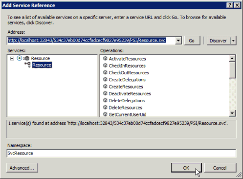

# <a name="prerequisites-for-wcf-based-code-samples-in-project"></a>在项目中的基于 WCF 的代码示例的先决条件

了解可帮助您使用 Project Server 接口 (PSI) 参考主题中包含的基于 WCF 的代码示例在 Visual Studio 中创建项目的信息。
   
[Project Server 2013 类类库和 web 服务引用](http://msdn.microsoft.com/library/ef1830e0-3c9a-4f98-aa0a-5556c298e7d1%28Office.15%29.aspx)中包含的基于 WCF 的代码示例的许多原来创建的 Project 2010 开发人员文档，并标准格式用于 WCF web 服务。 示例仍在 Project Server 2013 中工作，旨在复制到控制台应用程序和运行完整的单位。 例外示例中进行说明。 
  
Project 2013 开发人员文档中保持不变从为 Office Project Server 2007 开发的示例的代码示例使用 ASMX Web 服务。 也可以修改用于 WCF 服务的基于 ASMX 的示例。 本文介绍如何使用 WCF 服务示例。 有关如何使用示例的 ASMX web 服务的信息，请参阅[项目中的基于 ASMX 的代码示例的先决条件](prerequisites-for-asmx-based-code-samples-in-project.md)。
  
> [!NOTE]
> 如果客户端对象模型 (CSOM) 包括您的应用程序需要的方法，则应使用 CSOM 开发新应用程序。 CSOM 使应用程序与 Project Online 或 Project Server 2013 的本地安装一起使用。 否则，如果您的应用程序使用 PSI，它应使用 WCF 接口，这是建议的网络通信的技术。 使用 ASMX 接口或 WCF 接口的应用程序可以处理仅用于 Project Server 2013 的本地安装。 
>
> 有关 CSOM 的详细信息，请参阅[Project Server 2013 体系结构](project-server-2013-architecture.md)和[客户端对象模型 (CSOM) for Project 2013](client-side-object-model-csom-for-project-2013.md)。 
  
在运行代码示例之前，您必须设置开发环境、配置应用程序、添加服务配置文件（或以编程方式配置 WCF 服务）并更改泛型常量值以与您的环境匹配。
  
## <a name="setting-up-the-development-environment"></a>设置开发环境
<a name="pj15_PrerequisitesWCF_Setup"> </a>

1. **设置测试 Project Server 系统。**
    
    在进行开发或测试时，请使用测试 Project Server 系统。即使您的代码正常运行，项目间的相关性、报告或其他环境因素也会导致意想不到的结果。 
    
    > [!NOTE]
    > 确保您是有效的用户的服务器上，并确认您具有足够的权限的应用程序使用的 PSI 调用。 每个 PSI 方法的开发人员文档主题包括 Project Server 权限表。 例如， [Project.QueueCreateProject](https://msdn.microsoft.com/library/WebSvcProject.Project.QueueCreateProject.aspx)方法要求**新建项目**全局权限和**SaveProjectTemplate**权限。 
  
    在某些情况下，您可能需要执行远程调试服务器上。 您可能还需要设置事件处理程序，通过在 SharePoint 场中每个 Project Server 计算机上安装事件处理程序程序集，然后使用中常规 Project Server 设置页上配置的事件处理程序的 Project Web App 实例SharePoint 管理中心的应用程序设置。
    
2. **设置开发计算机。**
    
    通常，您会通过网络访问 PSI。代码示例设计为在独立于服务器的客户端上运行，除非另有说明。
    
    1. **安装 Visual Studio 的正确版本。** 除非另有说明，代码示例会写入 Visual C# 中。 它们可用于 Visual Studio 2010 或 Visual Studio 2012。 确保您已安装最新 service pack。 
    
    2. **将 Project Server Dll 复制到开发计算机。** 复制以下程序集从`[Program Files]\Microsoft Office Servers\15.0\Bin`到开发计算机上的 Project Server 计算机上： 
    
       - Microsoft.Office.Project.Server.Events.Receivers.dll
    
       - Microsoft.Office.Project.Server.Library.dll
    
    3. 有关如何编译和使用 ProjectServerServices.dll 代理程序集在 PSI 中的 WCF 服务的信息，请参阅[使用 PSI 代理程序集和 IntelliSense 说明](#pj15_PrerequisitesWCF_BuildingProxy)。
    
3. **安装 IntelliSense 文件。**
    
    要用于 Project Server 程序集，副本中类和成员的 IntelliSense 说明从 Project 2013 SDK 更新的 IntelliSense XML 文件下载到 Project Server 程序集所在的同一目录。 例如，将 Microsoft.Office.Project.Server.Library.xml 文件复制到您的应用程序将在其中设置 Microsoft.Office.Project.Server.Library.dll 程序集的引用的目录。
    
    PSI 服务的 IntelliSense 说明需要使用 CompileWCFProxyAssembly.cmd 脚本创建 PSI 代理程序集`Documentation\IntelliSense\WCF`Project 2013 SDK 下载中的子目录。 该脚本创建基于 WCF 的 ProjectServerServices.dll 代理程序集。 有关详细信息，请参阅 SDK 下载中的 [ReadMe_IntelliSense].mht 文件。 
    
## <a name="creating-the-application-and-adding-a-service-reference"></a>创建应用程序并添加服务引用
<a name="pj15_PrerequisitesWCF_Configure"> </a>

1. **创建一个控制台应用程序。**
    
    当您创建控制台应用程序，在**新建项目**对话框中下拉列表中时，选择 **.NET Framework 4**。 您可以将 PSI 示例代码复制到新的应用程序。
    
2. **添加 WCF 所需的引用。**
    
    在解决方案资源管理器中，添加对**System.ServiceModel**引用 （见图 1）。 Web 应用程序将使用**System.ServiceModel.Web**。
    
    此外添加对**system.runtime.serialization 的引用**。
    
    **图 1。为基于 WCF 的应用程序 Visual Studio 中添加引用**

    
  
3. **复制代码**。
    
    将完整的代码示例复制到控制台应用程序的 Program.cs 文件中。
    
4. **设置示例应用程序的命名空间。**
    
    您可将示例顶部列出的命名空间更改为应用程序的默认命名空间，或更改默认的应用程序命名空间以与示例匹配。可以通过更改应用程序属性来更改默认应用程序命名空间。 
    
    例如， [ReadResource](https://msdn.microsoft.com/library/WebSvcResource.Resource.ReadResource.aspx)的代码示例具有**Microsoft.SDK.Project.Samples.CreateResourceTest**的命名空间。 如果 Visual Studio 项目的名称， **ResourceTest**从 Program.cs 文件中，复制该命名空间，然后打开项目**属性**窗格 （在**项目**菜单中选择**ResourceTest 属性**）。 在**应用程序**选项卡中，将命名空间复制到**默认命名空间**文本框。 
    
5. **设置服务引用。**
    
    许多示例都需要对一个或多个 PSI 服务的引用。它们将在示例本身中或示例前面的注释中列出。若要获取正确的服务引用的命名空间，请确保您先设置了默认应用程序命名空间。
    
    添加 WCF 服务引用的方法有下列三种：
    
    - 生成 PSI 代理程序集名为 ProjectServerServices.dll，并将程序集的引用。 请参阅[使用 PSI 代理程序集和 IntelliSense 说明](#pj15_PrerequisitesWCF_BuildingProxy)。
    
    - 向 Visual Studio 解决方案从 svcutil.exe 输出添加代理文件。 请参阅[添加 PSI 代理文件](#pj15_PrerequisitesWCF_AddingProxyFile)。
    
    - 使用 Visual Studio 中添加服务引用。 请参阅[添加服务引用](#pj15_PrerequisitesWCF_AddingServiceReference)。
    
### <a name="using-a-psi-proxy-assembly-and-intellisense-descriptions"></a>使用 PSI 代理程序集和 IntelliSense 说明
<a name="pj15_PrerequisitesWCF_BuildingProxy"> </a>

代理程序集可用于在 PSI 中的所有公共 WCF 服务。 使用编译 ProjectServerServices.dll 代理程序集`Documentation\IntelliSense\WCF\CompileWCFProxyAssembly.cmd`脚本在 Project 2013 SDK 下载中，然后将代理程序集复制到开发计算机。 将智能感知 ProjectServerServices.xml 文件复制到相同的位置。 在 Visual Studio 中，设置对 ProjectServerServices.dll 代理程序集的引用。 
  
Project Server service pack 和更新，您可以更新代理源文件和 GenWCFProxyAssembly.cmd 脚本使用相同的 SDK 下载文件夹中创建新的代理程序集。 SDK 下载链接，请参阅[Project 2013 开发人员文档](project-2013-developer-documentation.md)。 有关详细信息，请参阅[添加服务引用](#pj15_PrerequisitesWCF_AddingServiceReference)部分。 
  
> [!NOTE]
> 当您从 Source.zip 提取代理源文件文件中的文件`Documentation\IntelliSense\WCF\Source`文件夹的当前 Project 2013 SDK 下载的发布日期。 若要生成更新 Project Server 计算机上运行 GenASMXProxyAssembly.cmd 脚本的 PSI 代理源文件。 有关详细信息，请参阅[添加服务引用](#pj15_PrerequisitesWCF_AddingServiceReference)。 
> 
> 中的脚本`Documentation\IntelliSense\ASMX`文件夹基于 WCF 的应用程序不起作用。 GenASMXProxyAssembly.cmd 脚本调用 Wsdl.exe，生成的 ASMX 服务的源代码文件。 ASMX 代理文件包括不同的类和属性。 例如，基于 ASMX 的资源的 web 服务包含**资源**类，而基于 WCF 的资源服务包括**资源**接口、 **ResourceChannel**接口以及**ResourceClient**类。 
  
ASMX web 服务和 WCF 服务创建的任意命名空间是相同的以便 IntelliSense 的 ProjectServerServices.xml 文件处理任一程序集。 例如，资源服务在基于 WCF 的代理程序集和基于 ASMX 的代理程序集的命名空间为**SvcResource**。 当然，可以更改命名空间名称 — 如果您确保它们匹配代理程序集和 ProjectServerServices.xml IntelliSense 文件中。
  
如果代码示例使用不同的 PSI 服务命名空间名称，例如**ProjectWebSvc**的 IntelliSense 以正常运行，则必须更改的示例使用**SvcProject**以便命名空间匹配代理程序集。 
  
使用基于 WCF 的代理程序集的优势如下：
  
- 您可在 Project Server 计算机之外的其他计算机上使用代理程序集开发大多数解决方案。设置独立服务引用需要在 Project Server 计算机上进行开发。
    
- 代理程序集包含所有 PSI 服务命名空间，因此您无需添加多个代理文件。
    
- 如果将 ProjectServerServices.xml 文件添加到您在其中设置对 ProjectServerServices.dll 代理程序集的引用相同的目录，可以获取 PSI 类和成员的 IntelliSense 说明。 有关详细信息，请参阅中的 [ReadMe_IntelliSense] 文件`Documentation\IntelliSense`Project 2013 SDK 下载文件夹。 
    
**图 2。资源服务中的方法使用 IntelliSense**


  
使用代理程序集的缺点是，解决方案更大并且您必须使用解决方案来分发和安装代理程序集。还必须使用同位于代理程序集和 IntelliSense 文件的命名空间，除非您将脚本更改为生成代理程序集并将 ProjectServerServices.xml IntelliSense 文件更改为使用其他命名空间。
  
### <a name="adding-a-psi-proxy-file"></a>添加 PSI 代理文件
<a name="pj15_PrerequisitesWCF_AddingProxyFile"> </a>

Project 2013 SDK 下载包括为代理程序集由 SvcUtil.exe 命令生成的源文件。 源文件位于 Source.zip 文件`Documentation\IntelliSense\WCF`子目录。 而不是设置代理程序集的引用，可以将一个或多个的源文件添加到 Visual Studio 解决方案。 例如，若要使用的 Project 服务和资源服务，添加 wcf。Project.cs 和 wcf。向解决方案 Resource.cs 文件。 
  
在 WCF 中每个 PSI 服务中的主要类定义由接口和成员的访问的客户端类中实现。 例如， **SvcProject.Resource**接口实现**SvcProject.ResourceClient**类中。 若要定义为类变量名为**resourceClient** **ResourceClient**对象，例如，使用下面的代码。 在示例中， **SetClientEndpoints**方法创建一个使用**basicHttp_Project**终结点，其中 app.config 文件中定义的**resourceClient**对象。 有关 app.config 文件的详细信息，请参阅[添加服务配置文件](#pj15_PrerequisitesWCF_AddConfig)部分。 
  
```cs
private static SvcResource.ResourceClient resourceClient;
. . .
private static void SetClientEndpoints()
{
  resourceClient = new SvcResource.ResourceClient("basicHttp_Resource");
  . . .
}
public void DisposeClients()
{
  resourceClient.Close();
  . . .
}
```

> [!NOTE]
> 无论是使用 PSI 代理程序集还是添加名为**SvcResource**的 Project 服务引用代理文件，您应使用相同的代码来创建和释放**resourceClient**对象。 
  
### <a name="adding-a-service-reference"></a>添加服务引用
<a name="pj15_PrerequisitesWCF_AddingServiceReference"> </a>

如果您不使用基于 WCF 的代理程序集或添加 PSI 服务代理文件，您可以直接在 Visual Studio 中设置一个或多个单独的服务引用。 您可以使用以下过程的步骤 1 创建更新的代理文件，若要准备`Documentation\IntelliSense\WCF\GenWCFProxyAssembly.cmd`脚本的 Project 2013 SDK 下载中包含。 
  
> [!NOTE]
> 若要设置服务引用，您必须在 Project Server 计算机上使用 Visual Studio。建议您使用 ProjectServerServices.dll 代理程序集或添加代理源文件，而不是直接在 Visual Studio 中添加服务引用。 
  
以下步骤演示如何通过运行测试安装的 Project Server 的计算机上使用 Visual Studio 2012 设置服务引用：
  
1. 若要获取对后端 WCF 服务的访问权限，请在 Project Server 计算机上运行 Visual Studio。
    
2. 在**解决方案资源管理器**中，右键单击**引用**文件夹，然后选择**添加服务引用**。 
    
3. 在**添加服务引用**对话框中**地址**文本框中，键入http://localhost:32843/ _GUID_/psi/ _ServiceName_.svc，并按**Enter**。 Project Server service 应用程序，如 534c37eb00d74ccfadcecf9827e95239 的虚拟目录名称中替换_GUID_ 。 _ServiceName_替换该服务，如资源的名称 （请参阅图 3）。 
    
   您可通过下列方式之一获取 Project Server Service 虚拟目录的名称：
    
   - 在浏览器中打开 SharePoint 2013 管理中心应用程序。 选择**管理服务应用程序**，然后选择所需的 Project Server PSI 服务应用程序。 例如，选择**ProjectServerService**。 管理 Project Web App 网站页的 URL 包含虚拟目录名称。 例如，在`http://ServerName:8080/_admin/pwa/managepwa.aspx?appid=534c37eb-00d7-4ccf-adce-cf9827e95239`，虚拟目录名即`534c37eb00d74ccfadcecf9827e95239`（目录名称包含任何虚线）。 
    
   - 打开**Internet 信息服务 (IIS) 管理器**对话框中的 Project Server 计算机上。 展开**连接**窗格中的**SharePoint Web 服务**节点，然后展开下方，服务虚拟目录，直到找到包含 PSI 文件夹的目录。 选择的目录，选择**高级设置**中**操作**窗格中，并在**虚拟路径**字段中复制的目录名称。 
    
      > [!NOTE]
      > 可以有多个 Project Server Service 虚拟目录。 确保您选择包含所需的 Project Web App 实例的虚拟目录。 
  
   - 与 SharePoint 2013 一起安装的 Windows PowerShell 中使用**Get-spserviceapplication** cmdlet。 在任务栏上的**开始**菜单上，选择**所有程序**、 都选择**Microsoft SharePoint 2013 产品**，然后都选择**SharePoint 2013 Management Shell**。 下面是命令以及**SharePoint 2013get-命令行管理程序**窗口 （您 Guid 将不同） 的定义的服务应用程序中的结果。 将复制的 Project Server service 应用程序的 GUID。 
    
        ```powershell
            PS > get-SPServiceApplication
            DisplayName          TypeName             Id
            -----------          --------             --
            State Service        State Service        04041cfa-4ab3-4473-8bc8-3967b02eff39
            ProjectServerSer...  Project Server PS... 534c37eb-00d7-4ccf-adce-cf9827e95239
            Security Token Se... Security Token Se... 7243732e-edea-405d-8cc8-1716b99faef5
            Application Disco... Application Disco... 3bfbdeb0-bc20-4a21-801c-cc6f1ce6c643
            SharePoint Server... SharePoint Server... 09912f49-3b72-462f-a44c-6533b578286a  
        ```

      如果您知道 Project Server Service Application 的全名，则可使用它获取 GUID 值，例如：
    
        ```powershell
        PS > $projectService = "ProjectServerService"
        PS > (get-SPServiceApplication -Name $projectService).Id
        Guid
        ----
        534c37eb-00d7-4ccf-adce-cf9827e95239
       ```

      > [!NOTE]
      > 删除 GUID 中的短划线以获取虚拟目录名称。 
  
   例如，Url`http://localhost:32843/534c37eb00d74ccfadcecf9827e95239/PSI/Resource.svc`是标准的 Project Server 服务。 
    
4. 服务引用解析后，请在**Namespace**文本框中键入引用名称。 Project 2013 开发人员文档中的代码示例使用任意命名空间名称**Svc _ServiceName_**。 例如，资源服务的代码示例在名为**SvcResource**。
    
    **图 3。添加基于 WCF 的资源服务引用**

    
  
5. 替换原始 （重命名为 web.config），为 Project Service 目录中的临时 web.config 文件，然后重新运行`iisreset`。
    
## <a name="setting-other-references"></a>设置其他引用
<a name="pj15_PrerequisitesWCF_OtherReferences"> </a>

Project Server 应用程序通常使用其他服务，例如 SharePoint 2013 web 服务。 需要其他服务或引用时，所述的代码示例。
  
代码示例的本地引用列出在示例顶部的**using**语句。 
  
1. 在**解决方案资源管理器**中，右键单击**引用**文件夹，然后选择**添加引用**。
    
2. 选择**浏览**，，然后浏览到您先前复制 Project Server Dll 存储的位置。 选择您希望，Dll，然后选择**确定**。
    
> [!NOTE]
> 确保您的开发计算机上的程序集版本与目标 Project Server 计算机上的程序集版本完全匹配。 
  
## <a name="adding-a-service-configuration-file"></a>添加服务配置文件
<a name="pj15_PrerequisitesWCF_AddConfig"> </a>

如果应用程序以编程方式配置 WCF 服务，而不使用服务配置文件。 否则，Windows 应用程序或控制台应用程序使用**system.serviceModel**元素在 app.config 文件;web 应用程序包含在 web.config 中**system.serviceModel** 。有关使用 app.config 文件或以编程方式配置的 WCF 服务的详细信息，请参阅[演练： 使用 WCF 开发 PSI 应用程序](http://msdn.microsoft.com/library/65707234-c3da-44e4-8364-32a6be28f645%28Office.15%29.aspx)。
  
在生成服务代理源文件时, SvcUtil.exe 命令还将创建 app.config 文件中的默认**system.serviceModel**元素的基础 output.config 文件或 web.config 文件。 Project 2013 SDK 下载包括中的示例 output.config 文件`Documentation\IntelliSense\WCF\Source.zip`。 例如，资源服务 SvcUtil.exe 创建的默认 output.config 文件包含两个的绑定，名为**BasicHttpBinding_Resource**和**BasicHttpBinding_Resource1**。 **客户端**元素包含两个默认终结点。 一个终结点端口 32843 上的 HTTP 地址安全访问，其他为普通访问端口 32843，如下所示： 
  
```XML
<client>
    <endpoint address="http://ServerName.domain:32843/GUID/PSI/Resource.svc/secure"
        binding="basicHttpBinding" bindingConfiguration="BasicHttpBinding_Resource"
        contract="SvcResource.Resource" name="BasicHttpBinding_Resource" />
address="http://ServerName.domain:32843/GUID/PSI/Resource.svc"
        binding="basicHttpBinding" bindingConfiguration="BasicHttpBinding_Resource1"
        contract="SvcResource.Resource" name="BasicHttpBinding_Resource1" />
</client>
```

PSI 服务配置不会使用默认绑定和终结点。Project Server 需要应用程序通过前端 ProjectServer.svc（其充当用于调用后端服务的传送器）访问 PSI 服务。若要创建 app.config 文件，请执行下列步骤：
  
1. 如果您设置引用 ProjectServerServices.dll 代理程序集，或添加服务的代理源文件，应用程序不包含 app.config 文件。 向 Visual Studio 项目中添加新项。 在**添加新项**对话框中，选择**应用程序配置文件**模板、 app.config，将其命名，然后选择**添加**。
    
2. 删除在 app.config 文件中，所有文本，然后将以下代码复制到该文件。 您可以使用相同的绑定，例如`basicHttpConf`，每个服务终结点。 如果您想要使用多个的绑定，例如，要绑定 HTTP 和 HTTPS 协议，您必须创建每个协议的绑定。
    
    ```XML
        <?xml version="1.0" encoding="utf-8" ?>
        <configuration>
            <system.serviceModel>
                <behaviors>
                    <endpointBehaviors>
                        <behavior name="basicHttpBehavior">
                            <clientCredentials>
                                <windows allowedImpersonationLevel="Impersonation" />
                            </clientCredentials>
                        </behavior>
                    </endpointBehaviors>
                </behaviors>
                <bindings>
                    <basicHttpBinding>
                        <binding name="basicHttpConf" sendTimeout="01:00:00" 
                            maxBufferSize="500000000" maxReceivedMessageSize="500000000">
                            <readerQuotas maxDepth="32" maxStringContentLength="8192" 
                                maxArrayLength="16384" maxBytesPerRead="4096" 
                                maxNameTableCharCount="500000000" />
                            <security mode="TransportCredentialOnly">
                                <transport clientCredentialType="Ntlm" realm="http://SecurityDomain" />
                            </security>
                        </binding>
                    </basicHttpBinding>
                </bindings>
                <client>
                    <endpoint address="http://ServerName/ProjectServerName/_vti_bin/PSI/ProjectServer.svc"
                        behaviorConfiguration="basicHttpBehavior" binding="basicHttpBinding"
                        bindingConfiguration="basicHttpConf" 
                        contract="SvcServiceName.ServiceName"
                        name="basicHttp_ServiceName" />
                </client>
            </system.serviceModel>
        </configuration>
    ```

3. 替换`ServerName/ProjectServerName`中的服务器和 Project Web App 实例名称的客户端终结点地址。 
    
4. 替换`ServiceName`PSI 服务，如资源的名称。 确保您替换所有三个实例的服务名称，例如：
    
    ```XML
        <endpoint address="http://myserver/pwa/_vti_bin/PSI/ProjectServer.svc"
            behaviorConfiguration="basicHttpBehavior" binding="basicHttpBinding"
            bindingConfiguration="basicHttpConf" 
            contract="SvcResource.Resource"
            name="basicHttp_Resource" />
    ```

5. 若要使用多个一个 PSI 服务，创建一个**终结点**元素用于每个服务，以及每个服务使用的**绑定**元素。 例如，以下终结点配置客户端项目服务和 QueueSystem 服务使用基本 HTTP 绑定。 
    
    > [!NOTE]
    > 如果运行应用程序时收到“服务器太忙”或“HTTP 请求未经授权”的错误，请确保 app.config 文件中的终结点地址正确。 
  
    ```XML
        <client>
        <endpoint address="http://ServerName/pwa/_vti_bin/PSI/ProjectServer.svc"
            behaviorConfiguration="basicHttpBehavior" binding="basicHttpBinding"
            bindingConfiguration="basicHttpConf" 
            contract="SvcProject.Project"
            name="basicHttp_Project" />
        <endpoint address="http://ServerName/pwa/_vti_bin/PSI/ProjectServer.svc"
            behaviorConfiguration="basicHttpBehavior" binding="basicHttpBinding"
            bindingConfiguration="basicHttpConf" 
            contract="SvcQueueSystem.QueueSystem"
            name="basicHttp_QueueSystem" />
        </client>
    ```

您可以通过使用 Visual Studio 中 （在**工具**菜单中） 的**WCF 服务配置编辑器**编辑 app.config 文件。 图 4 显示了如何在**Microsoft 服务配置编辑器**对话框中设置的**合同**元素。 如果解决方案使用 PSI 代理程序集，打开在 ProjectServerServices.dll`bin\debug`目录的 Visual Studio 解决方案。 **合同类型浏览器**对话框中显示的所有 WCF 服务协定 （参见图 5）。 
  
**图 4。使用 WCF 服务配置编辑器**


  
如果解决方案使用的服务代理文件，如 wcfResource.cs，编译应用程序，然后打开中的可执行文件`bin\debug`目录。 有关编辑 app.config 文件的详细信息，请参阅[演练： 使用 WCF 开发 PSI 应用程序](http://msdn.microsoft.com/library/65707234-c3da-44e4-8364-32a6be28f645%28Office.15%29.aspx)。
  
**图 5。使用合同类型浏览器中 WCF 服务配置编辑器**


  
## <a name="using-multiple-authentication"></a>使用多身份验证
<a name="pj15_PrerequisitesWCF_ClaimsMultiAuth"> </a>

通过 Windows 身份验证或表单身份验证的内部部署 Project Server 用户身份验证是通过在 SharePoint 中处理的声明。 多个身份验证是指在其设置 Project Web App 的 web 应用程序支持 Windows 身份验证和基于表单的身份验证。 如果是这样，对 WCF 服务使用 Windows 身份验证任何调用将失败并出现以下错误，因为声明过程无法确定哪种类型的用户进行身份验证：
  
`The server was unable to process the request due to an internal error. For more information about the error, either turn on Include ExceptionDetailInFaults (either from ServiceBehaviorAttribute or from the <serviceDebug> configuration behavior) on the server in order to send the exception information back to the client, or turn on tracing as per the Microsoft .NET Framework 3.0 SDK documentation and inspect the server trace logs.`

为 WCF 解决问题中定义的每个 PSI 服务**OperationContextScope** , 应为 PSI 方法的所有呼叫。 不要将嵌套范围为多个服务;例如，当使用调用资源和项目服务，呼叫的每组应为其自己的范围内。 
  
在以下示例中，可从应用程序中的每个**OperationContextScope**部分调用**DisableFormsAuth**方法。 则方法删除以前禁用表单身份验证，因此如果_isWindowsAuth_参数为**false**，可以继续进行表单身份验证的任何标题值。 如果_isWindowsAuth_为**true**，则**DisableFormsAuth**方法禁用表单身份验证。 
  
在**WcfSample**方法中， **projectClient**对象是 PSI **SvcProject.ProjectClient**类的实例。 
  
```cs
// Class variable that determines whether to disable Forms authentication.
private bool isWindowsUser = true;
public void DisableFormsAuth(bool isWindowsAuth)
{
    WebOperationContext.Current.OutgoingRequest.Headers.Remove(
        "X-FORMS_BASED_AUTH_ACCEPTED");
    if (isWindowsAuth)
    {
        // Disable Forms authentication, to enable Windows authentication.
        WebOperationContext.Current.OutgoingRequest.Headers.Add(
            "X-FORMS_BASED_AUTH_ACCEPTED", "f");
    }
}
private void WcfSample()
{
    // Limit the scope of WCF calls to the client channel. 
    using (OperationContextScope scope = new OperationContextScope(projectClient.InnerChannel))
    {
        // Add a web request header to enable Windows authentication in 
        // multiple authentication installations.
        DisableFormsAuth(isWindowsUser);
        // Add calls to the projectClient methods here:
        // . . .
    }
}
```

> [!NOTE]
> **OperationContextScope**中的 PSI 调用，则需要仅对多个身份验证的环境中运行的应用程序。 如果 Project Server 使用仅 Windows 身份验证，则没有必要设置范围并添加禁用表单的身份验证 web 请求标头。 
> 
> 基于 ASMX 的应用程序的解决方法是不同。 有关详细信息，请参阅*使用多身份验证*部分中[项目中的基于 ASMX 的代码示例的先决条件](prerequisites-for-asmx-based-code-samples-in-project.md)。 
  
## <a name="changing-values-of-generic-constants"></a>更改泛型常量值
<a name="pj15_PrerequisitesWCF_ChangeValues"> </a>

大多数示例具有一个或多个必须更新示例以正确环境中的变量。 在以下示例中，情况下，如果您有 SSL 安装，使用 HTTPS 协议而不是 HTTP 协议。 _ServerName_替换为您使用的服务器的名称。 _ProjectServerName_替换为 project server 网站，如 PWA 的虚拟目录名称。 
  
```cs
const string PROJECT_SERVER_URI = "http://ServerName/ProjectServerName/";
```

代码示例顶部记录了必须更改的其他变量。
  
## <a name="verifying-the-results"></a>验证结果
<a name="pj15_PrerequisitesWCF_Verify"> </a>

获取和解释结果的代码示例并不总是变得非常简单。 例如，如果您创建的项目时，才可以显示在 Project Web App 中的项目中心页上必须发布项目。
  
可以通过多种方式验证代码示例结果，例如：
  
- 使用 Project Professional 2013 客户端从 Project Server 计算机中，打开项目并查看所需的项。
    
- 在 Project Web App 的项目中心页上查看已发布的项目 ( `http://ServerName/ProjectServerName/projects.aspx`)。
    
- 在 Project Web App 中查看队列日志。 打开服务器设置页 （右上角选择**设置**图标），然后选择下**个人设置**部分**我的排队作业**( `http://ServerName/ProjectServerName/MyJobs.aspx`)。 在**视图**下拉列表中，您可以按作业状态排序。 **正在进行和过去一周的失败作业**的默认状态。 
    
- 使用 Project Web App 中的服务器设置页 ( `http://ServerName/ProjectServerName/_layouts/15/pwa/admin/admin.aspx`) 来管理所有队列作业和删除或强制签入企业对象。 您必须具有管理权限才能访问这些服务器设置页上的链接。
    
- 使用**Microsoft SQL Server Management Studio**运行 Project Server 数据库的表上的查询。 例如，使用下面的查询选择要在工作流容器中显示有关项目详细信息页面 (Pdp) 的信息的 MSP_WORKFLOW_STAGE_PDPS 表前 200 行。 
    
```sql
        SELECT TOP 200 [STAGE_UID]
                ,[PDP_UID]
                ,[PDP_NAME]
                ,[PDP_POSITION]
                ,[PDP_ID]
                ,[PDP_STAGE_DESCRIPTION]
                ,[PDP_REQUIRES_ATTENTION]
        FROM [ProjectService].[pub].[MSP_WORKFLOW_STAGE_PDPS]
```

## <a name="cleaning-up"></a>清理
<a name="pj15_PrerequisitesWCF_Cleanup"> </a>

测试某些代码示例后，没有企业对象和设置应删除或重置。 可以使用 Project Web App 中的服务器设置页来管理企业数据 ( `http://ServerName/ProjectServerName/_layouts/15/pwa/admin/admin.aspx`)。 在服务器设置页上的链接，可以删除旧项目、 强制签入项目、 管理作业队列的所有用户和执行其他管理任务。
  
下面是“服务器设置”页上的部分链接，可用于在运行代码示例之后进行常规清理活动：
  
- **企业自定义域和查阅表格**
    
- **管理队列作业**
    
- **删除企业对象**
    
- **强制签入企业对象**
    
- **企业项目类型**
    
- **工作流阶段**
    
- **工作流阶段**
    
- **项目详细信息页面**
    
- **时间报告阶段**
    
- **时间表设置值和默认值**
    
- **行分类**
    
通过 SharePoint Server 2013 的每个 Project Web App 实例，而不是按特定的 Project Web App 服务器设置页管理其他设置。 在 SharePoint 管理中心应用程序中，选择**应用程序的常规设置**，选择**管理** **Project Server 设置**下，然后选择服务器设置页上的下拉列表中的 Project Web App 实例. 例如，选择**服务器端事件处理程序**添加或删除所选的 Project Web App 实例的事件处理程序。 
  
## <a name="see-also"></a>另请参阅

- [在项目中的基于 ASMX 的代码示例的先决条件](prerequisites-for-asmx-based-code-samples-in-project.md)   
- [演练： 开发使用 WCF 的 PSI 应用程序](http://msdn.microsoft.com/library/65707234-c3da-44e4-8364-32a6be28f645%28Office.15%29.aspx)   
- [使用 WCF 模拟](http://msdn.microsoft.com/library/e3597901-2f02-44a2-8076-d32aae540b38%28Office.15%29.aspx)  
- [项目 PSI 参考概述](project-psi-reference-overview.md) 
- [SharePoint 开发中心](http://msdn.microsoft.com/en-us/sharepoint/default.aspx)
    

