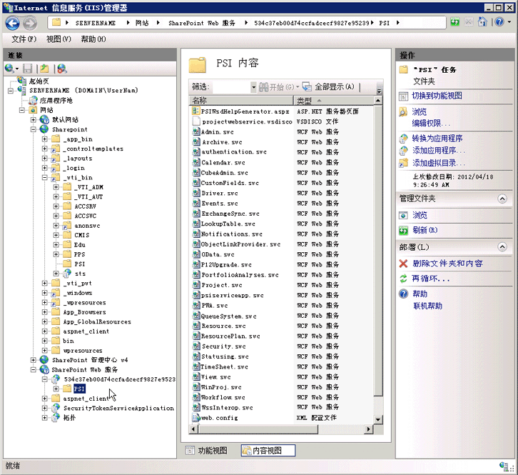

# <a name="project-psi-reference-overview"></a>Project PSI 参考概述

Project Server 接口 (PSI) 是用于开发与 Project Server 2013 本地集成的应用程序的 API。
  
本文概述了 PSI 中编档的程序集、命名空间和服务。 SDK 中的 [Project Server 2013 类库和 Web 服务引用](https://msdn.microsoft.com/library/ef1830e0-3c9a-4f98-aa0a-5556c298e7d1%28Office.15%29.aspx)包含 PSI 的所有托管代码文档以及 Project Server 2013中的 [Microsoft.ProjectServer.Client](https://msdn.microsoft.com/library/Microsoft.ProjectServer.Client.aspx) 命名空间。 若要为 Project Online 开发应用程序，必须使用 **Microsoft.ProjectServer.Client** 命名空间而不是 PSI。 

Project Server 2013 中的 PSI 具有双重接口。 Web 服务的 ASMX 接口由 `https://ServerName/ProjectServerName/_vti_bin/psi/` 虚拟目录（例如，Projectdisco.aspx 和 Projectwsdl.aspx）中的发现和 Web 服务描述语言（disco 和 WSDL）文件定义。 你只能通过本地安装的 Project Web App 的 URL（例如，`https://ServerName/ProjectServerName/_vti_bin/psi/project.asmx?wsdl)`）访问 ASMX 接口。 若要在浏览器中显示 Web 服务，必须包含 `?wsdl` URL 选项。 由于 ASMX 接口是使用 Windows Communication Foundation (WCF) 基础结构构建的，因此 Project Server Web 服务的 .asmx 文件实际上并不存在于虚拟 PSI 目录中。 
  
WCF 服务接口由 SharePoint Web 服务应用程序的后端 `https://ServerName:32843/GUID/PSI/` 虚拟目录中的 .svc 文件定义。 Project Service 应用程序虚拟目录中的 PSI 服务的 URL（例如，`https://ServerName:32843/GUID/PSI/project.svc`）包含 .svc 文件。 但是，你无法直接使用后端 URL 来设置 WCF 服务引用。 若要开发使用 PSI 的 WCF 服务的应用程序或组件，你可以使用代理程序集或代理文件。 Project 2013 SDK 下载包含 Project Server 2013 中的 WCF 服务的代理文件和脚本，它们用于获取更新的 WCF 代理文件并将文件编译为代理程序集，以便获取最新的 Project Server 内部版本。
  
Project Service 应用程序目录名称是 GUID 值，它与本地 Project Web App 实例的 GUID 相同。 在“**Internet 信息服务(IIS)管理器”** 窗口中，展开“**SharePoint Web 服务**”节点，选择 GUID 目录名称，然后选择“**高级设置**”以复制“**虚拟路径**”值。 
  
> [!IMPORTANT]
> 在 Project Server 2013 中，已弃用 PSI 的 ASMX Web 服务接口，但它仍受支持。 新应用程序应使用 PSI 的 WCF 接口或 CSOM。 有关已弃用功能的详细信息，请参阅 [Project 2013 中面向开发人员的更新](updates-for-developers-in-project-2013.md)
> 
> 仅在本地安装的 Project Server 上运行的新应用程序和中间件组件应使用 WCF 接口，这是我们建议用于网络通信的技术。 使用 ASMX 接口的旧版应用程序必须使用 Project Web App 中的 URL，它会检查 Project Server 权限。 
> 
> 有关 ASMX 接口以及如何使用 WCF 接口的详细信息，请参阅 [Project 中基于 ASMX 的代码示例的先决条件](prerequisites-for-asmx-based-code-samples-in-project.md)和 [Project 中基于 WCF 的代码示例的先决条件](prerequisites-for-wcf-based-code-samples-in-project.md)。 
  
若要开发使用 WCF 接口的应用程序，你可以使用 Visual Studio 2010 或 Visual Studio 2012。 若要创建声明性 Project Server 工作流，你可以使用 SharePoint Designer 2013。 可以使用 Visual Studio 2012 开发需要访问 PSI 或 CSOM 的 Project Server 工作流。
  
### <a name="using-the-psi-reference"></a>使用 PSI 引用
<a name="pj15_PSIRefOverview_Using"> </a>

PSI 对象模型很大，许多类和成员均仅供内部使用。 因此，在 [Project Server 2013 类库和 Web 服务引用](https://msdn.microsoft.com/library/ef1830e0-3c9a-4f98-aa0a-5556c298e7d1%28Office.15%29.aspx)中查找所需的主题可能会令人产生混淆。 你将用于开发的大部分参考主题都位于以下组中：
  
- **主类方法：** PSI 中的每个服务都包含一个以服务名称命名的主类。 例如，**资源**服务包含[资源](https://msdn.microsoft.com/library/WebSvcResource.Resource.aspx)类，该类位于 [WebSvcResource](https://msdn.microsoft.com/library/WebSvcResource.aspx) 命名空间中。 若要查看**资源**类中可用的方法列表，请在内容窗格中展开类节点，然后选择“**资源方法**”主题。 
    
- **DataRow 属性：** 许多主类方法都使用或返回 **DataSet**。 **DataSet** 中的每个 **DataTable** 对象都包含一个或多个 **DataRow** 对象中的数据。 在大多数情况下，你只需查看行属性，而不是 **DataSet**、**DataTable** 或 **DataRow** 类的所有其他成员。 例如，**ResourceAssignmentDataSet** 类包含 **ResourceAssignmentDataTable** 和 [ResourceAssignmentDataSet.ResourceAssignmentRow](https://msdn.microsoft.com/library/WebSvcResource.ResourceAssignmentDataSet.ResourceAssignmentRow.aspx) 类的子类。 若要查看 **ResourceAssignmentRow** 类中的属性列表，请在内容窗格中展开类节点，然后选择“**ResourceAssignmentDataSet.ResourceAssignmentRow 属性**”主题。 
    
除了服务命名空间之外，[Project Server 2013 类库和 Web 服务引用](https://msdn.microsoft.com/library/ef1830e0-3c9a-4f98-aa0a-5556c298e7d1%28Office.15%29.aspx)主题还链接到 3 个 Project Server 程序集，它们用于开发本地安装的第三方解决方案。 我们仅提供这些程序集的最少量文档。 PSI 引用编档了 23 个公共服务中的主要类和成员。 6 个 PSI 服务供内部使用，并且未进行编档。 
  
> [!NOTE]
> 客户端对象模型 (CSOM) 中的类可以独立于其他 Project Server 程序集和服务使用。 你可以在 Project Server 计算机的远程开发环境中使用 **Microsoft.ProjectServer.Client** 命名空间，并开发与 Project Online 或本地安装的 Project Server 相集成的应用程序。 但是，CSOM 包含完整 PSI 功能的子集。 CSOM 支持为 Project Server 集成开发最常见的方案。 有关详细信息，请参阅 [CSOM 执行和不执行的操作](what-the-csom-does-and-does-not-do.md)和 [Microsoft.ProjectServer.Client](https://msdn.microsoft.com/library/Microsoft.ProjectServer.Client.aspx)。 
  
对于大多数使用 PSI 进行的开发，你不必在 Project Server 计算机上进行开发，也不必在全局程序集缓存中设置对 Project Server 程序集的引用。 你可以将必要的 Project Server 程序集复制到开发计算机。 Project Server 2013 将在 _[Program Files]_ `\Microsoft Office Servers\15.0\Bin`中安装以下程序集： 
  
- Microsoft.Office.Project.Server.Events.Receivers.dll 
- Microsoft.Office.Project.Server.Library.dll
- Microsoft.Office.Project.Server.Workflow.dll
    
PSI 服务的命名空间具有为 PSI 代理程序集 ProjectServerServices.dll 创建的任意名称，它是为编档目的生成的。 在 PSI 引用中，每个服务命名空间都有一个占位符名称（如 _[Project Web service]_）和一个 Web 引用（如 `https://ServerName/ProjectServerName/_vti_bin/psi/Project.asmx?wsdl`）。 
  
## <a name="project-server-assemblies-and-namespaces"></a>Project Server 程序集和命名空间
<a name="pj15_PSIRefOverview_Assemblies"> </a>

许多程序集都是随 Project Server 一起安装的；仅编档了 4 个 Project Server 程序集。 第三方开发人员通常只在这些程序集中使用几个类和成员。 未编档的 Project Server 程序集包含 Project Server 在内部使用的命名空间和类，如 Project Web App、业务实体和数据访问层 (DAL) 的类。 如果已在 Visual Studio 中设置对已编档的 Project Server 程序集的引用，则可以在 Visual Studio 对象浏览器中查看所有命名空间、类和成员。
  
> [!NOTE]
> 已编档的 Project Server 命名空间的许多成员均仅在内部使用，并且具有最少量的文档。 
  
在为 Project Online 开发应用程序时，你只能使用 CSOM 来访问 Project Server 功能。 你无权访问 PSI 服务或其他 Project Server 程序集。
  
PSI 的 [Project Server 2013 类库和 Web 服务引用](https://msdn.microsoft.com/library/ef1830e0-3c9a-4f98-aa0a-5556c298e7d1%28Office.15%29.aspx)包括以下程序集中的命名空间： 
  
- **Microsoft.Office.Project.Server.Library.dll** 该程序集包含一个编档的命名空间和三个未编档的命名空间，如下所示： 
    
  - [Microsoft.Office.Project.Server.Library](https://msdn.microsoft.com/library/Microsoft.Office.Project.Server.Library.aspx) 命名空间包括多个枚举以及经常用于 Project Server 的本地应用程序的类域和属性。 例如，开发人员通常使用枚举（如 **CustomField.Type**）以及 **PSClientError**、**PSErrorInfo** 和 **Filter** 类。 
    
    ** Microsoft.Office.Project.Server.Library** 命名空间还包含以下 7 个属性类，其中包括 3,200 多个子类： 
    
      - **AssignmentProperties**  
      - **CalendarProperties**
      - **ConstraintProperties**
      - **LookupTableProperties**
      - **ProjectProperties**
      - **ResourceProperties**
      - **TaskProperties**
    
    这些属性类供内部使用，并且未进行编档。 属性类用于 Project Professional 2013 和 Project Server 之间的序列化。 在使用 Visual Studio 中的 **Microsoft.Office.Project.Server.Library** 命名空间时，对象浏览器会显示所有属性类，从而导致难以找到有助于进行第三方开发的类。 由于第三方开发人员无需使用属性类，因此，SDK 不会对属性类进行编档。 
    
  - **Microsoft.Office.Project.Server.DataServices** 该命名空间的类和成员由 Project Online 中的 **OData** 服务在内部使用，用于访问 Project 数据库中的报告表。 **DataServices** 类未进行编档。 
    
  - **Microsoft.Office.Project.Server.Administration** 该命名空间的类和成员在内部用于诊断日志记录，且未进行编档。 
    
  - **Microsoft.Office.Project.Server.Base** 该命名空间的类和成员在内部用作基类，且未进行编档。 
    
  - **Microsoft.Office.Project.Server.Library.FilterSchema** 该命名空间在内部用于生成筛选器架构，且未进行编档。 
    
- **Microsoft.Office.Project.Server.Workflow.dll** 该程序集用于仍可在 Project Server 2013 中运行的旧版 Project Server 2010 工作流。 若要创建新工作流，你应该使用 SharePoint Designer 2013，也可以将 Visual Studio 2012 与 [Microsoft.ProjectServer.Client.WorkflowActivities](https://msdn.microsoft.com/library/Microsoft.ProjectServer.Client.WorkflowActivities.aspx) 类一起使用。 Microsoft.Office.Project.Server.Workflow.dll 程序集包括以下三个名称空间： 
    
  - [Microsoft.Office.Project.Server.Workflow](https://msdn.microsoft.com/library/Microsoft.Office.Project.Server.Workflow.aspx) 该命名空间包括用于 Project Server 工作流活动的类。 这些活动包括读取、比较和更新项目属性。 其他类用于管理工作流，并且在项目发生更改时包括工作流回调。 
    
  - **Microsoft.Office.Project.PWA** 该命名空间包括 PSI 的内部代理，以便与 Project Web App 和自定义工作流活动一起使用；它未进行编档。 
    
    自定义工作流活动需要引用 **Microsoft.Office.Project.PWA** 来访问 PSI 服务中的所有类。 例如，**Microsoft.Office.Project.PWA.PSI** 类包括 **ProjectWebService** 属性，用于获取 [WebSvcProject](https://msdn.microsoft.com/library/WebSvcProject.aspx) 命名空间的代理。 
    
  - **Microsoft.Office.Project.Server.WebServiceProxy** 该命名空间包括每个 PSI 服务中的主类的内部代理类。 通过使用工作流用户的提升权限，工作流可以通过代理类调用 PSI 方法。 代理类未进行编档。 
    
- **Microsoft.Office.Project.Server.Events.Receivers.dll**[Microsoft.Office.Project.Server.Events](https://msdn.microsoft.com/library/Microsoft.Office.Project.Server.Events.aspx) 是此程序集中的唯一命名空间。 它包括 PSI 服务和其他内部类的事件接收器和事件自变量类。 
    
  开发人员编写从事件接收器类派生的事件处理程序。PSI 服务中的大多数主类都具有一个对应的事件接收器类。例如，**ProjectEventReceiver** 类包含对应于 PSI 中的 **Project** 类中的方法的前期事件和后期事件接收器方法。**OnCreating** 方法和 **OnCreated** 方法分别是 **QueueCreateProject** 方法的前期事件接收器方法和后期事件接收器方法。 
    
  开发人员通常使用以下事件接收器类：
  <br/>  
  - [AdminEventReceiver](https://msdn.microsoft.com/library/Microsoft.Office.Project.Server.Events.AdminEventReceiver.aspx)
  - [CalendarEventReceiver](https://msdn.microsoft.com/library/Microsoft.Office.Project.Server.Events.CalendarEventReceiver.aspx)
  - [CubeAdminEventReceiver](https://msdn.microsoft.com/library/Microsoft.Office.Project.Server.Events.CubeAdminEventReceiver.aspx)
  - [CustomFieldsEventReceiver](https://msdn.microsoft.com/library/Microsoft.Office.Project.Server.Events.CustomFieldsEventReceiver.aspx)
  - [LookupTableEventReceiver](https://msdn.microsoft.com/library/Microsoft.Office.Project.Server.Events.LookupTableEventReceiver.aspx)
  - [ProjectEventReceiver](https://msdn.microsoft.com/library/Microsoft.Office.Project.Server.Events.ProjectEventReceiver.aspx)
  - [OptimizerEventReceiver](https://msdn.microsoft.com/library/Microsoft.Office.Project.Server.Events.OptimizerEventReceiver.aspx)
  - [ReportingEventReceiver](https://msdn.microsoft.com/library/Microsoft.Office.Project.Server.Events.ReportingEventReceiver.aspx)
  - [ResourceEventReceiver](https://msdn.microsoft.com/library/Microsoft.Office.Project.Server.Events.ResourceEventReceiver.aspx)
  - [SecurityEventReceiver](https://msdn.microsoft.com/library/Microsoft.Office.Project.Server.Events.SecurityEventReceiver.aspx)
  - [StatusingEventReceiver](https://msdn.microsoft.com/library/Microsoft.Office.Project.Server.Events.StatusingEventReceiver.aspx)
  - [TimesheetEventReceiver](https://msdn.microsoft.com/library/Microsoft.Office.Project.Server.Events.TimesheetEventReceiver.aspx)
  - [UserDelegationEventReceiver](https://msdn.microsoft.com/library/Microsoft.Office.Project.Server.Events.UserDelegationEventReceiver.aspx)
  - [WorkflowEventReceiver](https://msdn.microsoft.com/library/Microsoft.Office.Project.Server.Events.WorkflowEventReceiver.aspx)
  - [WssInteropEventReceiver](https://msdn.microsoft.com/library/Microsoft.Office.Project.Server.Events.WssInteropEventReceiver.aspx)
    
  **RulesEventReceiver** 类和 **StatusReportsEventReceiver** 类在 Project Web App 内部使用。 
    
- **Microsoft.ProjectServer.Client.dll** 该程序集包含用于使用 .NET Framework 4 进行开发的 CSOM。 该程序集位于 `%ProgramFiles%\Common Files\Microsoft Shared\Web Server Extensions\15\ISAPI\Microsoft.ProjectServer.Client.dll` 中。 使用 **Microsoft.ProjectServer.Client** 命名空间开发应用程序将独立于本地 Project Server API 和服务，尽管这些应用程序可以与本地或在线安装的 Project Server 一起使用。 有关可用于 Windows Phone 8、Microsoft Silverlight 或 JavaScript（带有 Web应用程序）的相关 CSOM 程序集，请参阅 [Microsoft.ProjectServer.Client](https://msdn.microsoft.com/library/Microsoft.ProjectServer.Client.aspx)。 
    
- **Microsoft.Office.Project.Server.Schema.dll** Project 2013 SDK 未编档 **Microsoft.Office.Project.Server.Schema** 命名空间，它位于 `[Windows]\Microsoft.NET\assembly\GAC_MSIL\Microsoft.Office.Project.Schema\v4.0_15.0.0.0__71e9bce111e9429c\Microsoft.Office.Project.Schema.dll` 程序集中。 该命名空间包含在 PSI 中使用的所有 **DataSet**、**DataTable** 和 **DataRow** 类以及在 Project Server 内部使用的许多其他类似类的定义。 每个 PSI 服务中的公共类都编档在特定的服务引用中。 例如，**DriverDataSet.DriverRow** 类编档在 [WebSvcDriver](https://msdn.microsoft.com/library/WebSvcDriver.aspx) 命名空间中。 
    
  > [!NOTE]
  > 使用 CSOM、使用远程事件处理程序或访问 Project Online 的应用程序不使用 **Microsoft.Office.Project.Server.Schema** 命名空间。 
  
  在使用完全信任事件处理程序的某些应用程序中（将事件处理程序安装到 Project Server 计算机上），必须设置对 Microsoft.Office.Project.Schema.dll 程序集的引用。下面是两个示例：
    
  - 在自定义域的完全信任 **OnCreated** 前期事件处理程序中，可以将 **e.CustomFieldInformation** 事件参数与对 **CustomFieldDataSet** 和 **CustomFieldsRow** 定义的 **Microsoft.Office.Project.Server.Schema** 命名空间的引用一起使用。 
   
     ```cs
        using PSLibrary = Microsoft.Office.Project.Server.Library;
        using Microsoft.Office.Project.Server.Schema;
        . . .
        // Event handler for the OnCreated event of a custom field.
        public override void OnCreated(
            PSLibrary.PSContextInfo contextInfo, 
            CustomFieldsPostEventArgs e)
        {
            // Get information from the event arguments. 
            string userName = contextInfo.UserName.ToString();
            CustomFieldDataSet customFieldDs = e.CustomFieldInformation;
            CustomFieldsRow customFieldRow = customFieldDs.CustomFields.Rows[0];
            string customFieldName = customFieldRow["MD_PROP_NAME"].ToString();
            byte customFieldType = (byte)customFieldRow["MD_PROP_TYPE_ENUM"];
            Guid customFieldUid = (Guid)customFieldRow["MD_PROP_UID"];
            . . .
        }
     ```

  - 自定义工作流活动可能需要引用 **DataSet** 定义的 **Microsoft.Office.Project.Server.Schema**。 
    
## <a name="psi-services"></a>PSI 服务
<a name="pj15_PSIRefOverview_PSI"> </a>

PSI 是 Project Server 2013 中的一组 WCF 服务和相同的 ASMX Web 服务。 若要在 Visual Studio 项目中使用服务，请使用名称服务的任意名称设置对 `.svc` 文件或 `.asmx?wsdl` 服务的 URL 的引用。 wsdl.exe 实用工具或 svcutil.exe 实用工具随后会为该命名空间生成代理源代码，并且编译器会创建要包含在应用程序中的代理服务程序集。 
  
> [!NOTE]
> PSI 引用包括 PSI 服务的占位符名称服务名称，如 _[Admin web service]_、_[Driver web service]_ 和 _[Project web service]_。 每个 PSI 名称服务都包含一个主类，其中包含该服务的 Web 方法。 例如，如果设置对 **Admin** 服务的引用并将其命名为 **WebSvcAdmin**，则在你的应用程序中，**WebSvcAdmin** 名称服务将包括主 **Admin** 类，它采用 Web 方法 **GetServerCurrency**、**ListInstalledLanguages**、**ReadServerVersion** 等等。 有关已弃用的 PSI 服务列表，请参阅 [Project 2013 中面向开发人员的更新](updates-for-developers-in-project-2013.md)。 
  
在总共 30 个 PSI 服务中，**authentication**、**ExchangeSync**、**OData**、**P12Upgrade**,、**psiserviceapp**、**PWA**、**View** 和 **WinProj** 在 Project Web App 和 Project Professional 内部使用，并且未进行编档。 虽然你可以创建包括 PSI 内部服务的代理文件或代理程序集，但内部服务不适合由第三方使用；PSI 引用未编档这些服务。 下图显示了 Internet Information Services 管理器中的后端 PSI 服务的位置。 
  
**在 IIS 中查找 PSI 服务**


  
以下是 PSI 服务中包含 Web 方法的所有类：
  
1. [Admin](https://msdn.microsoft.com/library/WebSvcAdmin.Admin.aspx) 包括在 Project Web App 的“** Project Server 管理**”页面中使用的方法。 定义会计年度、管理状态和货币设置、报告期间、审核日志和 Active Directory 设置。 
    
2. [Archive](https://msdn.microsoft.com/library/WebSvcArchive.Archive.aspx) 包括对项目、安全类别、自定义域、资源、系统设置、视图和企业全局项目进行备份和还原的方法。 读取和更新存档计划。 存档所有项目或删除指定的已存档项目。 将备份对象保存到存档数据库表，并将备份的对象还原到已发布的数据库表。 
    
3. **authentication** 包括仅在 Project Professional 和 Project Web App 内部使用的方法。 
    
4. [Calendar](https://msdn.microsoft.com/library/WebSvcCalendar.Calendar.aspx) 管理企业日历异常。 签出和签入资源日历。 创建、删除、列出全部、更新或返回日历异常。 
    
5. [CubeAdmin](https://msdn.microsoft.com/library/WebSvcCubeAdmin.CubeAdmin.aspx) 管理 OLAP 多维数据集设置。 获取 Analysis Server、数据库状态和多维数据集列表。 将多维数据集生成服务请求置于队列中。 读取和更新多维数据集中的维度和度量的计算成员定义和域设置。 
    
6. [CustomFields](https://msdn.microsoft.com/library/WebSvcCustomFields.CustomFields.aspx) 管理企业自定义域。 包括签出和签入方法以及针对企业自定义域的创建、读取、更新和删除 (CRUD) 方法。 
    
7. [Driver](https://msdn.microsoft.com/library/WebSvcDriver.Driver.aspx) 管理项目创建和需求管理的项目组合分析驱动因素和驱动因素优先顺序。 包括项目驱动因素的 CRUD 方法。 
    
8. [Events](https://msdn.microsoft.com/library/WebSvcEvents.Events.aspx) 管理 Project Server 事件处理程序关联。 包括针对某个特定事件的 Project Server 事件处理程序关联的或针对所有事件处理程序关联的 CRUD 方法。 
    
9. **ExchangeSync** 这是用于处理 Exchange Server 事件的内部 Project Server 服务。 Project Web App 使用 **ExchangeSync** 来同步 Project Server 和 Exchange Server 之间的分配，而不是像在 Office Project Server 2007 中那样直接与 Outlook 客户端同步。 
    
    只能通过 **ProjectServiceApplication** URL 访问 **ExchangeSync** 服务。第三方开发不支持 **ExchangeSync** 类和成员。 
    
10. [LoginForms](https://msdn.microsoft.com/library/WebSvcLoginForms.LoginForms.aspx) 提供 **Login** 和 **Logoff** 方法，这些方法使用基于表单的身份验证。 只能在前端 Project Web App 网站上访问 **LoginForms** 服务。 
    
11. [LoginWindows](https://msdn.microsoft.com/library/WebSvcLoginWindows.LoginWindows.aspx) 提供 **Login** 和 **Logoff** 方法，这些方法用于对基于 ASMX 的应用程序进行 Windows 身份验证，并对 Project Server 2013 安装进行多重身份验证（声明身份验证和基于表单的身份验证）。 只能在前端 Project Web App 网站上访问 **LoginWindows** 服务。 
    
    > [!CAUTION]
    > 基于 WCF 的应用程序或在仅使用声明身份验证或 **OAuth** 的 Project Server 安装中运行的应用程序不使用 **LoginWindows** 服务；在上述情况下，**Login** 方法始终返回 **false**。声明身份验证将处理集成 Windows 身份验证。 
  
12. [LookupTable](https://msdn.microsoft.com/library/WebSvcLookupTable.LookupTable.aspx) 管理查找表、多语言查找表及其对应的代码掩码。 签出、签入、读取、创建、删除和更新。 
    
13. [Notifications](https://msdn.microsoft.com/library/WebSvcNotifications.Notifications.aspx) 管理警告和提醒。 包括获取、设置、注册和注销警告结果的方法。 
    
14. [ObjectLinkProvider](https://msdn.microsoft.com/library/WebSvcObjectLinkProvider.ObjectLinkProvider.aspx) 管理 Web 对象和指向 SharePoint 网站上的文档和列表项的链接。 创建、删除或读取项目、项目链接、任务或任务链接的 Web 对象。 
    
    > [!NOTE]
    > **ObjectLinkProvider** 服务已在 Project Server 2013 中弃用。 有关详细信息，请参阅 [Project 2013 中面向开发人员的更新](updates-for-developers-in-project-2013.md)中的*已弃用的功能*部分。 
  
15. **OData** 为报告表和视图提供内部 **OData** 接口。 只能通过后端 **ProjectServiceApplication** URL 访问 **OData** 服务。 PSI 中的专用 **OData** 服务提供了一种方法，即 **ODataClient.ProcessOdataMessage**，Project Server 在内部使用该方法处理报告数据的请求。 HTTP 请求将通过前端 **ProjectData** 服务。 
    
    有关用于读取报告数据的 **ProjectData** 服务和 OData 协议的信息，请参阅 [ProjectData - Project OData 服务引用](https://msdn.microsoft.com/library/office/jj163015.aspx)。
    
16. **P12Upgrade** 为 Project Server 2013 安装程序提供内部方法来升级 Office Project Server 2007 安装。 只能通过 **ProjectServiceApplication** URL 访问 **P12Upgrade** 服务。 第三方开发不支持 **P12Upgrade** 方法。 
    
17. [PortfolioAnalyses](https://msdn.microsoft.com/library/WebSvcPortfolioAnalyses.PortfolioAnalyses.aspx) 包括针对项目相关性、优化器、规划器以及分析解决方案的 CRUD 方法。 
    
18. [Project](https://msdn.microsoft.com/library/WebSvcProject.Project.aspx) 管理项目。 签出、签入、创建、删除、读取或更新 Project 数据库草稿表或已发布的表中的项目。 将消息置于队列中以进行发布。 
    
    创建或删除项目中的实体（任务、资源、分配等）。 获取有关项目团队或项目网站地址的信息或更新。 获取项目状态、草稿表中的项目列表、所有摘要任务、可分配给指定资源的任务或可进行资源分配的所有项目。
    
    创建和管理承诺、从 SharePoint 任务列表创建项目建议和项目以及查找项目/主项目关系。
    
19. **psiserviceapp** 在 Project Online 内部使用。 第三方开发不支持 **psiserviceapp** 类和成员。 
    
20. **PWA** 包含针对 Project Web App 优化的许多方法，包括任务更新审批规则和管理状态报告的方法。 **PWA** 方法通常是专用方法，与其他 PSI 服务中的等效方法相比显得有些多余。 **PWA** 方法使用或返回许多与其他 PSI 方法相同的数据集。 
    
    只能通过 **ProjectServiceApplication** URL 访问 **PWA** 服务。第三方开发不支持 **PWA** 类和成员。 
    
21. [QueueSystem](https://msdn.microsoft.com/library/WebSvcQueueSystem.QueueSystem.aspx) 管理 Project Server 队列。 获取作业计数、作业和作业组等待时间、所有作业的状态、指定的作业、调用方拥有的作业或指定项目的作业。 管理作业相关性并配置队列。 
    
22. [Resource](https://msdn.microsoft.com/library/WebSvcResource.Resource.aspx) 管理企业资源。 签出、签入、更新或创建资源或 Project Server 用户及其身份验证设置；按名称或 GUID 查找资源；读取资源或用户数据以及资源细分结构 (RBS) 和相关安全信息；获取资源的所有工作分配；以及重置用户密码。 **Resource** 类包括用户委派的 CRUD 方法。 
    
23. [ResourcePlan](https://msdn.microsoft.com/library/WebSvcResourcePlan.ResourcePlan.aspx) 管理资源计划。 签出、签入、发布和包括资源计划的 CRUD 方法。 
    
24. [Security](https://msdn.microsoft.com/library/WebSvcSecurity.Security.aspx) 包括安全模板、安全类别、组织和全局权限以及组权限的 CRUD 方法。 **Security** 类包括项目类别的方法。 
    
25. [Statusing](https://msdn.microsoft.com/library/WebSvcStatusing.Statusing.aspx) 管理状态更新和分配。 应用状态更新或审批、提交状态更新、设置已提交更新的摘要信息、删除已批准的状态更新或指定用户的审批历史记录，或者删除一组项目的所有状态信息。 创建、获取或委派分配；设置分配工期。 获取当前用户的新分配；获取分配或任务事务历史记录、时间分段实际值或摘要任务层次结构。 
    
    预览或导入时间表数据，或读取用户的工作计划和非工作计划。查找挂起的状态更新、已提交更新的信息或已提交更新中的更改的事务记录。读取团队状态。
    
26. [TimeSheet](https://msdn.microsoft.com/library/WebSvcTimeSheet.TimeSheet.aspx) 管理时间表。 包括用于时间表以及提交或调用时间表的 CRUD 方法。 查找推迟或等待批准的时间表；按日期或期间查找时间表。 获取时间表审批者的列表。 预加载时间表实际值并验证时间表行。 **TimeSheet** 类包括 **ReadProjectTimesheetLines** 方法和 **SubmitTimesheetLines** 方法，用于读取和提交其他资源的时间表而无需模拟。 
    
27. **View** **View** 服务专为在 Project Web App 内部使用而设计。 **View** 类中的方法用于管理视图以及查看报表和读取视图中的域。 
    
    只能通过 **ProjectServiceApplication** URL 访问 **View** 服务。第三方开发不支持 **View** 方法。 
    
28. **WinProj** **WinProj** 服务专为在 Project Professional 内部使用而设计。 第三方开发人员不应使用 ** WinProj** 方法来通过 Project Server 进行编程。 
    
    一些 **WinProj** 方法使用的数据集（如 **ProjectRelationsDataSet** 和 **ResourceDataSet**）与 **Project** 和 **Resource** 服务使用的数据集相同，但前者需要 Project Professional 中的特定属性和功能。 
    
    只能通过 **ProjectServiceApplication** URL 访问 **WinProj** 服务。第三方开发不支持 **WinProj** 方法。 
    
29. [Workflow](https://msdn.microsoft.com/library/WebSvcWorkflow.Workflow.aspx) 包括用于企业项目类型和管理工作流阶段的 CRUD 方法。 在需求管理工作流程中运行工作流程、设置状态信息以及管理项目详细信息页面 (PDP) 阶段。 若要开发 Project Server 工作流，开发人员可以为声明性工作流使用 SharePoint Designer 2013 或为 Visual Studio 2012 使用 Office 开发人员工具，以便使用 .NET Framework 4 和 CSOM 中的 [Microsoft.ProjectServer.Client.WorkflowActivities](https://msdn.microsoft.com/library/Microsoft.ProjectServer.Client.WorkflowActivities.aspx) 类进行开发。 
    
30. [WssInterop](https://msdn.microsoft.com/library/WebSvcWssInterop.WssInterop.aspx) 管理项目网站。 创建和删除项目网站。 获取相关信息并更新 SharePoint 设置和管理网站。 同步和更新项目网站成员身份和组。 
    
每个服务命名空间都包含服务使用的所有 **DataSet** 架构和事件处理程序类。 例如，`Calendar.svc`（或 ASMX Web 服务的 `Calendar.asmx?wsdl`）描述了 **Calendar** 服务。 如果你将引用命名为 **WebSvcCalendar**，则代理命名空间将包含主 **Calendar** 类，它采用方法 **CheckInCalendars**、**CheckOutCalendars** 等等。 **WebSvcCalendar** 代理命名空间还包括 **CalendarDataSet** 类及其所有子类。 
  
某些 PSI 服务包含重复的 **DataSet** 类。例如，**Project** 服务和 **Statusing** 服务都包括 **ProjectDataSet** 类。这是因为，**Project** 服务和 **Statusing** 服务中的方法都包括对 **ProjectDataSet** 的引用，而在设置引用和编译应用程序时创建的代理程序集包括相关的数据集。**Project** 服务和 **Statusing** 服务需要 **ProjectDataSet.ProjectRow** 类中的不同域的值。 
  
例如，在浏览 PSI 引用的命名空间和类时，若要查看 **Project** 服务的 Web 方法，请展开“目录”**** 列表中的“[Project web service]”**** 命名空间，然后展开 **Project** 类。 
  
## <a name="see-also"></a>另请参阅

- [Project Server 2013 体系结构](project-server-2013-architecture.md)
- [Project Server 可编程性](project-server-programmability.md)   
- [PSI 执行和不执行的操作](what-the-psi-does-and-does-not-do.md)   
- [Project 中基于 ASMX 的代码示例的先决条件](prerequisites-for-asmx-based-code-samples-in-project.md)   
- [Project 中基于 WCF 的代码示例的先决条件](prerequisites-for-wcf-based-code-samples-in-project.md)   
- [.NET Framework 开发人员中心](https://msdn.microsoft.com/netframework/aa496123.aspx)
    

