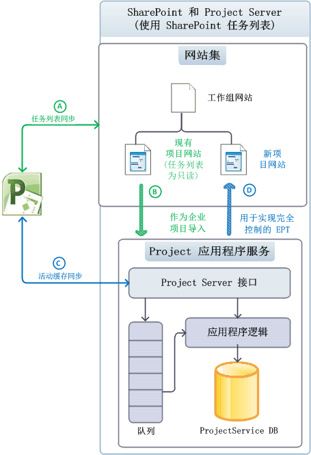
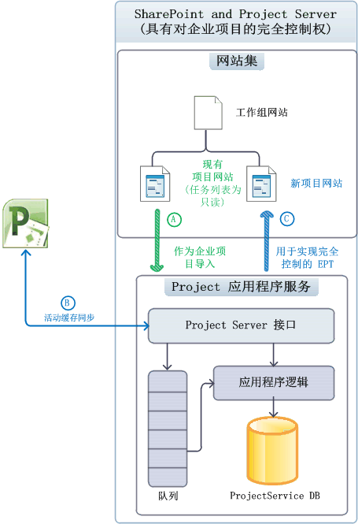
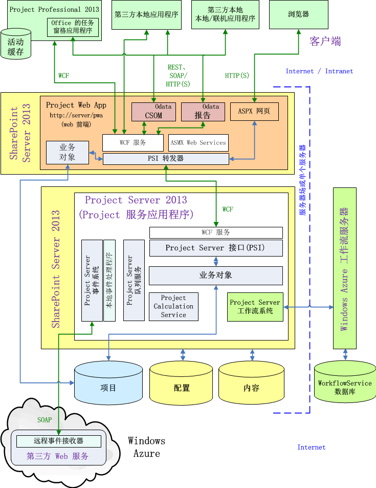

# Project Server 体系结构

Project Server 2013 集成整个 SharePoint 场中的项目管理功能，并允许使用 Project Online 与客户端对象模型 (CSOM) 和的 OData 接口的报告数据。
   
Project Server 2013 是扩展 Office Project Server 2007 中引入的体系结构的多层系统。 体系结构更改包括 Project Application Service 与 SharePoint 网站集添加一些业务对象上 web 前端 (WFE)、 远程访问的客户端对象模型 (CSOM)、 一个 Project 数据库，关联报告表和视图，实现集成的 Windows Workflow Foundation 版本 4 (WF4) 工作流管理器客户端 1.0 在云中，或通过上的本地服务器和多个 Project server 可访问的远程事件接收器的 OData 接口安装。 除了内部部署自定义解决方案，您可以创建包含远程事件接收器和访问的 CSOM 和 OData 接口的组件的应用程序。
  
前端层包括 Project Professional 2013、 Project Web App 和第三方应用程序。 与通过 Project Server 接口 (PSI) 或通过 CSOM 终结点，其中反过来与 PSI 和业务对象层通信的中间层通信客户端应用程序。 数据库访问集成中的业务对象。 Project Server 事件系统可以访问本地事件处理程序和远程事件接收器。 Project Calculation Service 实现在 Project Server 中的 Project Professional 计划引擎。 客户端应用程序不 （或不应） 直接访问 Project 数据库;Project Server 隐藏来自客户端业务对象。
  
> [!NOTE]
> Project Server 构建在 SharePoint 体系结构。 有关 SharePoint Server 2013 体系结构和 SharePoint 应用程序模型的信息，请参阅 Office 2013 开发人员文档中的*SharePoint 开发入门*一节。 

## 与 SharePoint 网站集集成

Project Server 2013 中的 Project 应用程序服务可与 SharePoint 网站集以用于 SharePoint 任务列表相关联、 Project 应用程序服务还可以导入 SharePoint 任务列表作为企业项目为完全的 Project Server控件。 与 SharePoint 任务列表，SharePoint 将维护网站集中; 项目网站Project Professional 可以与同步和更新任务列表。 项目网站可以是独立的 SharePoint 任务列表或任务列表与.mpp 文件; 同步本地或 SharePoint 库中，可以存储的.mpp 文件。 
  
Project Server 维护项目时它具有完全控制;Project Professional 将数据保存到 Project Server 直接。 表 1 Project Server 拥有完全控制权限时比较的任务列表、 日程安排 web 部件，以及针对 SharePoint 的任务列表的控件和导入的项目的其他功能的行为。 日程安排 web 部件包含可在其中编辑项目计划 Project Web App 页上的网格。 绑定的模式是其中 statusing 数据一次输入任务和时间表;在单输入模式下，任务状态数据是从时间表单独输入。
  
**表 1. 比较 SharePoint 任务列表和完全控制权**

| 功能 | 任务列表 | 完全控制权 |
|:-----|:-----|:-----|
|**SharePoint 中的任务列表**   |读/写    |只读    |
|**日程安排 web 部件**   |只读    |读/写    |
|**报告**   |通过 Project Server 进行的各种报告    |通过 Project Server 进行的各种报告    |
|**其他 Project Server 功能**   | 阻止的功能：   -服务器端项目编辑，与 Project Web App 或自定义客户端应用程序   -进展状况   -任务不是在绑定模式中可见    |启用了完整功能    |
   
### 将项目作为 SharePoint 任务列表进行管理

Project Server 时，SharePoint 将维护控件、 任务列表和文档库中的 Project Professional 2013 (.mpp) 文件都能看到 Project Application Service，但 SharePoint 将维护 SharePoint 网站集相关联主同步的数据 （见图 1）。 无法完成服务器端日程安排与日程安排 web 部件。 您可以使用 Project Professional 与同步和编辑项目网站中的任务列表。 通过启动与 SharePoint 任务列表，组织可以逐步发展，用于 Project Server 的全部功能。
  
图 1 显示了在 SharePoint 任务列表中维护项目时的以下过程： 
  
- (A) Project Professional 可以与任务列表同步，并在与 Project Application Service 建立关联之前或之后在网站集中创建新的项目网站。
    
- (B) Project Server 将与项目网站数据同步以进行报告，而 SharePoint 将维护主数据；任务列表保持读/写。
    
- (C) 在建立关联后，Project Professional 可创建新的项目，并将项目保存或发布到 Project Server。Project Professional 中的活动缓存将与 Project Server 保持数据同步。
    
- （D） 时在 Project Professional 发布新项目时，用户将具有创建项目的项目网站的选项。 作为 SharePoint 任务列表项目类型或完全控制企业项目类型 (EPT)，还可以在 Project Web App 中创建一个项目。 步骤 (D) 显示了完全控制 EPT。
    
**图 1. 将项目网站用作 SharePoint 任务列表**

 

### 使用完全控制权管理项目

Project Server 与网站集相关联，并且具有完全控制时, Project Server 导入的 SharePoint 作为企业项目任务列表，并可以删除任何相关的.mpp 文件。 Project Server 将维护主数据的任务列表同步;在网站集中的任务列表变为只读 （见图 2）。 使用 Project Professional 或使用 Project Web App，可以编辑导入的项目。
  
> [!NOTE]
> 在 Project Server 导入一个项目后，用户可选择是从网站中删除该项目，还是在编辑项目前断开连接。可以在 Project Professional 中作出选择。 
  
图 2 显示了当 Project Server 使用完全控制权维护企业项目时的以下过程：
  
- (A) 用户可以选择要导入的项目网站。Project Server 会导入这些项目网站，并（可选）删除关联的 .mpp 文件。导入的项目的 SharePoint 任务列表会变为只读。
    
- （Project Professional B） 后关联，请创建新的项目和保存或发布到 Project Server。 在 Project Professional 活动缓存可保持与 Project Server 数据同步。 Project Web App 中的日程安排 web 部件可执行服务器端日程安排。
    
- （C） 时在 Project Professional 发布新项目时，用户将具有创建项目的项目网站的选项。 此外可以完全控制 EPT 与 Project Web App 中创建和发布到网站集中的项目网站的只读的任务列表与项目。
    
**图 2. 使用具有完全控制权的项目网站**

  
## 常规体系结构

图 3 显示了 Project Server 2013 体系结构，包括 Project Service 应用程序，WFE 上的一个 Project Web App 实例和多个其他客户端应用程序包括 Project Professional 2013 的通用的视图。
  
可以有多个与后端 Project Service 应用程序进行通信的 Project Web App 实例。 在本地安装，WFE 可以是在 SharePoint 场中的一台服务器上或可以与 Project Service 应用程序相同的 SharePoint 服务器上。 Project Online 包括 WFE、 Project Service 应用程序，以及本地或远程工作流管理器客户端 1.0 服务器。 
  
**图 3. 常规 Project Server 2013 体系结构**

 

以下常用注释适用于图 3：
  
- **Project Online:** 您可以创建使用 CSOM、 REST 和 OData 接口的应用程序。 应用程序包还可以安装在本地服务器上，在 Azure 服务器，或在 Microsoft Azure 上自定义 web 服务中的远程事件接收器。 Project Online 不支持第三方在内部部署解决方案、 WCF 接口、 ASMX 接口或本地事件处理程序。 
    
- **事件接收器：** 此外可以调用事件接收器的事件处理程序。 Project Online 支持远程 Project Server 事件接收器，可通过在云中的 Project Web App 实例或内部部署 Project Server 安装的注册。 内部部署 Project Server 安装支持远程事件接收器和完全信任的本地事件处理程序。 
    
- **浏览器：** 不存在上查看某些 Project Web App 页中，跨浏览器限制为 Project Server 2010 中有。 充分利用 Project Web app 支持以下浏览器： 
    
  - Internet Explorer 8.x （在 Windows 7 和早期版本的 Microsoft Windows），Internet Explorer 9.x 和 Internet Explorer 10.x 
  - Firefox 4.x（在 Windows、Mac OS-X 和 Linux/Unix 上）
  - Safari 5.x（在 Windows 和 Mac OS-X 上）
  - Chrome
    
- **编程接口：** 对于第三方应用程序，Project Online 公开 （包括 REST） 的 HTTP/HTTPS 接口、 CSOM 接口、 CSOM、 OData 服务和 OData 服务报告。 对于本地 （Intranet) 的第三方客户端应用程序，可用于 WCF 接口 PSI，或您可以使用通过 HTTP CSOM、 OData、 和 REST 接口。 Project Web App 和 Project Professional 2013 客户端这两个使用 WCF 接口。 在单服务器安装中，前端的 ASMX web 服务、 CSOM、 和 REST 内部调用后端 WCF 服务。 
    
    > [!NOTE]
    > PSI 中的 web 服务 SOAP 基于 ASMX 接口 Project Server 2013 中仍然可用，但已被弃用。 
  
    由内部 OData.svc WCF 服务实现报告的 OData 服务。 可以通过使用的报表数据来获取服务元数据文档`http://ServerName/ProjectServerName/_api/ProjectData/$metadata`。 
    
    CSOM 的 OData 服务适用于 Windows RT、 iOS 和 Android，其中您可以使用 REST 接口与 JavaScript 中的 HTML 页等的平台。 
    
    > [!NOTE]
    > 尽管`$metadata`选项**ProjectData**报告服务有效的`$metadata` **ProjectServer**服务 CSOM 中的删除 Project Server 2013 的发行版中的选项。 CSOM 的 REST 查询的详细信息，请参阅[Project server 的客户端对象模型 (CSOM)](client-side-object-model-csom-for-project-2013.md)。 
  
- **PSI 转发器：** 以编程方式访问单独 WFE 上 PSI 经历 PSI 转发器，其中包括 WCF 转发器和 Web 服务转发器。 客户端使用 ASMX 接口的 Web 服务转发器通过访问 PSI。 使用 WCF 接口的客户端通过 WCF 转发器访问 PSI。 通过 CSOM、 OData、 和 REST 进行编程访问通过 WCF 转发器通过管道传递。 
    
- **工作流：** 声明性工作流 （SharePoint Designer 2013 中定义的工作流） 都被处理转移到工作流管理器客户端 1.0。 工作流管理器客户端 1.0 可以在 Microsoft Azure 在云中，或以进行测试或演示单一 Project Server 计算机上的 SharePoint 场中的单独服务器上运行。 使用 Visual Studio 2012 开发的编码工作流在 SharePoint，与 Project Server 2010 中的工作流运行时处理。 有关详细信息，请参阅[Getting started 开发 Project Server 工作流](getting-started-developing-project-server-workflows.md)。
    
- **外围网络 (DMZ):** 图 3 不显示，可通过外围网络 （也称为"外围安全区域"或 DMZ） 中的附加防火墙隔离内部部署 WFE 服务器。 外围网络可以允许 Internet 客户端跨防火墙访问 SharePoint 和 Project Server。 
    
- **的 SharePoint Web 服务：** 图 3 不会显示 SharePoint 基础结构，如后端 SharePoint Web 服务应用程序，它是 SharePoint Server 2013 的一部分。 在安装 Project Server 时，Project Service 应用程序添加到 SharePoint Web 服务。 
    
前端层包括第三方应用程序、 Project Professional 和 Project Web App。 浏览器中显示 Project Web App 中的 ASP.NET 4.0 页面 （.aspx 页）。 Project Web App 页使用 Project Server Web 部件的使用 PSI 进行通信和还使用标准 SharePoint Web 部件。 
  
中间层包括 PSI 和业务对象层包含表示 Project Server 业务实体的逻辑对象。 业务实体包括项目、 任务、 资源、 工作分配，等等。 PSI 和业务对象层紧密耦合位于同一服务器上。 客户端应用程序通过一个可用的接口，调用 PSI 和 PSI 调用业务对象。 改进的性能，Project Server 2013 的 WFE 包括不使用 Project Server 队列系统或不需要 Project Calculation Service 请求的一些业务对象。 直接与 Project 数据库通信的 WFE 业务对象。
  
Project Server 的 Project Web App 组件使用项目网站设置和项目网站内容，例如任务列表、 自定义页面、 工作流、 管理设置、 文档和的列表的内容数据库的 SharePoint 2013 配置数据库问题、 风险和承诺。 SharePoint 配置数据库和内容数据库支持用于管理的项目，如项目模板和工作区的其他功能自定义列表团队协作和报告。
  
### Project Web App 和 WFE

要启用负载分布 intranet 客户端的 WFE 和企业 intranet 内的多台 WFE 服务器上，您可以配置多个 Project Web App 实例。 当客户端应用程序使用单独的 WFE 服务器上的 Project Web App 实例时，PSI 呼叫通过 PSI 转发器进行路由。 PSI 转发器 （WCF 转发器或 Web 服务转发器） 执行下列功能：
  
- 优化对远程客户端中的 PSI 的调用。
    
- 区分需要 Project Server 队列服务的 PSI 调用和不需要该服务的 PSI 调用。异步 PSI 方法名称以 Queue 开头，如 **QueueCreateProject**。
    
- 标识调用注册的本地事件处理程序的 PSI 调用。
    
- 标识需要 Project Calculation Service 的 PSI 调用。
    
- 使用基于服务器的缓存，将该缓存与 Project Professional 中的客户端活动缓存一起使用可减少对 Project Server 的往返调用次数。
    
SharePoint Server 对 Project Server 用户进行身份验证后，PSI 转发器透明地实施发送运行 Project Server 的计算机使用 PSI 服务后端服务的请求。 不需要后端服务的请求发送到本地的 Project Web App 实例中的业务对象。 PSI 转发器处理通过 LAN，WAN，和 Project Online 中的 Project server 提高可伸缩性、 性能和可靠性。
  
Project Web App 开发与 ASP.NET 4.0。 .Aspx 文件 （HTML、 服务器控件和静态文本） 中的可视元素是独立的编译的程序集 （.dll 文件） 中的代码隐藏类中的编程逻辑。 可以通过使用 Web 部件自定义网站页面在 Project Web App 中，如顶级页、 项目中心和报告中心。 在**网站操作**菜单中没有**编辑页面**选项的应用程序页不能编辑，如服务器设置页和审阅时间表页。 
  
### CSOM 和 Project Server 接口

PSI 在内 22 公共服务，如**项目**、**资源**、 **CustomField**和**进展状况**。 PSI 还包含七个专用服务供内部使用。 PSI 的是基本 API 的 Project Server;它公开到 CSOM 和外部应用程序的 Project Server 功能。 CSOM 包括访问最常用的 PSI 类和成员用于第三方应用程序的类。 Project Server 2013 中某些 Project Server 功能不可用 csom，如**管理**服务、**日历**、 **PortfolioAnalyses**和**安全**的服务。 
  
Project Professional 2013 和 Project Web App 使用 PSI 访问中的草稿、 已发布，Project Server 数据和存档表和视图的 Project 数据库。 您可以通过代理文件或代理程序集的 WCF 服务或的 ASMX web 服务访问 PSI 服务。
  
> [!NOTE]
> CSOM 是针对第三方 Project Server 开发人员; 的首选的接口可用于访问内部部署 Project Server 安装和 Project Online 的应用程序。 我们建议使用 CSOM 开发新的应用程序，如果 CSOM 包括您的应用程序需要的功能。 
  
某些业务线 (LOB) 应用程序和其他第三方开发的应用程序的 Project Server 2010 需要尚不会出现在 CSOM 的 PSI 服务。 如果这些目标仅在本地安装的 Project Server，应用程序可以继续使用 WCF 接口或 PSI 的 ASMX 接口。
  
客户端应用程序调用 PSI 通过服务代理。 使用 WCF 接口的客户端访问所有 PSI 服务通过`http://ServerName/ProjectServerName/_vti_bin/psi/ProjectServer.svc`。 使用 ASMX web 服务接口的客户端使用的特定服务的 Project Web App 的 URL。 例如，**资源**服务位于`http://ServerName/ProjectServerName/_vti_bin/psi/resource.asmx?wsdl`。 如果应用程序没有 intranet 访问 Project Server，他们可以在外围网络 （不显示在图 3） 使用的 Project Web App 服务器。
  
图 4 显示**连接**窗格在**Internet 信息服务 (IIS) 管理器中**的单服务器安装的 SharePoint Server 2013 和 Project Server 2013 本地工作流管理网站的工作流管理器客户端 1.0。 SharePoint 网站集 (A) 包括前端 PSI 服务中的`_vti_bin\PSI`虚拟子目录。 SharePoint Web 服务应用程序 (B) 包括 Project Service 应用程序后, 端 PSI 服务中与`508c23fb7dfd4c83a8919fae24bc68c5/PSI`虚拟子目录。 GUID 是 Project Server 安装的 Project Service 应用程序实例的名称。 
  
**图 4. 显示了前端 PSI (A) 和后端 PSI (B) 的 IIS 管理器**

  
客户端应用程序无法直接访问后端 Project Service 应用程序中的 PSI 的 WCF 服务。 如果它们不需要访问 Project Online，客户端应用程序和组件的 LOB 应用程序使用 PSI 代理。 如图 4 中的**资源**服务的 WCF 接口的后端 URL 将为`http://ServerName:32843/508c23fb7dfd4c83a8919fae24bc68c5/psi/resource.svc`。 端口 32843 是为 SharePoint Web 服务应用程序的默认 HTTP 端口 （32844 为 HTTPS 通信的端口）。 但是，web.config 文件中的为 Project Web App 块直接访问后端 PSI 服务。
  
> [!NOTE]
> Project 2013 SDK 下载包括用于 WCF 服务和 ASMX 服务的 PSI 代理文件以及如何将其编译为代理程序集的说明。 > 到创建使用 WCF 接口的更新的 PSI 代理文件，您需要在 Project Server 计算机上直接使用 svcutil.exe 实用程序或 Visual Studio。 
  
PSI 服务的成员通常生成，或作为交换信息与业务对象的方法使用键入的**DataSet**对象。 还有 PSI 开发的几种不同的模型。 例如，**资源**、 **CustomFields**和**LookupTable** PSI 服务的**数据集**操作，使用 XML 筛选器对象和其他服务不;**Statusing**服务中的某些方法使用的_changeXml_参数，而其他方法和服务不能。 CSOM 不使用数据集。 尽管您可以使用.NET 程序集或 JavaScript CSOM 具有不同的编程模型比 PSI，以及使用 CSOM 开发是通常更简单、 更一致比使用 PSI 进行开发。 
  
有关 PSI 的详细信息，请参阅[Project PSI 参考概述](project-psi-reference-overview.md)。 有关 CSOM 的详细信息，请参阅[Project 2013 的客户端对象模型 (CSOM)](client-side-object-model-csom-for-project-2013.md)。
  
### WFE 中的业务对象和 Project Service 应用程序

Project Server 的内部对象模型包括业务对象，它们表示 Project 和 Resource 等逻辑实体。客户端应用程序仅通过 CSOM 或 PSI 访问业务对象。反过来，业务对象将访问 Project 数据库中的草稿、已发布和存档表和视图。
  
不会向第三方开发人员公开业务对象。PSI 将处理 API 与业务对象的映射，而 CSOM 会将其 API 映射到 PSI。业务对象的逻辑实体可分为三类：
  
- **核心实体**为项目、任务、分配、资源和日历等对象。核心实体包括基本业务逻辑，如权限和命名规则。 
    
- **业务实体**为时间表、项目组合和模型等对象。业务实体包括其他业务逻辑且通常是通过将核心实体组合在一起来构建的。 
    
- **支持实体**为安全性和验证等对象。 
    
在 Project Server 2010 中，所有业务对象是 Project Service 应用程序中都实现的。 Project Server 2013 中 WFE 承载多个处理同步方法并不需要 Project Calculation Service 的业务对象。 同步的 PSI 方法，如**DeleteProject**和**ReadAssignments**不要使用 Project Server 队列服务。 PSI 中的异步方法具有开头的名称`Queue`、 **QueueUpdateTimesheet** **QueueCreateProject**等。 异步方法向时控件返回给用户安排处理分析方法的 Project Server 队列服务发送邮件。
  
PSI 转发器决定将哪些请求发送到 Project Service 应用程序以及哪些请求可由 WFE 中的业务对象处理。WFE 中的业务对象将绕过 Project Service 应用程序并可以直接访问 Project 数据库，这与 WFE 中的其他 SharePoint 过程直接访问配置数据库和内容数据库的方式类似。通过在 WFE 上运行多个业务对象，可以提高 Project Server 的效率、减少应用程序层的负载并使 Project Server 能够更好地向上扩展以适应增加的工作负载。
  
> [!NOTE]
> 在 Project Server 2013 中本地事件处理程序都必须部署到 WFE 和后端 Project Server 计算机。 
  
### Project Server 数据库

在 Project Server 2013 中的以前版本的四个 Project Server 数据库合并到 SQL Server 中的一个 Project 数据库中。 默认项目数据库名称为 ProjectService。 报告表和视图保留它们先前的名称与`dbo`前缀，例如 dbo。MSP_EpmProject 和 dbo。MSP_EpmProject_UserView。 具有表和视图以前在草稿数据库的`draft`前缀。 具有表和视图的已发布数据库从`pub`前缀。 表和视图从存档数据库有`ver`前缀。 
  
> [!IMPORTANT]
> 直接访问不支持草稿 (`draft`前缀)、 已发布 (`pub`前缀)，和存档 (`ver`前缀) 表和视图。 仅报告的表和视图，具有，应使用报告`dbo`前缀。 
  
Project Server 数据在 Project 数据库中进行了分区，如下所示：
  
- 草稿表和视图包含未发布项目创建的 Project Professional 和其他应用程序中的数据。 Project Web App 不显示从草稿表和视图的项目数据。
    
- 已发布的表和视图包含的所有的已发布的项目和企业资源、 企业项目类型 (Ept) 的全局数据和其他项目模板。 已发布的项目是在 Project Web App 中可见。 已发布的数据还包括特定于 Project Web App （时间表、 模型、 视图等） 的表和全局数据表 （自定义字段、 查阅表格、 Project Server 授权权限和元数据）。
    
- 存档数据将保存项目、资源、自定义字段和其他数据的备份版本。
    
- 第三方应用程序中的只读访问权限和报告，可以使用的报表数据。 Project Server OLAP 多维数据集使用具有报告视图`_OlapView`后缀。 OLAP 多维数据集可在内部部署 Project Server 安装中，但在 Project Online 中不可用。 
    
    报表数据非常全面，并且几乎是实时更新的。报告表和视图已针对只读报表生成进行优化；例如，报告表是非规范化的，旨在提供冗余数据和减少关系表的数目。
    
逻辑实体（如 Resource 或 Project）可跨多个表，并且针对某个特殊实体的所有表都具有相同的主键。主键是单个列中的 GUID，用于唯一标识特殊实体的一个实例。
  
Project Web App 的每个实例的 project Server 数据存储在单独的 Project 数据库使用不同的名称。 报告表和视图，可以直接读取可以直接访问 Project Server 的客户端应用程序。 对于远程访问客户端应用程序可以使用 OData 接口和 REST 接口获取报告的数据。 客户端应使用仅 CSOM 或 PSI 访问草稿、 已发布，并将存档表和视图。 报告数据服务 (RDS，而不会显示在图 3) 更新从近乎实时的已发布数据的报表数据。 将 Project 数据库可以位于单独的服务器上。
  
架构记录仅用于报表的表和视图。 对于内部部署 Project Server 安装，您可以添加报告表和视图未定义 Project 数据库架构中的实体。 您还可以创建单独的数据库的本地自定义应用程序。 修改不支持草稿和已发布、 存档表和视图。 由于 Project 数据库不能直接访问 Project Online 中，不能修改报告表和视图。 但是，如果您有 SQL Azure 帐户，您可以与 Project Online 中创建自定义使用单独的数据库。
  
### 事件接收器

本地事件处理程序和远程事件接收器的 Project Server，例如创建或发布项目的 Project Server 事件的响应中的第三方扩展性。 Project Server 2010 中的所有事件处理本地和以完全信任代码，部署运行 Project Server 的计算机上直接和 Wfe，并运行 Project Server 事件系统内编写。 由于 Project Online 无法使用完全信任事件处理程序，Project Server 2013 实现类似于 SharePoint Server 2013 中的远程事件接收器的远程事件接收器。 传统完全信任事件处理程序和远程事件接收器，可以使用 Project Server 2013 的本地安装。
  
可以在 Microsoft Azure 或其他支持 SOAP web 服务的环境中运行的 SOAP 终结点与自定义 web 服务中实现的 Project Server 远程事件接收器。 Project Server 应用程序包可以包括安装了应用程序的远程事件接收器。
  
远程事件接收器可以回调到 Project Server CSOM 终结点 （不显示在图 3） 使用。 呼叫到远程事件接收器包括从 Project Server 事件系统和 Project Web App 实例 （或 Project Online 中的 Project Web App 租户） 发出呼叫的信息。 远程事件接收器允许您将创建并承载可由多个 Project Server 安装的单个 web 服务。 相比之下，必须为每个安装的 Project Server 部署完全信任的本地事件处理程序。
  
### 发布和服务器端计划

Project Server 2013 支持同时手动和自动项目计划更新。 默认过程是一个手动计划更新。 即，项目经理签出和 Project Professional 或 Project Web App 中打开项目、 应用所做的更改，然后保存并发布项目以使所做的更改可供所有人。 Project Professional 具有计算更改，然后将所做的更改保存到 Project Server 计划引擎。 Project Server 2010 中的服务器端计划引擎是从 Project Professional 中的计划引擎不同的实现。
  
在 Project Server 2013，Project Calculation Service 实现 Project Professional 2013 中的相同计划引擎。 在名为**Microsoft Project Server Calculation Service**的 Windows 服务运行 Project Calculation Service。 编辑 Project Web App 中或与完全相同计划的更改会使 Project Professional 中使用 CSOM 结果的第三方应用程序的项目计划。
  
> [!NOTE]
> 使用 PSI 的第三方应用程序可能会显示 Project Web App 计算计划一些计划不同之处。 向后兼容性，公共的 PSI 方法执行服务器端调度仍使用计划引擎 Project Server 2010 中引入的。 异常是**QueueUpdateProject2**，它是新 Project Server 2013 中的 PSI 方法。 例如，旧的计划引擎不安排 subprojects 或其他项目，指向和不计算挣的值字段。 以避免潜在安排第三方应用程序与 Project Professional 或 Project Web App 之间的差异您应开发应用程序使用 CSOM 在可能的情况。 
  
Project Server 允许在项目经理使用草稿版本时通过执行以下步骤来更新项目的已发布版本：
  
1. Project Server 应用更新并重新安排已发布版本。
    
2. 在发生以下任一事件时，Project Server 将保存更新以应用到草稿版本：
    
   - Project Professional 将打开项目。
    
   - Project Professional 尝试发布项目。
    
3. 如果存在冲突，项目经理会收到通知且必须先解决冲突，然后才能发布草稿版本。
    
## 另请参阅

- [面向开发人员的 Project 2013 概述](http://msdn.microsoft.com/library/8da91ab0-af4f-429f-8241-490600e3f7bd%28Office.15%29.aspx)
- [Project Server 可编程性](project-server-programmability.md)  
- [Project 2013 的客户端对象模型 (CSOM)](client-side-object-model-csom-for-project-2013.md)  
- [PSI 执行和不执行的操作](what-the-psi-does-and-does-not-do.md)  
- [开发 Project Server 工作流入门](getting-started-developing-project-server-workflows.md)   
- [项目 PSI 参考概述](project-psi-reference-overview.md)   
- [开放式数据协议](http://www.odata.org/)（http://www.odata.org）
    

