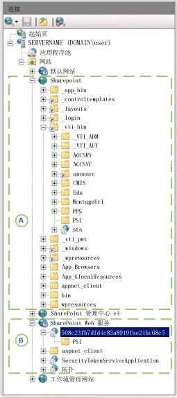

# Project Server 体系结构

Project Server 2013 在整个 SharePoint 场中集成项目管理功能，并支持结合使用 Project Online 与客户端对象模型 (CSOM) 和用于报告数据的 OData 接口。
   
作为多层次系统，Project Server 2013 扩展了 Office Project Server 2007 中引入的体系结构。 体系结构更改包括关联 Project Application Service 与 SharePoint 网站集、添加了 Web 前端 (WFE) 上的一些业务对象、用于远程访问的客户端对象模型 (CSOM)、单个 Project 数据库、用于报告表格和视图的 OData 接口、在云中或本地服务器上通过 Workflow Manager Client 1.0 集成 Windows Workflow Foundation 版本 4 (WF4)，以及可供多个 Project Server 安装访问的远程事件接收器。 除了本地自定义解决方案外，还可以创建包含远程事件接收器和访问 CSOM 和 OData 接口的组件的应用。
  
前端层包括 Project Professional 2013、Project Web App 和第三方应用。 客户端应用通过 Project Server 接口 (PSI) 或 CSOM 终结点与中间层通信，进而与 PSI 和业务对象层通信。 数据库访问集成在业务对象中。 Project Server 事件系统可以同时访问本地事件处理程序和远程事件接收器。 Project Calculation Service 在 Project Server 中实现 Project Professional 日程安排引擎。 客户端应用不（或不得）直接访问 Project 数据库；Project Server 对客户端隐藏业务对象。
  
> [!NOTE]
> Project Server 是在 SharePoint 体系结构的基础之上构建而成。 若要了解 SharePoint Server 2013 体系结构和 SharePoint 应用模型，请参阅 Office 2013 开发人员文档中的 *SharePoint 开发入门*部分。 

## 与 SharePoint 网站集集成

Project Server 2013 中的 Project Application Service 可以与 SharePoint 网站集关联，以用于 SharePoint 任务列表。Project Application Service 还可以将 SharePoint 任务列表导入为企业项目，以获取完全 Project Server 控制。 借助 SharePoint 任务列表，SharePoint 可以维护网站集中的项目网站；Project Professional 可以与任务列表同步，并更新任务列表。 项目网站可以是独立的 SharePoint 任务列表，也可以是与 .mpp 文件同步的任务列表；.mpp 文件可以存储在本地，也可以存储在 SharePoint 库中。 
  
Project Server 在可完全控制时维护项目；Project Professional 将数据直接保存到 Project Server 中。 表 1 比较了任务列表、日程安排 Web 部件和其他功能在便于 SharePoint 控制任务列表时的行为与在 Project Server 可完全控制时针对已导入项目的行为。 日程安排 Web 部件在 Project Web App 页中有网格，可便于编辑项目日程安排。 在绑定模式中，可以同时为任务和时间表一次输入状态数据；在单一输入模式中，任务和时间表的状态数据是分开输入的。
  
**表 1：比较 SharePoint 任务列表和完全控制**

| 功能 | 任务列表 | 完全控制 |
|:-----|:-----|:-----|
|**SharePoint 中的任务列表**   |读/写    |只读    |
|**日程安排 Web 部件**   |只读    |读/写    |
|**报告**   |通过 Project Server 的丰富报告    |通过 Project Server 的丰富报告    |
|**其他 Project Server 功能**   | 已屏蔽功能：   - 服务器端项目编辑（使用 Project Web App 或自定义客户端应用）   - 状态   - 任务在绑定模式中不可见    |完整功能已启用    |
   
### 将项目作为 SharePoint 任务列表进行管理

如果 Project Server 已与 SharePoint 一直控制的 SharePoint 网站集关联，虽然文档库中的任务列表和 Project Professional 2013 (.mpp) 文件对 Project Application Service 可见，但 SharePoint 会维护主数据以供同步（见图 1）。 无法使用日程安排 Web 部件进行服务器端日程安排。 可使用 Project Professional 与项目网站中的任务列表同步，并编辑任务列表。 从 SharePoint 任务列表入手，组织可以逐渐发展为使用 Project Server 的完整功能。
  
图 1 展示了以下在 SharePoint 任务列表中维护项目的过程： 
  
- (A) Project Professional 可以与任务列表同步，并在与 Project Application Service 建立关联之前或之后在网站集中创建新的项目网站。
    
- (B) Project Server 将与项目网站数据同步以进行报告，而 SharePoint 将维护主数据；任务列表保持读/写。
    
- (C) 在建立关联后，Project Professional 可创建新的项目，并将项目保存或发布到 Project Server。Project Professional 中的活动缓存将与 Project Server 保持数据同步。
    
- (D) 当新项目在 Project Professional 中发布后，用户可以视需要创建项目的项目网站。 也可以在 Project Web App 中创建 SharePoint 任务列表项目类型或完全控制企业项目类型 (EPT) 的项目。 步骤 (D) 展示的是完全控制 EPT。
    
**图 1：将项目网站用作 SharePoint 任务列表**

 

### 在可完全控制时管理项目

如果 Project Server 已与网站集关联且可完全控制，Project Server 既可以将 SharePoint 任务列表导入为企业项目，也可以删除任何相关的 .mpp 文件。 Project Server 维护主数据，以执行任务列表同步；网站集中的任务列表变为只读（见图 2）。 可使用 Project Professional 或 Project Web App 编辑已导入项目。
  
> [!NOTE]
> 在 Project Server 导入一个项目后，用户可选择是从网站中删除该项目，还是在编辑项目前断开连接。可以在 Project Professional 中作出选择。 
  
图 2 显示了当 Project Server 使用完全控制权维护企业项目时的以下过程：
  
- (A) 用户可以选择要导入的项目网站。Project Server 会导入这些项目网站，并（可选）删除关联的 .mpp 文件。导入的项目的 SharePoint 任务列表会变为只读。
    
- (B) 在建立关联后，Project Professional 新建项目，并将项目保存或发布到 Project Server 中。 Project Professional 中的活动缓存与 Project Server 保持数据同步。 Project Web App 中的日程安排 Web 部件可以执行服务器端日程安排。
    
- (C) 当新项目在 Project Professional 中发布后，用户可以视需要创建项目的项目网站。 也可以在 Project Web App 中创建类型为完全控制 EPT 的项目，并作为只读任务列表发布到网站集中的项目网站。
    
**图 2：在可完全控制时使用项目网站**

  
## 常规体系结构

图 3 展示了 Project Server 2013 体系结构的概括视图，包括 Project Service Application、WFE 上的一个 Project Web App 实例，以及其他几个客户端应用（包括 Project Professional 2013）。
  
可以有多个 Project Web App 实例与后端 Project Service Application 通信。 对于本地安装，WFE 可以位于 SharePoint 场的独立服务器上，也可以与 Project Service Application 位于同一个 SharePoint 服务器上。 Project Online 包括 WFE、Project Service Application 和本地或远程 Workflow Manager Client 1.0 服务器。 
  
**图 3：常规 Project Server 2013 体系结构**

 

下面是图 3 的一般性注释：
  
- **Project Online：** 可以创建使用 CSOM、REST 和 OData 接口的应用。应用包还可以在本地服务器、Azure 服务器或 Microsoft Azure 上的自定义 Web 服务中安装远程事件接收器。 Project Online 不支持第三方本地解决方案、WCF 接口、ASMX 接口或本地事件处理程序。 
    
- **事件接收器：** 事件接收器也可以称为"事件处理程序"。Project Online 支持注册远程 Project Server 事件接收器，可供云中的 Project Web App 实例或本地 Project Server 安装使用。本地 Project Server 安装支持远程事件接收器和本地完全信任事件处理程序。 
    
- **浏览器：** 查看一些 Project Web App 页时，没有跨浏览器限制，就像在 Project Server 2010 中一样。 支持充分结合使用以下浏览器和 Project Web App： 
    
  - Internet Explorer 8.x（在 Windows 7 和旧版 Microsoft Windows 上）、Internet Explorer 9.x 和 Internet Explorer 10.x 
  - Firefox 4.x（在 Windows、Mac OS-X 和 Linux/Unix 上）
  - Safari 5.x（在 Windows 和 Mac OS-X 上）
  - Chrome
    
- **编程接口：** 对于第三方应用，Project Online 公开了 HTTP/HTTPS 接口（包括 REST）、CSOM 接口、用于 CSOM 的 OData 服务，以及用于报告的 OData 服务。 对于本地（在 Intranet 上）第三方客户端应用，可以将 WCF 接口用于 PSI，也可以通过 HTTP 使用 CSOM、OData 和 REST 接口。 Project Web App 和 Project Professional 2013 客户端均使用 WCF 接口。 在单一服务器安装中，前端 ASMX Web 服务、CSOM 和 REST 内部调用后端 WCF 服务。 
    
    > [!NOTE]
    > 用于 PSI 中 Web 服务的基于 SOAP 的 ASMX 接口虽然在 Project Server 2013 中仍可用，但已遭弃用。 
  
    用于报表的 OData 服务由内部 OData.svc WCF 服务实现。可以使用  `https://ServerName/ProjectServerName/_api/ProjectData/$metadata` 为报表数据获取服务元数据文档。 
    
    用于 CSOM 的 OData 服务旨在用于 Windows RT、iOS 和 Android 等平台。在这些平台中，可以在 HTML 页中结合使用 REST 接口和 JavaScript。 
    
    > [!NOTE]
    > 尽管用于 **ProjectData** 报告服务的 `$metadata` 选项有效，但 Project Server 2013 发行版中已删除用于 CSOM **ProjectServer** 服务的 `$metadata` 选项。 若要详细了解用于 CSOM 的 REST 查询，请参阅 [Project Server 客户端对象模型 (CSOM)](client-side-object-model-csom-for-project-2013.md)。 
  
- **PSI 转发器：** 以编程方式访问单独 WFE 上的 PSI 是通过 PSI 转发器（包括 WCF 转发器和 Web 服务转发器）完成。 使用 ASMX 接口的客户端通过 Web 服务转发器访问 PSI。 使用 WCF 接口的客户端通过 WCF 转发器访问 PSI。 通过 CSOM、OData 和 REST 的编程访问是通过 WCF 转发器进行管道传递。 
    
- **工作流：** 声明性工作流（SharePoint Designer 2013 中定义的工作流）被转移到 Workflow Manager Client 1.0 中处理。 Workflow Manager Client 1.0 可以在 SharePoint 场的独立服务器上运行，也可以在云中的 Microsoft Azure 上运行，亦可以在一台 Project Server 计算机中运行以供测试或演示。 使用 Visual Studio 2012 开发的已编码工作流在 SharePoint 内的工作流运行时中进行处理，就像在 Project Server 2010 中一样。 有关详细信息，请参阅[开始开发 Project Server 工作流](getting-started-developing-project-server-workflows.md)。
    
- **外围网络 (DMZ)：** 在图 3 中，无法看出本地 WFE 服务器可以被外围网络（亦称为“隔离区 (DMZ)”）中的其他防火墙隔离。 外围网络可以允许 Internet 客户端跨防火墙访问 SharePoint 和 Project Server。 
    
- **SharePoint Web 服务：** 图 3 并未展示 SharePoint 基础结构，如属于 SharePoint Server 2013 的后端 SharePoint Web 服务应用。 在你安装 Project Server 后，Project Service Application 就会被添加到 SharePoint Web 服务中。 
    
前端层包括第三方应用程序、Project Professional 和 Project Web App。浏览器在 Project Web App 中显示 ASP.NET 4.0 页面（.aspx 页面）。Project Web App 页面使用与 PSI 通信的 Project Server Web 部件，并使用标准 SharePoint Web 部件。 
  
中间层包括 PSI 和业务对象层，其中包含表示 Project Server 业务实体的逻辑对象。 业务实体包括项目、任务、资源、作业等。 PSI 和业务对象层紧密结合，且位于同一服务器上。 客户端应用通过可用接口之一调用 PSI，PSI 调用业务对象。 为了提升性能，Project Server 2013 的 WFE 包括一些业务对象，适用于不使用 Project Server 队列系统或不需要 Project Calculation Service 的请求。 WFE 业务对象直接与 Project 数据库通信。
  
Project Server 的 Project Web App 组件使用 SharePoint 2013 配置数据库进行项目网站设置，并对项目网站内容（如任务列表、自定义页、工作流、管理设置、文档、问题列表、风险和承诺）使用内容数据库。 SharePoint 配置数据库和内容数据库支持其他项目管理功能，如项目模板和工作区、用于团队协作的自定义列表和报告。
  
### Project Web App 和 WFE

可以在 WFE 上和在企业 Intranet 内的多台 WFE 服务器上配置多个 Project Web App 实例，从而为 Intranet 客户端启用负载分布。 如果客户端应用使用独立 WFE 服务器上的 Project Web App 实例，PSI 调用通过 PSI 转发器进行路由。 PSI 转发器（WCF 转发器或 Web 服务转发器）的职能如下：
  
- 优化远程客户端对 PSI 的调用。
    
- 区分需要 Project Server 队列服务的 PSI 调用和不需要该服务的 PSI 调用。异步 PSI 方法名称以 Queue 开头，如 **QueueCreateProject**。
    
- 标识调用已注册本地事件处理程序的 PSI 调用。
    
- 标识需要 Project Calculation Service 的 PSI 调用。
    
- 使用与 Project Professional 中的客户端活动缓存配合使用的基于服务器的缓存，以减少对 Project Server 的往返调用。
    
在 SharePoint Server 验证 Project Server 用户身份后，PSI 转发器会以透明方式将使用后端服务的请求发送到运行 Project Server 的计算机上的 PSI 服务。 无需使用后端服务的请求会发送到本地 Project Web App 实例中的业务对象。 PSI 转发器提高了可伸缩性、性能和可靠性，以便能够通过 LAN、WAN 和在 Project Online 中执行 Project Server 处理工作。
  
Project Web App 是使用 ASP.NET 4.0 开发而成。 .aspx 文件中的可视化元素（HTML、服务器控件和静态文本）独立于已编译程序集（.dll 文件）内代码隐藏类中的编程逻辑。 可使用 Web 部件自定义 Project Web App 中的网页，如顶级页、项目中心和报告中心。 无法编辑在“网站操作”**** 菜单中没有“编辑页”**** 选项的应用页，如“服务器设置”页和“审核时间表”页。 
  
### CSOM 和 Project Server 接口

PSI 分成 22 个公共服务，如**项目**、**资源**、**自定义字段**和**状态**。 PSI 还包含 7 个专用服务，以供内部使用。 PSI 是 Project Server 的基本 API；它向 CSOM 和外部应用公开了 Project Server 功能。 CSOM 包括可访问最常用 PSI 类的类，以及用于第三方应用的成员。 在 Project Server 2013 中，一些 Project Server 功能在 CSOM 中不可用，如**管理员**、**日历**、**项目组合之分析**和**安全**服务。 
  
Project Professional 2013 和 Project Web App 使用 PSI 访问 Project 数据库的草稿、已发布、存档表格和视图中的 Project Server 数据。 可以通过代理文件或代理程序集访问 PSI 服务（WCF 服务或 ASMX Web 服务）。
  
> [!NOTE]
> CSOM 是第三方 Project Server 开发人员的首选接口；它可用于同时访问本地 Project Server 安装和 Project Online 的应用。 如果 CSOM 包括应用所需的功能，建议使用 CSOM 开发新应用。 
  
一些业务线 (LOB) 应用以及为 Project Server 2010 开发的其他第三方应用要求，PSI 服务尚未在 CSOM 中表示。 如果它们仅定目标到 Project Server 的本地安装，应用可以继续使用 PSI 的 WCF 接口或 ASMX 接口。
  
客户端应用通过服务代理调用 PSI。 使用 WCF 接口的客户端通过 `https://ServerName/ProjectServerName/_vti_bin/psi/ProjectServer.svc` 访问所有 PSI 服务。 使用 ASMX Web 服务接口的客户端使用特定服务的 Project Web App URL。 例如，**资源**服务位于 `https://ServerName/ProjectServerName/_vti_bin/psi/resource.asmx?wsdl`。 如果应用无法通过 Intranet 访问 Project Server，可使用外围网络中的 Project Web App 服务器（图 3 中未显示）。
  
图 4 针对 SharePoint Server 2013 单一服务器安装、Project Server 2013 和用于 Workflow Manager Client 1.0 的本地工作流管理网站，展示了 **Internet Information Services (IIS) 管理器**中的“连接”**** 窗格。 SharePoint 网站集 (A) 在 `_vti_bin\PSI` 虚拟子目录中包括前端 PSI 服务。 SharePoint Web 服务应用 (B) 在 `508c23fb7dfd4c83a8919fae24bc68c5/PSI` 虚拟子目录中包括 Project Service Application 以及后端 PSI 服务。 GUID 是相应 Project Server 安装的 Project Service Application 实例名称。 
  
**图 4：显示前端 PSI (A) 和后端 PSI (B) 的 IIS 管理器**

  
客户端应用无法直接在后端 Project Service Application 中访问 PSI 的 WCF 服务。 如果它们不要求访问 Project Online，LOB 应用的客户端应用和组件对 PSI 使用代理。 在图 4 中，**资源**服务的 WCF 接口的后端 URL 是 `https://ServerName:32843/508c23fb7dfd4c83a8919fae24bc68c5/psi/resource.svc`。 端口 32843 是 SharePoint Web 服务应用的默认 HTTP 端口（32844 是 HTTPS 通信端口）。 不过，Project Web App 的 web.config 文件会阻止对后端 PSI 服务的直接访问。
  
> [!NOTE]
> Project 2013 SDK 下载内容包括，用于 WCF 服务和 ASMX 服务的 PSI 代理文件，以及有关如何将它们编译为代理程序集的说明。 > 若要创建使用 WCF 接口的已更新 PSI 代理文件，必须直接在 Project Server 计算机上使用 svcutil.exe 实用工具或 Visual Studio。 
  
PSI 服务的成员通常会生成类型为 **DataSet** 的对象，或使用它们与业务对象交换信息。 还有其他几个模型可用于 PSI 开发。 例如，**资源**、**自定义字段**和**查阅表格** PSI 服务使用 XML 筛选器对象进行 **DataSet** 控制，而其他服务不使用；**状态**服务中的一些方法使用 _changeXml_ 参数，而其他方法和服务不使用。 CSOM 不使用数据集。 尽管 CSOM 的编程模型不同于 PSI，且可使用 .NET 程序集或 JavaScript，但使用 CSOM 开发通常比使用 PSI 开发更为简单和一致。 
  
若要详细了解 PSI，请参阅 [Project PSI 参考概述](project-psi-reference-overview.md)。 若要详细了解 CSOM，请参阅 [Project 2013 客户端对象模型 (CSOM)](client-side-object-model-csom-for-project-2013.md)。
  
### WFE 和 Project Service Application 中的业务对象

Project Server 的内部对象模型包括业务对象，它们表示 Project 和 Resource 等逻辑实体。客户端应用程序仅通过 CSOM 或 PSI 访问业务对象。反过来，业务对象将访问 Project 数据库中的草稿、已发布和存档表和视图。
  
不会向第三方开发人员公开业务对象。PSI 将处理 API 与业务对象的映射，而 CSOM 会将其 API 映射到 PSI。业务对象的逻辑实体可分为三类：
  
- **核心实体**为项目、任务、分配、资源和日历等对象。核心实体包括基本业务逻辑，如权限和命名规则。 
    
- **业务实体**为时间表、项目组合和模型等对象。业务实体包括其他业务逻辑且通常是通过将核心实体组合在一起来构建的。 
    
- **支持实体**是安全和验证等对象。 
    
在 Project Server 2010 中，所有业务对象都是在 Project Service Application 中实现。 在 Project Server 2013 中，WFE 托管多个业务对象，这些对象处理同步方法，且不要求使用 Project Calculation Service。 **DeleteProject** 和 **ReadAssignments** 等同步 PSI 方法不使用 Project Server 队列服务。 PSI 中的异步方法的名称以 `Queue` 开头，如 **QueueCreateProject** 和 **QueueUpdateTimesheet**。 异步方法将消息发送到 Project Server 队列服务，此服务会在用户恢复控制权时安排处理方法。
  
PSI 转发器决定将哪些请求发送到 Project Service 应用程序以及哪些请求可由 WFE 中的业务对象处理。WFE 中的业务对象将绕过 Project Service 应用程序并可以直接访问 Project 数据库，这与 WFE 中的其他 SharePoint 过程直接访问配置数据库和内容数据库的方式类似。通过在 WFE 上运行多个业务对象，可以提高 Project Server 的效率、减少应用程序层的负载并使 Project Server 能够更好地向上扩展以适应增加的工作负载。
  
> [!NOTE]
> 在 Project Server 2013 中，必须将本地事件处理程序部署到 WFE 和后端 Project Server 计算机。 
  
### Project Server 数据库

在 Project Server 2013 中，旧版的四个 Project Server 数据库合并为 SQL Server 的一个 Project 数据库。 默认 Project 数据库名称为 ProjectService。 报告表格和视图保留先前前缀为 `dbo` 的名称，如 dbo.MSP_EpmProject 和 dbo.MSP_EpmProject_UserView。 先前位于草稿数据库中的表格和视图的前缀为 `draft`。 先前位于已发布数据库中的表格和视图的前缀为 `pub`。 先前位于存档数据库中的表格和视图的前缀为 `ver`。 
  
> [!IMPORTANT]
> 不支持直接访问草稿（前缀为 `draft`）、已发布（前缀为 `pub`）和存档（前缀为 `ver`）表格和视图。 报告应仅使用前缀为 `dbo` 的报告表格和视图。 
  
Project Server 数据在 Project 数据库中进行分区，如下所示：
  
- 草稿表格和视图包含由 Project Professional 和其他应用创建的未发布项目中的数据。 Project Web App 不显示草稿表格和视图中的项目数据。
    
- 已发布表格和视图包含所有已发布项目和企业资源、企业项目类型 (EPT) 的全局数据和其他项目模板。 已发布项目在 Project Web App 中可见。 已发布数据还包括 Project Web App 专用表格（时间表、模型、视图等），以及全局数据表（自定义字段、查阅表格、Project Server 授权权限和元数据）。
    
- 存档数据保存项目、资源、自定义字段和其他数据的备份版本。
    
- 报告数据可以用于在第三方应用中进行只读访问，也可以用于报告。 Project Server OLAP 多维数据集使用后缀为 `_OlapView` 的报告视图。 OLAP 多维数据集在本地 Project Server 安装中可用，但在 Project Online 中不可用。 
    
    报表数据非常全面，并且几乎是实时更新的。报告表和视图已针对只读报表生成进行优化；例如，报告表是非规范化的，旨在提供冗余数据和减少关系表的数目。
    
逻辑实体（如 Resource 或 Project）可跨多个表，并且针对某个特殊实体的所有表都具有相同的主键。主键是单个列中的 GUID，用于唯一标识特殊实体的一个实例。
  
每个 Project Web App 实例的 Project Server 数据存储在名称不同的各个 Project 数据库中。 有权直接访问 Project Server 的客户端应用可以直接读取报告表格和视图。 对于远程访问，客户端应用可以使用 OData 接口和 REST 接口来获取报告数据。 客户端应仅使用 CSOM 或 PSI 来访问草稿、已发布和存档表格和视图。 报告数据服务 (RDS)（图 3 中未显示）几乎实时地更新已发布数据中的报告数据。 Project 数据库可以位于独立服务器上。
  
仅对报告表格和视图记录架构。 对于本地 Project Server 安装，可以添加 Project 数据库架构中未定义的实体的报告表格和视图。 还可以为自定义本地应用创建独立数据库。 不支持修改草稿、已发布和存档表格和视图。 由于无法在 Project Online 中直接访问 Project 数据库，因此也就无法修改报告表格和视图。 不过，如果拥有 SQL Azure 帐户，可以创建独立数据库，以自定义用于 Project Online。
  
### 事件接收器

Project Server 的本地事件处理程序和远程事件接收器启用第三方扩展性，以响应创建或发布项目等 Project Server 事件。 在 Project Server 2010 中，所有事件处理程序都是使用完全信任代码编写的本地处理程序，它们直接部署到运行 Project Server 的计算机和 WFE，并且在 Project Server 事件系统内运行。 由于 Project Online 无法使用完全信任事件处理程序，因此 Project Server 2013 实现与 SharePoint Server 2013 中的远程事件接收器类似的远程事件接收器。 Project Server 2013 的本地安装可使用传统的完全信任事件处理程序和远程事件接收器。
  
Project Server 远程事件接收器可以在具有 SOAP 终结点的自定义 Web 服务（在 Microsoft Azure 或支持 SOAP Web 服务的其他环境中运行）中实现。 Project Server 应用包可以包含与应用一起安装的远程事件接收器。
  
远程事件接收器可以使用 CSOM 终结点回调 Project Server（图 3 中未显示）。 对远程事件接收器的调用包括，Project Server 事件系统中的信息，以及发出调用的 Project Web App 实例（或 Project Online 中的 Project Web App 租户）中的信息。 通过远程事件接收器，可以创建并托管一个 Web 服务，可供多个 Project Server 安装使用。 相比之下，必须将本地完全信任事件处理程序部署到每个 Project Server 安装。
  
### 发布和服务器端日程安排

Project Server 2013 支持手动和自动项目日程安排更新。 默认过程是手动日程安排更新。 也就是说，项目经理先在 Project Professional 或 Project Web App 中签出并打开项目，并应用更改，再保存并发布项目，以让更改对所有人都生效。 Project Professional 有日程安排引擎，可用于先计算更改，再将更改保存到 Project Server。 在 Project Server 2010 中，服务器端日程安排引擎的实现与 Project Professional 中的日程安排引擎不同。
  
在 Project Server 2013 中，Project Calculation Service 实现 Project Professional 2013 中的相同日程安排引擎。 Project Calculation Service 在名为 **Microsoft Project Server Calculation Service** 的 Windows 服务中运行。 如果在 Project Web App 中或通过使用 CSOM 的第三方应用编辑项目，生成的日程安排更改与 Project Professional 做出的日程安排更改完全相同。
  
> [!NOTE]
> 使用 PSI 的第三方应用显示的日程安排可能会与 Project Web App 计算的日程安排有一些差异。 为了实现向后兼容性，执行服务器端日程安排的公共 PSI 方法仍使用 Project Server 2010 中引入的日程安排引擎。 **QueueUpdateProject2** 是例外，它是 Project Server 2013 中新增的 PSI 方法。 例如，旧版日程安排引擎不会安排子项目或指向其他项目的链接，也不会计算挣值字段。 为了避免第三方应用与 Project Professional 或 Project Web App 之间的潜在日程安排差异，应尽可能使用 CSOM 开发应用。 
  
Project Server 允许在项目经理使用草稿版本时通过执行以下步骤来更新项目的已发布版本：
  
1. Project Server 应用更新并重新安排已发布版本。
    
2. 在发生以下任一事件时，Project Server 将保存更新以应用到草稿版本：
    
   - Project Professional 将打开项目。
    
   - Project Professional 尝试发布项目。
    
3. 若有冲突，项目经理会收到通知，并且必须先解决冲突，然后才能发布草稿版本。
    
## 另请参阅

- [面向开发人员的 Project 2013 概述](https://msdn.microsoft.com/library/8da91ab0-af4f-429f-8241-490600e3f7bd%28Office.15%29.aspx)
- [Project Server 可编程性](project-server-programmability.md)  
- [Project 2013 客户端对象模型 (CSOM)](client-side-object-model-csom-for-project-2013.md)  
- [PSI 执行和不执行的操作](what-the-psi-does-and-does-not-do.md)  
- [开始开发 Project Server 工作流](getting-started-developing-project-server-workflows.md)   
- [Project PSI 参考概述](project-psi-reference-overview.md)   
- [Open Data Protocol](https://www.odata.org/)
    

