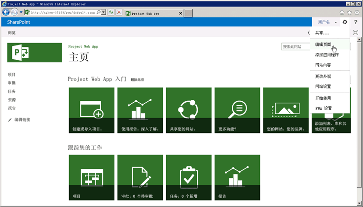
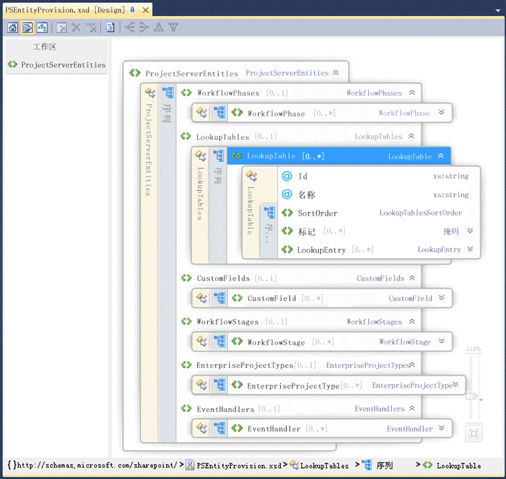

# Project Server 可编程性Project Server programmability

了解 Project Server 2013 中的主要可编程性功能。Learn about the major programmability features in Project Server 2013. 本文包含有关移植为 Project Server 的早期版本构建的应用程序的信息。This article includes information about porting applications that were built for previous versions of Project Server.

Project Server 2013 旨在支持大多数开发的应用程序的 Project Server 2010 和新解决方案的多个平台，其中应用程序可以访问两者在线和本地 Project Server 安装。Project Server 2013 is designed to support most applications that were developed for Project Server 2010 and new solutions for multiple platforms, where apps can access both online and on-premises Project Server installations. 应用程序和扩展而开发的 Project Server 2003 或更早版本的必须经过重新设计以使用客户端对象模型 (CSOM) 或 Project Server 接口 (PSI)。Applications and extensions that were developed for Project Server 2003 or earlier must be redesigned to use the client-side object model (CSOM) or the Project Server Interface (PSI). Office Project Server 2007 或 Project Server 2010 开发的应用程序可能需要一些更改和重新编译使用 PSI;若要使用 CSOM，这些应用程序需要重新设计。Applications that were developed for Office Project Server 2007 or Project Server 2010 may require some changes and recompiling to use the PSI; to use the CSOM, those applications require a redesign.
  
Project Server 平台通过构建在 SharePoint Server 2013、.NET Framework 4 和通过 CSOM OData 协议来启用程序员的工作效率的高的级别。The Project Server platform enables high levels of programmer productivity by building on SharePoint Server 2013, .NET Framework 4, and the OData protocol with the CSOM. 开发人员可以扩展 Project Web App 的应用程序、 应用程序部件和 Web 部件、 使用 SharePoint Designer 2013 中定义的工作流和通过 Project Server 事件中使用远程事件接收器来强制实施业务规则。Developers can extend Project Web App with apps, app parts, and Web Parts, define workflows by using SharePoint Designer 2013, and enforce business rules by using remote event receivers for Project Server events.
  
## Project Server 和 SharePoint ServerProject Server and SharePoint Server

Project Web App 基于 SharePoint Server 2013，并使用母版页和 Web 部件更加轻松地构建自定义应用程序和 Project Web App 解决方案。Project Web App is built upon SharePoint Server 2013, and uses master pages and Web Parts to make it easier to build custom apps and Project Web App solutions. Project Server 2013 深与集成 SharePoint Server 2013 作为平台的项目协作、 报告、 网站管理、 安全性和工作流管理。Project Server 2013 integrates deeply with SharePoint Server 2013 as the platform for project collaboration, reporting, site administration, security, and workflow management.
  
项目网站包括详细信息和协作选项工作组成员，您可以在其中添加包含摘要、 专用 SharePoint 列表的任务时间线、 跟踪问题、 风险某个项目的默认应用程序，项目可交付结果和团队日历，以及文档库和团队讨论。The project sites include more information and collaboration options for team members, where you can add default apps that include a project summary, specialized SharePoint lists for tasks with a timeline, tracking issues, risks, project deliverables, and the team calendar, along with the document library and team discussions. Project Server 2013 的自定义应用程序提供扩展和团队协作的灵活性。Custom apps for Project Server 2013 provide extensions and flexibility for team collaboration. 您还可以添加应用程序部件以使用相同的机制来添加和编辑页面时编辑 Web 部件自定义应用程序。You can also add app parts to customize an app, by using the same mechanism to add and edit Web Parts when you edit a page. 您可以找到 SharePoint 服务器场安装 Project Server 中的任意位置的项目网站。You can locate project sites anywhere within the SharePoint farm where Project Server is installed. 使用 SharePoint Server 2013，如 Excel Services 和企业级搜索的其他核心服务管理员可以启用和配置服务。To use other core services of SharePoint Server 2013, such as Excel Services and Enterprise Search, an administrator can enable and configure the services. 
  
在安装 Project Server 2013 时，您可以设置 Project Service 应用程序中的 SharePoint Web Services 网站。When you install Project Server 2013, you provision the Project Service Application in the SharePoint Web Services site. Project Service 应用程序包括本地 Windows Communication Foundation (WCF) 服务和 PSI 的 ASMX web 服务。The Project Service Application includes the local Windows Communication Foundation (WCF) services and ASMX web services for the PSI. 服务应用程序的其他示例包括 SharePoint 搜索和 SharePoint 文档管理。Other examples of service applications include SharePoint Search and SharePoint Document Management. 有关详细信息，请参阅 SharePoint Server 2013 开发人员文档。For more information, see the SharePoint Server 2013 developer documentation.
  
Project Service 应用程序是逻辑服务提供程序可以管理 Project Web App 的多个实例。The Project Service Application is a logical service provider that can manage multiple instances of Project Web App. Project Server 设置创建 SharePoint web 应用程序内的特定 Project Web App 网站。Project Server provisioning creates a specific Project Web App site within a SharePoint web application. Project Web App 主页包含项目中心页、 资源中心页和商业智能中心页上的报告，以及包含其他标准的应用程序的列表的页面的链接。The Home page of Project Web App contains links to the Project Center page, Resource Center page, and the Business Intelligence Center page for reporting, plus a page that contains a list of additional standard apps. 图 1 显示了在主页上的 Project Web App，以便您可以添加或编辑 Web 部件**设置**下拉列表中的**编辑页面**命令。Figure 1 shows the **Edit Page** command in the **Setttings** drop-down list on the Home page of Project Web App, which allows you to add or edit Web Parts. 
  
> [!NOTE]
> Project Web App 中的某些管理页 — 例如，PWA 设置页 — 不是编辑，而不显示**编辑页面**命令。Some administrative pages in Project Web App—such as the PWA Settings page—are not editable, and do not show the **Edit Page** command. Project Web App 不允许您使用 SharePoint Designer 2013 中编辑页面。Project Web App does not allow you to edit pages by using SharePoint Designer 2013. 您可以编辑项目网站页面使用 SharePoint Designer 2013。You can edit project site pages with SharePoint Designer 2013. 
  
**图 1。使用 Project Web App 中的编辑页面菜单****Figure 1. Using the Edit Page menu in Project Web App**

  
若要访问 Project Web App 中的网站设置页上，选择页面的右上角的**设置**图标。To access the Site Settings page in Project Web App, choose the **Settings** icon in the top-right corner of the page. 网站设置页 ( `http://ServerName/ProjectServerName/_layouts/15/settings.aspx`) 允许更改外观和网站主题，添加自定义 Web 部件，并修改或创建母版页的项目网站。The Site Settings page (  `http://ServerName/ProjectServerName/_layouts/15/settings.aspx`) enables changing the look and feel and the site theme, adding custom Web Parts, and modifying or creating master pages for project sites.
  
不支持自定义 ASPX 页中的代码或自定义 Project Web App 母版页使用 SharePoint Designer 2013。Customization of the code in ASPX pages, or customization of Project Web App master pages with SharePoint Designer 2013, is not supported. Project Web App 页中的代码的自定义项可能会导致问题 Project Server 更新和 service pack。Customization of the code in Project Web App pages can cause problems with Project Server updates and service packs. 
  
### 使用 SharePoint 包自定义 Project Web AppCustomization of Project Web App with SharePoint packages

由于 Project Web App 的 SharePoint 应用程序，且项目网站的 SharePoint 网站，您可以通过使用 SharePoint 包 （.wsp 文件） 或 SharePoint 应用程序 （.spapp 文件） 中添加自定义应用程序、 Web 部件、 事件处理程序、 自定义域和其他功能。Because Project Web App is a SharePoint application, and project sites are SharePoint sites, you can add custom apps, Web Parts, event handlers, custom fields, and other features by using SharePoint packages (.wsp files) or SharePoint apps (.spapp files). SharePoint 包或应用程序包可以包括多个 Project Server 实体，其中的包中的 elements.xml 文件中指定实体定义。A SharePoint package or an app package can include multiple Project Server entities, where entity definitions are specified in an elements.xml file within the package.
  
For Project Online 中，您可以将按钮添加到 Project Web App 功能区中，您不能删除或重命名现有产品按钮，但不能创建新的功能区选项卡。For Project Online, you can add buttons to the Project Web App ribbon, but you can't remove or rename existing product buttons, and you can't create new ribbon tabs. 有关详细信息，请参阅[创建自定义操作，以部署 SharePoint 相关应用程序](http://msdn.microsoft.com/en-us/library/office/apps/jj163954%28v=office.15%29.aspx)。For more information, see [Create custom actions to deploy with apps for SharePoint](http://msdn.microsoft.com/en-us/library/office/apps/jj163954%28v=office.15%29.aspx).
  
> [!CAUTION]
> 在安装 SharePoint 包或应用程序包时，Project Server 实体的类型必须以 PSEntityProvision.xsd 架构所指定的顺序显示，否则包的架构验证将失败且安装不会完成。When you install a SharePoint package or an app package, the types of Project Server entities must appear in the order that the PSEntityProvision.xsd schema specifies or schema validation of the package fails and installation is not completed. 
  
PSEntityProvision.xsd 架构文件位于 Project 2013 SDK 下载中，在`Documentation\Schemas\AppProvisioning`子目录。The PSEntityProvision.xsd schema file is available in the Project 2013 SDK download, in the  `Documentation\Schemas\AppProvisioning` subdirectory. 图 2 显示了在 Visual Studio 中展开**LookupTable**序列所在的**PSEntityProvision**架构的 XML 架构浏览器视图。Figure 2 shows the XML Schema Explorer view in Visual Studio of the **PSEntityProvision** schema, where the **LookupTable** sequence is expanded. 
  
**图 2。Project Server 实体架构设置 visual Studio 视图****Figure 2. Visual Studio view of the Project Server entity provisioning schema**

  
为 Project Server 安装功能的 SharePoint 包可以包含一个或多个遵循**PSEntityProvision**架构的 elements.xml 文件。SharePoint packages that install features for Project Server can contain one or more elements.xml files that follow the **PSEntityProvision** schema. 一个 XML 文件中的 Project Server 实体必须按以下顺序出现：The Project Server entities in a single XML file must appear in the following order: 
  
1. 工作流阶段Workflow phases
    
2. 查阅表格Lookup tables
    
3. 自定义域Custom fields
    
4. 工作流容器Workflow stages
    
5. 企业项目类型Enterprise project types
    
6. 事件处理程序Event handlers
    
在创建包含 Project Server 实体的 SharePoint 包时，可以将实体定义置于多个 elements.xml 文件中。每个 XML 文件均可传递架构验证，但整个包中的实体的顺序可能不正确。例如，第一个 XML 文件中的自定义域实体会引用第二个 XML 文件中的查阅表格。在安装过程中，无法创建自定义域，因为尚未创建查阅表格。When you create a SharePoint package that contains Project Server entities, it is possible to put the entity definitions in multiple elements.xml files. Each XML file could pass the schema validation, but the entities in the whole package might not be in the correct order. For example, a custom field entity in the first XML file could refer to a lookup table in the second XML file. During installation, the custom field cannot be created because the lookup table has not yet been created.
  
如果软件包安装失败，已创建的对象保留在 Project Web App，但不会完全安装包。If a package installation fails, objects that have been created remain in Project Web App, but the package does not install completely. 重新安装包可以工作，但不是客户好的体验。Reinstalling the package can work, but that is not a good experience for customers. 当实体定义跨越多个 elements.xml 文件时，组织中要确保安装按照正确的顺序的整个 SharePoint 包的 Project Server 实体。When the entity definitions span multiple elements.xml files, organize the Project Server entities in the entire SharePoint package to ensure that installation follows the correct order. Project 2013 SDK 下载中的 PSEntityProvision.xsd 架构，它是可以开发的实体的 XML 文件中的规定的顺序检查工具。With the PSEntityProvision.xsd schema in the Project 2013 SDK download, it is possible to develop a tool that checks for the prescribed order of entities in the XML files.
  
## 使用 Project Server API 升级应用程序Upgrading applications with the Project Server APIs

升级以前版本的 Project Server 的已开发的应用程序时，您可以选择使用 CSOM 或 PSI 编程接口，包含要创建、 读取、 更新和删除项目实体 （CRUD 操作） 的方法。When you upgrade an application that was developed for a previous version of Project Server, you can choose to use either the CSOM or the PSI for a programmatic interface that includes methods to create, read, update, and delete project entities (the CRUD operations). 尽管 CSOM 内部调用 PSI，但它不完全替换所有 PSI 方法。Although the CSOM internally calls the PSI, it does not fully replace all PSI methods. 对于方案和 PSI 和 CSOM 的限制，请参阅[What the PSI does and 不执行](what-the-psi-does-and-does-not-do.md)并[什么 CSOM 执行和不可实现的操作](what-the-csom-does-and-does-not-do.md)。For scenarios and limitations of the PSI and of the CSOM, see [What the PSI does and does not do](what-the-psi-does-and-does-not-do.md) and [What the CSOM does and does not do](what-the-csom-does-and-does-not-do.md).
  
> [!NOTE]
> 如果 CSOM 包括所需的功能，我们建议您升级应用程序使用 CSOM。If the CSOM includes the functionality you require, we recommend that you upgrade applications to use the CSOM. CSOM 使应用程序可用于在本地和联机 Project Server 2013 的安装。The CSOM enables applications to be used for both on-premises and online installations of Project Server 2013. 
  
如果您的应用程序主要从 Project Server 中读取数据，您可以使用报告的表和视图 Project Server 数据库中的内部部署方案。If your application primarily reads data from Project Server, you can use the reporting tables and views in the Project Server database for an on-premises scenario. 如果打算与 Project Online 中使用应用程序，可将 OData 协议用于**ProjectData**服务，它提供在本地和联机访问的报表数据。If you intend to use the application with Project Online, you can use the OData protocol for the **ProjectData** service, which provides both on-premises and online access to the reporting data. 有关详细信息，请参阅[ProjectData-Project OData 服务引用](https://msdn.microsoft.com/en-us/library/office/jj163015.aspx)For more information, see [ProjectData - Project OData service reference](https://msdn.microsoft.com/en-us/library/office/jj163015.aspx)
  
### 使用 PSIUsing the PSI

PSI 使完全信任客户端应用程序，包括 Project Professional 2013、 Project Web App 和 LOB 应用程序，以访问 SharePoint 服务器场中的 Project Server 数据。The PSI enables full-trust client applications, including Project Professional 2013, Project Web App, and LOB applications, to access Project Server data within a SharePoint farm. 生成和用于.NET Framework 4 PSI 和提供内置安全性、 错误处理和垃圾回收如已知的开发环境的优点。The PSI is built and used with .NET Framework 4 and provides advantages such as a well-known development environment with built-in security, error handling, and garbage collection.
  
PSI 可为通过 WCF 服务或 ASMX web 服务的访问。The PSI is accessed through WCF services or ASMX web services. WCF 基于 ASMX 接口。The ASMX interface is based on WCF. 每个 PSI 服务使用的类中的项目的 CRUD 方法通常包含一个基类。Each PSI service typically contains a base class with CRUD methods for items within that class. 相关的**数据集**类由指定项目。Items are specified by related **DataSet** classes. 例如， **CustomFields**服务使用如[CreateCustomFields2](https://msdn.microsoft.com/library/WebSvcCustomFields.CustomFields.CreateCustomFields2.aspx)方法包含**CustomFields**类。For example, the **CustomFields** service contains the **CustomFields** class with methods such as [CreateCustomFields2](https://msdn.microsoft.com/library/WebSvcCustomFields.CustomFields.CreateCustomFields2.aspx) . **CustomFieldDataSet**中指定了一个或多个企业自定义域的数据。Data for one or more enterprise custom fields are specified in the **CustomFieldDataSet**.
  
> [!NOTE]
> Project Server 2013 中已弃用 PSI 的 ASMX web 服务接口。The ASMX web services interface of the PSI is deprecated in Project Server 2013. 尽管 ASMX 接口仍然可用，但使用 PSI 的新应用程序应使用 WCF 接口，或新的应用程序如果可能，应使用 CSOM 而非 PSI。Although the ASMX interface is still available, new applications that use the PSI should use the WCF interface, or if possible, new applications should use the CSOM instead of the PSI. Project Server 的未来版本将需要升级的现有基于 ASMX 的应用程序使用 PSI 的 WCF 接口还是使用 CSOM。Future versions of Project Server will require an upgrade of existing ASMX-based applications to use the WCF interface of the PSI or to use the CSOM. 
  
有 22 public 记录重复的 WCF 接口和 ASMX 接口中的 PSI 服务。There are 22 public, documented PSI services, which are duplicated in the WCF interface and the ASMX interface. PSI 还包括八个私有、 未记录服务。The PSI also includes eight private, undocumented services. Project Web App 和 Project Professional 使用 PSI 服务公用和专用的 PSI 服务。Project Web App and Project Professional use the public PSI services and the private PSI services. PSI 通常分解匹配的业务对象。The PSI is generally factored to match the business objects. 即，每个 PSI 方法是与业务对象，如**日历**或**资源**关联。That is, each PSI method is associated with a business object such as **Calendar** or **Resource**. PSI 的业务对象的主要接口。The PSI is the primary interface to the business objects. 业务层提供可重用的业务逻辑组件，因为不同与 Project Server 数据进行交互的应用程序将使用相同的业务逻辑。Because the business layer provides reusable business logic components, different applications that interact with Project Server data use the same business logic.
  
与 Project Server 异步交互的 PSI 方法具有开头**队列**的名称。PSI methods that asynchronously interact with Project Server have names that begin with **Queue**. 每个 PSI 方法实现与单独的接口使用强类型数据。Each PSI method is implemented with a separate interface that uses strongly typed data. 例如， **Project**服务中的**QueueCreateProject**方法接受类型**ProjectDataSet**的_数据集_参数。For example, the **QueueCreateProject** method in the **Project** service accepts the  _dataset_ parameter of type **ProjectDataSet**. **ProjectDataSet**类派生的**数据集**类型。The **ProjectDataSet** class is derived from the **DataSet** type. 键入签入以减少中使用 PSI 进行开发的错误的 Visual Studio 帮助中的.NET Framework 和 IntelliSense 完成。Type checking in the .NET Framework and IntelliSense completion in Visual Studio help to reduce errors in development with the PSI. PSI 命名空间、 类、 方法、 属性、 事件和相关程序集的详细引用的简介，请参阅[Project PSI 参考概述](project-psi-reference-overview.md)。For an introduction to the detailed reference for PSI namespaces, classes, methods, properties, events, and related assemblies, see [Project PSI reference overview](project-psi-reference-overview.md).
  
Project Server 2013 使用.NET Framework 的异常处理。Project Server 2013 uses the exception handling of the .NET Framework. 在服务器顶部的 PSI 堆栈将记录所有错误。All errors are logged in the server, at the top of the PSI stack. 一些错误的简单报告发送到客户端，例如 ASMX 接口**SoapException**对象或**FaultException**对象的 WCF 接口。Some errors send a simple report to the client, such as a **SoapException** object for the ASMX interface or a **FaultException** object for the WCF interface. 可以在应用程序事件日志中，记录异常和一些错误也统一日志记录服务 (ULS) 跟踪日志中记录服务器上的详细的报告。Exceptions can be recorded in the application event log, and some errors also record a detailed report on the server in the Unified Logging Service (ULS) trace logs. 
  
此外，可以为本地完全信任应用程序扩展 PSI。可以将 .NET 程序集与服务一起添加，该服务提供了新功能、使用相同的 Project Server 安全基础结构并调用其他 PSI 方法或从 PSI 类继承。PSI 扩展还可提供新功能所需的业务逻辑和数据库访问权。For local full-trust applications, the PSI is also extensible. You can add a .NET assembly with a service that provides new functionality, uses the same Project Server security infrastructure, and calls other PSI methods or inherits from PSI classes. A PSI extension can also provide the business logic and database access required for new functionality.
  
### 使用 CSOMUsing the CSOM

使用 CSOM，您可以开发访问 Project Online 或内部部署 Project Server 2013 安装的应用程序。With the CSOM, you can develop apps that access Project Online or an on-premises Project Server 2013 installation. 可以将应用程序分发公共的 Office 商店或专用应用程序目录中。Apps can be distributed in a public Office Store or a private app catalog. CSOM 可易于使用 API 直接使用或通过使用 LINQ 查询的名称，而不是通过传递数据集和构造_changeXml_参数或 XML_筛选器_参数提供数据。The CSOM is designed to be an easy-to-use API that directly consumes or provides data by name with LINQ queries, rather than by passing datasets and constructing  _changeXml_ parameters or XML  _filter_ parameters. CSOM 可实现的主要功能的主实体，如**项目**、**任务**、 **EnterpriseResource**和**工作分配**的 Project Server 接口 (PSI)。The CSOM implements the main functionality of the Project Server Interface (PSI) for the primary entities such as **Project**, **Task**, **EnterpriseResource**, and **Assignment**. CSOM 包括许多其他实体，如**CustomField**、 **LookupTable**、 **WorkflowActivities**、**事件处理程序**和**QueueJob**，支持其他常见的 Project Server 功能。The CSOM includes many additional entities such as **CustomField**, **LookupTable**, **WorkflowActivities**, **EventHandler**, and **QueueJob**, which support other common Project Server functionality.
  
可通过将以下资源复制到本地开发计算机来使用 CSOM：The CSOM can be used by copying the following resources to your local development computer:
  
- 对于.NET Framework 4 开发，复制`%ProgramFiles%\Common Files\Microsoft Shared\Web Server Extensions\15\ISAPI\Microsoft.ProjectServer.Client.dll`程序集。For .NET Framework 4 development, copy the  `%ProgramFiles%\Common Files\Microsoft Shared\Web Server Extensions\15\ISAPI\Microsoft.ProjectServer.Client.dll` assembly. 
    
  有关 CSOM 类和成员的文档，请参阅[Microsoft.ProjectServer.Client](https://msdn.microsoft.com/library/Microsoft.ProjectServer.Client.aspx)命名空间。For documentation of the CSOM classes and members, see the [Microsoft.ProjectServer.Client](https://msdn.microsoft.com/library/Microsoft.ProjectServer.Client.aspx) namespace. 示例应用程序，请参阅[Getting started with CSOM 和.NET](getting-started-with-the-project-server-csom-and-net.md)。For an example application, see [Getting started with the CSOM and .NET](getting-started-with-the-project-server-csom-and-net.md).
    
- 对于 Microsoft Silverlight 开发，复制`%ProgramFiles%\Common Files\Microsoft Shared\Web Server Extensions\15\TEMPLATE\LAYOUTS\ClientBin\Microsoft.ProjectServer.Client.Silverlight.dll`程序集。For Microsoft Silverlight development, copy the  `%ProgramFiles%\Common Files\Microsoft Shared\Web Server Extensions\15\TEMPLATE\LAYOUTS\ClientBin\Microsoft.ProjectServer.Client.Silverlight.dll` assembly. 
    
- 若要开发面向 Windows Phone 8 应用程序，复制`%ProgramFiles%\Common Files\Microsoft Shared\Web Server Extensions\15\TEMPLATE\LAYOUTS\ClientBin\Microsoft.ProjectServer.Client.Phone.dll`程序集。To develop apps for Windows Phone 8, copy the  `%ProgramFiles%\Common Files\Microsoft Shared\Web Server Extensions\15\TEMPLATE\LAYOUTS\ClientBin\Microsoft.ProjectServer.Client.Phone.dll` assembly. 
    
- 若要使用 JavaScript 开发 web 应用程序和其他设备应用程序，复制`%ProgramFiles%\Common Files\Microsoft Shared\Web Server Extensions\15\TEMPLATE\LAYOUTS\PS.js`文件和`PS.debug.js`文件。To use JavaScript for developing web apps and apps for other devices, copy the  `%ProgramFiles%\Common Files\Microsoft Shared\Web Server Extensions\15\TEMPLATE\LAYOUTS\PS.js` file and the  `PS.debug.js` file. 示例 web 应用程序，请参阅[Getting started with Project Server 2013 JavaScript 对象模型](getting-started-with-the-project-server-2013-javascript-object-model.md)。For an example web app, see [Getting started with the Project Server 2013 JavaScript object model](getting-started-with-the-project-server-2013-javascript-object-model.md).
    
CSOM 内部调用 PSI;因此，如果 PSI 不能实现作业的操作，也不可以 CSOM。The CSOM internally calls the PSI; therefore, if the PSI cannot do a job, neither can the CSOM. 有关 CSOM 的限制，请参阅[What the CSOM does and 不执行](what-the-csom-does-and-does-not-do.md)并[What the PSI 执行和不可实现的操作](what-the-psi-does-and-does-not-do.md)。For limitations of the CSOM, see [What the CSOM does and does not do](what-the-csom-does-and-does-not-do.md) and [What the PSI does and does not do](what-the-psi-does-and-does-not-do.md). 有关使用 CSOM 进行开发的详细信息，请参阅[Project 2013 中面向开发人员的更新](updates-for-developers-in-project-2013.md)和[客户端对象模型 (CSOM) for Project 2013](client-side-object-model-csom-for-project-2013.md)。For more information about developing with the CSOM, see [Updates for developers in Project 2013](updates-for-developers-in-project-2013.md) and [Client-side object model (CSOM) for Project 2013](client-side-object-model-csom-for-project-2013.md).
  
### 移植为 Project Server 2003 生成的应用程序Porting applications built for Project Server 2003

在 Project Server 2003 中，许多数据和功能仅适用于 Project Professional 2003 或通过直接数据库访问使用。Project Server 2007 中引入的 PSI 在很大程度上消除了此限制。与 Project Server 2003 中的 Project Data Service (PDS) 不同，PSI 和 CSOM 为 Project Server 中的业务对象提供了全面的接口。In Project Server 2003, much data and functionality is available only with Project Professional 2003 or by direct database access. The PSI, introduced in Project Server 2007, removes much of that restriction. Unlike the Project Data Service (PDS) in Project Server 2003, the PSI and the CSOM provide comprehensive interfaces to business objects in Project Server.
  
为 PDS 开发的应用程序与更新版本的 Project Server 不兼容。CSOM 和 PSI 为 PDS 提供了功能奇偶校验位，但与 PDS 方法或参数不匹配。Applications developed for the PDS are not compatible with later versions of Project Server. The CSOM and the PSI provide functional parity for the PDS, but do not match PDS methods or parameters.
  
> [!NOTE]
> 由于必须完全重新 PDS 应用程序设计，Project Server 2013，我们建议您使用 CSOM。Because PDS applications must be completely redesigned for Project Server 2013, we recommend that you use the CSOM. 
  
有关 PDS 兼容性和 PDS 扩展移植到 PSI 的指南的详细信息，请参阅[PDS Parity in PSI Web 服务](http://msdn.microsoft.com/library/61a0b0c7-9b74-46d1-87ed-66ffdd8017f8%28Office.15%29.aspx)。For more information about PDS compatibility and guidelines for porting PDS extensions to the PSI, see [PDS Parity in PSI Web Services](http://msdn.microsoft.com/library/61a0b0c7-9b74-46d1-87ed-66ffdd8017f8%28Office.15%29.aspx).
  
### 移植为 Project Server 2007 和 Project Server 2010 生成的应用程序Porting applications built for Project Server 2007 and Project Server 2010

Project Server 2013 中的 PSI 是 Office Project Server 2007 和 Project Server 2010 中的 PSI 对象模型超集。The PSI in Project Server 2013 is a superset of the PSI object model in Office Project Server 2007 and Project Server 2010. 为 Project Server 的两个早期版本构建的多个应用程序继续在本地完全信任的本地安装的 Project Server 2013 中工作。Many applications built for the two previous versions of Project Server continue to work in local full-trust, on-premises installations of Project Server 2013. 但是，以下类型的应用程序需要更新或重新设计：However, the following kinds of applications require updates or redesign:
  
- 对修改为与 Project Online 一起使用的应用程序使用 CSOM。Use the CSOM for applications that are adapted for use with Project Online.
    
- 对修改为在移动设备和 Tablet 计算机上使用的应用程序使用 CSOM。Use the CSOM for applications that are adapted for use on mobile devices and tablet computers.
    
- 可在 Office 商店或专用应用程序目录中的应用程序的应用程序使用 CSOM。Use the CSOM for applications that are available as apps in the Office Store or a private app catalog.
    
- 对于修改项目计划的应用程序，使用 CSOM，或更改应用程序使用[QueueUpdateProject2](https://msdn.microsoft.com/library/WebSvcProject.Project.QueueUpdateProject2.aspx) PSI 方法。For applications that modify project scheduling, use the CSOM, or change the application to use the [QueueUpdateProject2](https://msdn.microsoft.com/library/WebSvcProject.Project.QueueUpdateProject2.aspx) PSI method. 
    
- 本地或 web 应用程序登录到 Project Web App 的不同实例的用户应使用 CSOM 或 PSI 的 WCF 终结点的编程式设置。Local or web applications that log on users to different instances of Project Web App should use programmatic settings for WCF endpoints of the CSOM or the PSI. 方法已被弃用。The methods are deprecated. 应用程序应使用 OAuth 身份验证来代替表单身份验证和用于 Project Online。Apps should use OAuth authentication in place of Forms authentication and for use with Project Online. 有关详细信息，请参阅[Authorization and SharePoint 2013 中应用程序的身份验证](http://msdn.microsoft.com/en-us/library/fp142384%28office.15%29.aspx#FileName_uniquekeyword1)。For more information, see [Authorization and authentication for apps in SharePoint 2013](http://msdn.microsoft.com/en-us/library/fp142384%28office.15%29.aspx#FileName_uniquekeyword1).
    
- 依赖或修改特定 Project Server 安全设置的应用程序。Applications that rely on or modify specific Project Server security settings.
    
  > [!NOTE]
  > 默认的本地安装的 Project Server 2013 使用 SharePoint 权限模式中，不通过 PSI 访问 Project Server 安全设置。A default on-premises installation of Project Server 2013 uses the SharePoint permission mode, where Project Server security settings are not accessible through the PSI. 若要将更改为 Project 权限模式，请参阅中[What's new for Project Server 2013 中的 IT 专业人员](http://technet.microsoft.com/en-us/library/ff631142%28office.15%29.aspx#section13)的*SharePoint 权限模式下*一节。To change to the Project permission mode, see the  *SharePoint Permission Mode*  section in [What's new for IT pros in Project Server 2013](http://technet.microsoft.com/en-us/library/ff631142%28office.15%29.aspx#section13). 
  
- 对于许多自定义 Project Server 工作流，您可以使用 SharePoint Designer 2013 创建声明性工作流。For many custom Project Server workflows, you can use SharePoint Designer 2013 to create declarative workflows. 对于需要其他编程的自定义工作流，您应该*直接使用的类或成员**Microsoft.Office.Project.Server.Workflow**命名空间中*。For custom workflows that require additional programming, you should  *not*  directly use classes or members in the **Microsoft.Office.Project.Server.Workflow** namespace. 请改用[Microsoft.ProjectServer.Client.WorkflowActivities](https://msdn.microsoft.com/library/Microsoft.ProjectServer.Client.WorkflowActivities.aspx)类中 CSOM。Instead, use the [Microsoft.ProjectServer.Client.WorkflowActivities](https://msdn.microsoft.com/library/Microsoft.ProjectServer.Client.WorkflowActivities.aspx) class in the CSOM. 
    
- 一般情况下，使用模拟的应用程序应重写以使用 PSI 的 WCF 接口。In general, applications that use impersonation should be rewritten to use the WCF interface of the PSI. 为其他用户执行简单的状态更新的应用程序不需要模拟。Applications that do simple status updates for other users do not require impersonation. 这些用户可以使用 CSOM 中的[StatusAssignment.SubmitStatusUpdates](https://msdn.microsoft.com/library/Microsoft.ProjectServer.Client.StatusAssignment.SubmitStatusUpdates.aspx)方法或 PSI 中的[Statusing.SubmitStatusForResource](https://msdn.microsoft.com/library/WebSvcStatusing.Statusing.SubmitStatusForResource.aspx)方法。They can use the [StatusAssignment.SubmitStatusUpdates](https://msdn.microsoft.com/library/Microsoft.ProjectServer.Client.StatusAssignment.SubmitStatusUpdates.aspx) method in the CSOM or the [Statusing.SubmitStatusForResource](https://msdn.microsoft.com/library/WebSvcStatusing.Statusing.SubmitStatusForResource.aspx) method in the PSI. 
    
- 在 Project Server 计算机运行的中间件组件可以安装仅供内部使用，并且必须使用 PSI 的 WCF 接口。Middleware components that run on the Project Server computer can be installed only for on-premises use, and must use the WCF interface of the PSI. 例如，使用 ASMX 的中间件组件部署 Project Web App 之间交换数据的接口和外部时间表应用程序需要重写以使用 PSI 的 WCF 接口。For example, a middleware component that uses the ASMX interface to exchange data between Project Web App on-premises and an external timesheet application would have to be rewritten to use the WCF interface of the PSI. 若要使用 Project Online，组件必须重新设计为应用程序并使用 CSOM。To work with Project Online, the component would have to be redesigned as an app and use the CSOM.
    
### 自定义解决方案的迁移和兼容性Migration and compatibility of custom solutions

PSI 的公共 ASMX 和 WCF 接口中类和成员是相同的。Classes and members in the public ASMX and WCF interfaces of the PSI are identical. 但是，可以不同 Project Server 2013 和两个早期 Project Server 版本之间的列数和数据表或使用 PSI 方法返回的大小。But, the number of columns and size of datatables used or returned by PSI methods can be different between Project Server 2013 and the two previous Project Server versions. 还有报告的表和视图，与早期版本中报告数据库中的差异。There are also differences in the reporting tables and views, compared with the Reporting database in previous versions.
  
> [!IMPORTANT]
> 我们强烈建议您全面测试 Project Server 2013 的非生产安装之前将它们部署到生产服务器上的解决方案。We strongly recommend that you thoroughly test solutions on a non-production installation of Project Server 2013 before deploying them to a production server. 
  
将解决方案迁移到 Project Server 2013，或如果解决方案未按预期，您应至少时执行以下操作：When you migrate a solution to Project Server 2013, or if a solution does not work as expected, you should at a minimum do the following:
  
- 通过在 Visual Studio 2012 中打开更新解决方案。Update the solution by opening it in Visual Studio 2012. 某些解决方案还可以使用 Visual Studio 2010。Some solutions can also use Visual Studio 2010.
    
- 将目标更改为.NET Framework 4。Change the target to .NET Framework 4.
    
- 更改程序集引用以使用 Project Server 2013 程序集，如 Microsoft.Office.Project.Server.Library.dll 和 Microsoft.Office.Project.Server.Events.Receivers.dll。Change assembly references to use the Project Server 2013 assemblies, such as Microsoft.Office.Project.Server.Library.dll and Microsoft.Office.Project.Server.Events.Receivers.dll.
    
- 列出 ASMX Web 引用或 WCF 服务引用和命名空间名称，然后删除 Project Server 引用。Make a list of the ASMX web references or the WCF service references and namespace names, and then delete the Project Server references.
    
- 添加 ProjectServerServices.dll 代理程序集，可以从 Project 2013 SDK 下载中的 WCF 代理源文件构建或添加所需的 WCF 服务的代理源文件。Add the ProjectServerServices.dll proxy assembly that you can build from the WCF proxy source files in the Project 2013 SDK download, or add the proxy source files for the required WCF services. ASMX 服务的前端的 ASMX web 服务引用再次添加，使用相同的命名空间名称;或添加您可以从 Project 2013 SDK 下载中的 WSDL 源生成 ProjectServerServices.dll 代理程序集。For ASMX services, add the front-end ASMX web service references again, by using the same namespace names; or add the ProjectServerServices.dll proxy assembly that you can build from the WSDL sources in the Project 2013 SDK download.
    
  > [!NOTE]
  > 在 Project 2013 SDK 下载中，代理源中的命名空间文件所有*Svc*开始。In the Project 2013 SDK download, the namespaces in the proxy source files all start with  *Svc*  . 例如，**资源**服务命名空间和 ASMX 代理文件中的 WCF 代理文件为**SvcResource**。For example, the **Resource** service namespace in the WCF proxy file and in the ASMX proxy file is **SvcResource**. > 如果您的应用程序使用不同的命名空间名称，您可以重新编译代理程序集，用于命名空间，或更改您的应用程序中的 PSI 命名空间。> If your application uses different namespace names, you can either recompile the proxy assembly to use your namespaces, or change the PSI namespaces in your application. 例如，您可以修改 CompileWCFProxyAssembly.cmd 脚本和重新编译 ProjectServerServices.dll SDK 下载中的代理源文件。For example, you can modify the CompileWCFProxyAssembly.cmd script and recompile ProjectServerServices.dll from the proxy source files in the SDK download. 
  
- 如果更改到的 WCF 接口使用 PSI 的 ASMX 接口，可以通过编程方式或通过使用 app.config 中的 WCF 端点初始化的客户端类。当您需要快速切换到 Project Web App 的不同实例或开发使用 PSI 的 web 部件时，请使用编程初始化。If you change from using the ASMX interface of the PSI to the WCF interface, you can initialize the client classes either programmatically or by using WCF endpoints in app.config. Use programmatic initialization when you have to quickly switch to different instances of Project Web App, or when you are developing a web part that uses the PSI.
    
- 有几种新方法，并且在 Project Server 2013 和一些**DataRow**类中的 PSI 服务中的数据集包含新属性。There are several new methods and datasets in the PSI services in Project Server 2013 and some **DataRow** classes contain new properties. 例如，PSI 中的[QueueUpdateProject2](https://msdn.microsoft.com/library/WebSvcProject.Project.QueueUpdateProject2.aspx)方法使用 Project Server 计划引擎进行重新更新的项目，而无需在 Project Professional 2013 中打开项目，还允许添加或删除项目中的实体在同一呼叫。For example, the [QueueUpdateProject2](https://msdn.microsoft.com/library/WebSvcProject.Project.QueueUpdateProject2.aspx) method in the PSI uses the Project Server scheduling engine to reschedule an updated project without you having to open the project in Project Professional 2013, and also allows adding or deleting project entities in the same call. 
    
- 编译和测试解决方案。Compile and test the solution.
    
## 服务器上的项目计划Project scheduling on the server

Project Server 2013 具有两个的计划引擎。Project Server 2013 has two scheduling engines. Project Professional 2013 中的计划引擎相同较新的计划引擎。The newer scheduling engine is the same as the scheduling engine in Project Professional 2013. 计划更改，然后发布更改，在 Project Web App 或项目网站，使用计划 web 部件 （项目详细信息页） 或使用 CSOM、 日期、 成本、 持续时间的计算时剩余工时、 比较基准，以及相关的其他更改要安排是相同的如同您进行更改，并使用 Project Professional 2013 中发布项目。When you make scheduling changes and publish the changes by using the Scheduling web part (Project Details page) in Project Web App or a project site, or by using the CSOM, the calculation of dates, costs, duration, remaining work, baselines, and other changes related to scheduling are the same as if you made the changes and published the project by using Project Professional 2013. 但是， [QueueUpdateProject2](https://msdn.microsoft.com/library/WebSvcProject.Project.QueueUpdateProject2.aspx)方法，除 PSI 方法使用已从 Project Server 2010 迁移的旧的计划引擎。However, except for the [QueueUpdateProject2](https://msdn.microsoft.com/library/WebSvcProject.Project.QueueUpdateProject2.aspx) method, PSI methods use the older scheduling engine that was migrated from Project Server 2010. 原因是以确保像以前那样，旧应用程序行为 Project Server 2013 中相同。The reason is to ensure that legacy applications behave the same in Project Server 2013 as they previously did. 
  
> [!NOTE]
> 若要在 Project Server 2013 中使用更新的计划引擎，应用程序可以使用 CSOM。To use the updated scheduling engine in Project Server 2013, applications can use the CSOM. 
  
较旧的计划引擎和较新的计划引擎都具有以下限制：Both the older and the newer scheduling engines have the following limitations:
  
- **单个项目仅计划**通过任务状态更新与 PSI 或 CSOM，或与 Project Web App 进行更改时，计划影响仅在当前项目。**Single project scheduling only** Scheduling affects only the current project, when changes are made through task status updates with the PSI or the CSOM, or with Project Web App. 如果当前项目链接到其他项目、 子项目或主项目，不会更改链接的项目。If the current project has links to other projects, subprojects, or master projects, the linked projects are not changed. 
    
- **摘要任务**摘要任务是通常只读的 Project Server 上。**Summary tasks** Summary tasks are generally read-only on Project Server. 例如，无法创建分配摘要任务，并且不能修改百分比完成。For example, assignments for summary tasks cannot be created, and percent completion cannot be modified. 然而，Project Server 支持编辑的日期和持续时间手动计划的摘要任务。However, Project Server does support editing the dates and duration of manually scheduled summary tasks. 
    
    Project Server 上的实际数据不会自动添加到摘要任务工作分配，因为这可能绕过 Project Server 中的审批流程。在 Project Professional 中，当您向子任务添加实际数据时，也会为摘要任务的工作分配添加这些实际值。用户可能会混淆行为上的差异。Actuals on Project Server are not added automatically to a summary task assignment, because that would bypass the approval process in Project Server. In Project Professional, when you add actuals to a subtask, the actuals are also added for an assignment on the summary task. The difference in behavior can be confusing for a user.
    
    如果子任务工期缩短或完成日期发生更改，则 Project Server 会删除摘要任务工作分配的实际值。Project Server deletes actuals on a summary task assignment if the subtask duration shortens or the finish date is changed.
    
    > [!CAUTION]
    > 虽然 Project Professional 可执行此操作，但建议您不要对摘要任务进行工作分配。Although Project Professional can do it, we recommend that you do not make assignments on summary tasks. 
  
以下是使用旧的 Project Server 计划引擎进行 PSI 编程的问题和限制：Following are issues and limitations of PSI programming with the older Project Server scheduling engine:
  
- **更改活动任务的状态**较旧的 Project Server 计划引擎可以显示不一致的开始或结束的时间使用[QueueUpdateProject](https://msdn.microsoft.com/library/WebSvcProject.Project.QueueUpdateProject.aspx)方法时更改活动状态的任务中，如果_的**ProjectDataSet**对象中有多个更改数据集_参数。**Changing the active status of a task** The older Project Server scheduling engine can show inconsistent start or finish times when you use the [QueueUpdateProject](https://msdn.microsoft.com/library/WebSvcProject.Project.QueueUpdateProject.aspx) method to change the active status of a task, if there are multiple changes in the **ProjectDataSet** object for the  _dataset_ parameter. 如果**TASK_IS_ACTIVE**属性为**QueueUpdateProject**的_数据集_参数中的唯一更改，您可以更新项目。If the **TASK_IS_ACTIVE** property is the only change in the  _dataset_ parameter of **QueueUpdateProject**, you can update the project.
    
    有关非活动任务和旧的计划引擎的详细信息，请参阅博客文章[Project 2010 中的介绍非活动任务](http://blogs.msdn.com/b/project/archive/2010/06/10/introducing-inactive-tasks-in-project-2010.aspx)和[Project Server 2010： 计划在网站上，PSI 和 Project Professional](http://blogs.msdn.com/b/brismith/archive/2010/09/10/project-server-2010-scheduling-on-the-web-the-psi-and-project-professional.aspx?wa=wsignin1.0)。For more information about inactive tasks and the older scheduling engine, see the blog articles [Introducing inactive tasks in Project 2010](http://blogs.msdn.com/b/project/archive/2010/06/10/introducing-inactive-tasks-in-project-2010.aspx) and [Project Server 2010: Scheduling on the web, the PSI and Project Professional](http://blogs.msdn.com/b/brismith/archive/2010/09/10/project-server-2010-scheduling-on-the-web-the-psi-and-project-professional.aspx?wa=wsignin1.0). Project Professional 2010 和 Project Server 2010 中的 Project Web App 中安排的比较，请参阅[基于 Web 的计划管理比较](http://www.microsoft.com/project/en/us/project-server-2010-editions.aspx)。For a comparison of scheduling in Project Professional 2010 and Project Web App in Project Server 2010, see [Web-based schedule management comparison](http://www.microsoft.com/project/en/us/project-server-2010-editions.aspx).
    
- **盈余不计算**较旧的计划引擎没有计算挣值域： ACWP，BAC、 BCWP、 BCWS、 CPI、 CV、 CV %、 EAC、 SPI、 SV、 SV %、 TCPI、 VAC、 工期差异，开始时间差异，完成时间差异、 成本差异和工时差异。**Earned value not calculated** The older scheduling engine does not calculate the earned value fields: ACWP, BAC, BCWP, BCWS, CPI, CV, CV%, EAC, SPI, SV, SV%, TCPI, VAC, Duration Variance, Start Variance, Finish Variance, Cost Variance, and Work Variance. 如果项目具有这些字段的值，并且该项目已更新使用**QueueUpdateProject**方法，则不要更改的字段值。If a project has values for these fields and the project is updated by using the **QueueUpdateProject** method, the field values do not change. 若要避免此问题，请使用**QueueUpdateProject2**方法。To avoid the problem, use the **QueueUpdateProject2** method. 
    
可通过以下方式处理 PSI 计划限制：You can handle the PSI scheduling limitations in the following ways:
  
- 如果 CSOM 具有应用程序所需的方法，则使用 CSOM 而非 PSI。If the CSOM has the methods the application requires, use the CSOM instead of the PSI.
    
- 在 Project Professional 中打开项目，并将这些项目保存回 Project Server。Open projects in Project Professional and save them back to Project Server.
    
- 在报表中，不要包括 PSI 未更新的域。In reports, do not include fields that the PSI does not update.
    
- 在报表中添加有关数据可能过时的说明。Add a note in reports about data that may be stale.
    
报告表和多维数据集中存在可帮助您检测某些项目数据未更新的情况的标记。MSP_EpmProject 表和 MSP_EpmProject_UserView 中的报表数据包括以下域：There are flags in the reporting tables and the cubes that help you detect when some project data is not updated. The reporting data in the MSP_EpmProject table and in MSP_EpmProject_UserView includes the following fields: 
  
-  _ProjectWbsIsStale_&ndash;指示工作分解结构 （任务大纲层次结构） 是否过期。_ProjectWbsIsStale_ &ndash; Indicates whether the work breakdown structure (task outline hierarchy) is stale. 
    
-  _ProjectEarnedValueIsStale_&ndash;指示挣值域已过时。_ProjectEarnedValueIsStale_ &ndash; Indicates the earned value fields are stale. 
    
-  _ProjectRollupsAreStale_&ndash;指示子项目更新中的草稿数据库，但不是更新主项目。_ProjectRollupsAreStale_ &ndash; Indicates that a subproject is updated in the draft database, but the master project is not updated. 子项目的汇总的值已过期。The rolled-up values from the subproject are stale. 
    
-  _ProjectHierarchyNotSynchronized_&ndash;与其子不同步主项目。_ProjectHierarchyNotSynchronized_ &ndash; The master project is not synchronized with its children. 不是主项目发布的一部分显式，发布子项目时，将发生这种情况。This happens when the child projects are published explicitly, not as part of the master project publishing. 
    
-  _ProjectCalculationsAreStale_&ndash; Project Professional 保存项目没有计算计划 （即，计算模式设置为**手动**在**项目选项**对话框的**日程**选项卡）。_ProjectCalculationsAreStale_ &ndash; Project Professional saved a project without calculating the schedule (that is, the calculation mode is set to **Manual** on the **Schedule** tab in the **Project Options** dialog box). 
    
-  _ProjectGhostTaskAreStale_&ndash;类似_ProjectHierarchyNotSynchronized_，但警告跨项目链接数据。_ProjectGhostTaskAreStale_ &ndash; Similar to  _ProjectHierarchyNotSynchronized_, but warns on cross-project link data. 则可能没有主项目存在，但一侧的链接的项目数据的另一端更高。It is possible that no master project exists, but the project data on one side of the link is newer than on the other side.
    
## 关于访问 Project Server 数据库About accessing the Project Server database

如果您在 Microsoft SQL Server 访问 Project Server 数据库中具有权限，您可以阅读报告表和视图。If you have permissions in Microsoft SQL Server to access the Project Server database, you can read the reporting tables and views. 如果您拥有所需的 Project Server 权限，您还可以阅读数据报告表中使用 OData 查询。If you have the necessary Project Server permissions, you can also read data from the reporting tables by using OData queries. 开发人员是直接访问草稿、 已发布，强烈建议您不要或存档通过 Project Server 数据库中的 SQL Server 查询表。Developers are strongly discouraged from directly accessing the draft, published, or archive tables through SQL Server queries in the Project Server database. 直接更改任意 Project Server 数据库中的表中可以损坏参照完整性，而且干扰通过 Project Server 队列服务的数据库访问。Making direct changes in any of the tables in the Project Server database can damage referential integrity and interfere with database access through the Project Server Queuing Service.
  
> [!IMPORTANT]
> 任何项目都不会主动阻止您使用直接编程数据库访问来更新数据。您应知道，Project Professional 缓存、已发布的表和报告表都依赖于可由直接数据编辑中断的缓存同步协议。在此警告您，如果您由于使用直接访问更改数据而破坏了 Project Server 数据库或损坏了 Project Professional 客户端缓存，产品支持将无法提供帮助！There is nothing to actively prevent you from using direct programmatic database access to update data. You should be aware that the Project Professional cache, the published tables, and the reporting tables all rely on a cache synchronization protocol that can be disrupted by direct data editing. If you damage your Project Server database or corrupt Project Professional client-side caches by using direct access to change data, be warned that product support won't be able to help! 
  
应用程序直接访问草稿、 发布，或存档表视图，而且还依赖于在 service pack 或更高版本的 Project Server 2013 中可以更改数据库架构。Applications that directly access the draft, published, or archive tables and views are also dependent on the database schemas, which can change in service packs or later versions of Project Server 2013. 内置的 Project Server 安全性、 常见业务逻辑、 跟踪、 审核、 错误检查、 报告、 工作流和其他功能，还会丢失直接访问数据库的应用程序。Applications that directly access the databases also lose the built-in Project Server security, common business logic, tracking, audits, error checking, reporting, workflow, and other features. 您可能需要重写这样的应用程序后更新 Project Server 2013。You would likely have to rewrite such an application after Project Server 2013 updates. 
  
对于所有这些原因，Project Professional 和 Project Web App 不直接调用草稿、 已发布，或存档表;也不应与 Project Server 集成的任何其他应用程序。For all of these reasons, Project Professional and Project Web App do not make direct calls to the draft, published, or archive tables; neither should any other application that integrates with Project Server.
  
草稿、 已发布、 架构和存档表且未进行归档。The schemas for the draft, published, and archive tables are not documented. 您可以使用报告表来帮助生成报告，并记录的报告的表和视图的架构 Project 2013 SDK 下载中。You can use the reporting tables to help generate reports, and the schema for the reporting tables and views is documented in the Project 2013 SDK download. 使用的报表数据的 OData 架构，请参阅[ProjectData-Project OData 服务引用](https://msdn.microsoft.com/en-us/library/office/jj163015.aspx)。For the OData schema of the reporting data, see [ProjectData - Project OData service reference](https://msdn.microsoft.com/en-us/library/office/jj163015.aspx).
  
## 另请参阅See also

- [Project 2013 中面向开发人员的更新Updates for developers in Project 2013](updates-for-developers-in-project-2013.md)    
- [Project Server 2013 体系结构Project Server 2013 architecture](project-server-2013-architecture.md)    
- [PSI 支持和不执行What the PSI does and does not do](what-the-psi-does-and-does-not-do.md)   
- [CSOM 支持和不执行What the CSOM does and does not do](what-the-csom-does-and-does-not-do.md)    
- [客户端对象模型 (CSOM) for Project 2013Client-side object model (CSOM) for Project 2013](client-side-object-model-csom-for-project-2013.md)    
- [开发 Project Server 工作流入门Getting started developing Project Server workflows](getting-started-developing-project-server-workflows.md)    
- [Project 2013 编程参考文档Project 2013 programming references](project-2013-programming-references.md)    
- [项目 PSI 参考概述Project PSI reference overview](project-psi-reference-overview.md)    
- [创建自定义操作的 SharePoint 相关应用程序部署Create custom actions to deploy with apps for SharePoint](http://msdn.microsoft.com/en-us/library/office/apps/jj163954%28v=office.15%29.aspx)    
- [Project 2010 中引入非活动任务Introducing Inactive Tasks in Project 2010](http://blogs.msdn.com/b/project/archive/2010/06/10/introducing-inactive-tasks-in-project-2010.aspx)    
- [Project Server 2010: Web 2010:WEB、PSI 和 Project Professional 上的计划Project Server 2010: Scheduling on the Web, the PSI and Project Professional](http://blogs.msdn.com/b/brismith/archive/2010/09/10/project-server-2010-scheduling-on-the-web-the-psi-and-project-professional.aspx?wa=wsignin1.0)
- [基于 web 的计划管理比较Web-Based Schedule Management Comparison](http://www.microsoft.com/project/en/us/project-server-2010-editions.aspx)
    

