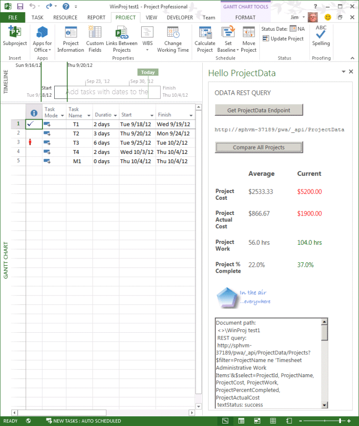

# <a name="updates-for-developers-in-project"></a><span data-ttu-id="a44e5-103">Project 中面向开发人员的更新</span><span class="sxs-lookup"><span data-stu-id="a44e5-103">Updates for developers in Project</span></span>

<span data-ttu-id="a44e5-104">project Server 2013 中的扩展性功能适用于 project Online 和内部部署安装的外接程序。</span><span class="sxs-lookup"><span data-stu-id="a44e5-104">Extensibility features in Project Server 2013 work with add-ins for Project Online and with on-premises installations.</span></span> <span data-ttu-id="a44e5-105">新增的功能包括客户端对象模型 (CSOM)、REST 接口、用于报告的 OData 服务、远程事件接收器、声明性工作流和 Project 客户端的任务窗格外接程序。</span><span class="sxs-lookup"><span data-stu-id="a44e5-105">New features include a client-side object model (CSOM), REST interfaces, an OData service for reporting, remote event receivers, declarative workflows, and task pane add-ins for Project clients.</span></span> <span data-ttu-id="a44e5-106">此外, 还应了解不应用于新开发的不推荐使用的功能。</span><span class="sxs-lookup"><span data-stu-id="a44e5-106">Also learn about deprecated features that should not be used for new development.</span></span>
  
<span data-ttu-id="a44e5-107">project server 2013 基于 Microsoft Office Project server 2007 引入的框架, 并由 Project Server 2010 扩展。</span><span class="sxs-lookup"><span data-stu-id="a44e5-107">Project Server 2013 builds on the framework introduced with Microsoft Office Project Server 2007 and extended by Project Server 2010.</span></span> <span data-ttu-id="a44e5-108">project server 2013 添加了从 Project Server Interface (PSI) 重构和简化的客户端对象模型 (CSOM), 其中包括适用于 windows 应用程序、windows Phone 8 和 Microsoft Silverlight 的 JavaScript 库和 .net Framework 4 库。</span><span class="sxs-lookup"><span data-stu-id="a44e5-108">Project Server 2013 adds a client-side object model (CSOM) that is refactored and simplified from the Project Server Interface (PSI), and includes a JavaScript library and .NET Framework 4 libraries for Windows apps, Windows Phone 8, and Microsoft Silverlight.</span></span> <span data-ttu-id="a44e5-109">CSOM 设计用于 project Online 开发, 也适用于本地 project Server 安装。</span><span class="sxs-lookup"><span data-stu-id="a44e5-109">The CSOM is designed for development for Project Online, and also works with an on-premises Project Server installation.</span></span> 

<span data-ttu-id="a44e5-110">Project Server 数据库将组合成一个数据库；您可通过 OData 服务访问联机报告表和视图。</span><span class="sxs-lookup"><span data-stu-id="a44e5-110">The Project Server databases are combined into a single database; you can access the online reporting tables and views through an OData service.</span></span> <span data-ttu-id="a44e5-111">CSOM 和 OData 服务均具有一个代表性状态传输 (REST) 接口。</span><span class="sxs-lookup"><span data-stu-id="a44e5-111">The CSOM and the OData service include a Representational State Transfer (REST) interface.</span></span> <span data-ttu-id="a44e5-112">可以使用 SharePoint Designer 2013 创建 Project Server 工作流。</span><span class="sxs-lookup"><span data-stu-id="a44e5-112">Project Server workflows can be created by using SharePoint Designer 2013.</span></span> <span data-ttu-id="a44e5-113">project Professional 2013 可以使用任务窗格的 Office 外接程序扩展性模型与 project Server 报告数据、SharePoint 任务列表和其他外部内容相集成。</span><span class="sxs-lookup"><span data-stu-id="a44e5-113">Project Professional 2013 can integrate with Project Server reporting data, SharePoint task lists, and other external content by using the Office Add-ins extensibility model for task panes.</span></span> <span data-ttu-id="a44e5-114">Project Standard 2013 可以使用任务窗格外接程序与一般外部内容集成。</span><span class="sxs-lookup"><span data-stu-id="a44e5-114">Project Standard 2013 can use task pane add-ins to integrate with general external content.</span></span>
  
<span data-ttu-id="a44e5-115">有关 project server 2013 中的主要更改的图示和详细信息, 请参阅[project server 2013 体系结构](project-server-2013-architecture.md)。</span><span class="sxs-lookup"><span data-stu-id="a44e5-115">For diagrams and more information about major changes in Project Server 2013, see [Project Server 2013 architecture](project-server-2013-architecture.md).</span></span>
  
> [!NOTE]
> <span data-ttu-id="a44e5-116">Project Server 2013 基于 SharePoint Server 2013 平台，并且 Project 2013 中使用的大部分基础结构与其他 Office 2013 应用程序相同。</span><span class="sxs-lookup"><span data-stu-id="a44e5-116">Project Server 2013 is built on the SharePoint Server 2013 platform, and Project 2013 includes much of the same infrastructure as the other Office 2013 applications.</span></span> <span data-ttu-id="a44e5-117">有关 sharepoint 加载项模型、基于 sharepoint 的工作流、Web 部件、与其他 SharePoint 功能的开发以及 Office 加载项的文档的文档, 请参阅[SharePoint 加载项](https://docs.microsoft.com/sharepoint/dev/sp-add-ins/sharepoint-add-ins)、 [Office 外接程序](https://docs.microsoft.com/office/dev/add-ins/overview/office-add-ins)和[SharePoint2013开发概述](https://msdn.microsoft.com/library/jj164084%28office.15%29.aspx)。</span><span class="sxs-lookup"><span data-stu-id="a44e5-117">For documentation of the model for SharePoint Add-ins, SharePoint-based workflows, Web Parts, development with other SharePoint features, and documentation of Office Add-ins, see [SharePoint Add-ins](https://docs.microsoft.com/sharepoint/dev/sp-add-ins/sharepoint-add-ins), [Office Add-ins](https://docs.microsoft.com/office/dev/add-ins/overview/office-add-ins), and [SharePoint 2013 development overview](https://msdn.microsoft.com/library/jj164084%28office.15%29.aspx).</span></span> 
  
## <a name="major-new-features-in-project-2013"></a><span data-ttu-id="a44e5-118">Project 2013 的主要新增功能</span><span class="sxs-lookup"><span data-stu-id="a44e5-118">Major new features in Project 2013</span></span>
<span data-ttu-id="a44e5-119"><a name="pj15_WhatsNew_MajorNewFeatures"> </a></span><span class="sxs-lookup"><span data-stu-id="a44e5-119"></span></span>

<span data-ttu-id="a44e5-120">project Standard 2013 和 project Professional 2013 中的新功能包括改进的用户界面, 可匹配其他 Office 2013 应用程序, 并支持 Windows 8 中的新式样式用户界面, 与用于报告的 Office Art 对象的集成, 燃尽报告和新的针对报告的可编程性功能。</span><span class="sxs-lookup"><span data-stu-id="a44e5-120">New features in Project Standard 2013 and Project Professional 2013 include an improved user interface that matches other Office 2013 applications and supports the modern style user interface in Windows 8, integration with Office Art objects for reports, burndown reports, and new programmability features for reports.</span></span> <span data-ttu-id="a44e5-121">Project Professional 2013 支持在 SharePoint Server 2013 上进行更广泛的共享和同步项目, 以及在其他 Office 2013 应用程序 (如 Word、Excel 和 Outlook) 中也实现的任务窗格加载项。</span><span class="sxs-lookup"><span data-stu-id="a44e5-121">Project Professional 2013 enables more extensive sharing and synchronizing projects on SharePoint Server 2013, along with the task pane add-ins that are also implemented in other Office 2013 applications such as Word, Excel, and Outlook.</span></span>
  
<span data-ttu-id="a44e5-122">在 Project Server 2013 中有许多新功能。</span><span class="sxs-lookup"><span data-stu-id="a44e5-122">There are many new features in Project Server 2013.</span></span> <span data-ttu-id="a44e5-123">有些不具有主要可编程性情景, 如 Project Web App 中的新日程表。</span><span class="sxs-lookup"><span data-stu-id="a44e5-123">Some do not have a major programmability story, such as the new timeline in Project Web App.</span></span> <span data-ttu-id="a44e5-124">这些功能将记录在 Microsoft Office Online 的产品帮助和最终用户文档以及 Microsoft TechNet 上面向管理员和 IT 专业人员的主题中。</span><span class="sxs-lookup"><span data-stu-id="a44e5-124">Those features will be documented in the product help and end-user documentation on Microsoft Office Online and in topics targeted at administrators and IT professionals on Microsoft TechNet.</span></span> <span data-ttu-id="a44e5-125">其他新增功能（如改进的时间表）使第三方开发人员通过 Project Server 接口 (PSI) 与时间表和状态集成变得更简单。</span><span class="sxs-lookup"><span data-stu-id="a44e5-125">Other new features, such as improved timesheets, make it easier for third-party developers to interact with timesheets and statusing through the Project Server Interface (PSI).</span></span>
  
<span data-ttu-id="a44e5-126">添加 project Online 和 Office 应用商店 (https://office.microsoft.com/store)对于项目外接程序来说, 更改次数较大, 其中 project Server 可通过 Microsoft Azure 访问)。</span><span class="sxs-lookup"><span data-stu-id="a44e5-126">The addition of Project Online and the Office Store (https://office.microsoft.com/store) for Project add-ins are far-reaching changes, where Project Server is accessible through Microsoft Azure.</span></span> <span data-ttu-id="a44e5-127">对 Project Server 的基于云的访问使用客户端对象模型 (CSOM) 在使用 JavaScript 的 microsoft .net Framework、microsoft Silverlight、Windows Phone 和 web 应用程序开发外接程序。</span><span class="sxs-lookup"><span data-stu-id="a44e5-127">Cloud-based access to Project Server uses a client-side object model (CSOM) for development of add-ins with the Microsoft .NET Framework, Microsoft Silverlight, Windows Phone, and web apps that use JavaScript.</span></span> <span data-ttu-id="a44e5-128">project Online 的要求是, 早期版本的四个 Project Server 数据库将合并到一个数据库中。</span><span class="sxs-lookup"><span data-stu-id="a44e5-128">A requirement of Project Online is that the four Project Server databases of previous versions are merged into one database.</span></span>
  
<span data-ttu-id="a44e5-129">在许多方面 (如任务状态、时间表和项目管理) 改进了 Project Server 2013 的性能和可伸缩性。</span><span class="sxs-lookup"><span data-stu-id="a44e5-129">Project Server 2013 performance and scalability is improved in many areas such as task status, timesheets, and project management.</span></span> <span data-ttu-id="a44e5-130">使用 Windows Workflow Foundation (WF4) 的第4版重新设计 Project Server 工作流。</span><span class="sxs-lookup"><span data-stu-id="a44e5-130">Project Server workflows are redesigned with version 4 of Windows Workflow Foundation (WF4).</span></span> <span data-ttu-id="a44e5-131">将 .net Framework 4 和 Windows Communication Foundation (WCF) 与 PSI 结合使用可提高安全性、性能和可伸缩性。</span><span class="sxs-lookup"><span data-stu-id="a44e5-131">Use of the .NET Framework 4 and Windows Communication Foundation (WCF) with the PSI improves security, performance, and scalability.</span></span> <span data-ttu-id="a44e5-132">例如，您无需更改应用程序代码或重新编译，即可使用配置文件更改基于 WCF 的应用程序的传输协议。</span><span class="sxs-lookup"><span data-stu-id="a44e5-132">For example, you can change the transport protocol of WCF-based applications by using configuration files, without changing the application code or recompiling.</span></span> <span data-ttu-id="a44e5-133">Project Web App 缓存许多 PSI 调用, 其中的数据不会发生显著变化。</span><span class="sxs-lookup"><span data-stu-id="a44e5-133">Project Web App caches many of the PSI calls where data does not change significantly.</span></span>
  
> [!NOTE]
> <span data-ttu-id="a44e5-134">若要使用 Project Server 2013 进行开发, 可以将 Visual Studio 与 office 和 SharePoint 工具扩展结合使用, 这可以为 office 2013 产品本身创建外接程序。</span><span class="sxs-lookup"><span data-stu-id="a44e5-134">For development with Project Server 2013, you can use Visual Studio with the Office and SharePoint tools extensions, which can natively create add-ins for the Office 2013 products.</span></span> <span data-ttu-id="a44e5-135">project Server 2013 要求 Visual Studio 完全启用功能 (如项目详细信息页面和基于 WCF 的应用程序) 的开发。</span><span class="sxs-lookup"><span data-stu-id="a44e5-135">Project Server 2013 requires Visual Studio to fully enable development of features such as project detail pages and WCF-based applications.</span></span> <span data-ttu-id="a44e5-136">Visual Studio 中的 SharePoint 工具扩展可以将 Web 部件和其他 sharepoint 功能直接部署到 Project Web App 和其他 sharepoint 网站。</span><span class="sxs-lookup"><span data-stu-id="a44e5-136">The SharePoint tools extensions in Visual Studio can deploy Web Parts and other SharePoint features directly to Project Web App and other SharePoint sites.</span></span> 
>
> <span data-ttu-id="a44e5-137">不再需要 Visual Studio 开发使用可在 Project Web App 中管理的自定义字段、阶段、阶段和企业项目类型的 project Server 工作流。</span><span class="sxs-lookup"><span data-stu-id="a44e5-137">Visual Studio is no longer required to develop Project Server workflows that use custom fields, stages, phases, and enterprise project types that can be managed in Project Web App.</span></span> <span data-ttu-id="a44e5-138">虽然您可以使用 Visual Studio 开发工作流, 但使用 SharePoint Designer 创建它们通常更为简单快捷。</span><span class="sxs-lookup"><span data-stu-id="a44e5-138">Although you can use Visual Studio to develop workflows, they are often easier and quicker to create by using SharePoint Designer.</span></span> <span data-ttu-id="a44e5-139">Visual Studio 可用于需要访问 CSOM 或其他外部 API 的工作流。</span><span class="sxs-lookup"><span data-stu-id="a44e5-139">Visual Studio can be used for workflows that require access to the CSOM or other external APIs.</span></span> 
  
### <a name="project-add-ins"></a><span data-ttu-id="a44e5-140">Project 加载项</span><span class="sxs-lookup"><span data-stu-id="a44e5-140">Project add-ins</span></span>
<span data-ttu-id="a44e5-141"><a name="pj15_WhatsNew_Apps"> </a></span><span class="sxs-lookup"><span data-stu-id="a44e5-141"></span></span>

<span data-ttu-id="a44e5-142">使用外接程序的概念对软件的分发和市场营销进行了彻底的革新。</span><span class="sxs-lookup"><span data-stu-id="a44e5-142">Distribution and marketing of software has been revolutionized with the concept of an add-in.</span></span> <span data-ttu-id="a44e5-143">对于 Project 2013, 可以从公共 Office 商店购买和下载外接程序, 也可以在 SharePoint 上的专用目录中进行发布。</span><span class="sxs-lookup"><span data-stu-id="a44e5-143">For Project 2013, add-ins can be made available for purchase and download from the public Office Store or distributed within a private catalog on SharePoint.</span></span> <span data-ttu-id="a44e5-144">外接程序通常是一个自包含的交互程序, 可执行少量相关的任务。</span><span class="sxs-lookup"><span data-stu-id="a44e5-144">An add-in is typically a self-contained, interactive program that performs a small number of related tasks.</span></span> <span data-ttu-id="a44e5-145">项目外接程序可以是 project standard 2013 或 project standard 2013 客户端的任务窗格外接程序, 也可以是 project Server 2013 或 project Online 的外接程序。</span><span class="sxs-lookup"><span data-stu-id="a44e5-145">A Project add-in can be a task pane add-in for the Project Standard 2013 or Project Standard 2013 clients, or an add-in for Project Server 2013 or Project Online.</span></span>
  
<span data-ttu-id="a44e5-146">有关 project 桌面客户端的外接程序的信息, 请参阅[project 中的任务窗格外接程序](#pj15_WhatsNew_Agave)。</span><span class="sxs-lookup"><span data-stu-id="a44e5-146">For information about add-ins for the Project desktop clients, see [Task pane add-ins in Project](#pj15_WhatsNew_Agave).</span></span> <span data-ttu-id="a44e5-147">有关 Project server 2013 示例, 请参阅[创建 SharePoint 托管的 Project Server 外接程序](create-a-sharepoint-hosted-project-server-add-in.md)。</span><span class="sxs-lookup"><span data-stu-id="a44e5-147">For a Project Server 2013 example, see [Create a SharePoint-hosted Project Server add-in](create-a-sharepoint-hosted-project-server-add-in.md).</span></span> <span data-ttu-id="a44e5-148">除了[office 和 SharePoint 外接程序 SDK](https://msdn.microsoft.com/library/fp161507.aspx)中的文章外, [office 博客](https://blogs.office.com/dev/)还包含许多与 project 2013 和 project Online 相关的文章。</span><span class="sxs-lookup"><span data-stu-id="a44e5-148">In addition to articles in the [Office and SharePoint Add-ins SDK](https://msdn.microsoft.com/library/fp161507.aspx), the [Office Blog](https://blogs.office.com/dev/) has many posts that are also relevant to Project 2013 and Project Online.</span></span> 
  
<span data-ttu-id="a44e5-149">Project Server 2013 的外接程序可同时适用于本地安装和 Project Online。</span><span class="sxs-lookup"><span data-stu-id="a44e5-149">An add-in for Project Server 2013 can work with both an on-premises installation and Project Online.</span></span> <span data-ttu-id="a44e5-150">Project Server 外接程序可以包含 Web 部件、远程事件接收器和业务逻辑。</span><span class="sxs-lookup"><span data-stu-id="a44e5-150">Project Server add-ins can include Web Parts, remote event receivers, and business logic.</span></span> <span data-ttu-id="a44e5-151">对外接程序中的 Project Server 对象模型的访问权限是通过 CSOM, 而不是 PSI。</span><span class="sxs-lookup"><span data-stu-id="a44e5-151">Access to the Project Server object model in an add-in is through the CSOM, not the PSI.</span></span> <span data-ttu-id="a44e5-152">数据存储可以是基于云的, 如使用 SQL Azure、外部的 Microsoft Business Connectivity Services (BCS)、本地数据库的内部或混合的。</span><span class="sxs-lookup"><span data-stu-id="a44e5-152">Data storage can be cloud-based such as with SQL Azure, external such as through Microsoft Business Connectivity Services (BCS), internal with a local database, or mixed.</span></span>
  
#### <a name="add-in-security"></a><span data-ttu-id="a44e5-153">加载项安全性</span><span class="sxs-lookup"><span data-stu-id="a44e5-153">Add-in security</span></span>

<span data-ttu-id="a44e5-154">通常, 外接程序所执行的操作代表运行外接程序的用户, 或者您不显式使用模拟或指定可以运行加载项的用户。</span><span class="sxs-lookup"><span data-stu-id="a44e5-154">In general, actions that an add-in takes are performed on behalf of the user who runs the add-in; you do not explicitly use impersonation or specify who can run the add-in.</span></span> <span data-ttu-id="a44e5-155">操作不能超过运行加载项的用户的权限级别。</span><span class="sxs-lookup"><span data-stu-id="a44e5-155">Actions cannot exceed the permission level of the user who runs the add-in.</span></span> 
  
<span data-ttu-id="a44e5-156">在 Visual Studio 2012 的 Office 开发人员工具中, AppManifext 文件具有一个图形编辑器, 您可以在其中设置权限请求范围。</span><span class="sxs-lookup"><span data-stu-id="a44e5-156">In Office Developer Tools for Visual Studio 2012, the AppManifext.xml file has a graphical editor where you can set the permission request scope.</span></span> <span data-ttu-id="a44e5-157">例如, 若要创建可使项目经理更新其项目的外接程序, 请在**appmanifest.xml** designer 窗格的 "**权限**" 选项卡上, 为该范围选择**多个项目**并为该权限进行**写入**。</span><span class="sxs-lookup"><span data-stu-id="a44e5-157">For example, to create an add-in that enables project managers to update their projects, on the **Permissions** tab of the **AppManifest.xml** designer pane, select **Multiple Projects** for the scope and **Write** for the permission.</span></span> <span data-ttu-id="a44e5-158">如果外接程序用户具有项目经理权限, 则可以为其管理的项目运行外接程序。</span><span class="sxs-lookup"><span data-stu-id="a44e5-158">If the add-in user has project manager permissions, she can run the add-in for projects that she manages.</span></span> <span data-ttu-id="a44e5-159">AppManifest.xml 文件中的代码可包括以下内容：</span><span class="sxs-lookup"><span data-stu-id="a44e5-159">The code in the AppManifest.xml file would include the following:</span></span> 
  
```XML
  <AppPermissionRequests>
    <AppPermissionRequest Scope="https://sharepoint/projectserver/projects" Right="Write" />
  </AppPermissionRequests>
```

<span data-ttu-id="a44e5-160">**表1。Project Server 外接程序的权限请求范围**</span><span class="sxs-lookup"><span data-stu-id="a44e5-160">**Table 1. Permission request scopes for Project Server add-ins**</span></span>

|<span data-ttu-id="a44e5-161">Scope</span><span class="sxs-lookup"><span data-stu-id="a44e5-161">Scope</span></span>|<span data-ttu-id="a44e5-162">权限</span><span class="sxs-lookup"><span data-stu-id="a44e5-162">Permissions</span></span>|
|:-----|:-----|
|<span data-ttu-id="a44e5-163">**Project Server**</span><span class="sxs-lookup"><span data-stu-id="a44e5-163">**Project Server**</span></span> <br/> |<span data-ttu-id="a44e5-164">**管理**（需要 Project Server 管理员权限。）</span><span class="sxs-lookup"><span data-stu-id="a44e5-164">**Manage** (Requires Project Server administrator permissions.)</span></span>  <br/> |
|<span data-ttu-id="a44e5-165">**多个项目**</span><span class="sxs-lookup"><span data-stu-id="a44e5-165">**Multiple Projects**</span></span> <br/> |<span data-ttu-id="a44e5-166">**读取**、**写入**(需要针对某些操作的项目经理权限; 针对基本读取操作的项目工作组成员权限, 例如任务分配。)</span><span class="sxs-lookup"><span data-stu-id="a44e5-166">**Read**, **Write** (Requires project manager permissions for some operations; project team member permissions for basic read operations, such as task assignments.)</span></span>  <br/> |
|<span data-ttu-id="a44e5-167">**单个项目**</span><span class="sxs-lookup"><span data-stu-id="a44e5-167">**Single Project**</span></span> <br/> |<span data-ttu-id="a44e5-168">**读**、**写**（至少需要项目团队成员权限；对项目中某些数据的访问权限取决于其他权限级别。）</span><span class="sxs-lookup"><span data-stu-id="a44e5-168">**Read**, **Write** (Requires at least project team member permissions; access to some data in a project depends on other permission levels.)</span></span>  <br/> |
|<span data-ttu-id="a44e5-169">**企业资源**</span><span class="sxs-lookup"><span data-stu-id="a44e5-169">**Enterprise Resources**</span></span> <br/> |<span data-ttu-id="a44e5-170">**读**、**写**（需要资源经理权限。）</span><span class="sxs-lookup"><span data-stu-id="a44e5-170">**Read**, **Write** (Requires resource manager permissions.)</span></span>  <br/> |
|<span data-ttu-id="a44e5-171">**Statusing**</span><span class="sxs-lookup"><span data-stu-id="a44e5-171">**Statusing**</span></span> <br/> |<span data-ttu-id="a44e5-172">**SubmitStatus**（需要提交项目状态的权限。）</span><span class="sxs-lookup"><span data-stu-id="a44e5-172">**SubmitStatus** (Requires permission to submit status for your projects.)</span></span>  <br/> |
|<span data-ttu-id="a44e5-173">**报告**</span><span class="sxs-lookup"><span data-stu-id="a44e5-173">**Reporting**</span></span> <br/> |<span data-ttu-id="a44e5-174">**读**（需要登录 Project Server 的权限。）</span><span class="sxs-lookup"><span data-stu-id="a44e5-174">**Read** (Requires permission to log on Project Server.)</span></span>  <br/> |
|<span data-ttu-id="a44e5-175">**工作流**</span><span class="sxs-lookup"><span data-stu-id="a44e5-175">**Workflow**</span></span> <br/> |<span data-ttu-id="a44e5-176">**提升**(需要具有运行工作流的权限。</span><span class="sxs-lookup"><span data-stu-id="a44e5-176">**Elevate** (Requires permission to run workflows.</span></span> <span data-ttu-id="a44e5-177">外接端使用提升的权限运行, 以在工作流中启用从阶段到阶段的转换。</span><span class="sxs-lookup"><span data-stu-id="a44e5-177">The add-in runs with elevated permissions, to enable transitions from stage to stage in a workflow.</span></span> <span data-ttu-id="a44e5-178">加载项控件中的业务逻辑的阶段转换。)</span><span class="sxs-lookup"><span data-stu-id="a44e5-178">Business logic in the add-in controls stage transitions.)</span></span>  <br/> |
   
> [!NOTE]
> <span data-ttu-id="a44e5-179">project Server 2013 和 project Online 在 sharepoint 2013 中不使用仅应用身份验证模型 (请参阅[sharepoint 2013 中的外接程序授权策略类型](https://msdn.microsoft.com/library/124879c7-a746-4c10-96a7-da76ad5327f0%28Office.15%29.aspx))。</span><span class="sxs-lookup"><span data-stu-id="a44e5-179">Project Server 2013 and Project Online do not use the app-only authentication model in SharePoint 2013 (see [Add-in authorization policy types in SharePoint 2013](https://msdn.microsoft.com/library/124879c7-a746-4c10-96a7-da76ad5327f0%28Office.15%29.aspx)).</span></span> 
  
<span data-ttu-id="a44e5-180">有关开发、分发、托管和管理外接程序的信息, 请参阅[sharepoint 外接程序](https://docs.microsoft.com/sharepoint/dev/sp-add-ins/sharepoint-add-ins)和[office 外接程序](https://docs.microsoft.com/office/dev/add-ins/overview/office-add-ins), 以及 sharepoint Server 2013 和 office 2013 开发人员文档中的相关主题。</span><span class="sxs-lookup"><span data-stu-id="a44e5-180">For information about developing, distributing, hosting, and managing add-ins, see [SharePoint Add-ins](https://docs.microsoft.com/sharepoint/dev/sp-add-ins/sharepoint-add-ins) and [Office Add-ins](https://docs.microsoft.com/office/dev/add-ins/overview/office-add-ins), and related topics in the SharePoint Server 2013 and Office 2013 developer documentation.</span></span> <span data-ttu-id="a44e5-181">有关其他 SharePoint 外接程序的权限请求范围的信息, 请参阅[SharePoint 2013 中的外接程序权限](https://msdn.microsoft.com/library/5f7a8440-3c09-4cf8-83ec-c236bfa2d6c4%28Office.15%29.aspx)。</span><span class="sxs-lookup"><span data-stu-id="a44e5-181">For information about permission request scope for other SharePoint Add-ins, see [Add-in permissions in SharePoint 2013](https://msdn.microsoft.com/library/5f7a8440-3c09-4cf8-83ec-c236bfa2d6c4%28Office.15%29.aspx).</span></span>
  
### <a name="integrating-with-sharepoint-server"></a><span data-ttu-id="a44e5-182">与 SharePoint Server 集成</span><span class="sxs-lookup"><span data-stu-id="a44e5-182">Integrating with SharePoint Server</span></span>
<span data-ttu-id="a44e5-183"><a name="pj15_WhatsNew_IntegrationWSS"> </a></span><span class="sxs-lookup"><span data-stu-id="a44e5-183"></span></span>

<span data-ttu-id="a44e5-184">Project Web App 中的许多功能都需要 sharepoint Server 2013 中的新基础结构, 例如 OAuth 和基于声明的身份验证、通过 sharepoint 组的 Project Server 授权和权限、使用 sharepoint 任务同步项目列表和 Project Server 声明性工作流。</span><span class="sxs-lookup"><span data-stu-id="a44e5-184">Many features in Project Web App require the new infrastructure in SharePoint Server 2013 such as OAuth and claims-based authentication, Project Server authorization and permissions through SharePoint groups, synchronization of projects with SharePoint task lists, and Project Server declarative workflows.</span></span> <span data-ttu-id="a44e5-185">可将 Project Service 应用程序与 SharePoint 场中的任何网站集相关联。</span><span class="sxs-lookup"><span data-stu-id="a44e5-185">The Project Service Application can be associated with any site collection in a SharePoint farm.</span></span> <span data-ttu-id="a44e5-186">项目可与 SharePoint 任务列表同步，其中 SharePoint 保留项目。</span><span class="sxs-lookup"><span data-stu-id="a44e5-186">Project synchronization can be with a SharePoint task list, where SharePoint maintains the project.</span></span> <span data-ttu-id="a44e5-187">企业项目还可与 SharePoint 任务列表进行同步，其中 Project Server 保留完全控制权限。</span><span class="sxs-lookup"><span data-stu-id="a44e5-187">An enterprise project can also be synchronized with a SharePoint task list, where Project Server maintains full control.</span></span> <span data-ttu-id="a44e5-188">有关体系结构图表和项目同步的说明, 请参阅[project Server 2013 体系结构](project-server-2013-architecture.md)。</span><span class="sxs-lookup"><span data-stu-id="a44e5-188">For architectural diagrams and an explanation of project synchronization, see [Project Server 2013 architecture](project-server-2013-architecture.md).</span></span>
  
<span data-ttu-id="a44e5-189">SharePoint Server 2013 中有很多新功能。</span><span class="sxs-lookup"><span data-stu-id="a44e5-189">There are many new features in SharePoint Server 2013.</span></span> <span data-ttu-id="a44e5-190">有关详细信息, 请参阅[适用于开发人员的 SharePoint](https://msdn.microsoft.com/sharepoint)。</span><span class="sxs-lookup"><span data-stu-id="a44e5-190">For more information, see [SharePoint for developers](https://msdn.microsoft.com/sharepoint).</span></span>
  
### <a name="integrating-with-workflows"></a><span data-ttu-id="a44e5-191">与工作流集成</span><span class="sxs-lookup"><span data-stu-id="a44e5-191">Integrating with workflows</span></span>
<span data-ttu-id="a44e5-192"><a name="pj15_WhatsNew_Workflow"> </a></span><span class="sxs-lookup"><span data-stu-id="a44e5-192"></span></span>

<span data-ttu-id="a44e5-p120">工作流是项目组合管理的核心功能。项目生命周期可包含长时间运行的跨多个阶段的过程。管理阶段包含项目建议、业务影响分析以及选择、创建、规划、管理和跟踪项目。</span><span class="sxs-lookup"><span data-stu-id="a44e5-p120">Workflows are a core feature of project portfolio management. A project life cycle can include long-running processes that span many phases. Governance phases include project proposals, analyses of business impact, and selecting, creating, planning, managing, and tracking projects.</span></span>
  
<span data-ttu-id="a44e5-196">Project Server 2013 工作流建立在使用 WF4 的 SharePoint 2013 工作流平台之上。</span><span class="sxs-lookup"><span data-stu-id="a44e5-196">Project Server 2013 workflows are built on the SharePoint 2013 workflow platform, which uses WF4.</span></span> <span data-ttu-id="a44e5-197">与以前的版本不同, 可使用 SharePoint Designer 2013 创建 Project Server 2013 的声明性工作流, 并可在内部部署和联机使用中访问。</span><span class="sxs-lookup"><span data-stu-id="a44e5-197">Unlike in previous versions, declarative workflows for Project Server 2013 can be created by using SharePoint Designer 2013 and are accessible for both on-premises and online use.</span></span> <span data-ttu-id="a44e5-198">Project Server 工作流将 SharePoint 工作流安全模型与 OAuth 结合使用, 并可将其安装在 Project Web App 网站上。</span><span class="sxs-lookup"><span data-stu-id="a44e5-198">Project Server workflows use the SharePoint workflow security model with OAuth, and can be installed on a Project Web App site.</span></span> <span data-ttu-id="a44e5-199">图1显示了 SharePoint Designer 2013 可以将阶段添加到需要管理的网站工作流中, 其中的阶段是在 Project Web App 中定义的。</span><span class="sxs-lookup"><span data-stu-id="a44e5-199">Figure 1 shows that SharePoint Designer 2013 can add stages to a site workflow for Demand Management, where the stages are defined in Project Web App.</span></span>
  
<span data-ttu-id="a44e5-200">**图 1. 使用 SharePoint 设计器向 Project Web App 的工作流添加容器**</span><span class="sxs-lookup"><span data-stu-id="a44e5-200">**Figure 1. Using SharePoint Designer to add a stage to a workflow for Project Web App**</span></span>

<span data-ttu-id="a44e5-201"></span><span class="sxs-lookup"><span data-stu-id="a44e5-201"></span></span>

<br/>

<span data-ttu-id="a44e5-202">通过在设计工具 (可以是 SharePoint Designer 2013 或 Visual Studio 2012) 中添加工作流阶段、操作、条件和其他元素来构建声明性工作流。</span><span class="sxs-lookup"><span data-stu-id="a44e5-202">You build a declarative workflow by adding workflow stages, actions, conditions, and other elements in a design tool, which can be either SharePoint Designer 2013 or Visual Studio 2012.</span></span> <span data-ttu-id="a44e5-203">然后, 设计工具将工作流另存为 XAML 代码, 该代码在运行时解释。</span><span class="sxs-lookup"><span data-stu-id="a44e5-203">The design tool then saves the workflow as XAML code, which is interpreted at runtime.</span></span> <span data-ttu-id="a44e5-204">声明性工作流可在本地或 project Online 中的 project Server 2013 中运行。</span><span class="sxs-lookup"><span data-stu-id="a44e5-204">Declarative workflows can run either in Project Server 2013 on-premises or in Project Online.</span></span> <span data-ttu-id="a44e5-205">通过使用 Visual Studio 2012, 您还可以为其他控件生成自定义操作和窗体, 并保存工作流模板以供多个 Project Web App 实例重复使用。</span><span class="sxs-lookup"><span data-stu-id="a44e5-205">By using Visual Studio 2012, you can also build custom actions and forms for additional control, and save workflow templates for reuse with multiple Project Web App instances.</span></span> <span data-ttu-id="a44e5-206">SharePoint Designer 2013 可以使用在 Visual Studio 2012 中创建的自定义操作。</span><span class="sxs-lookup"><span data-stu-id="a44e5-206">SharePoint Designer 2013 can consume custom actions that are created in Visual Studio 2012.</span></span>
  
<span data-ttu-id="a44e5-207">project Server 2013 工作流充当一个应用程序, 其中管理员 (拥有 Project Web app 的设计权限) 可以发布声明性工作流, 并将其与企业项目类型 (EPT) 相关联。</span><span class="sxs-lookup"><span data-stu-id="a44e5-207">A Project Server 2013 workflow acts as an app, where an administrator—who has design permissions for Project Web App—can publish a declarative workflow and associate it with an enterprise project type (EPT).</span></span> <span data-ttu-id="a44e5-208">EPT 必须适用于其中 Project Server 保留完全控制权限的企业项目。</span><span class="sxs-lookup"><span data-stu-id="a44e5-208">The EPT must be for an enterprise project, where Project Server maintains full control.</span></span> <span data-ttu-id="a44e5-209">SharePoint 任务列表无法使用 Project Server 工作流。</span><span class="sxs-lookup"><span data-stu-id="a44e5-209">A SharePoint task list cannot use a Project Server workflow.</span></span> 
  
<span data-ttu-id="a44e5-210">利用 OAuth，具有项目创建权限的项目经理无需使用模拟，即可调用工作流。</span><span class="sxs-lookup"><span data-stu-id="a44e5-210">OAuth enables project managers who have project creation permissions to invoke the workflow without using impersonation.</span></span> <span data-ttu-id="a44e5-211">对 Project Server 的工作流调用（例如，读取自定义字段值以决定要跟踪的分支）是代表项目经理进行的。</span><span class="sxs-lookup"><span data-stu-id="a44e5-211">Workflow calls to Project Server, for example to read a custom field value to decide which branch to follow, are made on behalf of the project manager.</span></span> <span data-ttu-id="a44e5-212">若要防止项目经理创建的工作流自动前进至下一容器，移至下一工作流容器的调用将以工作流作者（管理员）的身份运行。</span><span class="sxs-lookup"><span data-stu-id="a44e5-212">To prevent the project manager from creating a workflow that automatically advances to the next stage, the call for moving to the next workflow stage runs as the workflow author (the administrator).</span></span> <span data-ttu-id="a44e5-213">相比之下, 旧版 Project Server 2010 工作流的用户通过工作流代理用户帐户进行模拟调用, 以获得整个工作流的管理员访问权限。</span><span class="sxs-lookup"><span data-stu-id="a44e5-213">In contrast, users of legacy Project Server 2010 workflows make impersonated calls through the Workflow Proxy User account to gain administrator access throughout the entire workflow.</span></span>
  
<span data-ttu-id="a44e5-214">尽管 Project Server 2013 本地版可以使用编译的基于 wf 3.5 的工作流, 但我们建议您将旧版工作流升级到基于 WF4 的声明性工作流。</span><span class="sxs-lookup"><span data-stu-id="a44e5-214">Although Project Server 2013 on-premises can use compiled WF3.5-based workflows, we recommend that you upgrade legacy workflows to declarative workflows based on WF4.</span></span> <span data-ttu-id="a44e5-215">较新的技术更具可扩展性且更强大。</span><span class="sxs-lookup"><span data-stu-id="a44e5-215">The newer technology is more scalable and robust.</span></span> <span data-ttu-id="a44e5-216">业务分析员和 PMO 员工可以使用 Visio 2013 创建或更新工作流设计, 并通过使用 SharePoint Designer 2013 来实现 Project Server 工作流, 而无需编码。</span><span class="sxs-lookup"><span data-stu-id="a44e5-216">Business analysts and PMO staff can create or update workflow designs by using Visio 2013 and implement Project Server workflows without coding by using SharePoint Designer 2013.</span></span>
  
<span data-ttu-id="a44e5-217">有关为 project Web App 创建声明性工作流的信息, 请参阅[开始开发 project Server 工作流](getting-started-developing-project-server-workflows.md)。</span><span class="sxs-lookup"><span data-stu-id="a44e5-217">For information about creating a declarative workflow for Project Web App, see [Getting started developing Project Server workflows](getting-started-developing-project-server-workflows.md).</span></span> <span data-ttu-id="a44e5-218">若要比较 SharePoint Designer 和 visual studio 的工作流功能, 请参阅[使用 Visual Studio 开发 sharepoint 2013 工作流](https://msdn.microsoft.com/library/office/jj163199.aspx)。</span><span class="sxs-lookup"><span data-stu-id="a44e5-218">For a comparison of SharePoint Designer and Visual Studio capabilities for workflows, see [Develop SharePoint 2013 workflows using Visual Studio](https://msdn.microsoft.com/library/office/jj163199.aspx).</span></span>
  
### <a name="client-side-object-model"></a><span data-ttu-id="a44e5-219">客户端对象模型</span><span class="sxs-lookup"><span data-stu-id="a44e5-219">Client-side object model</span></span>
<span data-ttu-id="a44e5-220"><a name="pj15_WhatsNew_CSOM"> </a></span><span class="sxs-lookup"><span data-stu-id="a44e5-220"></span></span>

<span data-ttu-id="a44e5-221">以编程方式访问 Project Online 需要在 SharePoint CSOM 上构建的 CSOM。</span><span class="sxs-lookup"><span data-stu-id="a44e5-221">Programmatic access to Project Online requires a CSOM that is built on the SharePoint CSOM.</span></span> <span data-ttu-id="a44e5-222">使用 Windows Live ID (而不是 project Server Forms 身份验证或 Windows 身份验证) 将使用 OAuth 进行 Project Online 身份验证。</span><span class="sxs-lookup"><span data-stu-id="a44e5-222">Project Online authentication will be with OAuth using a Windows Live ID, not Project Server Forms authentication or Windows authentication.</span></span>
  
<span data-ttu-id="a44e5-223">以下是 Project Server 2013 中的 CSOM 的原则和功能:</span><span class="sxs-lookup"><span data-stu-id="a44e5-223">Following are the principles and features of the CSOM in Project Server 2013:</span></span>
  
- <span data-ttu-id="a44e5-224">CSOM 旨在易于使用。</span><span class="sxs-lookup"><span data-stu-id="a44e5-224">The CSOM is designed for ease of use.</span></span> <span data-ttu-id="a44e5-225">例如, 方法和属性直接按名称使用或提供数据, 而不是需要许多 guid、 _changeXml_参数或传递数据集。</span><span class="sxs-lookup"><span data-stu-id="a44e5-225">For example, methods and properties directly use or provide data by name, rather than requiring many GUIDs,  _changeXml_ parameters, or passing around datasets.</span></span> 
    
- <span data-ttu-id="a44e5-226">Project Server CSOM 基于第三方解决方案的最常见要求实现 PSI 功能的子集。</span><span class="sxs-lookup"><span data-stu-id="a44e5-226">The Project Server CSOM implements a subset of the PSI functionality, based on the most common requirements for third-party solutions.</span></span>
    
- <span data-ttu-id="a44e5-227">CSOM 内部方式调用 PSI，但以不同的方式构成。</span><span class="sxs-lookup"><span data-stu-id="a44e5-227">The CSOM internally calls the PSI, but is factored differently.</span></span> <span data-ttu-id="a44e5-228">例如，对所有状态更改的更新是通过 **StatusAssignmentCollection.SubmitAllStatusUpdates** 方法而不是通过用户的 **Statusing.SubmitStatus** PSI 方法或其他资源的 **SubmitStatusForResource** 方法完成的。</span><span class="sxs-lookup"><span data-stu-id="a44e5-228">For example, updates for all statusing changes are done through the **StatusAssignmentCollection.SubmitAllStatusUpdates** method, not by the **Statusing.SubmitStatus** PSI method for the user or the **SubmitStatusForResource** method for other resources.</span></span> 
    
- <span data-ttu-id="a44e5-229">CSOM 可通过一个 WCF 服务 (Client.svc) 而不是 PSI 的 22 个公共服务进行访问。</span><span class="sxs-lookup"><span data-stu-id="a44e5-229">The CSOM is accessible through one WCF service (Client.svc), rather than through the 22 public services of the PSI.</span></span>
    
- <span data-ttu-id="a44e5-230">project Server CSOM 的初始化通过 project Web App URL 直接通过[ProjectContext](https://msdn.microsoft.com/library/Microsoft.ProjectServer.Client.ProjectContext.aspx)类, 而不是使用 WCF 引用或代理程序集。</span><span class="sxs-lookup"><span data-stu-id="a44e5-230">Initialization of the Project Server CSOM is directly through the [ProjectContext](https://msdn.microsoft.com/library/Microsoft.ProjectServer.Client.ProjectContext.aspx) class with the Project Web App URL, not by using a WCF reference or proxy assembly.</span></span> 
    
- <span data-ttu-id="a44e5-p130">CSOM 实现的多个客户端库和接口均受内部 SharePoint CSOM 基础结构的支持。这些客户端库和接口包括：</span><span class="sxs-lookup"><span data-stu-id="a44e5-p130">The CSOM implements multiple client libraries and interfaces, which are supported by the internal SharePoint CSOM infrastructure. The client libraries and interfaces include the following:</span></span>
    
  - <span data-ttu-id="a44e5-233">Microsoft.ProjectServer.Client.dll 程序集中的 Microsoft .NET 客户端库</span><span class="sxs-lookup"><span data-stu-id="a44e5-233">Microsoft .NET client library in the Microsoft.ProjectServer.Client.dll assembly</span></span>
    
  - <span data-ttu-id="a44e5-234">microsoft.projectserver.client 程序集内的 Silverlight 库</span><span class="sxs-lookup"><span data-stu-id="a44e5-234">Silverlight library in the Microsoft.ProjectServer.Client.Silverlight.dll assembly</span></span>
    
  - <span data-ttu-id="a44e5-235">microsoft microsoft.projectserver.client 程序集中的 Windows Phone 8 库</span><span class="sxs-lookup"><span data-stu-id="a44e5-235">Windows Phone 8 library in the Microsoft.ProjectServer.Client.Phone.dll assembly</span></span>
    
  - <span data-ttu-id="a44e5-236">用于 ps .js 文件或 ps. debug.exe 文件中 web 应用程序的 JavaScript 库</span><span class="sxs-lookup"><span data-stu-id="a44e5-236">JavaScript library for web applications in the PS.js file or PS.debug.js file</span></span>
    
  - <span data-ttu-id="a44e5-237">REST 终结点，使用 OData 协议进行访问</span><span class="sxs-lookup"><span data-stu-id="a44e5-237">REST endpoints, for access with the OData protocol</span></span>
    
  - <span data-ttu-id="a44e5-238">对使用筛选的 LINQ 查询的本机支持，以限制返回的数据量</span><span class="sxs-lookup"><span data-stu-id="a44e5-238">Native support for LINQ queries with filtering, to limit the amount of data that is returned</span></span>
    
- <span data-ttu-id="a44e5-239">CSOM 可用于 Project Online 解决方案和内部部署解决方案, 独立于 PSI 和其他 Project Server 程序集 (如 Microsoft. .dll.)。</span><span class="sxs-lookup"><span data-stu-id="a44e5-239">The CSOM can be used both for Project Online solutions and for on-premises solutions, independently of the PSI and other Project Server assemblies such as Microsoft.Office.Project.Server.Library.dll.</span></span>
    
- <span data-ttu-id="a44e5-240">根据 project server 合作伙伴和开发人员社区的请求, 可能会根据累积更新和 service pack 对 project server 2013 CSOM 的其他功能进行考虑。</span><span class="sxs-lookup"><span data-stu-id="a44e5-240">Additional functionality of the Project Server 2013 CSOM may be considered for cumulative updates and service packs, based on requests by Project Server partners and the developer community.</span></span>
    
> [!NOTE]
> <span data-ttu-id="a44e5-p131">CSOM 是第三方 Project Server 开发人员的首选接口。如果 CSOM 包括应用程序所需的功能，建议您使用 CSOM 开发新的应用程序。</span><span class="sxs-lookup"><span data-stu-id="a44e5-p131">The CSOM is the preferred interface for third-party Project Server developers. We recommend that you use the CSOM for developing new applications, if the CSOM includes the functionality that your application requires.</span></span> 
  
<span data-ttu-id="a44e5-243">有关使用 CSOM 进行开发的信息, 请参阅[Project 2013 的客户端对象模型 (CSOM)](client-side-object-model-csom-for-project-2013.md)。</span><span class="sxs-lookup"><span data-stu-id="a44e5-243">For information about developing with the CSOM, see [Client-side object model (CSOM) for Project 2013](client-side-object-model-csom-for-project-2013.md).</span></span> <span data-ttu-id="a44e5-244">有关 sharepoint 应用程序中的 REST 接口的信息, 请参阅 sharepoint 2013 开发人员文档中*的使用 sharepoint REST 服务编程*。</span><span class="sxs-lookup"><span data-stu-id="a44e5-244">For information about the REST interface in SharePoint applications, see  *Programming using the SharePoint REST service*  in the SharePoint 2013 developer documentation.</span></span> 
  
### <a name="changes-in-the-reporting-database"></a><span data-ttu-id="a44e5-245">报告数据库中的更改</span><span class="sxs-lookup"><span data-stu-id="a44e5-245">Changes in the Reporting database</span></span>
<span data-ttu-id="a44e5-246"><a name="pj15_WhatsNew_RDBChanges"> </a></span><span class="sxs-lookup"><span data-stu-id="a44e5-246"></span></span>

<span data-ttu-id="a44e5-247">project server 2010 中的四个数据库组合到 project server 2013 中的单个 project 数据库中。</span><span class="sxs-lookup"><span data-stu-id="a44e5-247">The four databases in Project Server 2010 are combined into a single Project database in Project Server 2013.</span></span> <span data-ttu-id="a44e5-248">Project 数据库的默认名称为 ProjectService。</span><span class="sxs-lookup"><span data-stu-id="a44e5-248">The default name of the Project database is ProjectService.</span></span> <span data-ttu-id="a44e5-249">报告表和视图保留其以前的名称, 并且 "草稿"、"已发布" 和 "存档" 数据库中`draft`的`pub`表和`ver`视图具有前缀、和 ProjectService 数据库中的表和视图。</span><span class="sxs-lookup"><span data-stu-id="a44e5-249">Reporting tables and views retain their previous names, and tables and views from the Draft, Published, and Archive databases have the prefixes  `draft`,  `pub`, and  `ver` in the ProjectService database.</span></span> <span data-ttu-id="a44e5-250">例如，已发布项目表为 pub.MSP_PROJECTS。</span><span class="sxs-lookup"><span data-stu-id="a44e5-250">For example, the published projects table is pub.MSP_PROJECTS.</span></span> 
  
> [!IMPORTANT]
> <span data-ttu-id="a44e5-251">草稿 (`draft`前缀)、已发布 (`pub`) 和存档 (`ver`) 表和视图不支持直接访问。</span><span class="sxs-lookup"><span data-stu-id="a44e5-251">Direct access is not supported for the draft (`draft` prefix), published (`pub`), and archive (`ver`) tables and views.</span></span> <span data-ttu-id="a44e5-252">报告应仅使用具有`dbo`前缀的报告表格和视图。</span><span class="sxs-lookup"><span data-stu-id="a44e5-252">Reports should use only the reporting tables and views, which have the `dbo` prefix.</span></span> <span data-ttu-id="a44e5-253">例如, dbo。MSP_EpmProject 表包含 Project Web App 实例中的项目列表。</span><span class="sxs-lookup"><span data-stu-id="a44e5-253">For example, the dbo.MSP_EpmProject table includes the list of projects in the Project Web App instance.</span></span> 
>
> <span data-ttu-id="a44e5-p135">实际上没有任何内容阻止您使用直接编程数据库访问来更新 Project 数据库中任何表和视图中的数据。您应注意，Project Professional 缓存、草稿和已发布数据的表以及报告表均依赖可被直接数据编辑中断的缓存同步协议。如果您使用直接访问更改数据损坏了 Project Server 数据库或损坏了 Project Professional 客户端缓存，则将收到产品支持无法帮助的警告！</span><span class="sxs-lookup"><span data-stu-id="a44e5-p135">There is nothing to actively prevent you from using direct programmatic database access to update data in any of the tables and views in the Project database. You should be aware that the Project Professional cache, the tables for draft and published data, and the reporting tables all rely on a cache synchronization protocol that can be disrupted by direct data editing. If you damage your Project Server databases or corrupt Project Professional client-side caches by using direct access to change data, be warned that product support won't be able to help!</span></span> 
  
<span data-ttu-id="a44e5-257">Project Server 2013 引入了适用于联机和本地访问的 OData 服务。</span><span class="sxs-lookup"><span data-stu-id="a44e5-257">Project Server 2013 introduces an OData service for online and on-premises access.</span></span> <span data-ttu-id="a44e5-258">联机报告表和视图只能由 OData 接口公开；对于内部使用，您可使用 OData 接口或直接访问 SharePoint 场中的 ProjectService 数据库中的报告表和视图。</span><span class="sxs-lookup"><span data-stu-id="a44e5-258">The online reporting tables and views are exposed only by the OData interface; for on-premises use, you can use the OData interface or directly access the reporting tables and views in the ProjectService database in the SharePoint farm.</span></span> <span data-ttu-id="a44e5-259">Project Online 不支持多租户数据库。</span><span class="sxs-lookup"><span data-stu-id="a44e5-259">Project Online does not support a multitenant database.</span></span> <span data-ttu-id="a44e5-260">也就是说, 每个 project Web App 的实例都有自己的项目数据库。</span><span class="sxs-lookup"><span data-stu-id="a44e5-260">That is, multiple instances of Project Web App each have their own Project database.</span></span> <span data-ttu-id="a44e5-261">OData 服务内部运行对报告表和视图的 SQL 查询，并提供 XML 或 JSON 负载。</span><span class="sxs-lookup"><span data-stu-id="a44e5-261">The OData service internally runs SQL queries on the reporting tables and views, and delivers an XML or JSON payload.</span></span> <span data-ttu-id="a44e5-262">有关 Project Server 2013 中用于报告的 OData 服务的简介和**ProjectData**架构参考, 请参阅[ProjectData-Project OData service reference](https://msdn.microsoft.com/library/office/jj163015.aspx)。</span><span class="sxs-lookup"><span data-stu-id="a44e5-262">For an introduction to the OData service for reporting in Project Server 2013, and for the **ProjectData** schema reference, see [ProjectData - Project OData service reference](https://msdn.microsoft.com/library/office/jj163015.aspx).</span></span>
  
<span data-ttu-id="a44e5-263">有关 odata 查询的常规信息, 请参阅[odata: URI 约定](https://www.odata.org/documentation/)。</span><span class="sxs-lookup"><span data-stu-id="a44e5-263">For general information about OData queries, see [OData: URI conventions](https://www.odata.org/documentation/).</span></span> <span data-ttu-id="a44e5-264">例如, 您可以通过在浏览器中使用以下查询, 在 project Web App 的本地实例中查看所有项目, 其中项目名称以 "Test" 开头。</span><span class="sxs-lookup"><span data-stu-id="a44e5-264">For example, you can see all of the projects in an on-premises instance of Project Web App where the project name starts with "Test" by using the following query in a browser.</span></span> <span data-ttu-id="a44e5-265">在浏览器页中右键单击，然后单击“查看源代码”\*\*\*\*。</span><span class="sxs-lookup"><span data-stu-id="a44e5-265">Right-click in the browser page, and then click **View source**.</span></span>
  
```html
https://ServerName /ProjectServerName /_api/ProjectData/Projects?$filter=startswith(ProjectName, 'Test') eq true
```

<span data-ttu-id="a44e5-266">若要将项目数据导入 Excel 2013 中的 PowerPivot, 请在数据功能区上, 从 "**自其他源**" 下拉菜单中选择 "**来自 OData 数据源**"。</span><span class="sxs-lookup"><span data-stu-id="a44e5-266">To import project data into PowerPivot in Excel 2013, on the DATA ribbon, select **From OData data feed** in the **From Other Sources** drop-down menu.</span></span> <span data-ttu-id="a44e5-267">在 "**数据连接向导**" 对话框中, https://ServerName/ProjectServerName/_api/ProjectData/键入数据馈送位置, 选择 "**下一步**", 然后在向导的 "**选择表**" 页中选择 "**项目**" 表。</span><span class="sxs-lookup"><span data-stu-id="a44e5-267">In the **Data Connection Wizard** dialog box, type https://ServerName/ProjectServerName/_api/ProjectData/ in the data feed location, choose **Next**, and then select the **Projects** table in the **Select Tables** page of the wizard.</span></span> <span data-ttu-id="a44e5-268">命名并保存此 .odc 文件，然后选择“完成”\*\*\*\*。</span><span class="sxs-lookup"><span data-stu-id="a44e5-268">Name and save the .odc file, and then choose **Finish**.</span></span> <span data-ttu-id="a44e5-269">在“导入数据”\*\*\*\* 对话框中，选择“数据透视表报告”\*\*\*\*。</span><span class="sxs-lookup"><span data-stu-id="a44e5-269">In the **Import Data** dialog box, choose **PivotTable Report**.</span></span> <span data-ttu-id="a44e5-270">在 Excel 工作表上，选择要显示的数据透视表的行和列上的字段。</span><span class="sxs-lookup"><span data-stu-id="a44e5-270">On the Excel worksheet, choose fields for the pivot table rows and columns that you want to show.</span></span>
  
<span data-ttu-id="a44e5-271">本地 Project Server 用户拥有适当的权限, 可以直接通过 Microsoft SQL Server 访问报告表和视图, 以创建报告, 就像在 Project Server 2010 中那样。</span><span class="sxs-lookup"><span data-stu-id="a44e5-271">On-premises Project Server users, who have the correct permissions, can directly access the reporting tables and views through Microsoft SQL Server to create reports, as they do in Project Server 2010.</span></span> <span data-ttu-id="a44e5-272">在 Project Server 2013 中, 用户还可以通过 OData 接口访问内部部署报告表。</span><span class="sxs-lookup"><span data-stu-id="a44e5-272">In Project Server 2013, users can also access the on-premises reporting tables through the OData interface.</span></span> <span data-ttu-id="a44e5-273">您还可通过 OData 服务的 REST 终结点联机或内部检索 Project Server 数据。</span><span class="sxs-lookup"><span data-stu-id="a44e5-273">You can retrieve Project Server data online or on-premises through REST endpoints for the OData service.</span></span> <span data-ttu-id="a44e5-274">例如，dbo.MSP_PROJECT 表和 dbo.MSP_EpmProject_UserView 视图可用于报告。</span><span class="sxs-lookup"><span data-stu-id="a44e5-274">For example, the dbo.MSP_PROJECT table and the dbo.MSP_EpmProject_UserView view can be used for reports.</span></span> <span data-ttu-id="a44e5-275">具有`draft`、 `pub`或`ver`前缀的任何表或视图仅供 Project Server 内部使用, 而不能用于报告。</span><span class="sxs-lookup"><span data-stu-id="a44e5-275">Any tables or views that have a  `draft`,  `pub`, or  `ver` prefix are for internal use by Project Server only, and are not for reporting use.</span></span> <span data-ttu-id="a44e5-276">例如，没有记录 draft.MSP_TASKS 表和 pub.MSP_PROJECTS_WORKING_VIEW 视图，它们仅供内部使用。</span><span class="sxs-lookup"><span data-stu-id="a44e5-276">For example, the draft.MSP_TASKS table and the pub.MSP_PROJECTS_WORKING_VIEW view are not documented and are for internal use only.</span></span> 
  
> [!NOTE]
> <span data-ttu-id="a44e5-p140">您可以通过在单独数据库中添加表、视图、字段和存储过程来扩展内部报告。您不能在 Project Server 数据库中修改现有报告表和视图。</span><span class="sxs-lookup"><span data-stu-id="a44e5-p140">You can extend on-premises reporting by adding tables, views, fields, and stored procedures in a separate database. You should not modify the existing reporting tables and views in the Project Server database.</span></span> 
  
<span data-ttu-id="a44e5-279">project 数据库中的报告表、视图和字段将记录在 HTML 帮助文件中, 在后续更新的 project 2013 SDK 下载中。</span><span class="sxs-lookup"><span data-stu-id="a44e5-279">The reporting tables, views, and fields in the Project database will be documented in an HTML Help file in a later update of the Project 2013 SDK download.</span></span> <span data-ttu-id="a44e5-280">有关**ProjectData**服务的 OData XML 架构的文档, 请参阅[ProjectData-Project OData service reference](https://msdn.microsoft.com/library/office/jj163015.aspx)。</span><span class="sxs-lookup"><span data-stu-id="a44e5-280">For documentation of the OData XML schema for the **ProjectData** service, see [ProjectData - Project OData service reference](https://msdn.microsoft.com/library/office/jj163015.aspx).</span></span> <span data-ttu-id="a44e5-281">对为 project server 2010 创建的报告表和视图的查询在大多数情况下, 使用 project server 2013 中的 project 数据库。</span><span class="sxs-lookup"><span data-stu-id="a44e5-281">Queries of the reporting tables and views that were created for Project Server 2010 will, in most cases, work with the Project database in Project Server 2013.</span></span> <span data-ttu-id="a44e5-282">内部用户可以像现在一样访问 SQL Server Analysis Services 中的 Project Server OLAP 多维数据集。</span><span class="sxs-lookup"><span data-stu-id="a44e5-282">On-premises users can access the Project Server OLAP cubes in SQL Server Analysis Services, as they currently do.</span></span> <span data-ttu-id="a44e5-283">在 Project Online 中, OLAP 多维数据集不可用。</span><span class="sxs-lookup"><span data-stu-id="a44e5-283">In Project Online, OLAP cubes are not available.</span></span>
  
### <a name="task-pane-add-ins-in-project"></a><span data-ttu-id="a44e5-284">项目中的任务窗格外接程序</span><span class="sxs-lookup"><span data-stu-id="a44e5-284">Task pane add-ins in Project</span></span>
<span data-ttu-id="a44e5-285"><a name="pj15_WhatsNew_Agave"> </a></span><span class="sxs-lookup"><span data-stu-id="a44e5-285"></span></span>

<span data-ttu-id="a44e5-286">project Standard 2013 和 project Professional 2013 支持任务窗格外接程序, 可用于与网页中的外部内容集成并显示外部内容。</span><span class="sxs-lookup"><span data-stu-id="a44e5-286">Both Project Standard 2013 and Project Professional 2013 support task pane add-ins, which can be used to integrate with and display external content in a webpage.</span></span> <span data-ttu-id="a44e5-287">任务窗格显示可通过 JavaScript 访问任务、资源、视图和常规项目数据的网页内容。</span><span class="sxs-lookup"><span data-stu-id="a44e5-287">The task pane shows webpage content that has access through JavaScript to tasks, resources, views, and general project data.</span></span> <span data-ttu-id="a44e5-288">Project 的 JavaScript 对象模型可以获取有关所选任务或资源的信息, 并且可以在网格中的选定单元格中获取数据, 例如 "甘特图" 中的视图。</span><span class="sxs-lookup"><span data-stu-id="a44e5-288">The JavaScript object model for Project can get information about a selected task or resource, and can get data in a selected cell in the grid for views such as the Gantt chart.</span></span> <span data-ttu-id="a44e5-289">Project 的任务窗格外接程序还可以实现任务、资源或视图选择已更改事件的事件处理程序。</span><span class="sxs-lookup"><span data-stu-id="a44e5-289">Task pane add-ins for Project can also implement event handlers for task, resource, or view selection changed events.</span></span> 
  
<span data-ttu-id="a44e5-290">图2显示了用于查询**ProjectData**服务的**Hello ProjectData**任务窗格外接程序, 然后将当前项目中的数据与所有项目的平均值进行比较。</span><span class="sxs-lookup"><span data-stu-id="a44e5-290">Figure 2 shows the **Hello ProjectData** task pane add-in that queries the **ProjectData** service, and then compares data in the current project with the averages for all projects.</span></span> <span data-ttu-id="a44e5-291">Project 2013 SDK 下载包括外接程序的完整源代码。</span><span class="sxs-lookup"><span data-stu-id="a44e5-291">The Project 2013 SDK download includes the complete source code for the add-in.</span></span> 
  
<span data-ttu-id="a44e5-292">**图2。project Professional 中的任务窗格加载项可以访问 project Server 中的数据**</span><span class="sxs-lookup"><span data-stu-id="a44e5-292">**Figure 2. A task pane add-in in Project Professional can access data in Project Server**</span></span>

<span data-ttu-id="a44e5-293"></span><span class="sxs-lookup"><span data-stu-id="a44e5-293"></span></span>
  
> [!NOTE]
> <span data-ttu-id="a44e5-294">project Standard 2013 无法直接通过任务窗格外接程序与 Project Server 2013 集成。</span><span class="sxs-lookup"><span data-stu-id="a44e5-294">Project Standard 2013 cannot directly integrate with Project Server 2013 through task pane add-ins.</span></span> 
  
<span data-ttu-id="a44e5-295">project Professional 中的任务窗格加载项可以支持为 project Server 2013 生成的 Web 部件, 因此开发人员可以在运行 project Web App 和 project Professional 的情况下构建扩展。</span><span class="sxs-lookup"><span data-stu-id="a44e5-295">Task pane add-ins in Project Professional can support Web Parts that are built for Project Server 2013, so developers can build an extension once that runs with both Project Web App and Project Professional.</span></span> <span data-ttu-id="a44e5-296">为其他 Office 2013 产品开发的常规任务窗格外接程序还可以与 project Standard 2013 和 project Professional 2013 一起使用。</span><span class="sxs-lookup"><span data-stu-id="a44e5-296">General task pane add-ins that are developed for other Office 2013 products can also be used with Project Standard 2013 and Project Professional 2013.</span></span> <span data-ttu-id="a44e5-297">有关详细信息, 请参阅[Project 的任务窗格外接程序](task-pane-add-ins-for-project.md)。</span><span class="sxs-lookup"><span data-stu-id="a44e5-297">For more information, see [Task pane add-ins for Project](task-pane-add-ins-for-project.md).</span></span>
  
### <a name="project-server-event-receivers"></a><span data-ttu-id="a44e5-298">Project Server 事件接收器</span><span class="sxs-lookup"><span data-stu-id="a44e5-298">Project Server event receivers</span></span>
<span data-ttu-id="a44e5-299"><a name="pj15_WhatsNew_Events"> </a></span><span class="sxs-lookup"><span data-stu-id="a44e5-299"></span></span>

<span data-ttu-id="a44e5-300">SharePoint 场中可以有多个 Project Web App 服务器 (也称为 Web 前端服务器或 wfe), 其中包括后端 Project Service 应用程序。</span><span class="sxs-lookup"><span data-stu-id="a44e5-300">There can be multiple Project Web App servers (also called web front end servers, or WFEs) in a SharePoint farm that includes the back-end Project Service Application.</span></span> <span data-ttu-id="a44e5-301">事件接收器还可称为事件处理程序。</span><span class="sxs-lookup"><span data-stu-id="a44e5-301">Event receivers can also be called event handlers.</span></span> <span data-ttu-id="a44e5-302">本地事件处理程序可使用完全信任代码实现，并且可部署在本地 Project Server 安装的所有 WFE 中。</span><span class="sxs-lookup"><span data-stu-id="a44e5-302">Local event handlers can be implemented with full-trust code and deployed on all of the WFEs for a local Project Server installation.</span></span> <span data-ttu-id="a44e5-303">远程事件接收器可在本地或远程服务器上的 Web 服务中实现，并且可由多个 WFE 和多个 Project Server 安装访问。</span><span class="sxs-lookup"><span data-stu-id="a44e5-303">Remote event receivers can be implemented in web services on local or remote servers and accessed by multiple WFEs and multiple Project Server installations.</span></span> <span data-ttu-id="a44e5-304">Project Online 只能使用远程事件接收器。</span><span class="sxs-lookup"><span data-stu-id="a44e5-304">Project Online can use only remote event receivers.</span></span>
  
<span data-ttu-id="a44e5-305">project Server 事件处理程序由 SharePoint 为每个 project web app 实例 (而不是特定的 Project web app 设置页) 进行管理。</span><span class="sxs-lookup"><span data-stu-id="a44e5-305">Project Server event handlers are managed by SharePoint for each Project Web App instance, rather than by a specific Project Web App Settings page.</span></span> <span data-ttu-id="a44e5-306">在 SharePoint 管理中心应用程序中, 选择 "**常规应用程序设置**", 选择 " **pwa 设置**" 下的 "**管理**", 然后在 "pwa 设置" 上的 " **Project Web App 实例**" 下拉列表中选择实例。页符.</span><span class="sxs-lookup"><span data-stu-id="a44e5-306">In the SharePoint Central Administration application, choose **General Application Settings**, choose **Manage** under **PWA Settings**, and then choose the instance in the **Project Web App Instance** drop-down list on the PWA Settings page.</span></span> <span data-ttu-id="a44e5-307">若要添加本地事件处理程序或远程事件接收器，请选择“服务器端事件处理程序”\*\*\*\*。</span><span class="sxs-lookup"><span data-stu-id="a44e5-307">To add a local event handler or a remote event receiver, choose **Server Side Event Handlers**.</span></span>
  
<span data-ttu-id="a44e5-308">对于 Project Server 的本地安装, 可以创建远程事件接收器作为 SharePoint 功能, 在 CSOM 中使用 EventHandlerCreationInformation 类, 然后以编程方式管理[microsoft.projectserver.client](https://msdn.microsoft.com/library/Microsoft.ProjectServer.Client.EventHandlerCreationInformation.aspx)中的事件接收器通过使用[EventHandlerCollection](https://msdn.microsoft.com/library/Microsoft.ProjectServer.Client.EventHandlerCollection.aspx)类中的方法。</span><span class="sxs-lookup"><span data-stu-id="a44e5-308">For an on-premises installation of Project Server, you can create a remote event receiver as a SharePoint feature that uses the [Microsoft.ProjectServer.Client.EventHandlerCreationInformation](https://msdn.microsoft.com/library/Microsoft.ProjectServer.Client.EventHandlerCreationInformation.aspx) class in the CSOM, and then programmatically manage the event receiver by using methods in the [EventHandlerCollection](https://msdn.microsoft.com/library/Microsoft.ProjectServer.Client.EventHandlerCollection.aspx) class.</span></span> <span data-ttu-id="a44e5-309">对于远程事件接收器，前期事件是同步的，后期事件是异步的，在远程事件接收器未返回的情况下会出现超时。</span><span class="sxs-lookup"><span data-stu-id="a44e5-309">For remote event receivers, pre-events are synchronous, post-events are asynchronous, and there is a timeout for cases where the remote event receiver does not return.</span></span> 
  
> [!NOTE]
> <span data-ttu-id="a44e5-310">SharePoint 管理中心仅适用于内部安装。</span><span class="sxs-lookup"><span data-stu-id="a44e5-310">SharePoint Central Administration is available only for on-premises installations.</span></span> <span data-ttu-id="a44e5-311">对于 Project online 和 SharePoint online, 可以使用基于 CSOM 的应用程序包添加或删除远程事件接收器。</span><span class="sxs-lookup"><span data-stu-id="a44e5-311">For Project Online and SharePoint Online, you can add or remove remote event receivers by using a CSOM-based app package.</span></span> 
  
<span data-ttu-id="a44e5-312">在 "服务器端事件处理程序" 页上, 为本地 project server 安装添加本地事件处理程序的过程几乎与 "[创建 project server 事件处理程序并](https://msdn.microsoft.com/library/gg615466.aspx)为 project server 记录事件" 主题中所述的过程相同。2010。</span><span class="sxs-lookup"><span data-stu-id="a44e5-312">On the Server Side Event Handlers page, the process to add a local event handler for an on-premises Project Server installation is nearly the same as the process described in the [Create a Project Server event handler and log an event](https://msdn.microsoft.com/library/gg615466.aspx) topic for Project Server 2010.</span></span> <span data-ttu-id="a44e5-313">区别是“新建事件处理程序”页具有其他选项。</span><span class="sxs-lookup"><span data-stu-id="a44e5-313">The difference is that the New Event Handler page has additional options.</span></span> <span data-ttu-id="a44e5-314">例如，选择“事件”\*\*\*\* 列表中的“项目创建”\*\*\*\*，然后选择“新建事件处理程序”\*\*\*\*。</span><span class="sxs-lookup"><span data-stu-id="a44e5-314">For example, choose **Project Creating** in the **Events** list, and then choose **NEW EVENT HANDLER**.</span></span> <span data-ttu-id="a44e5-315">在“新建事件处理程序”页上，只有“名称”\*\*\*\* 和“顺序”\*\*\*\* 两个必填字段（见图 3）。</span><span class="sxs-lookup"><span data-stu-id="a44e5-315">On the New Event handler page, the only two required fields are **Name** and **Order** (see Figure 3).</span></span> <span data-ttu-id="a44e5-316">如果要添加本地完全信任的事件处理程序，请添加“程序集名称”\*\*\*\* 字段和“类名称”\*\*\*\* 字段；保留“终结点 Url”\*\*\*\* 为空。</span><span class="sxs-lookup"><span data-stu-id="a44e5-316">If you are adding a local full-trust event handler, add the **Assembly Name** field and the **Class Name** field; leave **Endpoint Url** empty.</span></span> <span data-ttu-id="a44e5-317">如果要添加远程事件接收器，请添加“终结点 Url”\*\*\*\* 并保留“程序集名称”\*\*\*\* 和“类名称”\*\*\*\* 为空。</span><span class="sxs-lookup"><span data-stu-id="a44e5-317">If you are adding a remote event receiver, add **Endpoint Url**, and leave **Assembly Name** and **Class Name** empty.</span></span> 
  
> [!CAUTION]
> <span data-ttu-id="a44e5-318">如果*同时*指定程序集名称/类名和终结点 URL, 则 Project Server 仅调用本地 (内部部署) 事件处理程序。</span><span class="sxs-lookup"><span data-stu-id="a44e5-318">If you specify  *both*  the assembly name/class name, and the endpoint URL, Project Server calls only the local (on-premises) event handler.</span></span> <span data-ttu-id="a44e5-319">将忽略远程事件接收器。</span><span class="sxs-lookup"><span data-stu-id="a44e5-319">The remote event receiver is ignored.</span></span> 
> 
> <span data-ttu-id="a44e5-320">如果为同一个事件创建两个事件处理程序, 其中一个事件处理程序是本地的, 另一个是远程事件接收器, 并且这两个事件的**顺序**值相同, 则 Project Server 将忽略远程事件接收器。</span><span class="sxs-lookup"><span data-stu-id="a44e5-320">If you create two event handlers for the same event, where one event handler is local and one is a remote event receiver, and the **Order** value is the same for both, Project Server ignores the remote event receiver.</span></span> 
  
<span data-ttu-id="a44e5-321">**图 3. 添加本地事件处理程序或远程事件接收器**</span><span class="sxs-lookup"><span data-stu-id="a44e5-321">**Figure 3. Adding a local event handler or a remote event receiver**</span></span>

<span data-ttu-id="a44e5-322"></span><span class="sxs-lookup"><span data-stu-id="a44e5-322"></span></span>
    
<span data-ttu-id="a44e5-323">如果您需要对本地事件处理程序的 PSI 数据集的访问权限, 则可以从 [Windows] \Microsoft.NET\assembly\GAC\_MSIL\Microsoft.Office.Project.Schema\v4.0_15.0.0.0__ 中复制 Microsoft. .dll 程序集。71e9bce111e9429c 目录。</span><span class="sxs-lookup"><span data-stu-id="a44e5-323">If you require access to PSI datasets for a local event handler, you can copy the Microsoft.Office.Project.Schema.dll assembly from the [Windows]\Microsoft.NET\assembly\GAC\_MSIL\Microsoft.Office.Project.Schema\v4.0_15.0.0.0__71e9bce111e9429c directory.</span></span> 

<span data-ttu-id="a44e5-324">建议您在 **Microsoft.ProjectServer.Client** 命名空间中使用事件类而不是 PSI；使用 CSOM 进行开发不需要操作数据集。</span><span class="sxs-lookup"><span data-stu-id="a44e5-324">Instead of the PSI, we recommend that you use the event classes in the **Microsoft.ProjectServer.Client** namespace; development with the CSOM does not require manipulation of datasets.</span></span> <span data-ttu-id="a44e5-325">若要为 Project Online 开发远程事件接收器, 您必须使用 CSOM 中的[event](https://msdn.microsoft.com/library/Microsoft.ProjectServer.Client.Event.aspx)类和[EventHandlerCreationInformation](https://msdn.microsoft.com/library/Microsoft.ProjectServer.Client.EventHandlerCreationInformation.aspx)类。</span><span class="sxs-lookup"><span data-stu-id="a44e5-325">To develop remote event receivers for Project Online, you must use the [Event](https://msdn.microsoft.com/library/Microsoft.ProjectServer.Client.Event.aspx) class and the [EventHandlerCreationInformation](https://msdn.microsoft.com/library/Microsoft.ProjectServer.Client.EventHandlerCreationInformation.aspx) class in the CSOM.</span></span> 
  
<span data-ttu-id="a44e5-326">在部署 Project Server 事件处理程序之前，请在 Project Server 的测试安装中安装并测试事件处理程序。</span><span class="sxs-lookup"><span data-stu-id="a44e5-326">Before you deploy a Project Server event handler, install and test the event handler thoroughly on a test installation of Project Server.</span></span> <span data-ttu-id="a44e5-327">对于本地 Project Server 安装, 如果您添加的本地事件处理程序无效, 则 Project Server 2013 事件服务无法加载其他有效的自定义事件处理程序。</span><span class="sxs-lookup"><span data-stu-id="a44e5-327">For an on-premises Project Server installation, if the local event handler that you add becomes inoperative, the Project Server 2013 Events Service fails to load the other valid custom event handlers.</span></span> <span data-ttu-id="a44e5-328">在此情况下，您必须解决事件处理程序问题，然后才能重新启动 Events 服务。</span><span class="sxs-lookup"><span data-stu-id="a44e5-328">In that case, you must remove the problem event handler and restart the Events service.</span></span>
  
> [!NOTE]
> <span data-ttu-id="a44e5-p153">对于本地 Project Server 安装，建议您使用 CSOM 开发事件接收器来迁移到远程事件接收器。因为远程事件接收器未在 Project Server Events 服务中运行第三方代码，因此远程事件接收器要更稳定。本地管理员免除了维护 Project Server Events 服务的责任。</span><span class="sxs-lookup"><span data-stu-id="a44e5-p153">For an on-premises Project Server installation, we recommend that you migrate to remote event receivers by using the CSOM to develop event receivers. Because remote event receivers do not have third-party code running within the Project Server Events Service, remote event receivers are more stable. Local administrators are relieved of the responsibility for maintaining the Project Server Events Service.</span></span> 
  
<span data-ttu-id="a44e5-332">有关事件的一般信息, 请参阅[处理 SharePoint 相关应用程序中的事件](https://msdn.microsoft.com/library/jj220048%28office.15%29.aspx)。</span><span class="sxs-lookup"><span data-stu-id="a44e5-332">For general information about events, see [Handling events in apps for SharePoint](https://msdn.microsoft.com/library/jj220048%28office.15%29.aspx).</span></span> 
  
## <a name="deprecated-features"></a><span data-ttu-id="a44e5-333">不推荐使用的功能</span><span class="sxs-lookup"><span data-stu-id="a44e5-333">Deprecated features</span></span>
<span data-ttu-id="a44e5-334"><a name="pj15_WhatsNew_Deprecated"> </a></span><span class="sxs-lookup"><span data-stu-id="a44e5-334"></span></span>

> [!NOTE]
> <span data-ttu-id="a44e5-335">有关在 project server 2016 preview 中已弃用或删除的功能和 api 的信息, 请参阅[project server 2016 preview 中已弃用或已删除的内容](https://technet.microsoft.com/library/mt422816%28v=office.16%29.aspx)。</span><span class="sxs-lookup"><span data-stu-id="a44e5-335">For information about features and APIs that are deprecated or removed in Project Server 2016 Preview, see [What's deprecated or removed in Project Server 2016 Preview](https://technet.microsoft.com/library/mt422816%28v=office.16%29.aspx).</span></span> 
  
<span data-ttu-id="a44e5-336">已弃用的功能仍可用于某些解决方案的 Project 2013 中, 但不应用于新的开发。</span><span class="sxs-lookup"><span data-stu-id="a44e5-336">Deprecated features are still available in Project 2013 for some solutions, but should not be used for new development.</span></span> <span data-ttu-id="a44e5-337">在 SharePoint 权限模式下, 以下大部分功能和实践不适用于 project Online 或 project Server 2013 的默认本地安装。</span><span class="sxs-lookup"><span data-stu-id="a44e5-337">Most of the following features and practices do not work with Project Online, or with the default on-premises installation of Project Server 2013 in SharePoint permission mode.</span></span> <span data-ttu-id="a44e5-338">使用这些功能的现有解决方案在将 project server 2010 升级到 project server 2013 时可能不起作用。</span><span class="sxs-lookup"><span data-stu-id="a44e5-338">Existing solutions that use these features may not work for an upgrade of Project Server 2010 to Project Server 2013.</span></span> <span data-ttu-id="a44e5-339">尽管使用弃用的功能的解决方案在某些情况下可能仍可继续工作, 但并非所有 Project 2013 安装完全支持这些解决方案。</span><span class="sxs-lookup"><span data-stu-id="a44e5-339">Although solutions that use deprecated features may continue to work in some cases, they are not fully supported for all Project 2013 installations.</span></span>
  
<span data-ttu-id="a44e5-340">如果你的解决方案使用已弃用的功能, 则应在部署之前对其进行全面测试, 并且应将其修改为尽可能使用受支持的功能。</span><span class="sxs-lookup"><span data-stu-id="a44e5-340">If your solutions use deprecated features, they should be tested thoroughly before deployment, and you should modify them to use supported features as soon as is practical.</span></span> <span data-ttu-id="a44e5-341">有关为 project 权限模式配置本地 Project Server 2013 安全性的信息, 请参阅[project Server 2013 中面向 IT 专业人员的新增功能](https://technet.microsoft.com/en-us/library/ff631142%28office.15%29.aspx)中的 " *SharePoint 权限模式*" 部分。</span><span class="sxs-lookup"><span data-stu-id="a44e5-341">For information about configuring on-premises Project Server 2013 security for Project permission mode, see the  *SharePoint Permission Mode*  section in [What's new for IT pros in Project Server 2013](https://technet.microsoft.com/en-us/library/ff631142%28office.15%29.aspx).</span></span>
  
- <span data-ttu-id="a44e5-342">**扩展**[PSI 扩展方案](https://msdn.microsoft.com/library/office/ff843378%28v=office.14%29.aspx)已弃用, 在将来的版本中不受支持。</span><span class="sxs-lookup"><span data-stu-id="a44e5-342">**Extensions** [PSI extension scenarios](https://msdn.microsoft.com/library/office/ff843378%28v=office.14%29.aspx) are deprecated, and will not be supported in future releases.</span></span> <span data-ttu-id="a44e5-343">这些本地 Project Server 2013 方案启用了使用自定义 Windows Communication Foundation (WCF) 服务的集成。</span><span class="sxs-lookup"><span data-stu-id="a44e5-343">These on-premises Project Server 2013 scenarios enabled integration by using custom Windows Communication Foundation (WCF) services.</span></span> 
  
- <span data-ttu-id="a44e5-344">**Project PSI**PSI 的[项目类](https://docs.microsoft.com/office/client-developer/project/project-psi-reference-overview)已被弃用。</span><span class="sxs-lookup"><span data-stu-id="a44e5-344">**Project PSI** The [Project class](https://docs.microsoft.com/office/client-developer/project/project-psi-reference-overview) of the PSI is deprecated.</span></span> <span data-ttu-id="a44e5-345">对于所有新的开发, 请使用[项目 CSOM](client-side-object-model-csom-for-project-2013.md)。</span><span class="sxs-lookup"><span data-stu-id="a44e5-345">For all new development, use the [Project CSOM](client-side-object-model-csom-for-project-2013.md).</span></span> <span data-ttu-id="a44e5-346">使用 project PSI 的 project Server 2013 应用将继续工作, 但 project Online 应用程序将需要使用等效的 CSOM 方法替换任何项目类 PSI 方法。</span><span class="sxs-lookup"><span data-stu-id="a44e5-346">Project Server 2013 apps that use the Project PSI will continue to work, but Project Online apps will need to replace any Project-class PSI methods with their equivalent CSOM methods.</span></span>
  
- <span data-ttu-id="a44e5-347">**资源计划 PSI**[资源计划 PSI](https://msdn.microsoft.com/library/office/websvcresourceplan_di_pj14mref.aspx)已弃用。</span><span class="sxs-lookup"><span data-stu-id="a44e5-347">**Resource Plan PSI** The [Resource Plan PSI](https://msdn.microsoft.com/library/office/websvcresourceplan_di_pj14mref.aspx) is deprecated.</span></span> <span data-ttu-id="a44e5-348">它将继续为 Project 2013 开发提供支持, 但在将来的版本中不受支持。</span><span class="sxs-lookup"><span data-stu-id="a44e5-348">It will continue to be supported for Project 2013 development, but will not be supported in future releases.</span></span> 
  
- <span data-ttu-id="a44e5-349">**PSI 的 .asmx 接口**PSI 包含用于开发本地 Project Server 扩展的重复接口。</span><span class="sxs-lookup"><span data-stu-id="a44e5-349">**ASMX interface for the PSI** The PSI includes duplicate interfaces for developing on-premises Project Server extensions.</span></span> <span data-ttu-id="a44e5-350">在 Office Project Server 2007 中第一次实施 PSI 时引入了 ".asmx web 服务" 接口。</span><span class="sxs-lookup"><span data-stu-id="a44e5-350">The ASMX web services interface was introduced with the first implementation of the PSI in Office Project Server 2007.</span></span> <span data-ttu-id="a44e5-351">Project Server 2010 添加了 WCF 服务接口, 其中对象模型基本上复制了 ".asmx web 服务"。</span><span class="sxs-lookup"><span data-stu-id="a44e5-351">Project Server 2010 added the WCF services interface, where the object model essentially duplicates the ASMX web services.</span></span> <span data-ttu-id="a44e5-352">[! 注意] 尽管 Project Server 2013 继续支持 .asmx 和 WCF, 但需要 PSI 的新解决方案应使用 WCF 服务。</span><span class="sxs-lookup"><span data-stu-id="a44e5-352">Although Project Server 2013 continues to support both ASMX and WCF, new solutions that require the PSI should use the WCF services.</span></span> <span data-ttu-id="a44e5-353">如果可能, 应使用 CSOM 编写新的解决方案。</span><span class="sxs-lookup"><span data-stu-id="a44e5-353">If possible, new solutions should be written using the CSOM.</span></span> 
  
  <span data-ttu-id="a44e5-354">PSI 的 .asmx web 服务在 Project Server 2013 中已被弃用。</span><span class="sxs-lookup"><span data-stu-id="a44e5-354">The ASMX web services of the PSI are deprecated in Project Server 2013.</span></span> <span data-ttu-id="a44e5-355">若要在未来的 Project Server 版本中工作, 必须将使用 ".asmx web 服务" 的解决方案重写为使用 WCF 服务或 CSOM。</span><span class="sxs-lookup"><span data-stu-id="a44e5-355">To work in future Project Server versions, solutions that use the ASMX web services must be rewritten to use either the WCF services or the CSOM.</span></span> <span data-ttu-id="a44e5-356">有关详细信息, 请参阅[project server 可编程性](project-server-programmability.md)中的*使用 project server api 升级应用程序*一节。</span><span class="sxs-lookup"><span data-stu-id="a44e5-356">For more information, see the  *Upgrading applications with the Project Server APIs*  section in [Project Server programmability](project-server-programmability.md).</span></span>
  
- <span data-ttu-id="a44e5-357">**对象链接提供程序 (OLP)** 在早期版本的 Project Server 中, PSI 中的**ObjectLinkProvider**服务 (请参阅[WebSvcObjectLinkProvider](https://msdn.microsoft.com/library/WebSvcObjectLinkProvider.aspx) ) 提供了一种方法, 用于管理企业项目任务和项目网站中的专门 SharePoint 列表之间的 web 对象链接。有关问题、风险、可交付结果和文档的详细说明。</span><span class="sxs-lookup"><span data-stu-id="a44e5-357">**Object Link Provider (OLP)** In previous versions of Project Server, the **ObjectLinkProvider** service in the PSI (see [WebSvcObjectLinkProvider](https://msdn.microsoft.com/library/WebSvcObjectLinkProvider.aspx) ) provides a way to manage web object links between enterprise project tasks and specialized SharePoint lists in the project site for issues, risks, deliverables, and documents.</span></span> <span data-ttu-id="a44e5-358">在 Project Server 2013 中, OLP 已被弃用。</span><span class="sxs-lookup"><span data-stu-id="a44e5-358">In Project Server 2013, the OLP is deprecated.</span></span> 
  
  <span data-ttu-id="a44e5-359">您可以使用 SharePoint CSOM 中的**[RelatedItemManager](https://msdn.microsoft.com/library/microsoft.sharepoint.client.relateditemmanager.aspx)** 类在 "任务" 列表中的项目与项目网站中的其他列表之间创建、读取和删除 web 对象链接。</span><span class="sxs-lookup"><span data-stu-id="a44e5-359">You can use the **[RelatedItemManager](https://msdn.microsoft.com/library/microsoft.sharepoint.client.relateditemmanager.aspx)** class in the SharePoint CSOM to create, read, and delete web object links between items in the tasks list and the other lists in a project site.</span></span> <span data-ttu-id="a44e5-360">例如, 若要向问题添加来自任务项的链接, 您可以使用**[AddSingleLink](https://msdn.microsoft.com/library/office/microsoft.sharepoint.client.relateditemmanager.addsinglelink.aspx)** 方法或以下两种类似的方法之一: **AddSingleLinkFromUrl**或**AddSingleLinkToUrl**。</span><span class="sxs-lookup"><span data-stu-id="a44e5-360">For example, to add a link from a task item to an issue, you can use the **[AddSingleLink](https://msdn.microsoft.com/library/office/microsoft.sharepoint.client.relateditemmanager.addsinglelink.aspx)** method or either of two similar methods, **AddSingleLinkFromUrl** or **AddSingleLinkToUrl**.</span></span> <span data-ttu-id="a44e5-361">**RelatedItemManager**类还包括用于删除 web 对象链接和读取相关项目的方法。</span><span class="sxs-lookup"><span data-stu-id="a44e5-361">The **RelatedItemManager** class also includes methods for deleting a web object link and reading related items.</span></span> <span data-ttu-id="a44e5-362">对于 JSOM 中的等效类 (JavaScript 对象模型), 请参阅[SP。RelatedItemManager 对象 (sp-1)](https://msdn.microsoft.com/library/jj838582.aspx)。</span><span class="sxs-lookup"><span data-stu-id="a44e5-362">For the equivalent class in the JSOM (the JavaScript object model), see [SP.RelatedItemManager object (sp.js)](https://msdn.microsoft.com/library/jj838582.aspx).</span></span>
  
  <span data-ttu-id="a44e5-363">建议使用 SharePoint CSOM 为本地安装的 project Server 2013 和 project Online 创建 OLP 应用程序。</span><span class="sxs-lookup"><span data-stu-id="a44e5-363">We recommend that you use the SharePoint CSOM to create OLP-type apps for an on-premises installation of Project Server 2013 and for Project Online.</span></span> <span data-ttu-id="a44e5-364">[Microsoft SharePoint](https://msdn.microsoft.com/library/microsoft.sharepoint.aspx)命名空间不包含**RelatedItemManager** \* \* \* \* 类。</span><span class="sxs-lookup"><span data-stu-id="a44e5-364">The [Microsoft.SharePoint](https://msdn.microsoft.com/library/microsoft.sharepoint.aspx) namespace does not include a **RelatedItemManager** \*\*\*\* class.</span></span> 
  
- <span data-ttu-id="a44e5-365">**自定义权限**Office Project server 2007 中支持访问特定 Project server 功能或扩展的自定义安全权限, 其中的 SDK 文章介绍了如何通过直接修改发布的数据库来创建这些功能或扩展。</span><span class="sxs-lookup"><span data-stu-id="a44e5-365">**Custom permissions** Custom security permissions to access specific Project Server features or extensions were supported in Office Project Server 2007, where an SDK article explained how to create them by directly modifying the Published database.</span></span> <span data-ttu-id="a44e5-366">在 Project Server 2010 中, 自定义权限仍有效, 但已被弃用。</span><span class="sxs-lookup"><span data-stu-id="a44e5-366">In Project Server 2010, custom permissions still work but are deprecated.</span></span> <span data-ttu-id="a44e5-367">在 Project Server 2013 中, 自定义权限不适用于本地安装的默认 SharePoint 权限模式。</span><span class="sxs-lookup"><span data-stu-id="a44e5-367">In Project Server 2013, custom permissions do not work with the default SharePoint permission mode for on-premises installations.</span></span> <span data-ttu-id="a44e5-368">对于项目权限模式, 支持自定义权限。</span><span class="sxs-lookup"><span data-stu-id="a44e5-368">For the Project permission mode, custom permissions are supported.</span></span> <span data-ttu-id="a44e5-369">在 Project Online 中, 不可能直接访问数据库。</span><span class="sxs-lookup"><span data-stu-id="a44e5-369">With Project Online, direct database access is not possible.</span></span> 
  
- <span data-ttu-id="a44e5-370">**模拟**在基于 PSI 的应用程序中进行模拟, 其中应用程序的用户可以假定不同 project server 用户的安全权限在 project server 2013 中已被弃用。</span><span class="sxs-lookup"><span data-stu-id="a44e5-370">**Impersonation** Impersonation in PSI-based apps, where the user of an app can assume the security permissions of a different Project Server user, is deprecated in Project Server 2013.</span></span> <span data-ttu-id="a44e5-371">如前所述, 默认的本地 Project Server 2013 安装使用 SharePoint 权限模式, 该模式不允许在 Project Server 安全组中进行模拟。</span><span class="sxs-lookup"><span data-stu-id="a44e5-371">As previously indicated, a default on-premises Project Server 2013 installation uses SharePoint permission mode, which does not allow impersonation in the Project Server security groups.</span></span> <span data-ttu-id="a44e5-372">有关详细信息，请参阅 [Authentication, authorization, and security in SharePoint 2013](https://msdn.microsoft.com/library/ms457529%28office.15%29.aspx)。</span><span class="sxs-lookup"><span data-stu-id="a44e5-372">For more information, see [Authentication, authorization, and security in SharePoint 2013](https://msdn.microsoft.com/library/ms457529%28office.15%29.aspx).</span></span>
  
  <span data-ttu-id="a44e5-373">Statusing 应用程序是早期版本的 Project Server 中可能已使用模拟的典型扩展。</span><span class="sxs-lookup"><span data-stu-id="a44e5-373">Statusing applications are typical extensions that might have used impersonation in previous versions of Project Server.</span></span> <span data-ttu-id="a44e5-374">Project Server 2010 在 PSI 中引入了**ReadStatusForResource**方法和**SubmitStatusForResource**方法, 并提供了**StatusBrokerPermission**全局权限, 从而消除了模拟读取的必要性并代表另一个用户更新状态。</span><span class="sxs-lookup"><span data-stu-id="a44e5-374">Project Server 2010 introduced the **ReadStatusForResource** method and the **SubmitStatusForResource** method in the PSI, along with the **StatusBrokerPermission** global permission, which eliminated the need for impersonation to read and update status on behalf of another user.</span></span> <span data-ttu-id="a44e5-375">project Server 2013 中的 CSOM 使用基础 PSI 透明地启用 statusing 扩展, 并且可用于 Project Online 或本地安装。</span><span class="sxs-lookup"><span data-stu-id="a44e5-375">The CSOM in Project Server 2013 uses the underlying PSI to transparently enable statusing extensions, and can be used for either Project Online or on-premises installations.</span></span> 
  
- <span data-ttu-id="a44e5-376">**报告数据库扩展**将自定义表和视图添加到报告数据库是早期版本的 Project Server 的常见做法。</span><span class="sxs-lookup"><span data-stu-id="a44e5-376">**Reporting database extensions** Adding custom tables and views to the Reporting database is a common practice with previous versions of Project Server.</span></span> <span data-ttu-id="a44e5-377">由于 project server 2013 将早期版本的四个数据库合并到一个数据库中, 因此升级不会将自定义表、视图或 SPROCs 转移到 Project Server 2013 数据库中的报告表。</span><span class="sxs-lookup"><span data-stu-id="a44e5-377">Because Project Server 2013 combines the four databases of previous versions into one database, upgrades do not transfer custom tables, views, or SPROCs to the reporting tables in the Project Server 2013 database.</span></span> 
  
  <span data-ttu-id="a44e5-378">我们建议您为自定义报告表和视图使用 sql Azure 或单独的 sql Server 数据库, 您可以在其中管理数据库备份和更新。</span><span class="sxs-lookup"><span data-stu-id="a44e5-378">We recommend that you use either SQL Azure or a separate SQL Server database for custom reporting tables and views, where you can manage database backups and updates.</span></span> <span data-ttu-id="a44e5-379">对于 Project Online, 这是必需的。</span><span class="sxs-lookup"><span data-stu-id="a44e5-379">For Project Online, this is required.</span></span>
  
- <span data-ttu-id="a44e5-380">**报告**Project Server 数据库中的本地报告表和视图和 OLAP 多维数据集*不*会被弃用, 并保持完全受支持。</span><span class="sxs-lookup"><span data-stu-id="a44e5-380">**Reporting** The local reporting tables and views in the Project Server database, and the OLAP cubes, are  *not*  deprecated, and remain fully supported.</span></span> <span data-ttu-id="a44e5-381">但是, 报表表和视图 (以前的 Project Server 版本中的报表数据库) 在 Project Online 中不可访问。</span><span class="sxs-lookup"><span data-stu-id="a44e5-381">However, the reporting tables and views (the Reporting database in previous Project Server versions) are not accessible in Project Online.</span></span> <span data-ttu-id="a44e5-382">同样, OLAP 多维数据集仅适用于 Project Server 2013 的本地安装。</span><span class="sxs-lookup"><span data-stu-id="a44e5-382">Similarly, OLAP cubes are available only with on-premises installations of Project Server 2013.</span></span> <span data-ttu-id="a44e5-383">若要使用 Project Online 报告应用程序, 您可以通过使用 OData 协议的 REST 查询使用**ProjectData**服务。</span><span class="sxs-lookup"><span data-stu-id="a44e5-383">For reporting applications with Project Online, you can use the **ProjectData** service, through REST queries with the OData protocol.</span></span> 
  
- <span data-ttu-id="a44e5-384">**项目指南**项目指南是 Office Project 2007 桌面应用程序中的一项标准功能, 其中, 在任务窗格中的 HTML 和 JavaScript 内容提供了有关创建和管理项目的交互式指南。</span><span class="sxs-lookup"><span data-stu-id="a44e5-384">**Project Guide** The Project Guide is a standard feature in the Office Project 2007 desktop applications, where HTML and JavaScript content in a task pane provides interactive guidance for creating and managing projects.</span></span> <span data-ttu-id="a44e5-385">在 project 2010 中, "项目向导" 在默认安装中不可用, 但可以通过 VBA 或 VSTO 加载项启用。</span><span class="sxs-lookup"><span data-stu-id="a44e5-385">In Project 2010, the Project Guide is not available in a default installation, but can be enabled through VBA or a VSTO add-in.</span></span> <span data-ttu-id="a44e5-386">project 2010 SDK 下载包括修改的项目指南文件。</span><span class="sxs-lookup"><span data-stu-id="a44e5-386">The Project 2010 SDK download includes the modified Project Guide files.</span></span> 
  
  <span data-ttu-id="a44e5-387">Project 2013 中的 VBA 对象模型和**msproject.xml**对象模型仍然包含**应用程序**类的22个成员和可以管理项目指南的**项目**类。</span><span class="sxs-lookup"><span data-stu-id="a44e5-387">The VBA object model and the **Microsoft.Office.Interop.MSProject** object model in Project 2013 still include the 22 members of the **Application** class and the **Project** class that can manage the Project Guide.</span></span> <span data-ttu-id="a44e5-388">但是, project 2013 任务窗格应用程序可能与项目指南任务窗格中的操作冲突, 并且项目指南中的内容无法在 Office 应用商店中轻松分发或销售。</span><span class="sxs-lookup"><span data-stu-id="a44e5-388">However, Project 2013 task pane apps may conflict with actions in a Project Guide task pane and Project Guide contents cannot be easily distributed or sold in the Office Store.</span></span> <span data-ttu-id="a44e5-389">强烈建议使用 Office 外接程序开发项目任务窗格解决方案, 而不是自定义项目指南内容。</span><span class="sxs-lookup"><span data-stu-id="a44e5-389">We strongly recommend that you develop Project task pane solutions with Office Add-ins, not custom Project Guide content.</span></span> <span data-ttu-id="a44e5-390">有关项目指南的详细信息, 请参阅[project 2010 SDK 文档](https://msdn.microsoft.com/library/ms512767.aspx)。</span><span class="sxs-lookup"><span data-stu-id="a44e5-390">For more information about the Project Guide, see the [Project 2010 SDK Documentation](https://msdn.microsoft.com/library/ms512767.aspx).</span></span>
  
## <a name="comparing-project-server-on-premises-with-project-online"></a><span data-ttu-id="a44e5-391">将本地 project Server 与 project Online 进行比较</span><span class="sxs-lookup"><span data-stu-id="a44e5-391">Comparing Project Server on-premises with Project Online</span></span>
<span data-ttu-id="a44e5-392"><a name="pj15_WhatsNew_Comparing"> </a></span><span class="sxs-lookup"><span data-stu-id="a44e5-392"></span></span>

<span data-ttu-id="a44e5-393">为了帮助您决定是使用 project server 内部部署还是 project online, 以及在任一情况下可以开发哪些类型的扩展, 表2将 project Server 2013 的本地安装的可扩展功能与 Project Online 进行比较。</span><span class="sxs-lookup"><span data-stu-id="a44e5-393">To help you decide whether to use Project Server on-premises or Project Online, and what kinds of extensions you can develop in either case, Table 2 compares the extensible features of an on-premises installation of Project Server 2013 with Project Online.</span></span> <span data-ttu-id="a44e5-394">表2不包括部署、管理或使用方面的差异。</span><span class="sxs-lookup"><span data-stu-id="a44e5-394">Table 2 does not include differences in deployment, administration, or usage.</span></span> <span data-ttu-id="a44e5-395">有关 project Online 和 project Server 2013 的详细信息, 请参阅[Project 2013 for 开发人员](https://msdn.microsoft.com/office/fp161502)和[project Online](https://developer.microsoft.com/en-us/project)。</span><span class="sxs-lookup"><span data-stu-id="a44e5-395">For more information about Project Online and Project Server 2013, see [Project 2013 for developers](https://msdn.microsoft.com/office/fp161502) and [Project Online](https://developer.microsoft.com/en-us/project).</span></span>
  
<span data-ttu-id="a44e5-396">**表2。project Server 本地和 project Online 的可扩展性**</span><span class="sxs-lookup"><span data-stu-id="a44e5-396">**Table 2. Extensibility of Project Server on-premises and Project Online**</span></span>

| <span data-ttu-id="a44e5-397">功能</span><span class="sxs-lookup"><span data-stu-id="a44e5-397">Feature</span></span> |<span data-ttu-id="a44e5-398">Project Server 本地</span><span class="sxs-lookup"><span data-stu-id="a44e5-398">Project Server on-premises</span></span> | <span data-ttu-id="a44e5-399">Project Online</span><span class="sxs-lookup"><span data-stu-id="a44e5-399">Project Online</span></span> |
|:-----|:-----|:-----|
|<span data-ttu-id="a44e5-400">**实现**</span><span class="sxs-lookup"><span data-stu-id="a44e5-400">**Programmability**</span></span> <br/> |<span data-ttu-id="a44e5-401">基于 CSOM 的应用;一致的编程模型</span><span class="sxs-lookup"><span data-stu-id="a44e5-401">CSOM-based apps; consistent programming model</span></span>  <br/><span data-ttu-id="a44e5-402">-.net、Silverlight、Windows Phone 客户端库</span><span class="sxs-lookup"><span data-stu-id="a44e5-402">- .NET, Silverlight, Windows Phone client libraries</span></span>  <br/><span data-ttu-id="a44e5-403">-自定义页面、Web 部件和功能区扩展的 JavaScript 库</span><span class="sxs-lookup"><span data-stu-id="a44e5-403">- JavaScript library for custom pages, Web Parts, and ribbon extensions</span></span>  <br/><span data-ttu-id="a44e5-404">-OData 和 REST 协议</span><span class="sxs-lookup"><span data-stu-id="a44e5-404">- OData and REST protocols</span></span><br/><br/> <span data-ttu-id="a44e5-405">基于 PSI 的应用;复杂编程模型, 还可以创建用于管理、项目组合分析、通知、项目模式安全性、队列系统和其他方面的应用程序</span><span class="sxs-lookup"><span data-stu-id="a44e5-405">PSI-based apps; complex programming model, can also create apps for administration, portfolio analysis, notifications, Project mode security, queue system, and other areas</span></span><br/><br/><span data-ttu-id="a44e5-406">PSI 扩展</span><span class="sxs-lookup"><span data-stu-id="a44e5-406">PSI extensions</span></span>  <br/><br/><span data-ttu-id="a44e5-407">使用项目模式安全性的自定义权限 (已弃用)</span><span class="sxs-lookup"><span data-stu-id="a44e5-407">Custom permissions with Project mode security (deprecated)</span></span>  <br/><br/><span data-ttu-id="a44e5-408">使用 PSI 进行模拟 (已弃用)</span><span class="sxs-lookup"><span data-stu-id="a44e5-408">Impersonation with the PSI (deprecated)</span></span>  <br/><br/><span data-ttu-id="a44e5-409">完全信任代码;在 SharePoint 场中安装扩展</span><span class="sxs-lookup"><span data-stu-id="a44e5-409">Full-trust code; install extensions in SharePoint farm</span></span>  <br/> |<span data-ttu-id="a44e5-410">基于 CSOM 的应用;一致的编程模型</span><span class="sxs-lookup"><span data-stu-id="a44e5-410">CSOM-based apps; consistent programming model</span></span>  <br/><span data-ttu-id="a44e5-411">-.net、Silverlight、Windows Phone 客户端库</span><span class="sxs-lookup"><span data-stu-id="a44e5-411">- .NET, Silverlight, Windows Phone client libraries</span></span><br/><span data-ttu-id="a44e5-412">-自定义页面、Web 部件和功能区扩展的 JavaScript 库</span><span class="sxs-lookup"><span data-stu-id="a44e5-412">- JavaScript library for custom pages, Web Parts, and ribbon extensions</span></span><br/><span data-ttu-id="a44e5-413">-OData 和 REST 协议</span><span class="sxs-lookup"><span data-stu-id="a44e5-413">- OData and REST protocols</span></span><br/><br/><span data-ttu-id="a44e5-414">可以使用 PSI, 但不支持: 没有 OAuth 且无服务到服务连接</span><span class="sxs-lookup"><span data-stu-id="a44e5-414">Can use the PSI, but not supported: no OAuth and no service-to-service connections</span></span><br/><br/><span data-ttu-id="a44e5-415">没有 CSOM API 的扩展</span><span class="sxs-lookup"><span data-stu-id="a44e5-415">No extensions of the CSOM API</span></span><br/><br/><span data-ttu-id="a44e5-416">无自定义权限</span><span class="sxs-lookup"><span data-stu-id="a44e5-416">No custom permissions</span></span><br/><br/><span data-ttu-id="a44e5-417">无模拟</span><span class="sxs-lookup"><span data-stu-id="a44e5-417">No impersonation</span></span><br/><br/><span data-ttu-id="a44e5-418">无完全信任代码</span><span class="sxs-lookup"><span data-stu-id="a44e5-418">No full-trust code</span></span>  <br/> |
|<span data-ttu-id="a44e5-419">**自定义数据库**</span><span class="sxs-lookup"><span data-stu-id="a44e5-419">**Custom databases**</span></span> <br/> |<span data-ttu-id="a44e5-420">-SQL Azure</span><span class="sxs-lookup"><span data-stu-id="a44e5-420">- SQL Azure</span></span>  <br/><span data-ttu-id="a44e5-421">-SQL server (不支持修改 Project server 数据库中的报告表和视图)</span><span class="sxs-lookup"><span data-stu-id="a44e5-421">- SQL Server (modification of reporting tables and views in the Project Server database is not supported)</span></span>  <br/> |<span data-ttu-id="a44e5-422">-SQL Azure</span><span class="sxs-lookup"><span data-stu-id="a44e5-422">- SQL Azure</span></span>  <br/><span data-ttu-id="a44e5-423">-SQL server (不支持修改 Project server 数据库中的报告表和视图)</span><span class="sxs-lookup"><span data-stu-id="a44e5-423">- SQL Server (modification of reporting tables and views in the Project Server database is not supported)</span></span>  <br/> |
|<span data-ttu-id="a44e5-424">**报告**</span><span class="sxs-lookup"><span data-stu-id="a44e5-424">**Reporting**</span></span> <br/> |<span data-ttu-id="a44e5-425">- **ProjectData**服务;OData 和 REST 协议</span><span class="sxs-lookup"><span data-stu-id="a44e5-425">- **ProjectData** service; OData and REST protocols</span></span>  <br/><span data-ttu-id="a44e5-426">在 Project Server 数据库中报告表和视图</span><span class="sxs-lookup"><span data-stu-id="a44e5-426">- Reporting tables and views in the Project Server database</span></span><br/><span data-ttu-id="a44e5-427">-OLAP 数据库</span><span class="sxs-lookup"><span data-stu-id="a44e5-427">- OLAP database</span></span>  <br/> |<span data-ttu-id="a44e5-428">- **ProjectData**服务;OData 和 REST 协议</span><span class="sxs-lookup"><span data-stu-id="a44e5-428">- **ProjectData** service; OData and REST protocols</span></span>  <br/> |
|<span data-ttu-id="a44e5-429">**事件处理程序**</span><span class="sxs-lookup"><span data-stu-id="a44e5-429">**Event handlers**</span></span> <br/> |<span data-ttu-id="a44e5-430">-可通过 WCF 终结点访问的远程事件接收器</span><span class="sxs-lookup"><span data-stu-id="a44e5-430">- Remote event receivers, accessible through WCF endpoints</span></span><br/><span data-ttu-id="a44e5-431">-已安装在 SharePoint 场中的完全信任事件处理程序</span><span class="sxs-lookup"><span data-stu-id="a44e5-431">- Full-trust event handlers, installed in SharePoint farm</span></span>  <br/> | <span data-ttu-id="a44e5-432">-可通过 WCF 终结点访问的远程事件接收器</span><span class="sxs-lookup"><span data-stu-id="a44e5-432">- Remote event receivers, accessible through WCF endpoints</span></span>  <br/> |
|<span data-ttu-id="a44e5-433">**工作流**</span><span class="sxs-lookup"><span data-stu-id="a44e5-433">**Workflows**</span></span> <br/> |<span data-ttu-id="a44e5-434">使用 SharePoint Designer 2013 创建的声明性工作流</span><span class="sxs-lookup"><span data-stu-id="a44e5-434">Declarative workflows, created with SharePoint Designer 2013</span></span><br/><span data-ttu-id="a44e5-435">-仅在特定 Project Web App 实例上使用</span><span class="sxs-lookup"><span data-stu-id="a44e5-435">- Use only on a specific Project Web App instance</span></span><br/><span data-ttu-id="a44e5-436">-可以从 Visio 2013 导入工作流设计</span><span class="sxs-lookup"><span data-stu-id="a44e5-436">- Can import a workflow design from Visio 2013</span></span><br/><span data-ttu-id="a44e5-437">-可以导入和使用自定义操作</span><span class="sxs-lookup"><span data-stu-id="a44e5-437">- Can import and use custom actions</span></span><br/><br/> <span data-ttu-id="a44e5-438">使用 Visual Studio 2012 创建的声明性工作流</span><span class="sxs-lookup"><span data-stu-id="a44e5-438">Declarative workflows, created with Visual Studio 2012</span></span><br/><span data-ttu-id="a44e5-439">-创建可包含工作流的应用程序</span><span class="sxs-lookup"><span data-stu-id="a44e5-439">- Create an app that can include workflows</span></span><br/><span data-ttu-id="a44e5-440">-创建可包含工作流的 SharePoint 解决方案包 (.wsp)</span><span class="sxs-lookup"><span data-stu-id="a44e5-440">- Create a SharePoint solution package (.wsp) that can include workflows</span></span><br/><span data-ttu-id="a44e5-441">-创建重复使用的工作流模板</span><span class="sxs-lookup"><span data-stu-id="a44e5-441">- Create workflow templates for reuse</span></span><br/><span data-ttu-id="a44e5-442">-创建和使用自定义操作</span><span class="sxs-lookup"><span data-stu-id="a44e5-442">- Create and use custom actions</span></span>  <br/><br/><span data-ttu-id="a44e5-443">可以使用使用 wf 3.5 创建的旧版已编译工作流 (建议升级到声明性 WF4 工作流)</span><span class="sxs-lookup"><span data-stu-id="a44e5-443">Can use legacy compiled workflows, created with WF3.5 (recommend upgrade to declarative WF4 workflow)</span></span>  <br/> |<span data-ttu-id="a44e5-444">使用 SharePoint Designer 2013 创建的声明性工作流</span><span class="sxs-lookup"><span data-stu-id="a44e5-444">Declarative workflows, created with SharePoint Designer 2013</span></span><br/><span data-ttu-id="a44e5-445">-仅在特定 Project Web App 实例上使用</span><span class="sxs-lookup"><span data-stu-id="a44e5-445">- Use only on a specific Project Web App instance</span></span><br/><span data-ttu-id="a44e5-446">-可以从 Visio 2013 导入工作流设计</span><span class="sxs-lookup"><span data-stu-id="a44e5-446">- Can import a workflow design from Visio 2013</span></span><br/><span data-ttu-id="a44e5-447">-可以导入和使用自定义操作</span><span class="sxs-lookup"><span data-stu-id="a44e5-447">- Can import and use custom actions</span></span>  <br/><br/><span data-ttu-id="a44e5-448">使用 Visual Studio 2012 创建的声明性工作流</span><span class="sxs-lookup"><span data-stu-id="a44e5-448">Declarative workflows, created with Visual Studio 2012</span></span><br/><span data-ttu-id="a44e5-449">-创建可包含工作流的应用程序</span><span class="sxs-lookup"><span data-stu-id="a44e5-449">- Create an app that can include workflows</span></span>  <br/><span data-ttu-id="a44e5-450">-创建可包含工作流的 SharePoint 解决方案包 (.wsp)</span><span class="sxs-lookup"><span data-stu-id="a44e5-450">- Create a SharePoint solution package (.wsp) that can include workflows</span></span><br/><span data-ttu-id="a44e5-451">-创建重复使用的工作流模板</span><span class="sxs-lookup"><span data-stu-id="a44e5-451">- Create workflow templates for reuse</span></span> <br/><span data-ttu-id="a44e5-452">-创建和使用自定义操作</span><span class="sxs-lookup"><span data-stu-id="a44e5-452">- Create and use custom actions</span></span>  <br/> |
|<span data-ttu-id="a44e5-453">**分发**</span><span class="sxs-lookup"><span data-stu-id="a44e5-453">**Distribution**</span></span> <br/> |<span data-ttu-id="a44e5-454">-Office 应用商店 (针对基于 CSOM 的应用)</span><span class="sxs-lookup"><span data-stu-id="a44e5-454">- Office Store (for CSOM-based apps)</span></span><br/><span data-ttu-id="a44e5-455">-SharePoint 上的专用应用程序目录</span><span class="sxs-lookup"><span data-stu-id="a44e5-455">- Private app catalog on SharePoint</span></span><br/><span data-ttu-id="a44e5-456">-Intranet 文件共享</span><span class="sxs-lookup"><span data-stu-id="a44e5-456">- Intranet file share</span></span>  <br/> |<span data-ttu-id="a44e5-457">-Office 应用商店</span><span class="sxs-lookup"><span data-stu-id="a44e5-457">- Office Store</span></span><br/><span data-ttu-id="a44e5-458">-SharePoint 上的专用应用程序目录</span><span class="sxs-lookup"><span data-stu-id="a44e5-458">- Private app catalog on SharePoint</span></span>  <br/> |

   
## <a name="conclusion"></a><span data-ttu-id="a44e5-459">结束语</span><span class="sxs-lookup"><span data-stu-id="a44e5-459">Conclusion</span></span>
<span data-ttu-id="a44e5-460"><a name="pj15_WhatsNew_Conclusion"> </a></span><span class="sxs-lookup"><span data-stu-id="a44e5-460"></span></span>

<span data-ttu-id="a44e5-461">Project server 2013 提供了大量新的开发功能和方案, 合作伙伴和客户可以使用它们来调整和扩展大型企业和小型组织中的 Project Server 的功能和有用性。</span><span class="sxs-lookup"><span data-stu-id="a44e5-461">Project Server 2013 provides a wealth of new development capabilities and scenarios that partners and customers can use to adapt and extend the capabilities and usefulness of Project Server in large enterprises and in small organizations.</span></span> <span data-ttu-id="a44e5-462">您可以使用 Office 2013 和 SharePoint 2013 的基础结构来帮助创建和分发可大大扩展 marketability 和使用自定义应用程序的项目2013的应用程序。</span><span class="sxs-lookup"><span data-stu-id="a44e5-462">You can use the infrastructure for Office 2013 and SharePoint 2013 to help create and distribute apps for Project 2013 that can greatly extend the marketability and use of custom applications.</span></span> <span data-ttu-id="a44e5-463">早期版本的一些扩展性功能和做法在 project 2013 中已弃用, 尤其是 PSI 的 .asmx web 服务和涉及模拟或直接数据库更改的功能, 这些功能不能与 Project Online 一起使用。</span><span class="sxs-lookup"><span data-stu-id="a44e5-463">Some extensibility features and practices of previous versions are deprecated in Project 2013, particularly the ASMX web services of the PSI and features that involve impersonation or direct database changes, which cannot be used with Project Online.</span></span>
  
<span data-ttu-id="a44e5-464">引入 CSOM 使您能够以编程方式访问各种设备的 Project Online, 并在 web 应用程序中使用 JavaScript。</span><span class="sxs-lookup"><span data-stu-id="a44e5-464">The introduction of the CSOM enables programmatic access to Project Online for a wide variety of devices and by using JavaScript in web applications.</span></span> <span data-ttu-id="a44e5-465">与 PSI 相比，CSOM 提供的编程模型更加一致。</span><span class="sxs-lookup"><span data-stu-id="a44e5-465">The CSOM provides a more consistent programming model compared to the PSI.</span></span> <span data-ttu-id="a44e5-466">可访问 Project Server 数据的方式比之前的版本中的方式更多，包括从联机 OData 服务和通过用于报告 Project 数据库中数据的 REST 终结点。</span><span class="sxs-lookup"><span data-stu-id="a44e5-466">Project Server data can be accessed in many more ways than in previous versions, including through the online OData service and through REST endpoints for reporting data in the Project database.</span></span> <span data-ttu-id="a44e5-467">现有报告将仍以相同的方式供内部使用；新报告更灵活。</span><span class="sxs-lookup"><span data-stu-id="a44e5-467">Existing reports still work in the same way for on-premises use; new reports have more flexibility.</span></span>
  
<span data-ttu-id="a44e5-468">Office 外接程序为销售解决方案提供了新的途径, 并将 Project Standard 2013 与 web 内容和其他 Office 2013 产品集成在一起。</span><span class="sxs-lookup"><span data-stu-id="a44e5-468">Office Add-ins provide a new avenue for selling solutions and integrating Project Standard 2013 with web content and other Office 2013 products.</span></span> <span data-ttu-id="a44e5-469">您还可以通过任务窗格 Office 外接程序创建将 project Professional 2013 与 project Server 数据和 SharePoint 列表集成的新方法。</span><span class="sxs-lookup"><span data-stu-id="a44e5-469">You can also create new ways to integrate Project Professional 2013 with Project Server data and SharePoint lists through task pane Office Add-ins.</span></span>
  
<span data-ttu-id="a44e5-470">有关开发应用程序以及使用可编程性功能和 CSOM 的 sharepoint Server 2013 的详细信息, 请参阅适用于[开发人员的 sharepoint](https://msdn.microsoft.com/sharepoint)和[Office for 开发人员](https://msdn.microsoft.com/office)。</span><span class="sxs-lookup"><span data-stu-id="a44e5-470">For more information about developing apps, and using the programmability features and the CSOM of SharePoint Server 2013, see [SharePoint for developers](https://msdn.microsoft.com/sharepoint) and [Office for developers](https://msdn.microsoft.com/office).</span></span>
  
## <a name="see-also"></a><span data-ttu-id="a44e5-471">另请参阅</span><span class="sxs-lookup"><span data-stu-id="a44e5-471">See also</span></span>

- [<span data-ttu-id="a44e5-472">Project Server 2013 体系结构</span><span class="sxs-lookup"><span data-stu-id="a44e5-472">Project Server 2013 architecture</span></span>](project-server-2013-architecture.md)  
- [<span data-ttu-id="a44e5-473">Project 编程任务</span><span class="sxs-lookup"><span data-stu-id="a44e5-473">Project programming tasks</span></span>](project-programming-tasks.md) 
- [<span data-ttu-id="a44e5-474">Project 2013 的客户端对象模型 (CSOM)</span><span class="sxs-lookup"><span data-stu-id="a44e5-474">Client-side object model (CSOM) for Project 2013</span></span>](client-side-object-model-csom-for-project-2013.md) 
- [<span data-ttu-id="a44e5-475">ProjectData - Project 2013 OData 服务引用</span><span class="sxs-lookup"><span data-stu-id="a44e5-475">ProjectData - Project OData service reference</span></span>](https://msdn.microsoft.com/library/office/jj163015.aspx)  
- [<span data-ttu-id="a44e5-476">Project 任务窗格加载项</span><span class="sxs-lookup"><span data-stu-id="a44e5-476">Task pane add-ins for Project</span></span>](task-pane-add-ins-for-project.md)   
- [<span data-ttu-id="a44e5-477">OData: URI 约定</span><span class="sxs-lookup"><span data-stu-id="a44e5-477">OData: URI conventions</span></span>](https://www.odata.org/documentation/uri-conventions#FilterSystemQueryOption)    
- [<span data-ttu-id="a44e5-478">面向开发人员的 SharePoint</span><span class="sxs-lookup"><span data-stu-id="a44e5-478">SharePoint for developers</span></span>](https://msdn.microsoft.com/sharepoint)    
- [<span data-ttu-id="a44e5-479">面向开发人员的 Office</span><span class="sxs-lookup"><span data-stu-id="a44e5-479">Office for developers</span></span>](https://msdn.microsoft.com/office)   
- [<span data-ttu-id="a44e5-480">处理 SharePoint 相关应用程序中的事件</span><span class="sxs-lookup"><span data-stu-id="a44e5-480">Handling events in apps for SharePoint</span></span>](https://msdn.microsoft.com/library/jj220048%28office.15%29.aspx)   
- [<span data-ttu-id="a44e5-481">Office 应用商店</span><span class="sxs-lookup"><span data-stu-id="a44e5-481">Office Store</span></span>](https://office.microsoft.com/en-us/store/)   
- [<span data-ttu-id="a44e5-482">Project Online</span><span class="sxs-lookup"><span data-stu-id="a44e5-482">Project Online</span></span>](https://developer.microsoft.com/en-us/project)
    

