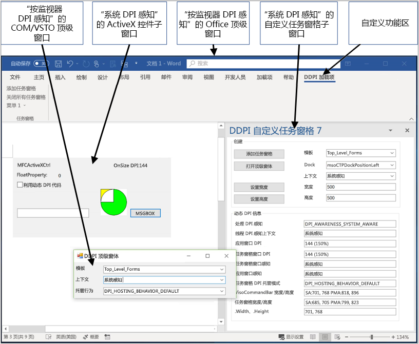
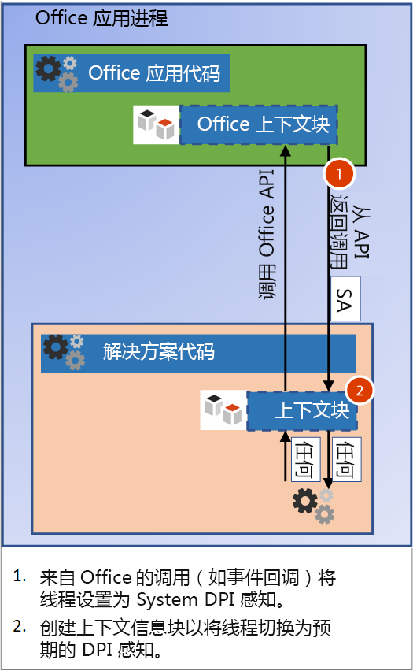
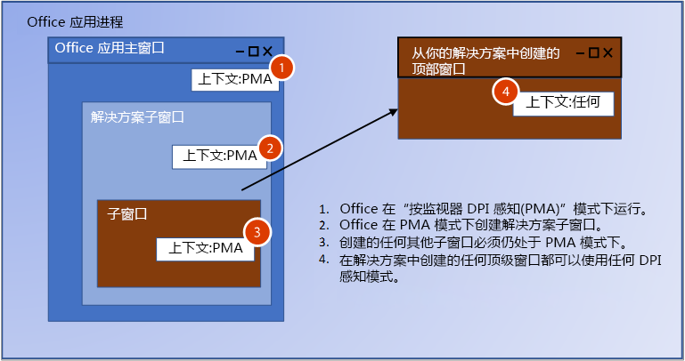
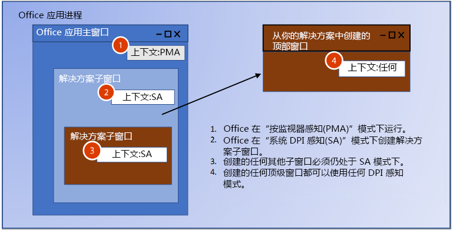
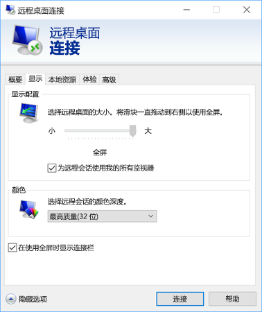

# <a name="handle-high-dpi-and-dpi-scaling-in-your-office-solution"></a>在 Office 解决方案中处理高 DPI 和 DPI 缩放

许多计算机和显示器配置现在都支持高 DPI（每英寸点数）分辨率，并且可以连接具有不同大小和像素密度的多个监视器。 这要求用户将应用移动到具有不同 DPI 的监视器时调整应用程序，或者更改缩放级别。 不支持 DPI 缩放的应用程序在低 DPI 监视器上可能看起来很好，但在高 DPI 监视器上将显得模糊不清。 

Office 2016 应用程序（如 Word 和 Excel）已更新，以响应缩放比例的更改。 然而，你的 Office 解决方案还必须响应更改，以便在 DPI 更改时正确进行绘制。 本文介绍 Office 如何支持动态 DPI，以及你可以采取哪些步骤来确保 Office 可扩展性解决方案在处理 DPI 缩放时带来最佳查看体验。 

## <a name="dpi-scaling-symptoms-in-your-solution"></a>解决方案中的 DPI 缩放症状

当应用程序从一个显示器移动到另一个具有不同 DPI 的显示器时，Windows 会应用 DPI 缩放。 例如，将应用程序拖动到其他显示器或插接笔记本电脑时会发生这种情况。 如果 DPI 缩放对你的 Office 解决方案造成不良影响，你将看到以下一个或多个症状：

- Windows 在错误位置绘制或者大小调整不正确。
- 按钮和标签等元素显示在解决方案窗口的错误位置。
- 字体和图像显得太小、太大或位于错误位置。

DPI 缩放可能会影响以下类型的 Office 解决方案：

- VSTO 加载项
- 自定义任务窗格
- COM 加载项
- ActiveX 控件
- 功能区扩展
- Ole 服务器
- Office Web 加载项

## <a name="windows-dpi-awareness-modes"></a>Windows DPI 感知模式

在整篇文章中，我们将引用 Windows 支持的 DPI 感知模式。 每种 DPI 感知模式都支持不同的功能，如下表所述。 这是有关这些模式的简化描述，用于介绍 Office 如何为其提供支持。 有关 DPI 感知模式的详细信息，请参阅 [Windows 上的高 DPI 桌面应用程序开发](https://docs.microsoft.com/zh-CN/windows/desktop/hidpi/high-dpi-desktop-application-development-on-windows)。

|模式  |描述  |DPI 发生更改时  |
|---------|---------|---------|
|非 DPI 感知     |    应用程序始终呈现为如同在 DPI 值为 96 的显示器上显示。     |    应用程序在主显示器和辅助显示器上将位图拉伸到预期大小。    |
|系统 DPI 感知     |   应用程序将在 Windows 登录时检测主连接监视器的 DPI，但无法响应 DPI 更改。 有关详细信息，请参阅本文中的[配置 Windows 以修复模糊应用](#Configure-Windows-to-fix-blurry-apps)部分。      |     当移动到具有不同 DPI 的新显示器时，应用程序将拉伸位图。    |
|按监视器 DPI 感知     |    应用程序能够在 DPI 发生更改时正确地进行重绘。     |    Windows 会将 DPI 通知发送到应用程序中的顶级窗口，以便在 DPI 发生更改时进行重绘。     |
|按监视器 v2     |   应用程序能够在 DPI 发生更改时正确地进行重绘。      |        Windows 将同时向顶级窗口和子窗口发送 DPI 通知，以便应用程序能够在 DPI 发生更改时进行重绘。 |

## <a name="how-office-supports-dpi-scaling"></a>Office 如何支持 DPI 缩放

决定 Office 解决方案如何处理 DPI 缩放的最重要因素是你的解决方案是顶级窗口还是子窗口。 下图显示了作为顶级窗口或子窗口运行的 Office 解决方案的一些示例，以及它们将在 Windows 2018 年 4 月更新 (1803) 及更高版本中使用的 DPI 感知模式。



在此图中：
- COM/VSTO 顶级窗口是“按监视器 DPI 感知”。
- ActiveX 控件子窗口是“系统 DPI 感知”。
- Office 顶级窗口是“按监视器 DPI 感知”。
- 自定义任务窗格子窗口是“系统 DPI 感知”。

## <a name="managing-thread-dpi-context"></a>管理线程 DPI 上下文

当主机 Office 应用启动时，其主线程将在“按监视器 DPI 感知”上下文中运行。 当你的解决方案代码创建线程或从 Office 接收调用时，你需要管理线程 DPI 上下文。

### <a name="creating-new-threads-with-the-correct-dpi-context"></a>使用正确的 DPI 上下文创建新线程

如果你的解决方案创建了其他线程，则 Office 将强制该线程进入“按监视器 DPI 感知”上下文。 如果你的代码需要不同的上下文，则需要使用 [SetThreadDpiAwarenessContext](https://docs.microsoft.com/zh-CN/windows/desktop/api/winuser/nf-winuser-setthreaddpiawarenesscontext) 函数设置预期的线程 DPI 感知。 

### <a name="build-a-context-block-for-incoming-thread-calls"></a>为传入的线程调用构建上下文块



你的解决方案将与其主机 Office 应用进行交互，因此你可以对 Office 中的解决方案进行传入调用，例如事件回调。 当 Office 调用你的解决方案时，它有一个上下文块，用于强制线程上下文位于“系统 DPI 感知”上下文中。 你必须更改线程上下文，使其匹配窗口的 DPI 感知。 你可以实施类似的上下文块以切换传入调用的线程上下文。 使用 [SetThreadDpiAwarenessContext](https://docs.microsoft.com/zh-CN/windows/desktop/api/winuser/nf-winuser-setthreaddpiawarenesscontext) 函数更改上下文，使其匹配窗口上下文。 

> [!NOTE]
> 在调用解决方案代码之外的其他组件之前，上下文块应该会还原原始 DPI 线程上下文。

#### <a name="managed-code-context-block"></a>托管代码上下文块

以下示例代码显示了如何构建自己的上下文块。

```csharp
public struct DPI_AWARENESS_CONTEXT
        {
            private IntPtr value;

            private DPI_AWARENESS_CONTEXT(IntPtr value)
            {
                this.value = value;
            }
            public static implicit operator DPI_AWARENESS_CONTEXT(IntPtr value)
            {
                return new DPI_AWARENESS_CONTEXT(value);
            }

            public static implicit operator IntPtr(DPI_AWARENESS_CONTEXT context)
            {
                return context.value;
            }

            public static DPI_AWARENESS_CONTEXT operator -(DPI_AWARENESS_CONTEXT context, long value)
            {
                return (IntPtr)(context.value.ToInt64() - value);
            }
            public static DPI_AWARENESS_CONTEXT operator -(DPI_AWARENESS_CONTEXT context, int value)
            {
                return (IntPtr)(context.value.ToInt32() - value);
            }

            public static bool operator ==(DPI_AWARENESS_CONTEXT context1, DPI_AWARENESS_CONTEXT context2)
            {
                return context1.value == context2;
            }
            public static bool operator !=(DPI_AWARENESS_CONTEXT context1, DPI_AWARENESS_CONTEXT context2)
            {
                return context1.value != context2;
            }

            public static bool operator ==(IntPtr context1, DPI_AWARENESS_CONTEXT context2)
            {
                return AreDpiAwarenessContextsEqual(context1, context2);
            }
            public static bool operator !=(IntPtr context1, DPI_AWARENESS_CONTEXT context2)
            {
                return !AreDpiAwarenessContextsEqual(context1, context2);
            }

            public override bool Equals(object obj)
            {
                return base.Equals(obj);
            }

            public override int GetHashCode()
            {
                return base.GetHashCode();
            }

            public override string ToString()
            {
                if (this.value == DPI_AWARENESS_CONTEXT_UNAWARE)
                {
                    return "Unaware";
                }
                if (this.value == DPI_AWARENESS_CONTEXT_SYSTEM_AWARE)
                {
                    return "System Aware";
                }
                if (this.value == DPI_AWARENESS_CONTEXT_PER_MONITOR_AWARE)
                {
                    return "Per Monitor Aware";
                }
                if (this.value == DPI_AWARENESS_CONTEXT_PER_MONITOR_AWARE_V2)
                {
                    return "Per Monitor Aware V2";
                }
                return "Unknown";
            }
        }

        private static DPI_AWARENESS_CONTEXT DPI_AWARENESS_CONTEXT_HANDLE = IntPtr.Zero;

        public static readonly DPI_AWARENESS_CONTEXT DPI_AWARENESS_CONTEXT_INVALID = IntPtr.Zero;
        public static readonly DPI_AWARENESS_CONTEXT DPI_AWARENESS_CONTEXT_UNAWARE = DPI_AWARENESS_CONTEXT_HANDLE - 1;
        public static readonly DPI_AWARENESS_CONTEXT DPI_AWARENESS_CONTEXT_SYSTEM_AWARE = DPI_AWARENESS_CONTEXT_HANDLE - 2;
        public static readonly DPI_AWARENESS_CONTEXT DPI_AWARENESS_CONTEXT_PER_MONITOR_AWARE = DPI_AWARENESS_CONTEXT_HANDLE - 3;
        public static readonly DPI_AWARENESS_CONTEXT DPI_AWARENESS_CONTEXT_PER_MONITOR_AWARE_V2 = DPI_AWARENESS_CONTEXT_HANDLE - 4;

        public static DPI_AWARENESS_CONTEXT[] DpiAwarenessContexts =
        {
            DPI_AWARENESS_CONTEXT_UNAWARE,
            DPI_AWARENESS_CONTEXT_SYSTEM_AWARE,
            DPI_AWARENESS_CONTEXT_PER_MONITOR_AWARE,
            DPI_AWARENESS_CONTEXT_PER_MONITOR_AWARE_V2
        };

class DPIContextBlock : IDisposable
    {
        private DPI_AWARENESS_CONTEXT resetContext;
        private bool disposed = false;

        public DPIContextBlock(DPI_AWARENESS_CONTEXT contextSwitchTo)
        {
            resetContext = SetThreadDpiAwarenessContext(contextSwitchTo);
         }

        public void Dispose()
        {
            Dispose(true);
            GC.SuppressFinalize(this);
        }

        protected virtual void Dispose(bool disposing)
        {
            if (!disposed)
            {
                if (disposing)
                {
                    SetThreadDpiAwarenessContext(resetContext);
                }
            }
            disposed = true;
        }
    }
```

#### <a name="native-code-context-block"></a>本机代码上下文块

```cpp
#include <winuser.h>
/* DpiAwarenessContextBlock can be used to simplify setting and resetting the DPI_AWARENESS_CONTEXT of
the current thread.  When the object is constructed, the DPI_AWARENESS_CONTEXT is set, and when the object is
destructed, the DPI awareness context is reverted to the previous awareness context at construct time.

This object allows us to write code such as:

// Thread state is currently DPI_AWARENESS_SYSTEM_AWARE
if (condition)
{
DpiAwarenessContextBlock perMonitorAware(DPI_AWARENESS_PER_MONITOR_AWARE);
... // Create a top-level hwnd with the current thread state, DPI_AWARENESS_PER_MONITOR_AWARE
}
// Thread state automatically returns to DPI_AWARENESS_SYSTEM_AWARE

*/
class DpiAwarenessContextBlock
{
public:
      DpiAwarenessContextBlock(DPI_AWARENESS_CONTEXT dpiContext) noexcept;
      ~DpiAwarenessContextBlock();

      // Copy and move are not to be used with these context objects
      DpiAwarenessContextBlock(const DpiAwarenessContextBlock&) = delete;
      DpiAwarenessContextBlock(DpiAwarenessContextBlock&&) = delete;

private:
      DPI_AWARENESS_CONTEXT m_contextReversalType;
      bool m_doContextSwitch;
};

inline DpiAwarenessContextBlock::DpiAwarenessContextBlock(DPI_AWARENESS_CONTEXT dpiContext) noexcept
{
      m_contextReversalType = SetThreadDpiAwarenessContext(dpiContext);
}

inline DpiAwarenessContextBlock::~DpiAwarenessContextBlock()
{
      SetThreadDpiAwarenessContext(m_contextReversalType);
}
```
<h2 id="top-level-window-management">顶级窗口管理</h2>

当 Office 应用程序启动时，将以 DPI_AWARENESS_CONTEXT_PER_MONITOR_AWARE 的形式调用 [SetThreadDpiAwarenessContext](https://docs.microsoft.com/zh-CN/windows/desktop/api/winuser/nf-winuser-setthreaddpiawarenesscontext)。 在此上下文中，DPI 更改将发送到以“按监视器 DPI 感知”形式运行的进程中的任何顶级窗口的 HWND。 顶级窗口是指 Office 应用程序窗口以及由解决方案创建的任何其他顶级窗口。 将 Office 应用程序移动到新显示器时，系统会通知它，以便它能够按照新显示器的 DPI 正确地进行动态缩放和绘制。 你的 Office 解决方案可以创建处于任何 DPI 感知模式的顶级窗口。 顶级窗口还可以通过侦听 Windows 更改消息来响应 DPI 更改。

如果已创建作为顶级窗口父级的子窗口，则你也可以将它们设置为任何 DPI 感知模式。 但是，如果使用“按监视器 DPI 感知”模式，则子窗口将不会收到 DPI 更改通知。  有关 Windows DPI 感知模式的详细信息，请参阅 [Windows 上的高 DPI 桌面应用程序开发](https://docs.microsoft.com/zh-CN/windows/desktop/hidpi/high-dpi-desktop-application-development-on-windows)。

## <a name="child-window-management"></a>子窗口管理

使用 ActiveX 控件和自定义任务窗格时，Office 会为你的解决方案创建子窗口。 你可以创建其他子窗口，但必须知道父窗口 DPI 感知。 Office 在“按监视器 DPI 感知”模式下运行，这意味着解决方案中的任何子窗口都不会收到 DPI 更改通知。 仅“按监视器 v2”模式支持向子窗口发送 DPI 更改（Office 不支持“按监视器 v2”）。 但是，对于 ActiveX 控件，有一种解决方法。 有关详细信息，请参阅本文后面的 [ActiveX 控件](#activex-controls)部分。

> [!NOTE]
> 如果子窗口创建了顶级窗口，则可以为新的顶级窗口使用任何 DPI 感知模式。 有关管理顶级窗口的详细信息，请参阅本文的[顶级窗口管理](#top-level-window-management)部分。

您将看到应用于子窗口的两种不同的 DPI 模式，具体取决于运行的 Windows 10 Office 版本。

### <a name="office-dpi-behavior-on-windows-fall-creators-update-1709"></a>Windows Fall Creators Update (1709) 中的 Office DPI 行为

由于 Office 应用使用按监视器感知模式，因此还将在“按监视器 DPI 感知”模式下为解决方案创建子窗口。 这意味着 Windows 希望在采用新 DPI 进行绘制时更新解决方案。  由于窗口无法收到 DPI 更改通知，因此你的解决方案 UI 可能不正确。 



### <a name="office-dpi-behavior-on-windows-april-2018-update-1803"></a>Windows 2018 年 4 月更新 (1803) 中的 Office DPI 行为

对于 Windows 2018 年 4 月更新 (1803) 及更高版本，Office DPI 托管行为在某些情况下会使用混合模式 DPI 缩放。 这允许系统 DPI 感知窗口成为设置为“按监视器 DPI 感知”的 Office 窗口的父级。 这有助于确保在 DPI 发生更改和窗口位图拉伸时提高兼容性。 经过位图拉伸的窗口可能仍模糊不清。



创建新的子窗口时，请确保它们匹配其父窗口的 DPI 感知。 你可以使用 [GetWindowdpiAwarenessContext](https://docs.microsoft.com/zh-CN/windows/desktop/api/winuser/nf-winuser-getwindowdpiawarenesscontext) 函数来获取父窗口的 DPI 感知。 有关 DPI 感知一致性的详细信息，请参阅 [Windows 上的高 DPI 桌面应用程序开发](https://docs.microsoft.com/zh-CN/windows/desktop/hidpi/high-dpi-desktop-application-development-on-windows#related-topics)中的“强制重置整个进程的 DPI 感知”部分。

> [!NOTE]
> 你不能依赖于进程 DPI 感知，因为它可能会返回 [PROCESS_SYSTEM_DPI_AWARE](https://msdn.microsoft.com/en-us/library/windows/desktop/dn280512(v=vs.85).aspx)，即使应用程序主线程 DPI 感知上下文为 [DPI_AWARENESS_CONTEXT_PER_MONITOR_AWARE](https://docs.microsoft.com/zh-CN/windows/desktop/hidpi/dpi-awareness-context) 也是如此。 使用 [GetThreadDpiAwarenessContext](https://docs.microsoft.com/zh-CN/windows/desktop/api/winuser/nf-winuser-getthreaddpiawarenesscontext) 函数获取线程 DPI 感知上下文。

## <a name="office-and-windows-dpi-compatibility-settings"></a>Office 和 Windows DPI 兼容性设置

当用户遇到无法正确呈现的加载项或解决方案时，某些兼容性设置可帮助解决该问题。

<h3 id="office-compatibility">配置 Office 以优化兼容性</h3>

当移动到具有不同 DPI 缩放比例的其他屏幕时，Office 提供了用于优化兼容性的设置。 兼容模式可禁用 DPI 缩放，以便在移动到使用不同 DPI 缩放比例的显示器时，Office 中的所有内容都会进行位图拉伸。 

兼容性模式强制 Office 在系统 DPI 感知模式下运行。 这会导致应用程序窗口进行位图拉伸，并且可能会产生外观模糊的负面影响。 Office 解决方案无法控制此设置，因为这是用户选择的。 使用显示兼容性模式可以解决许多绘图问题。 有关详细信息，请参阅 [高清晰度显示器的 Office 支持](https://support.office.com/zh-CN/article/office-support-for-high-definition-displays-6720ca0e-be59-41f6-b629-1369f549279d)。 

### <a name="configure-windows-to-fix-blurry-apps"></a>配置 Windows 以修复模糊应用程序

在 Windows 10（版本 1803）及更高版本中，可以通过设置修复应用程序，使其不再模糊。 如果你的解决方案无法正常呈现，则可以尝试使用这种设置。 Office 解决方案无法控制此设置，因为这是用户选择的。 有关详细信息，请参阅[在 Windows 10 中修复显示模糊的应用程序](https://support.microsoft.com/zh-CN/help/4091364/windows-10-fix-blurry-apps)。

## <a name="how-to-support-dpi-scaling-in-your-solution"></a>如何支持解决方案中的 DPI 缩放

有些解决方案可以接收和响应 DPI 更改。 有些则可以通过解决办法解决无法接收通知的问题。 下表列出了与每种解决方案相关的详细信息。

<table>
    <thead>
        <tr>
            <th>解决方案类型</th>
            <th>窗口类型</th>
            <th>可响应 DPI 缩放</th>
            <th>更多详细信息</th>
        </tr>
    </thead>
<tbody>
    <tr>
        <td rowspan="2"><a href="#vsto-add-ins">VSTO 加载项</a></td>
        <td>顶部及其子代</td>
        <td>是</td>
        <td>请参阅 <a href="#vsto-add-ins">VSTO 加载项指南</a>。</td>
    </tr>
<tr>
        <td>已设置为 Office 窗口父级的子级</td>
        <td>否</td>
        <td>请参阅<a href="#office-compatibility">配置 Office 以优化兼容性</a>。</td>
</tr>
    <tr>
        <td rowspan="2"><a href="#custom-task-panes">自定义任务窗格</a></td>
        <td>顶部及其子代</td>
        <td>是</td>
        <td>请参阅<a href="#top-level-window-management">顶级窗口指南</a>。</td>
    </tr>
<tr>
        <td>已设置为 Office 窗口父级的子级</td>
        <td>否</td>
        <td>请参阅<a href="#office-compatibility">配置 Office 以优化兼容性</a>。</td>
</tr>
    <tr>
        <td rowspan="2"><a href="#com-add-ins">COM 加载项</a></td>
        <td>顶部及其子代</td>
        <td>是</td>
        <td>请参阅 <a href="#com-add-ins">COM 加载项指南</a>。</td>
    </tr>
<tr>
        <td>已设置为 Office 窗口父级的子级</td>
        <td>否</td>
        <td>请参阅<a href="#office-compatibility">配置 Office 以优化兼容性</a>。</td>
</tr>
    <tr>
        <td rowspan="2"><a href="#activex-controls">ActiveX 控件</a></td>
        <td>顶部及其子代</td>
        <td>是</td>
        <td>请参阅<a href="#activex-controls">ActiveX 控件指南</a>。</td>
    </tr>
    <tr>
        <td>已设置为 Office 窗口父级的子级</td>
        <td>是</td>
    </tr>
    <tr>
        <td><a href="#web-add-ins">Web 加载项</a></td>
        <td>NA</td>
        <td>是</td>
        <td>请参阅<a href="#web-add-ins">Office Web 加载项指南</a>。</td>
    </tr>
    <tr>
        <td><a href="#ribbon-extensibility">功能区扩展</a></td>
        <td>NA</td>
        <td>NA</td>
        <td>请参阅<a href="#ribbon-extensibility">功能区扩展指南</a>。</td>
    </tr>
    <tr>
        <td><a href="#ole">OLE 服务器或客户端</a></td>
        <td>NA</td>
        <td>NA</td>
        <td>请参阅<a href="#ole">OLE 服务器/客户端指南</a>。</td>
    </tr>
</tbody>
</table>

<h3 id="vsto-add-ins">VSTO 加载项</h3>

如果 VSTO 加载项创建了已设置为任何 Office 窗口的子窗口，请确保它们与其父窗口的 DPI 感知匹配。 你可以使用 [GetWindowdpiAwarenessContext](https://docs.microsoft.com/zh-CN/windows/desktop/api/winuser/nf-winuser-getwindowdpiawarenesscontext) 函数来获取父窗口的 DPI 感知。 子窗口不会收到任何 DPI 更改通知。 如果你的解决方案无法正常呈现，则用户需要将 Office 置于兼容性模式。

对于任何 VSTO 加载项创建的顶级窗口，可以将其设置为任意 DPI 感知模式。 以下示例代码显示了如何设置所需的 DPI 感知以及如何响应 DPI 更改。 此外，你需要按照 [High DPI support in Windows Forms](https://docs.microsoft.com/zh-CN/dotnet/framework/winforms/high-dpi-support-in-windows-forms) 文章中所述，调整 app.config。 

```csharp
using System;
using System.Diagnostics;
using System.Drawing;
using System.Runtime.InteropServices;
using System.Windows.Forms;

namespace SharedModule
{
    // DpiAwareWindowsForm
    // For any top level winform you create, derive from the DpiWindowsForm class
    // if you are creating Windows Forms with the Dpi Awareness Context set to 
    // DPI_AWARENESS_CONTEXT_PER_MONITOR_AWARE or DPI_AWARENESS_CONTEXT_PER_MONITOR_AWARE_V2
    //
    // For example, if you Window form class is defined as:
    //    public partial class TopLevelWinForm : Form
    //
    // update to:
    //    public partial class TopLevelWinForm : DpiAwareWindowsForm
    //
    // When showing the form, call SetThreadDpiAwarenessContext() or use a context block to
    // to set the desired Dpi Awareness Context.
    //
    // For example, here is code to show a Windows Form using a context block as Per Monitor Aware v2.
    //
    //    DPIContextBlock context = new DPIContextBlock(DPI_AWARENESS_CONTEXT_PER_MONITOR_AWARE_V2);
    //    TopLevelWinForm frm = new TopLevelWinForm();
    //    frm.Show();
    //
    public partial class DpiAwareWindowsForm : Form
    {
        private SizeF m_newDpi = SizeF.Empty;
        private SizeF m_oldDpi = SizeF.Empty;

        public DpiAwareWindowsForm()
        {
            this.HandleCreated += new EventHandler((sender, args) =>
            {
                m_oldDpi = m_newDpi = DPIHelper.GetDpiForWindowSizeF(this.Handle);
            });
        }

        public void OnDpiChangedEvent(RECT newRect)
        {
            this.SuspendLayout();

            // Resize form
            this.Width = newRect.Width;
            this.Height = newRect.Height;

            // Resize controls and set font sizes
            ScaleAllChildControls(this.Controls, m_oldDpi.Width, m_newDpi.Width);
            this.ResumeLayout(true);
        }

        // Additional changes may be needed for controls that set Anchor or Dock properties 
        private void ScaleAllChildControls(Control.ControlCollection controls, float oldDpi, float newDpi)
        {
            float scaleFactorChange = newDpi / oldDpi;

            foreach (Control control in controls)
            {
                control.Top = (int)(control.Top * scaleFactorChange);
                control.Left = (int)(control.Left * scaleFactorChange);
                control.Width = (int)(control.Width * scaleFactorChange);
                control.Height = (int)(control.Height * scaleFactorChange);
                control.Font = ScaleFont(control.Font, oldDpi, newDpi);
            }
        }

        private Font ScaleFont(Font font, float oldDpi, float newDpi)
        {
            float fontSizePx = 0.0f;
            float fontSizePt = 0.0f;

            fontSizePx = font.SizeInPoints / 72 * oldDpi;
            fontSizePt = fontSizePx * (newDpi / oldDpi) * 72 / oldDpi;

            return new Font(font.Name, fontSizePt, font.Style, GraphicsUnit.Point);
        }

        protected override void WndProc(ref Message m)
        {
            switch ((DPIHelper.WinMessages)m.Msg)
            {
                case DPIHelper.WinMessages.WM_DPICHANGED:
                    // Marshal the value in the lParam into a Rect.
                    RECT newDisplayRect = (RECT)Marshal.PtrToStructure(m.LParam, typeof(RECT));

                    // Remember current DPI and calculate current from WParam.
                    // Both X and Y are the same on Windows for Dpi.
                    m_oldDpi = m_newDpi;

                    m_newDpi.Width = (float)(m.WParam.ToInt32() >> 16);
                    m_newDpi.Height = (float)(m.WParam.ToInt32() & 0x0000FFFF);

                    // DPI should be the same for both width and height on Windows devices.
                    Debug.Assert(m_newDpi.Height == m_newDpi.Width);

                    if (m_oldDpi.Width != m_newDpi.Width)
                    {
                        OnDpiChangedEvent(newDisplayRect);
                    }
                    base.DefWndProc(ref m);
                    break;
                default:
                    base.WndProc(ref m);
                    break;
            }
        }
    }
}
```

<h3 id="custom-task-panes">自定义任务窗格</h3>

Office 将会创建一个自定义任务窗格，作为子窗口。 在 Windows Fall Creators Update (1709) 上运行时，自定义任务窗格将使用与 Office 相同的 DPI 感知模式运行。 在 Windows April 2018 Update (1803) 及更高版本上运行时，自定义任务窗口将使用系统 DPI 感知模式。 

自定义任务窗格为子窗口，因此，它们无法接收 DPI 通知。 如果绘制错误，则用户需要使用 [Office DPI 兼容性模式](https://support.office.com/zh-CN/article/office-support-for-high-definition-displays-6720ca0e-be59-41f6-b629-1369f549279d)。
如果自定义任务窗格创建了一个顶级窗口，则这些窗口可以在任何 DPI 感知模式下运行并且可接收 DP 更改通知。 有关详细信息，请参阅本文的[顶级窗口管理](#Top-level-window-management)部分。

<h3 id="com-add-ins">COM 加载项</h3>

用于创建顶级窗口的 COM 加载项可以接收 DPI 通知。 应先创建[上下文块](#Build-a-context-block-for-incoming-thread-calls)以将线程设置为窗口所需的 DPI 感知，然后再创建窗口。 要正确处理 DPI 通知，需要知悉许多内容，因此，务必阅读 [Windows 上的高 DPI 桌面应用程序开发](https://docs.microsoft.com/zh-CN/windows/desktop/hidpi/high-dpi-desktop-application-development-on-windows#related-topics)，以了解更多详细信息。

当某一窗口的 DPI 发生更改时，将会发送 [WM_DPICHANGED](https://msdn.microsoft.com/en-us/library/windows/desktop/dn312083(v=vs.85).aspx) 消息。  在非托管代码中，此消息由 HWND 的[窗口程序](https://msdn.microsoft.com/en-us/library/windows/desktop/ms633570(v=vs.85).aspx)处理。  
  [WM_DPICHANGED](https://msdn.microsoft.com/en-us/library/windows/desktop/dn312083(v=vs.85).aspx) 一文中提供了 DPI 更改处理程序示例代码。 

如果 COM 加载项显示已设置为 Office 中某个窗口的父级的子窗口，则它无法接收 DPI 通知。 如果绘制错误，则用户需要使用 [Office DPI 兼容性模式](https://support.office.com/zh-CN/article/office-support-for-high-definition-displays-6720ca0e-be59-41f6-b629-1369f549279d)。

<h3 id="activex-controls">ActiveX 控件</h3>

如何支持 ActiveX 控件中的 DPI 缩放取决于该控件是窗口化控件还是无窗口控件。

#### <a name="windowed-activex-controls"></a>窗口化 ActiveX 控件

每次调整控件大小时，窗口化 ActiveX 控件均会收到 WM_SIZE 消息。  触发此事件后，事件处理程序代码将会使用该控件的 HWND 调用 [GetDpiForWindow](https://docs.microsoft.com/zh-CN/windows/desktop/api/winuser/nf-winuser-getdpiforwindow) 函数，以获取 DPI、计算缩放比例差异并按需要进行调整。 

以下示例中启用了基于 MFC 的 ActiveX 控件，以响应 **OnSize** 事件。 

```cpp
void ChangeWindowFontDPI(HWND hWnd, UINT dpi) 
{ 
LOGFONT fontInfo1 = { 0 }; 
// Calculate the font height based on the DPI. 
fontInfo1.lfHeight = -MulDiv(DESIRED_HEIGHT, dpi, 72); 
fontInfo1.lfQuality = CLEARTYPE_QUALITY; 
wcscpy_s(fontInfo1.lfFaceName, DESIRED_FONT_NAME); 
 
::SendMessage(hWnd, WM_SETFONT, (WPARAM)::CreateFontIndirectW(&fontInfo1), TRUE); 
} 
 
BOOL CALLBACK CMainDialog::EnumChildProc(HWND hWnd, LPARAM lParam) 
{ 
CMainDialog* _this = (CMainDialog*) lParam; 
if (_this != nullptr) 
{ 
// Calculate the scale factor difference between the old and new DPI changes. 
double scale = (((double) _this->m_newDPI) /  
   (((double) _this->m_currentDPI) / 100.0)) / 100; 
 
RECT rect = {}; 
::GetWindowRect(hWnd, &rect); 
 
POINT pt = { rect.left, rect.top }; 
::ScreenToClient(::GetParent(hWnd), &pt); 
 
// Adjust the window based on the scale changes. 
::MoveWindow(hWnd, 
pt.x * scale, 
pt.y * scale, 
(rect.right - rect.left) * scale, 
(rect.bottom - rect.top) * scale, 
TRUE); 
 
ChangeWindowFontDPI(hWnd, _this->m_newDPI); 
return TRUE; 
} 
return FALSE; 
} 
 
void CMainDialog::OnSize(UINT nType, int cx, int cy) 
{ 
CDialog::OnSize(nType, cx, cy); 
 
// Get the new DPI and enumerate the child windows that will use that value. 
m_currentDPI = ::GetDpiForWindow(this->GetSafeHwnd()); 
::EnumChildWindows(this->GetSafeHwnd(), EnumChildProc, (LPARAM)this); 
} 
```

#### <a name="windowless-activex-controls"></a>无窗口 ActiveX 控件

无法确保无窗口 ActiveX 控件拥有 HWND。  将 ActiveX 控件插入到文档画布中后，该控件即处于设计模式。  在 Office 应用程序中，如果控件处于设计模式，则在 ::OnDrawll 事件中调用 hDC->GetWindow() 时，托管容器将会返回 0。  在此情况下，无法检索到可靠的 DPI。 

但是，如果控件处于运行时模式，则 Office 将在绘制控件的位置返回 HWND。  在此情况下，空间开发人员可以调用 [GetDpiForWindow](https://docs.microsoft.com/zh-CN/windows/desktop/api/winuser/nf-winuser-getdpiforwindow) 并获取当前 DPI 和缩放字体、控件等。 

<h3 id="ribbon-extensibility">自定义功能区扩展性</h3>

来自 Office 自定义功能区控件的任何回调将处于系统 DPI 感知的 DPI 线程感知中。  如果解决方案期望获得不同的 DPI 线程感知，则应使用上下文块设置预期的线程感知。 有关详细信息，请参阅[构建上下文块](#Build-a-context-block-for-incoming-thread-calls)。

<h3 id="ole">OLE 客户端和服务器</h3>

如果 OLE 服务器托管在 OLE 客户端容器内，则此时无法提供当前或受支持的 DPI 信息。 这可能会导致出现问题，因为当前 Windows 体系结构不支持某些父窗口到子窗口的混合模式组合。 如果 Word 或 Excel 检测到有多个具有不同 DPI 缩放的监视器，则它们不支持就地激活。 OLE 服务器将会进行非现场激活。 如果遇到 OLE 服务器交互方面的问题，则用户需要使用 [Office DPI 兼容性模式](https://support.office.com/zh-CN/article/office-support-for-high-definition-displays-6720ca0e-be59-41f6-b629-1369f549279d)。

<h3 id="web-add-ins">Office Web 加载项</h3>

使用 Office JavaScript API 构建的 Office 加载项将在浏览器控件中运行。 可以使用与任何 Web 应用程序设计中所使用的相同技术处理 DPI 缩放。 为高清晰度的屏幕设计网页时，可以借助多种在线资源。

## <a name="verify-that-your-solution-supports-dpi-scaling"></a>验证你的解决方案是否支持 DPI 缩放

更新应用程序以支持 DPI 缩放之后，应在混合 DPI 环境中验证你的更改。 将解决方案的窗口从一台显示器移至具有不同 DPI 值的另一个窗口时，验证你的 UI 代码是否可以正确响应 DPI 更改。 有关 DPI 缩放测试技术的详细信息，请参阅 [Windows 上的高 DPI 桌面应用程序开发](https://docs.microsoft.com/zh-CN/windows/desktop/hidpi/high-dpi-desktop-application-development-on-windows#related-topics)。

此外，以下技术可能会对你有用：

- 在笔记本电脑上，可以将主监视器设为外部监视器，然后脱开笔记本电脑。 这将强制主监视器更改笔记本电脑显示。
- 使用开源 [WinSpy++ 工具](https://github.com/BissetJ/winspy/releases)协助调试。 可以用它来查看任何窗口的 DPI 感知设置。
- 可以使用远程桌面来在远程计算机上测试多台监视器，方法是在“显示”选项卡的远程会话中选择“使用所有监视器”，如下面的屏幕截图所示。



## <a name="see-also"></a>另请参阅

### <a name="articles"></a>文章

- 
  [编写 DPI 感知桌面和 Win32 应用程序](https://msdn.microsoft.com/en-us/library/windows/desktop/dn469266(v=vs.85).aspx)中提供了编写 Win32 桌面应用程序的一般性概述和指南。 本文中所述的许多相同技术适用于 Office 扩展性解决方案。
- 
  [混合模式 DPI 缩放和 DPI 感知 API](https://msdn.microsoft.com/en-us/library/windows/desktop/mt744321(v=vs.85).aspx) 中提供有一个与 DPI 相关的 API 列表。
- [开发人员指南 - 按监视器 DPI - WPF 预览](https://github.com/Microsoft/WPF-Samples/blob/master/PerMonitorDPI/Developer%20Guide%20-%20Per%20Monitor%20DPI%20-%20WPF%20Preview.docx)介绍了构建 DPI 感知 WPF 应用程序的开发指南。
- [高清晰度显示器的 Office 支持](https://support.office.com/zh-CN/article/office-support-for-high-definition-displays-6720ca0e-be59-41f6-b629-1369f549279d)中提供了相关的信息，让用户知道在因 DPI 发生更改而使 Office 解决方案不受支持时，如何设置 Office 以优化兼容性。
- [Windows 10 周年更新的显示器缩放更改](https://blogs.technet.microsoft.com/askcore/2016/08/16/display-scaling-changes-for-the-windows-10-anniversary-update/)博客文章介绍了 Windows 10 周年更新中引入的更改。 
- [DPI_AWARENESS_CONTEXT 句柄](https://docs.microsoft.com/zh-CN/windows/desktop/hidpi/dpi-awareness-context)具有与 DPI_AWARENESS_CONTEXT 值和定义相关的编程详细信息。
- [Windows 上的高 DPI 桌面应用程序开发](https://docs.microsoft.com/zh-CN/windows/desktop/hidpi/high-dpi-desktop-application-development-on-windows#testing-your-changes)的“测试更改”部分包括了与测试相关的信息。

### <a name="code-samples"></a>代码示例

- [按窗口 DPI 感知示例](https://github.com/Microsoft/Windows-classic-samples/tree/master/Samples/DPIAwarenessPerWindow)
- [动态 DPI 示例](https://github.com/Microsoft/Windows-classic-samples/tree/master/Samples/DynamicDPI)
- [按监视器感知 WPF 示例](https://github.com/Microsoft/Windows-classic-samples/tree/master/Samples/PerMonitorDPIAware)