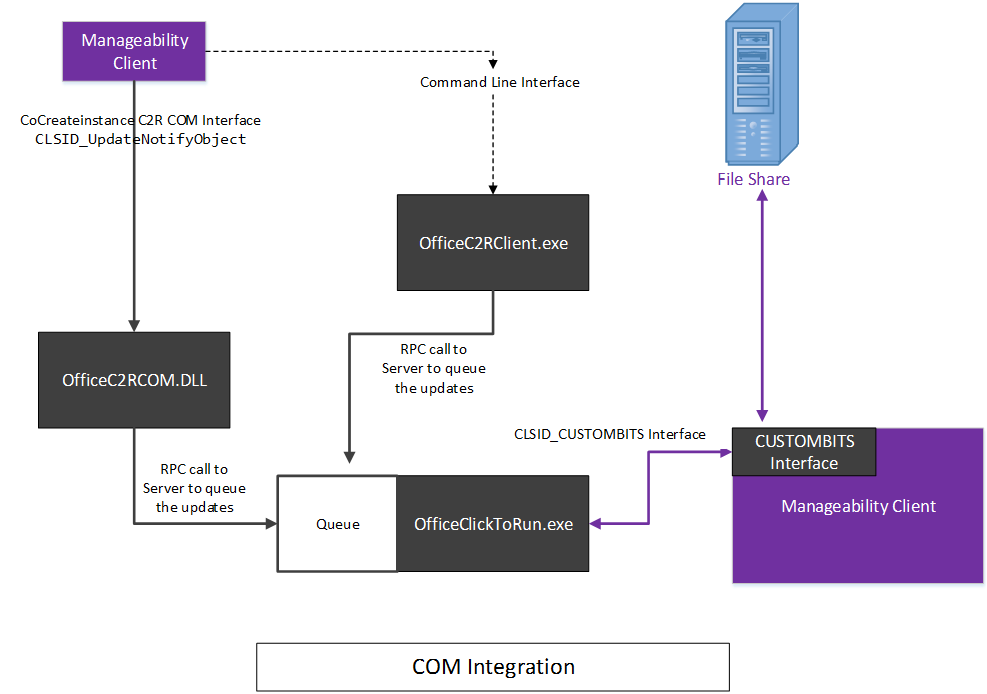

# <a name="integrating-manageability-applications-with-office-365-click-to-run-installer"></a><span data-ttu-id="31ddf-103">将可管理性应用程序与 Office 365 即点即用安装程序集成</span><span class="sxs-lookup"><span data-stu-id="31ddf-103">Integrating manageability applications with Office 365 click-to-run installer</span></span>

<span data-ttu-id="31ddf-104">了解如何将 Office 365 即点即用安装程序与软件管理解决方案集成。</span><span class="sxs-lookup"><span data-stu-id="31ddf-104">Learn how to integrate the Office 365 Click-to-Run installer with a software management solution.</span></span>
  
<span data-ttu-id="31ddf-105">Office 365 即点即用安装程序提供一个 COM 接口，允许 IT 专业人员和软件管理解决方案以编程方式控制更新管理。</span><span class="sxs-lookup"><span data-stu-id="31ddf-105">The Office 365 Click-to-Run installer provides a COM interface that allows IT Professionals and software management solutions programmatic control over update management.</span></span> <span data-ttu-id="31ddf-106">此接口提供了 Office 部署工具所提供功能之外的其他管理功能。</span><span class="sxs-lookup"><span data-stu-id="31ddf-106">This interface provides additional management capabilities beyond what is provided by the Office Deployment Tool.</span></span>
  
> [!NOTE]
> <span data-ttu-id="31ddf-107">本文适用于 Office 2016 及更高版本（Office 365）。</span><span class="sxs-lookup"><span data-stu-id="31ddf-107">This article applies to Office 2016 and later, Office 365.</span></span> 
  
## <a name="integrating-with-the-click-to-run"></a><span data-ttu-id="31ddf-108">与即点即用集成</span><span class="sxs-lookup"><span data-stu-id="31ddf-108">Integrating with the Click-to-Run</span></span>

<span data-ttu-id="31ddf-109">若要使用此接口，可管理性应用程序将调用 COM 接口，并调用与即点即用安装服务直接通信的公开 Api。</span><span class="sxs-lookup"><span data-stu-id="31ddf-109">To use this interface, a manageability application invokes the COM interface and calls exposed APIs that communicate directly with the Click-to-Run installation service.</span></span> 
  
> [!NOTE]
> <span data-ttu-id="31ddf-110">可以通过命令行运行 Office 即点即用安装程序，这些参数可以控制针对即点即用的[Office 部署工具](https://www.microsoft.com/download/details.aspx?id=49117)中所述的行为。</span><span class="sxs-lookup"><span data-stu-id="31ddf-110">The Office Click-to-Run installer can be run from the command-line with parameters that can control the behavior, as documented in [Office Deployment Tool for Click-to-Run](https://www.microsoft.com/download/details.aspx?id=49117).</span></span> 
  
<span data-ttu-id="31ddf-111">**以下是 COM 接口的概念图**</span><span class="sxs-lookup"><span data-stu-id="31ddf-111">**Following is a conceptual diagram of the COM interface**</span></span>

<span data-ttu-id="31ddf-112"></span><span class="sxs-lookup"><span data-stu-id="31ddf-112"></span></span>
  
<span data-ttu-id="31ddf-113">Office 365 即点即用安装程序实现基于 COM 的接口， **IUpdateNotify**注册到 CLSID **CLSID_UpdateNotifyObject**。</span><span class="sxs-lookup"><span data-stu-id="31ddf-113">The Office 365 Click-to-Run installer implements a COM-based interface, **IUpdateNotify** registered to CLSID **CLSID_UpdateNotifyObject**.</span></span>
  
<span data-ttu-id="31ddf-114">可以按如下方式调用此接口：</span><span class="sxs-lookup"><span data-stu-id="31ddf-114">This interface can be invoked as follows:</span></span>
  
```cpp
hr = CoCreateInstance(CLSID_UpdateNotifyObject, NULL, CLSCTX_ALL,
       IID_IUpdateNotify, 
      (void **)&p); 
```

<span data-ttu-id="31ddf-115">仅当呼叫者在提升的权限下运行时，调用才会成功，因为必须使用提升的权限运行即点即用安装程序。</span><span class="sxs-lookup"><span data-stu-id="31ddf-115">The call will only succeed if the caller is running under elevated privileges, as the Click-to-Run installation program must be run with elevated privileges.</span></span>
  
<span data-ttu-id="31ddf-116">**IUpdateNotify** COM 接口公开三个异步功能，负责验证命令和参数，并使用即点即用安装服务执行计划的运行。</span><span class="sxs-lookup"><span data-stu-id="31ddf-116">The **IUpdateNotify** COM interface exposes three asynchronous functions responsible for validating the commands and parameters and scheduling execution with the Click-to-Run installation service.</span></span> 
  
```cpp
HRESULT Download([in] LPWSTR pcwszParameters) // Download update content.
HRESULT Apply([in] LPWSTR pcwszParameters) // Apply update content.
HRESULT Cancel() // Cancel the download action.

```

<span data-ttu-id="31ddf-117">"**状态**" 方法可用于获取有关上次执行的命令状态的信息，或当前正在执行的命令的状态（即成功、失败、详细错误代码）。</span><span class="sxs-lookup"><span data-stu-id="31ddf-117">A forth method, **Status**, can be used to get information about the status of the last executed command or the status of the currently executing command (i.e. success, failure, detailed error codes).</span></span>
  
```cpp
HRESULT status([out] _UPDATE_STATUS_REPORT* pUpdateStatusReport) // Get status of current action. 
typedef struct _UPDATE_STATUS_REPORT  
{  
UPDATE_STATUS status;  
UINT error; 
BSTR contentid;  
} UPDATE_STATUS_REPORT;

```

<span data-ttu-id="31ddf-118">在其生命周期中，即点即用安装服务可能处于运行状态的四种状态，在此期间可以调用**IUpdateNotify**方法;重新启动、空闲、下载和应用。</span><span class="sxs-lookup"><span data-stu-id="31ddf-118">There are four states that the Click-to-Run installation service may be in during its lifecycle, during which **IUpdateNotify** methods may be called; Rebooting, Idle, Downloading and Applying.</span></span> 
  
<span data-ttu-id="31ddf-119">**以下是 COM 接口状态机关系图**</span><span class="sxs-lookup"><span data-stu-id="31ddf-119">**Following is the COM Interface State Machine diagram**</span></span>

<span data-ttu-id="31ddf-120"></span><span class="sxs-lookup"><span data-stu-id="31ddf-120"></span></span>
  
> [!NOTE]
> <span data-ttu-id="31ddf-121">**重新启动**：当计算机启动时，即点即用安装程序服务不可用时的一段时间。</span><span class="sxs-lookup"><span data-stu-id="31ddf-121">**Rebooting**: When the machine is booting there is a period of time when the Click-to-Run installer service is not available.</span></span> <span data-ttu-id="31ddf-122">重新启动后，对 Status 方法的成功调用将返回 eUPDATE_UNKNOWN。</span><span class="sxs-lookup"><span data-stu-id="31ddf-122">A successful call to the Status method after a reboot will return eUPDATE_UNKNOWN.</span></span> 
  
<span data-ttu-id="31ddf-123">**空闲：** 当即点即用安装程序处于空闲状态时，您可以调用：</span><span class="sxs-lookup"><span data-stu-id="31ddf-123">**Idle:** When the Click-to-Run installer is in the idle state, you can call:</span></span> 
  
- <span data-ttu-id="31ddf-124">**应用**：安装以前下载的内容。</span><span class="sxs-lookup"><span data-stu-id="31ddf-124">**Apply**: Install previously downloaded content.</span></span>
    
- <span data-ttu-id="31ddf-125">**取消**：返回`0x800000e`"在意外的时间调用方法"。</span><span class="sxs-lookup"><span data-stu-id="31ddf-125">**Cancel**: Returns  `0x800000e`, "A method was called at an unexpected time."</span></span>
    
- <span data-ttu-id="31ddf-126">**下载**：将新内容下载到客户端，以供以后安装。</span><span class="sxs-lookup"><span data-stu-id="31ddf-126">**Download**: Downloads new content to the client for later installation.</span></span>
    
- <span data-ttu-id="31ddf-127">**Status**：返回上次完成的操作的结果，如果操作在失败时结束，则返回错误消息。</span><span class="sxs-lookup"><span data-stu-id="31ddf-127">**Status**: Returns the result of the last completed action, or an error message if the action ended in failure.</span></span> <span data-ttu-id="31ddf-128">如果没有上一个操作，**状态**将返回`eUPDATE_UNKNOWN`。</span><span class="sxs-lookup"><span data-stu-id="31ddf-128">If there is no previous action, **Status** returns  `eUPDATE_UNKNOWN`.</span></span>
    
<span data-ttu-id="31ddf-129">**下载：** 当即点即用安装程序处于下载状态时，您可以调用：</span><span class="sxs-lookup"><span data-stu-id="31ddf-129">**Downloading:** When the Click-to-Run installer is in the downloading state, you can call:</span></span> 
  
- <span data-ttu-id="31ddf-130">**应用**：返回值\*\*\*\* `0x800000e`为 "在意外的时间调用了某个方法的 HRESULT"。</span><span class="sxs-lookup"><span data-stu-id="31ddf-130">**Apply**: Returns an **HRESULT** with the value  `0x800000e`, "A method was called at an unexpected time."</span></span>
    
- <span data-ttu-id="31ddf-131">**取消**：停止下载并删除部分下载的内容。</span><span class="sxs-lookup"><span data-stu-id="31ddf-131">**Cancel**: Stops the download and removes the partially downloaded content.</span></span>
    
- <span data-ttu-id="31ddf-132">**下载**：返回值\*\*\*\* `0x800000e`为 "在意外时间调用方法" 的 HRESULT。</span><span class="sxs-lookup"><span data-stu-id="31ddf-132">**Download**: Returns an **HRESULT** with the value  `0x800000e`, "A method was called at an unexpected time."</span></span> 
    
- <span data-ttu-id="31ddf-133">**Status**：返回**DOWNLOAD_WIP**以指示正在进行下载工作。</span><span class="sxs-lookup"><span data-stu-id="31ddf-133">**Status**: Returns **DOWNLOAD_WIP** to indicate that download work is in progress.</span></span> 
    
<span data-ttu-id="31ddf-134">**应用：** 当即点即用安装程序安装之前的下载内容的过程中：</span><span class="sxs-lookup"><span data-stu-id="31ddf-134">**Applying:** When the Click-to-Run installer is in the process of installing previously download content:</span></span> 
  
- <span data-ttu-id="31ddf-135">**应用**：返回值\*\*\*\* `0x800000e`为 "在意外的时间调用了某个方法的 HRESULT"。</span><span class="sxs-lookup"><span data-stu-id="31ddf-135">**Apply**: Returns an **HRESULT** with the value  `0x800000e`, "A method was called at an unexpected time."</span></span>
    
- <span data-ttu-id="31ddf-136">**取消**：返回`0x800000e`，无法取消应用操作。</span><span class="sxs-lookup"><span data-stu-id="31ddf-136">**Cancel**: Returns  `0x800000e`, the Apply action cannot be canceled.</span></span>
    
- <span data-ttu-id="31ddf-137">**下载**：返回值\*\*\*\* `0x800000e`为 "在意外时间调用方法" 的 HRESULT。</span><span class="sxs-lookup"><span data-stu-id="31ddf-137">**Download**: Returns an **HRESULT** with the value  `0x800000e`, "A method was called at an unexpected time."</span></span> 
    
- <span data-ttu-id="31ddf-138">**Status**：返回**APPLY_WIP**以指示应用工作正在进行中。</span><span class="sxs-lookup"><span data-stu-id="31ddf-138">**Status**: Returns **APPLY_WIP** to indicate that apply work is in progress.</span></span> 
    
> [!NOTE]
> <span data-ttu-id="31ddf-139">由于 OfficeC2RCOM 是 COM + 服务并且已动态加载，因此您需要在每次调用此类上的方法时调用**CoCreateInstance** ，以确保获得预期的结果。</span><span class="sxs-lookup"><span data-stu-id="31ddf-139">Since OfficeC2RCOM is a COM+ service and is dynamically loaded, you need to call **CoCreateInstance** every time you call a method on this class to ensure that you get the expected result.</span></span> <span data-ttu-id="31ddf-140">如果需要，COM + 服务将处理创建新实例的情况。</span><span class="sxs-lookup"><span data-stu-id="31ddf-140">The COM+ service will handle creating a new instance if necessary.</span></span> <span data-ttu-id="31ddf-141">当首次调用其中一种方法时，COM + 将加载**IUpdateNotify**对象并在其中一个 dllhost 实例中运行它。</span><span class="sxs-lookup"><span data-stu-id="31ddf-141">When one of the methods is called for the first time, COM+ will load the **IUpdateNotify** object and run it within one of the dllhost.exe instances.</span></span> <span data-ttu-id="31ddf-142">新对象将保持活动状态大约3分钟，并处于空闲状态。</span><span class="sxs-lookup"><span data-stu-id="31ddf-142">The new object will stay active for about 3 minutes in idle.</span></span> <span data-ttu-id="31ddf-143">如果在最后一次呼叫的三分钟内进行后续调用，则**IUpdateNotify**对象将保持加载，并且不会创建新的实例。</span><span class="sxs-lookup"><span data-stu-id="31ddf-143">If a subsequent call is made within three minutes of the last call, the **IUpdateNotify** object will remain loaded and a new instance is not created.</span></span> <span data-ttu-id="31ddf-144">如果在三分钟内未进行任何调用，则将卸载 IUpdateNotify 对象，并在下一次调用时创建一个新的**IUpdateNotify**对象。</span><span class="sxs-lookup"><span data-stu-id="31ddf-144">If no call is made within three minutes, the IUpdateNotify object will be unloaded and a new **IUpdateNotify** object will be created when the next call is made.</span></span> 
  
## <a name="click-to-run-installer-com-api-reference-guide"></a><span data-ttu-id="31ddf-145">即点即用安装程序 COM API 参考指南</span><span class="sxs-lookup"><span data-stu-id="31ddf-145">Click-to-Run installer COM API reference guide</span></span>

<span data-ttu-id="31ddf-146">在下面的 API 参考文档中：</span><span class="sxs-lookup"><span data-stu-id="31ddf-146">In the following API reference documentation:</span></span>
  
- <span data-ttu-id="31ddf-147">参数的键/值对格式由空格分隔。</span><span class="sxs-lookup"><span data-stu-id="31ddf-147">Parameters are in a key/value pair format separated by a space.</span></span>
    
- <span data-ttu-id="31ddf-148">参数不区分大小写。</span><span class="sxs-lookup"><span data-stu-id="31ddf-148">The parameters are not case-sensitive.</span></span>
    
- <span data-ttu-id="31ddf-149">有可用的带有文档[的参数的列表](https://blogs.technet.microsoft.com/odsupport/2014/03/03/the-new-update-now-feature-for-office-2013-click-to-run-for-office365-and-its-associated-command-line-and-switches/)。</span><span class="sxs-lookup"><span data-stu-id="31ddf-149">There is a [list of parameters](https://blogs.technet.microsoft.com/odsupport/2014/03/03/the-new-update-now-feature-for-office-2013-click-to-run-for-office365-and-its-associated-command-line-and-switches/) with documentation available.</span></span> 
    
- <span data-ttu-id="31ddf-150">IUpdateNotify2 接口摘要现已包括在内。</span><span class="sxs-lookup"><span data-stu-id="31ddf-150">Summary of IUpdateNotify2 interface is now included.</span></span>
    
### <a name="apply"></a><span data-ttu-id="31ddf-151">应用</span><span class="sxs-lookup"><span data-stu-id="31ddf-151">Apply</span></span>

```cpp
HRESULT Apply([in] LPWSTR pcwszParameters) // Apply update content.
```

#### <a name="parameters"></a><span data-ttu-id="31ddf-152">Parameters</span><span class="sxs-lookup"><span data-stu-id="31ddf-152">Parameters</span></span>

-  <span data-ttu-id="31ddf-153">_displaylevel_： **true**以在更新过程中显示安装状态（包括错误）;**如果为 false** ，则在更新过程中隐藏安装状态，包括错误。</span><span class="sxs-lookup"><span data-stu-id="31ddf-153">_displaylevel_: **true** to show the installation status, including errors, during the update process; **false** to hide the installation status, including errors, during the update process.</span></span> <span data-ttu-id="31ddf-154">默认值为 **false**。</span><span class="sxs-lookup"><span data-stu-id="31ddf-154">The default is **false**.</span></span>
    
-  <span data-ttu-id="31ddf-155">_forceappshutdown_： **True**以强制 Office 应用程序在触发**应用**程序操作时立即关闭;**假**如果有任何 Office 应用程序在运行时失败。</span><span class="sxs-lookup"><span data-stu-id="31ddf-155">_forceappshutdown_: **true** to force Office applications to shut down immediately when the **Apply** action is triggered; **false** to fail if any Office applications are running.</span></span> <span data-ttu-id="31ddf-156">默认值为 **false**。</span><span class="sxs-lookup"><span data-stu-id="31ddf-156">The default is **false**.</span></span> <span data-ttu-id="31ddf-157">有关详细信息，请参阅 "[备注](#bk_ApplyRemark)"。</span><span class="sxs-lookup"><span data-stu-id="31ddf-157">See [Remarks](#bk_ApplyRemark) for more information.</span></span> 
    
  <span data-ttu-id="31ddf-158">如果在触发**应用**操作时任何 Office 应用程序正在运行，则**apply**操作通常会失败。</span><span class="sxs-lookup"><span data-stu-id="31ddf-158">If any Office application is running when the **Apply** action is triggered, the **Apply** action will usually fail.</span></span> <span data-ttu-id="31ddf-159">传递`forceappshutdown=true`给**Apply**方法将导致**OfficeClickToRun**服务立即关闭应用程序并应用更新。</span><span class="sxs-lookup"><span data-stu-id="31ddf-159">Passing  `forceappshutdown=true` to the **Apply** method will cause the **OfficeClickToRun** service to immediately shut down the applications and apply the update.</span></span> <span data-ttu-id="31ddf-160">在这种情况下，用户可能会遇到数据丢失。</span><span class="sxs-lookup"><span data-stu-id="31ddf-160">The user may experience data loss in this case.</span></span> 
    
#### <a name="return-results"></a><span data-ttu-id="31ddf-161">返回结果</span><span class="sxs-lookup"><span data-stu-id="31ddf-161">Return results</span></span>

|||
|:-----|:-----|
|<span data-ttu-id="31ddf-162">**S_OK**</span><span class="sxs-lookup"><span data-stu-id="31ddf-162">**S_OK**</span></span> <br/> |<span data-ttu-id="31ddf-163">操作已成功提交到即点即用服务以执行。</span><span class="sxs-lookup"><span data-stu-id="31ddf-163">Action was successfully submitted to the Click-To-Run service for execution.</span></span>  <br/> |
|<span data-ttu-id="31ddf-164">**E_ACCESSDENIED**</span><span class="sxs-lookup"><span data-stu-id="31ddf-164">**E_ACCESSDENIED**</span></span> <br/> |<span data-ttu-id="31ddf-165">呼叫者未使用提升的权限运行。</span><span class="sxs-lookup"><span data-stu-id="31ddf-165">The caller is not running with elevated privileges.</span></span>  <br/> |
|<span data-ttu-id="31ddf-166">**E_INVALIDARG**</span><span class="sxs-lookup"><span data-stu-id="31ddf-166">**E_INVALIDARG**</span></span> <br/> |<span data-ttu-id="31ddf-167">传递的参数无效。</span><span class="sxs-lookup"><span data-stu-id="31ddf-167">Invalid parameters were passed.</span></span>  <br/> |
|<span data-ttu-id="31ddf-168">**E_ILLEGAL_METHOD_CALL**</span><span class="sxs-lookup"><span data-stu-id="31ddf-168">**E_ILLEGAL_METHOD_CALL**</span></span> <br/> |<span data-ttu-id="31ddf-169">此时不允许执行操作。</span><span class="sxs-lookup"><span data-stu-id="31ddf-169">Action is not allowed at this time.</span></span> <span data-ttu-id="31ddf-170">有关详细信息，请参阅 "[备注](#bk_ApplyRemark)"。</span><span class="sxs-lookup"><span data-stu-id="31ddf-170">See [Remarks](#bk_ApplyRemark) for more information.</span></span>  <br/> |

<a name="bk_ApplyRemark"></a>

#### <a name="remarks"></a><span data-ttu-id="31ddf-171">说明</span><span class="sxs-lookup"><span data-stu-id="31ddf-171">Remarks</span></span>

- <span data-ttu-id="31ddf-172">如果在触发**应用**操作时任何 Office 应用程序正在运行，则**应用**操作将失败。</span><span class="sxs-lookup"><span data-stu-id="31ddf-172">If any Office application is running when the **Apply** action is triggered, the **Apply** action will fail.</span></span> <span data-ttu-id="31ddf-173">传递`forceappshutdown=true`给**Apply**方法将导致**OfficeClickToRun**服务立即关闭任何正在运行的 Office 应用程序并应用更新。</span><span class="sxs-lookup"><span data-stu-id="31ddf-173">Passing  `forceappshutdown=true` to the **Apply** method will cause the **OfficeClickToRun** service to immediately shut down any Office applications that are running and apply the update.</span></span> <span data-ttu-id="31ddf-174">用户可能会遇到数据，因为不提示他们保存对打开文档所做的更改。。</span><span class="sxs-lookup"><span data-stu-id="31ddf-174">The user may experience data as they are not prompted to save changes to open documents..</span></span> 
    
- <span data-ttu-id="31ddf-175">仅当 COM 状态为以下情况之一时，才能触发此操作：</span><span class="sxs-lookup"><span data-stu-id="31ddf-175">This action can only be triggered when the COM status is one of the following:</span></span> 
    
  - <span data-ttu-id="31ddf-176">**eUPDATE_UNKNOWN**</span><span class="sxs-lookup"><span data-stu-id="31ddf-176">**eUPDATE_UNKNOWN**</span></span>
    
  - <span data-ttu-id="31ddf-177">**eDOWNLOAD_CANCELLED**</span><span class="sxs-lookup"><span data-stu-id="31ddf-177">**eDOWNLOAD_CANCELLED**</span></span>
    
  - <span data-ttu-id="31ddf-178">**eDOWNLOAD_FAILED**</span><span class="sxs-lookup"><span data-stu-id="31ddf-178">**eDOWNLOAD_FAILED**</span></span>
    
  - <span data-ttu-id="31ddf-179">**eDOWNLOAD_SUCCEEDED**</span><span class="sxs-lookup"><span data-stu-id="31ddf-179">**eDOWNLOAD_SUCCEEDED**</span></span>
    
  - <span data-ttu-id="31ddf-180">**eAPPLY_SUCCEEDED**</span><span class="sxs-lookup"><span data-stu-id="31ddf-180">**eAPPLY_SUCCEEDED**</span></span>
    
  - <span data-ttu-id="31ddf-181">**eAPPLY_FAILED**</span><span class="sxs-lookup"><span data-stu-id="31ddf-181">**eAPPLY_FAILED**</span></span>
    
- <span data-ttu-id="31ddf-182">如果在不下载内容的情况下调用**Apply**方法，则**Apply**方法将报告**成功**，因为它检测到什么内容未成功应用并已完成**应用**过程。</span><span class="sxs-lookup"><span data-stu-id="31ddf-182">If you call the **Apply** method without previously downloading content, the **Apply** method will report **Succeeded** as it detected nothing to apply and completed the **Apply** process successfully.</span></span> 
    
### <a name="cancel"></a><span data-ttu-id="31ddf-183">取消</span><span class="sxs-lookup"><span data-stu-id="31ddf-183">Cancel</span></span>

```cpp
HRESULT Cancel() // Cancel the download action.
```

#### <a name="return-results"></a><span data-ttu-id="31ddf-184">返回结果</span><span class="sxs-lookup"><span data-stu-id="31ddf-184">Return results</span></span>

|||
|:-----|:-----|
|<span data-ttu-id="31ddf-185">S_OK</span><span class="sxs-lookup"><span data-stu-id="31ddf-185">S_OK</span></span>  <br/> |<span data-ttu-id="31ddf-186">操作已成功提交到即点即用服务以执行。</span><span class="sxs-lookup"><span data-stu-id="31ddf-186">Action was successfully submitted to the Click-to-Run service for execution.</span></span>  <br/> |
|<span data-ttu-id="31ddf-187">E_ILLEGAL_METHOD_CALL</span><span class="sxs-lookup"><span data-stu-id="31ddf-187">E_ILLEGAL_METHOD_CALL</span></span>  <br/> |<span data-ttu-id="31ddf-188">此时不允许执行操作。</span><span class="sxs-lookup"><span data-stu-id="31ddf-188">Action is not allowed at this time.</span></span> <span data-ttu-id="31ddf-189">有关详细信息，请参阅 "[备注](#bk_CancelRemarks)" 部分</span><span class="sxs-lookup"><span data-stu-id="31ddf-189">See the [Remarks](#bk_CancelRemarks) section for more information</span></span>  <br/> |

<a name="bk_CancelRemarks"></a>

#### <a name="remarks"></a><span data-ttu-id="31ddf-190">说明</span><span class="sxs-lookup"><span data-stu-id="31ddf-190">Remarks</span></span>

- <span data-ttu-id="31ddf-191">仅当 COM 状态 id **eDOWNLOAD_WIP**时，才能触发此方法。</span><span class="sxs-lookup"><span data-stu-id="31ddf-191">This method can only be triggered when the COM status id **eDOWNLOAD_WIP**.</span></span> <span data-ttu-id="31ddf-192">它将尝试取消当前的下载操作。</span><span class="sxs-lookup"><span data-stu-id="31ddf-192">It will attempt to cancel the current download action.</span></span> <span data-ttu-id="31ddf-193">COM 状态将更改为 " **eDOWNLOAD_CANCELLING** "，并最终更改为 " **eDOWNLOAD_CANCELED**"。</span><span class="sxs-lookup"><span data-stu-id="31ddf-193">The COM status will change to **eDOWNLOAD_CANCELLING** and eventually change to **eDOWNLOAD_CANCELED**.</span></span> <span data-ttu-id="31ddf-194">如果在任何其他时间触发，COM 状态将返回**E_ILLEGAL_METHOD_CALL** 。</span><span class="sxs-lookup"><span data-stu-id="31ddf-194">The COM status will return **E_ILLEGAL_METHOD_CALL** if triggered at any other time.</span></span> 
    
### <a name="download"></a><span data-ttu-id="31ddf-195">下载</span><span class="sxs-lookup"><span data-stu-id="31ddf-195">Download</span></span>

```cpp
HRESULT Download([in] LPWSTR pcwszParameters) // Download update content.
```

#### <a name="parameters"></a><span data-ttu-id="31ddf-196">Parameters</span><span class="sxs-lookup"><span data-stu-id="31ddf-196">Parameters</span></span>

-  <span data-ttu-id="31ddf-197">_displaylevel_： **true**以在更新过程中显示安装状态（包括错误）;**如果为 false** ，则在更新过程中隐藏安装状态，包括错误。</span><span class="sxs-lookup"><span data-stu-id="31ddf-197">_displaylevel_: **true** to show the installation status, including errors, during the update process; **false** to hide the installation status, including errors, during the update process.</span></span> <span data-ttu-id="31ddf-198">默认值为 **false**。</span><span class="sxs-lookup"><span data-stu-id="31ddf-198">The default is **false**.</span></span>
    
-  <span data-ttu-id="31ddf-199">_updatebaseurl_：指向备用下载源的 URL。</span><span class="sxs-lookup"><span data-stu-id="31ddf-199">_updatebaseurl_: URL to the alternate download source.</span></span>
    
-  <span data-ttu-id="31ddf-200">_updatetoversion_：将 Office 更新到的版本。</span><span class="sxs-lookup"><span data-stu-id="31ddf-200">_updatetoversion_: The version to update Office to.</span></span> <span data-ttu-id="31ddf-201">如果要更新到比当前安装的版本更旧的版本，请定义此参数。</span><span class="sxs-lookup"><span data-stu-id="31ddf-201">Define this parameter if you want to update to an older version than the version that is currently installed.</span></span>
    
-  <span data-ttu-id="31ddf-202">_downloadsource_：自定义**IBackgroundCopyManager**实现的 CLSID （BITS 管理器）。</span><span class="sxs-lookup"><span data-stu-id="31ddf-202">_downloadsource_: CLSID of the customized **IBackgroundCopyManager** implementation (BITS manager).</span></span> 
    
-  <span data-ttu-id="31ddf-203">_contentid_：标识要通过自定义的 BITS 管理器从内容服务器下载的内容。</span><span class="sxs-lookup"><span data-stu-id="31ddf-203">_contentid_: Identifies the content to download from the content server through the customized BITS manager.</span></span> <span data-ttu-id="31ddf-204">此值通过 BITS 接口传递以用于解释。</span><span class="sxs-lookup"><span data-stu-id="31ddf-204">This value is passed through the BITS interface for interpretation.</span></span>
    
#### <a name="return-results"></a><span data-ttu-id="31ddf-205">返回结果</span><span class="sxs-lookup"><span data-stu-id="31ddf-205">Return results</span></span>

|||
|:-----|:-----|
|<span data-ttu-id="31ddf-206">**S_OK**</span><span class="sxs-lookup"><span data-stu-id="31ddf-206">**S_OK**</span></span> <br/> |<span data-ttu-id="31ddf-207">操作已成功提交到即点即用服务以执行。</span><span class="sxs-lookup"><span data-stu-id="31ddf-207">Action was successfully submitted to the Click-To-Run service for execution.</span></span>  <br/> |
|<span data-ttu-id="31ddf-208">**E_ACCESSDENIED**</span><span class="sxs-lookup"><span data-stu-id="31ddf-208">**E_ACCESSDENIED**</span></span> <br/> |<span data-ttu-id="31ddf-209">呼叫者未使用提升的权限运行。</span><span class="sxs-lookup"><span data-stu-id="31ddf-209">The caller is not running with elevated privileges.</span></span>  <br/> |
|<span data-ttu-id="31ddf-210">**E_INVALIDARG**</span><span class="sxs-lookup"><span data-stu-id="31ddf-210">**E_INVALIDARG**</span></span> <br/> |<span data-ttu-id="31ddf-211">传递的参数无效。</span><span class="sxs-lookup"><span data-stu-id="31ddf-211">Invalid parameters were passed.</span></span>  <br/> |
|<span data-ttu-id="31ddf-212">**E_ILLEGAL_METHOD_CALL**</span><span class="sxs-lookup"><span data-stu-id="31ddf-212">**E_ILLEGAL_METHOD_CALL**</span></span> <br/> |<span data-ttu-id="31ddf-213">此时不允许执行操作。</span><span class="sxs-lookup"><span data-stu-id="31ddf-213">Action is not allowed at this time.</span></span> <span data-ttu-id="31ddf-214">有关详细信息，请参阅 "[备注](#bk_DownloadRemark)"。</span><span class="sxs-lookup"><span data-stu-id="31ddf-214">See [Remarks](#bk_DownloadRemark) for more information.</span></span>  <br/> |

<a name="bk_DownloadRemark"></a>

#### <a name="remarks"></a><span data-ttu-id="31ddf-215">说明</span><span class="sxs-lookup"><span data-stu-id="31ddf-215">Remarks</span></span>

- <span data-ttu-id="31ddf-216">必须将_downloadsource_和_contentid_指定为一对。</span><span class="sxs-lookup"><span data-stu-id="31ddf-216">You must specify  _downloadsource_ and  _contentid_ as a pair.</span></span> <span data-ttu-id="31ddf-217">如果不是，则**下载**方法将返回一个**E_INVALIDARG**错误。</span><span class="sxs-lookup"><span data-stu-id="31ddf-217">If not, the **Download** method will return an **E_INVALIDARG** error.</span></span> 
    
- <span data-ttu-id="31ddf-218">如果提供了_downloadsource_、 _contentid_和_updatebaseurl_ ，则将忽略_updatebaseurl_ 。</span><span class="sxs-lookup"><span data-stu-id="31ddf-218">If  _downloadsource_,  _contentid_, and  _updatebaseurl_ are provided,  _updatebaseurl_ will be ignored.</span></span> 
    
- <span data-ttu-id="31ddf-219">仅当 COM 状态为以下情况之一时，才能触发此操作：</span><span class="sxs-lookup"><span data-stu-id="31ddf-219">This action can only be triggered when the COM status is one of the following:</span></span> 
    
  - <span data-ttu-id="31ddf-220">**eUPDATE_UNKNOWN**</span><span class="sxs-lookup"><span data-stu-id="31ddf-220">**eUPDATE_UNKNOWN**</span></span>
    
  - <span data-ttu-id="31ddf-221">**eDOWNLOAD_CANCELLED**</span><span class="sxs-lookup"><span data-stu-id="31ddf-221">**eDOWNLOAD_CANCELLED**</span></span>
    
  - <span data-ttu-id="31ddf-222">**eDOWNLOAD_FAILED**</span><span class="sxs-lookup"><span data-stu-id="31ddf-222">**eDOWNLOAD_FAILED**</span></span>
    
  - <span data-ttu-id="31ddf-223">**eDOWNLOAD_SUCCEEDED**</span><span class="sxs-lookup"><span data-stu-id="31ddf-223">**eDOWNLOAD_SUCCEEDED**</span></span>
    
  - <span data-ttu-id="31ddf-224">**eAPPLY_SUCCEEDED**</span><span class="sxs-lookup"><span data-stu-id="31ddf-224">**eAPPLY_SUCCEEDED**</span></span>
    
  - <span data-ttu-id="31ddf-225">**eAPPLY_FAILED**</span><span class="sxs-lookup"><span data-stu-id="31ddf-225">**eAPPLY_FAILED**</span></span>
    
- <span data-ttu-id="31ddf-226">如果在未下载内容的情况下调用**apply**方法，则**Apply**方法将报告**成功**，因为它检测到什么内容未成功应用并已完成**应用**过程。</span><span class="sxs-lookup"><span data-stu-id="31ddf-226">If you call the **Apply** method without previously downloaded content, the **Apply** method will report **Succeeded** as it detected nothing to apply and completed the **Apply** process successfully.</span></span> 
    
#### <a name="examples"></a><span data-ttu-id="31ddf-227">示例</span><span class="sxs-lookup"><span data-stu-id="31ddf-227">Examples</span></span>

- <span data-ttu-id="31ddf-228">若要从自定义的 BITS 管理器下载内容：调用**下载（）** 函数传递以下参数：</span><span class="sxs-lookup"><span data-stu-id="31ddf-228">To download the content from the customized BITS manager: Call the **download()** function passing the following parameters:</span></span> 
    
  ```cpp
  "downloadsource=CLSIDofBITSInterface contentid=BITSServerContentIdentifier"
  ```

- <span data-ttu-id="31ddf-229">若要从 Microsoft CDN 下载内容：在未指定_downloadsource_、 _contentid_或_Updatebaseurl_参数的情况下调用**下载（）** 函数。</span><span class="sxs-lookup"><span data-stu-id="31ddf-229">To download the content from the Microsoft CDN: Call the **download()** function without specifying the  _downloadsource_,  _contentid_, or  _updatebaseurl_ parameters.</span></span> 
    
- <span data-ttu-id="31ddf-230">若要从自定义位置下载内容：调用**下载（）** 函数传递以下参数：</span><span class="sxs-lookup"><span data-stu-id="31ddf-230">To download the content from a customized location: Call the **download()** function passing the following parameter:</span></span> 
    
  ```cpp
  "updatebaseurl=yourcontentserverurl"
  ```

### <a name="status"></a><span data-ttu-id="31ddf-231">状态</span><span class="sxs-lookup"><span data-stu-id="31ddf-231">Status</span></span>

```cpp
typdef struct _UPDATE_STATUS_REPORT
{
    UPDATE_STATUS status;
    UINT error;
    LPCWSTR contentid;
}UPDATE_STATUS_REPORT;
HRESULT status([out] _UPDATE_STATUS_REPORT& pUpdateStatusReport) // Get status of current action
```

#### <a name="parameters"></a><span data-ttu-id="31ddf-232">Parameters</span><span class="sxs-lookup"><span data-stu-id="31ddf-232">Parameters</span></span>

|||
|:-----|:-----|
| <span data-ttu-id="31ddf-233">_pUpdateStatusReport_</span><span class="sxs-lookup"><span data-stu-id="31ddf-233">_pUpdateStatusReport_</span></span> <br/> |<span data-ttu-id="31ddf-234">指向 UPDATE_STATUS_REPORT 结构的指针。</span><span class="sxs-lookup"><span data-stu-id="31ddf-234">Pointer to an UPDATE_STATUS_REPORT structure.</span></span>  <br/> |
   
#### <a name="return-results"></a><span data-ttu-id="31ddf-235">返回结果</span><span class="sxs-lookup"><span data-stu-id="31ddf-235">Return results</span></span>

|||
|:-----|:-----|
|<span data-ttu-id="31ddf-236">**S_OK**</span><span class="sxs-lookup"><span data-stu-id="31ddf-236">**S_OK**</span></span> <br/> |<span data-ttu-id="31ddf-237">**Status**方法始终返回此结果。</span><span class="sxs-lookup"><span data-stu-id="31ddf-237">The **Status** method always returns this result.</span></span> <span data-ttu-id="31ddf-238">检查当前`UPDATE_STATUS_RESULT`操作的状态的结构。</span><span class="sxs-lookup"><span data-stu-id="31ddf-238">Inspect the  `UPDATE_STATUS_RESULT` structure for the status of the current action.</span></span>  <br/> |
   
#### <a name="remarks"></a><span data-ttu-id="31ddf-239">说明</span><span class="sxs-lookup"><span data-stu-id="31ddf-239">Remarks</span></span>

- <span data-ttu-id="31ddf-240">的 "状态" 字段`UPDATE_STATUS_REPORT`包含当前操作的状态。</span><span class="sxs-lookup"><span data-stu-id="31ddf-240">The status field of the  `UPDATE_STATUS_REPORT` contains the status of the current action.</span></span> <span data-ttu-id="31ddf-241">将返回以下状态值之一：</span><span class="sxs-lookup"><span data-stu-id="31ddf-241">One of the following status values is returned:</span></span> 
    
  ```cpp
  typedef enum _UPDATE_STATUS
  {
  eUPDATE_UNKNOWN = 0,
  eDOWNLOAD_PENDING,
  eDOWNLOAD_WIP,
  eDOWNLOAD_CANCELLING,
  eDOWNLOAD_CANCELLED,
  eDOWNLOAD_FAILED,
  eDOWNLOAD_SUCCEEDED,
  eAPPLY_PENDING,
  eAPPLY_WIP,
  eAPPLY_SUCCEEDED,
  eAPPLY_FAILED,
  } UPDATE_STATUS;
  
  ```

- <span data-ttu-id="31ddf-242">如果最后一个命令导致错误，则`UPDATE_STATUS_REPORT`中的 "错误" 字段包含有关错误的详细信息。</span><span class="sxs-lookup"><span data-stu-id="31ddf-242">If the last command resulted in an error, the error field of the  `UPDATE_STATUS_REPORT` contains detailed information about the error.</span></span> <span data-ttu-id="31ddf-243">**状态**方法返回两种类型的错误代码。</span><span class="sxs-lookup"><span data-stu-id="31ddf-243">Two types of error codes are returned from the **Status** method.</span></span> 
    
- <span data-ttu-id="31ddf-244">如果错误小于`UPDATE_ERROR_CODE::eUNKNOWN`，则此错误为下列预定义的错误代码之一：</span><span class="sxs-lookup"><span data-stu-id="31ddf-244">If the error less than  `UPDATE_ERROR_CODE::eUNKNOWN`, the error is one of the following pre-defined error codes:</span></span>
    
  ```cpp
  typedef enum _UPDATE_ERROR_CODE
  {
  eOK = 0,
  eFAILED_UNEXPECTED,
  eTRIGGER_DISABLED,
  ePIPELINE_IN_USE,
  eFAILED_STOP_C2RSERVICE,
  eFAILED_GET_CLIENTUPDATEFOLDER,
  eFAILED_LOCK_PACKAGE_TO_UPDATE,
  eFAILED_CREATE_STREAM_SESSION,
  eFAILED_PUBLISH_WORKING_CONFIGURATION,
  eFAILED_DOWNLOAD_UPGRADE_PACKAGE,
  eFAILED_APPLY_UPGRADE_PACKAGE,
  eFAILED_INITIALIZE_RSOD,
  eFAILED_PUBLISH_RSOD,
  // Keep this one as the last
  eUNKNOWN
  } UPDATE_ERROR_CODE;
  
  ```

  <span data-ttu-id="31ddf-245">如果返回错误代码大于`UPDATE_ERROR_CODE::eUNKNOWN`为失败的函数调用的**HRESULT** 。</span><span class="sxs-lookup"><span data-stu-id="31ddf-245">If the return error code is larger than  `UPDATE_ERROR_CODE::eUNKNOWN` it is the **HRESULT** of a failed function call.</span></span> <span data-ttu-id="31ddf-246">从的 " `UPDATE_STATUS_REPORT`错误" `UPDATE_ERROR_CODE::eUNKNOWN`字段中返回的值中提取 HRESULT 减去。</span><span class="sxs-lookup"><span data-stu-id="31ddf-246">To extract the HRESULT subtract  `UPDATE_ERROR_CODE::eUNKNOWN` from the value returned in the error field of the  `UPDATE_STATUS_REPORT`.</span></span>
    
  <span data-ttu-id="31ddf-247">可以通过检查嵌入在 OfficeC2RCom 中的**IUpdateNotify**类型库来查看状态和错误值的完整列表。</span><span class="sxs-lookup"><span data-stu-id="31ddf-247">The complete list of status and error values can be viewed by inspecting the **IUpdateNotify** type library embedded in OfficeC2RCom.dll.</span></span> 
    
- <span data-ttu-id="31ddf-248">Contentid 字段用于在开始**下载**后对**状态**的调用，并返回传入到**下载**调用的 contentid。</span><span class="sxs-lookup"><span data-stu-id="31ddf-248">The contentid field is used for calls to **Status** after **Download** has initiated and returns the contentid that was passed in to the **Download** call.</span></span> <span data-ttu-id="31ddf-249">最佳做法是，在调用**status**方法之前将此字段初始化为**null** ，然后在返回**状态**后检查值。</span><span class="sxs-lookup"><span data-stu-id="31ddf-249">It is a best practice to initialize this field to **null** before you call the **Status** method and then check the value after **Status** has been returned.</span></span> <span data-ttu-id="31ddf-250">如果该值仍为**null**，则表示没有要返回的 contentid。</span><span class="sxs-lookup"><span data-stu-id="31ddf-250">If the value is still **null**, that means there is no contentid to return.</span></span> <span data-ttu-id="31ddf-251">如果值不为**null**，则需要调用**SysFreeString （）** 来释放它。</span><span class="sxs-lookup"><span data-stu-id="31ddf-251">If the value is not **null**, you need to free it with a call to **SysFreeString()**.</span></span> <span data-ttu-id="31ddf-252">下面是一个代码段，介绍了如何在**下载**后调用**状态**。</span><span class="sxs-lookup"><span data-stu-id="31ddf-252">Here is a code snippet of how to call **Status** after **Download**.</span></span>
    
  ```cpp
  std::wstring contentID;
  UPDATE_STATUS_REPORT statusReport;
  statusReport.status = eUPDATE_UNKNOWN;
  statusReport.error = eOK;
  statusReport.contentid = NULL;
  hr = p->Status(&statusReport);
  if (statusReport.contentid != NULL)
  {
  contentID = statusReport.contentid;
  SysFreeString(statusReport.contentid);
  }
  wprintf(L"ContentID: %s, Status: %d, LastError: %d", contentID.c_str(), statusReport.status, statusReport.error);
  
  ```

### <a name="summary-of-iupdatenotify2-interface"></a><span data-ttu-id="31ddf-253">IUpdateNotify2 接口摘要</span><span class="sxs-lookup"><span data-stu-id="31ddf-253">Summary of IUpdateNotify2 interface</span></span>

> [!NOTE]
> <span data-ttu-id="31ddf-254">此摘要作为将[可管理性应用程序与 Office 365 即点即用安装程序集成](https://docs.microsoft.com/office/client-developer/shared/manageability-applications-with-the-office-365-click-to-run-installer)的补充信息提供。</span><span class="sxs-lookup"><span data-stu-id="31ddf-254">This summary is provided as a compliment info to [Integrating manageability applications with the Office 365 click-to-run installer](https://docs.microsoft.com/office/client-developer/shared/manageability-applications-with-the-office-365-click-to-run-installer).</span></span> <span data-ttu-id="31ddf-255">更新公用文档后，可以将此文档视为已过时。</span><span class="sxs-lookup"><span data-stu-id="31ddf-255">Once the public doc is updated, this doc can be considered as obsolete.</span></span> 
  
<span data-ttu-id="31ddf-256">从 C2RTenant [16.0.8208.6352](https://oloop/BuildGroup/Details/tenantc2rclient#3519/1255278) （第一个公开发布的内部版本应为六月的分叉生成--8326. \*）我们添加了新的**IUpdateNotify2**接口。</span><span class="sxs-lookup"><span data-stu-id="31ddf-256">From C2RTenant [16.0.8208.6352](https://oloop/BuildGroup/Details/tenantc2rclient#3519/1255278) (First publicly available build should be June fork build -- 8326.\*) we have added a new **IUpdateNotify2** interface.</span></span> <span data-ttu-id="31ddf-257">下面是有关此接口的一些基本信息：</span><span class="sxs-lookup"><span data-stu-id="31ddf-257">Here is some basic info about this interface:</span></span> 
  
- <span data-ttu-id="31ddf-258">CLSID_UpdateNotifyObject2，{52C2F9C2-F1AC-4021-BF50-756A5FA8DDFE}</span><span class="sxs-lookup"><span data-stu-id="31ddf-258">CLSID_UpdateNotifyObject2, {52C2F9C2-F1AC-4021-BF50-756A5FA8DDFE}</span></span>
    
- <span data-ttu-id="31ddf-259">此接口也托管原始 IUpdateNotify 接口，以提供向后兼容性。</span><span class="sxs-lookup"><span data-stu-id="31ddf-259">This interface also hosted the original IUpdateNotify interface to provide backward compatibility.</span></span> <span data-ttu-id="31ddf-260">这意味着，如果您使用此接口，则可以访问**UpdateNotifyObject**接口中提供的所有方法。</span><span class="sxs-lookup"><span data-stu-id="31ddf-260">Which means if you use this interface, you have access to all the methods provided in **UpdateNotifyObject** interface.</span></span> 
    
- <span data-ttu-id="31ddf-261">添加到 IUpdateNotify2 的新方法：</span><span class="sxs-lookup"><span data-stu-id="31ddf-261">New methods added to IUpdateNotify2:</span></span>
    
  - <span data-ttu-id="31ddf-262">**HRESULT**GetBlockingApps （[out] BSTR \* AppsList）。</span><span class="sxs-lookup"><span data-stu-id="31ddf-262">**HRESULT** GetBlockingApps([out] BSTR \* AppsList).</span></span> <span data-ttu-id="31ddf-263">获取更新阻止应用程序列表。</span><span class="sxs-lookup"><span data-stu-id="31ddf-263">Get updates blocking apps list.</span></span> <span data-ttu-id="31ddf-264">此调用将返回运行的 Office 应用程序，这将阻止更新过程继续进行。</span><span class="sxs-lookup"><span data-stu-id="31ddf-264">This call will return running Office apps which will block the update process from proceeding.</span></span> 
    
  - <span data-ttu-id="31ddf-265">**HRESULT**GetOfficeDeploymentData （[in] int dataType，[in]**一个 lpcwstr** pcwszName，[OUT] BSTR \* OfficeData）。</span><span class="sxs-lookup"><span data-stu-id="31ddf-265">**HRESULT** GetOfficeDeploymentData([in] int dataType, [in] **LPCWSTR** pcwszName, [out] BSTR \* OfficeData).</span></span> <span data-ttu-id="31ddf-266">获取 Office 部署数据。</span><span class="sxs-lookup"><span data-stu-id="31ddf-266">Get Office deployment Data.</span></span> 
    
- <span data-ttu-id="31ddf-267">如果要使用新的方法，您需要确保：</span><span class="sxs-lookup"><span data-stu-id="31ddf-267">If you want to use the new methods, you need to make sure:</span></span>
    
  - <span data-ttu-id="31ddf-268">您的 C2R 版本比上面的版本（\>= 六月的分叉构建）新。</span><span class="sxs-lookup"><span data-stu-id="31ddf-268">Your C2R version is newer than the above build (\>= June fork build).</span></span>
    
  - <span data-ttu-id="31ddf-269">使用 UpdateNotifyObject2 而不是**UpdateNotifyObject**调用**CoCreateInstance**。</span><span class="sxs-lookup"><span data-stu-id="31ddf-269">Use UpdateNotifyObject2, instead of **UpdateNotifyObject** to call **CoCreateInstance**.</span></span>
    
<span data-ttu-id="31ddf-270">如果不使用任何新方法，则无需更改任何内容。</span><span class="sxs-lookup"><span data-stu-id="31ddf-270">If you don't use any of the new methods, you don't need to change anything.</span></span> <span data-ttu-id="31ddf-271">所有现有方法的工作方式都与之前完全相同。</span><span class="sxs-lookup"><span data-stu-id="31ddf-271">All the existing methods will work as exact the same way as before.</span></span>
  
## <a name="implementing-the-bits-interface"></a><span data-ttu-id="31ddf-272">实现 BITS 接口</span><span class="sxs-lookup"><span data-stu-id="31ddf-272">Implementing the BITS interface</span></span>

<span data-ttu-id="31ddf-273">[后台智能传输服务](https://docs.microsoft.com/windows/win32/bits/background-intelligent-transfer-service-portal)（BITS）是 Microsoft 提供的一种服务，用于在客户端和服务器之间传输文件。</span><span class="sxs-lookup"><span data-stu-id="31ddf-273">The [Background Intelligent Transfer Service](https://docs.microsoft.com/windows/win32/bits/background-intelligent-transfer-service-portal) (BITS) is a service provided by Microsoft to transfer files between a client and server.</span></span> <span data-ttu-id="31ddf-274">BITS 是 Office 即点即用安装程序可用于下载内容的频道之一。</span><span class="sxs-lookup"><span data-stu-id="31ddf-274">BITS is one of the channels that Office Click-To-Run installer can use to download content.</span></span> <span data-ttu-id="31ddf-275">默认情况下，Office 即点即用安装程序使用在 BITS 的内置实现从 CDN 下载内容。</span><span class="sxs-lookup"><span data-stu-id="31ddf-275">By default, the Office Click-To-Run installer uses the Windows' built in implementation of BITS to download the content from the CDN.</span></span> 
  
<span data-ttu-id="31ddf-276">通过向**IUpdateNotify**接口的**下载（）** 方法提供自定义的 BITS 实现，您的可管理性软件可以控制客户端的下载内容的位置和方式。</span><span class="sxs-lookup"><span data-stu-id="31ddf-276">By providing a customized BITS implementation to the **download()** method of the **IUpdateNotify** interface, your manageability software can control where and how the client downloads the content.</span></span> <span data-ttu-id="31ddf-277">当提供自定义内容分发通道（而非即点即用的内置通道，如 Office CDN、IIS 服务器或文件共享）时，自定义的 BITS 接口非常有用。</span><span class="sxs-lookup"><span data-stu-id="31ddf-277">A customized BITS interface is useful when providing a custom content distribution channel other than the Click-to-Run built-in channels, such as the Office CDN, IIS servers, or file shares.</span></span> 
  
<span data-ttu-id="31ddf-278">与 Office C2R service 配合使用的自定义位接口的最低要求是：</span><span class="sxs-lookup"><span data-stu-id="31ddf-278">The minimum requirement for a customized BITS interface to work with Office C2R service is:</span></span>
  
- <span data-ttu-id="31ddf-279">对于**IBackgroundCopyManager**：</span><span class="sxs-lookup"><span data-stu-id="31ddf-279">For **IBackgroundCopyManager**:</span></span>
    
  ```cpp
  HRESULT _stdcall CreateJob(
                      [in] LPWSTR DisplayName, 
                      [in] BG_JOB_TYPE Type, 
                      [out] GUID* pJobId, 
                      [out] IBackgroundCopyJob** ppJob)
  HRESULT _stdcall GetJob(
                      [in] GUID* jobID, 
                      [out] IBackgroundCopyJob** ppJob)
  HRESULT _stdcall EnumJobs(
                      [in] unsigned long dwFlags, 
                      [out] IEnumBackgroundCopyJobs** ppenum)
  
  ```

- <span data-ttu-id="31ddf-280">对于**IBackgroundCopyJob**：</span><span class="sxs-lookup"><span data-stu-id="31ddf-280">For **IBackgroundCopyJob**:</span></span>
    
  ```cpp
  HRESULT _stdcall AddFile(
                      [in] LPWSTR RemoteUrl, 
                      [in] LPWSTR LocalName)
  HRESULT _stdcall Resume()
  HRESULT _stdcall Complete()
  HRESULT _stdcall Cancel();
  HRESULT _stdcall GetState([out] BG_JOB_STATE* pVal);
  HRESULT GetProgress( [out] BG_JOB_PROGRESS *pProgress);
  
  ```

- <span data-ttu-id="31ddf-281">对于**IBackgroundCopyJob3**：</span><span class="sxs-lookup"><span data-stu-id="31ddf-281">For **IBackgroundCopyJob3**:</span></span>
    
  ```cpp
  HRESULT _stdcall AddFileWithRanges(
                      [in] LPWSTR RemoteUrl, 
                      [in] LPWSTR LocalName,
                      [in] DWORD RangeCount,
                      [in] BG_FILE_RANGE Ranges[])
  
  ```

- <span data-ttu-id="31ddf-282">对于`Addfile`和`AddFileWithRanges`函数，远程 URL 采用以下格式：</span><span class="sxs-lookup"><span data-stu-id="31ddf-282">For the  `Addfile` and  `AddFileWithRanges` functions, the remote URL is in the following format:</span></span> 
    
  ```cpp
  cmbits://<contentid>/<relative path to target file>
  ```

  - <span data-ttu-id="31ddf-283">cmbits 是硬编码的，并代表自定义位。</span><span class="sxs-lookup"><span data-stu-id="31ddf-283">cmbits is hard coded, and stands for customized BITS.</span></span>
    
  -  <span data-ttu-id="31ddf-284">__ \*\*\*\* _\> contentid 是用于下载（）方法\<_ 的 contentid 参数。</span><span class="sxs-lookup"><span data-stu-id="31ddf-284">_\<contentid\>_ is the  _contentid_ parameter for the **Download()** method.</span></span> 
    
  -  <span data-ttu-id="31ddf-285">_目标文件\>的相对路径提供要下载的文件的位置和\<_ 文件名。</span><span class="sxs-lookup"><span data-stu-id="31ddf-285">_\<relative path to target file\>_ provides the location and file name of the file to download.</span></span> 
    
    <span data-ttu-id="31ddf-286">例如，如果您已提供**下载（）** `v32.cab`方法`f732af58-5d86-4299-abe9-7595c35136ef`的_contentid_ ，而 Office C2R 想要下载版本 cab 文件（如 file），它将使用以下`RemoteUrl`命令调用**AddFile （）** ：</span><span class="sxs-lookup"><span data-stu-id="31ddf-286">For example, if you have provided a  _contentid_ of  `f732af58-5d86-4299-abe9-7595c35136ef` to the **Download()** method, and Office C2R wants to download the version cab file, such as  `v32.cab` file, it will call **AddFile()** with the following  `RemoteUrl`:</span></span>
    
  ```cpp
  cmbits://f732af58-5d86-4299-abe9-7595c35136ef/Office/Data/V32.cab
  ```

- <span data-ttu-id="31ddf-287">对于**IBackgroundCopyError**：</span><span class="sxs-lookup"><span data-stu-id="31ddf-287">For **IBackgroundCopyError**:</span></span>
    
  ```cpp
  HRESULT _stdcall GetErrorDescription(
        [in]  DWORD  LanguageId,
        [out] LPWSTR *ppErrorDescription);
  
  ```

- <span data-ttu-id="31ddf-288">对于**IBackgroundCopyFile**：</span><span class="sxs-lookup"><span data-stu-id="31ddf-288">For **IBackgroundCopyFile**:</span></span>
    
  ```cpp
  HRESULT _stdcall GetLocalName([out] LPWSTR *ppName); 
  HRESULT _stdcall GetRemoteName([out] LPWSTR *ppName);
  
  ```

<!--## Automating content staging

IT administrators can choose to have desktop clients enabled to automatically receive updates when they are available directly from the Microsoft Content Delivery Network (CDN) or they can choose to control the deployment of updates available from the [update channels](https://docs.microsoft.com/DeployOffice/overview-of-update-channels-for-office-365-proplus) using the [Office 2016 Deployment Tool](https://www.microsoft.com/download/details.aspx?id=49117) or [System Center Configuration Manager](https://docs.microsoft.com/deployoffice/manage-office-365-proplus-updates-with-configuration-manager).
  
The service supports the ability for management tools to recognize and automate the download of the content when updates are made available.
  
**Following is a diagram showing the overview of downloading a custom image**


  
In the above diagram you see that a new Office 365 ProPlus image is available on the Office Content Distribution Network (CDN). Along with the Office 365 ProPlus image, an XML-formatted file list is also available which has the information needed to enable manageability software to directly create customized images replacing the need for using the Office Deployment Tool.
  
An enterprise configures their WSUS to sync the Office 365 Client Updates. These updates do not contain the actual image payload but does allow the manageability software to recognize when new content is available. The manageability software can then read the Client Update metadata to understand what version of Office the update applies to.
  
If the update is applicable, the manageability software can use the CDN content and the file list to create the custom image and store it onto the file share location that it is configured to use.
  
### Format of the XML file list

There are two file lists available in a cab file on the CDN. One lists the files for the 32-bit version of Office and one for the 64-bit version of Office. The URL of the location of the Office File List (OFL.CAB) file is [https://officecdn.microsoft.com/pr/wsus/ofl.cab](https://officecdn.microsoft.com/pr/wsus/ofl.cab). The two file lists are called:
  
- O365Client_32bit.xml
    
- O365Client_64bit.xml
    
Within the XML for each of the file lists is an  `UpdateFiles` node which contains a version attribute.  `UpdateFiles version="1.4"`.
  
This version is incremented if changes are made to the file lists.
  
There are two parameters that need to be combined with the XML to make a custom image: 
  
- Replace  _%version%_ with the build version of Office. This can be derived from the Client Update metadata  `MoreInfoURL` field, see below. 
    
- Define  _baseURL_ by using the URL value associated with the branch the image is being created for. This can be derived from the Client Update metadata, see below. 
    
The steps for creating an image are:
  
1. Open the XML file list.
    
2. Replace occurrences of  _%version%_ with the applicable Office build version. The build version can be acquired from releasehistory.xml as described later in this article. 
    
3. Read the URL attribute for the target branch.
    
4. Remove language nodes for any languages not required in the custom image.
    
   > [!NOTE]
   > Nodes with language='0' are language neutral and must be included in the image. 
  
5. Construct a local image of the CDN by iterating through the XML file list and copying the CDN files, while creating the folder structure as needed. 
    
   - If the  _rename_ attribute is provided, then rename the copied file to the value provided in the  _rename_ attribute. This used to create the top-level default v64.cab and v32.cab files. These are the renamed versions of the top-level build cab file and are used as the default installation version if the version is not specified. 
    
   - Use URL + relativePath + filename to construct the CDN location.
    
The following examples use the Monthly channel (as defined by the  `baseURL` node) and build version 16.0.4229.1004 from releasehistory.xml. 
  
```cpp
baseURL branch="Monthly" URL="https://officecdn.microsoft.com/pr/492350f6-3a01-4f97-b9c0-c7c6ddf67d60" /
```

- The following is a language neutral file needed for all languages. The name of the file is v64_16.0.4229.1004.cab and it should be copied from https://officecdn.microsoft.com/pr/492350f6-3a01-4f97-b9c0-c7c6ddf67d60/office/data/v64_16.0.4229.1004.cab and renamed to …/office/data/v64.cab.
    
  ```cpp
  baseURL branch="Business" URL="https://officecdn.microsoft.com/pr/7ffbc6bf-bc32-4f92-8982-f9dd17fd3114" /
  File name="v64_%version%.cab" rename="v64.cab" relativePath="/office/data/" language="0"/
  
  ```

- The following is a file to be included in the en-US image as designated by the language LCID=1033. The name of the file is s641033.cab and it should be copied from https://officecdn.microsoft.com/pr/492350f6-3a01-4f97-b9c0-c7c6ddf67d60/office/data/16.0.4229.1004/s641033.cab and not renamed.
    
  ```cpp
  File name="s641033.cab" relativePath="/office/data/%version%/" language="1033" /
  ```

### Hash verification of data files

Image creation tools may verify the integrity of the downloaded .dat files by comparing a computed HASH value with the supplied HASH value associated with each of the .dat files. Below is an example of a .dat file from the Monthly channel with build version 16.0.4229.1004 and language set to Bulgarian.
  
```cpp
File name="stream.x64.bg-bg.dat" hashLocation="s641026.cab/stream.x64.bg-bg.hash" hashAlgo="Sha256" relativePath="/office/data/%version%/" language="1026"
```

- The  _hashLocation_ attribute specifies the relative path location of the stream.x64.bg-bg.hash for the stream.x64.bg-bg.dat file. Construct the hash file location by concatenating URL + relativePath + hashLocation. In this example the stream.x64.bg-bg.hash location would be https://officecdn.microsoft.com/pr/492350f6-3a01-4f97-b9c0-c7c6ddf67d60/office/data/16.0.4229.1004/s641026.cab/stream.x64.bg-bg.hash 
    
- The  _hashAlgo_ attribute specifies what hashing algorithm was used. In this case the Sha256 algorithm was used. 
    
To validate the integrity of the stream.x64.bg-bg.dat file, open the stream.x64.bg-bg.hash and read the hash value from the first line of text in the hash file. Compare this to the has value that you computed using the specified hashing algorithm to verify that the values match. Use the following C# code to read the hash.
  
```cs
string[] readHashes = System.IO.File.ReadAllLines(tmpFile, Encoding.Unicode);
string readHash = readHashes.First();

```

### Office 365 Client Updates

Office 365 Client Updates enable manageability software to treat the Office 365 Client Updates in a manner very similar to any other WU update with one exception; the client updates do not contain an actual payload. The Office 365 Client Updates should not be installed on any clients but rather used to trigger the workflows with the manageability software replacing the installation command with the COM based installation mechanism shown above.
  
**Office 365 Client Update workflow**


  
Each Office 365 Client Update that is published includes metadata about the update. This metadata includes a parameter called  _MoreInfoUrl_ which can be used to derive the following information: 
  
-  _Ver_: Identifies the Office version associated with this update. For example 16.0.4229.1004.
    
-  _Branch_: Identifies the Update Channel for this update. Values include InsiderFast, Insiders, Monthly, Targeted, Broad. Additional values may be added in the future.
    
-  _Arch_: Identifies the processor architecture associated with this update.
    
-  _xmlVer_: Identifies the version of the XML file lists to use to construct the base image for this update.
    
-  _xmlPath_: Path to the OFL.CAB file that contains the XML file lists.
    
-  _xmlFile_: The name of the file list that should be used for this update. The value will be  `O365Client_32bit` or  `O365Client_64bit` and will match the value in  _Arch_.
    
The following is an example of the  _MoreInfoURL_ parameter which refers to the Office 365 Client Update for the 32-bit version of Office with build version of 16.0.2342.2343 on the Current channel. 
  
```http
https://officecdn.microsoft.com/pr/wsus/ofl.cab is the location of the XML file lists for this update, specifically the O365Client_32bit.xml from within the OFL.CAB.
https://go.microsoft.com/fwlink/?LinkId=626090&Ver=16.0.8326.2096&Branch=Current&Arch=64&XMLVer=1.4&xmlPath=https://officecdn.microsoft.com/pr/wsus/ofl.cab&xmlFile=O365Client_64bit.xml 

```
THE ABOVE SECTION APPEARS TO BE A DUPLICATE OF THE FOLLOWING SECTION; TEMPORARILY COMMENTING IT OUT.-->

## <a name="automating-content-staging"></a><span data-ttu-id="31ddf-289">自动化内容暂存</span><span class="sxs-lookup"><span data-stu-id="31ddf-289">Automating content staging</span></span>

<span data-ttu-id="31ddf-290">IT 管理员可以选择启用桌面客户端，以便在 Microsoft 内容交付网络（CDN）中直接获取更新，也可以选择控制更新时可用的更新部署使用 Office 部署工具或 System Center Configuration Manager 的通道。</span><span class="sxs-lookup"><span data-stu-id="31ddf-290">IT administrators can choose to have desktop clients enabled to automatically receive updates when they are available directly from the Microsoft Content Delivery Network (CDN) or they can choose to control the deployment of updates available from the update channels using the Office Deployment Tool or System Center Configuration Manager.</span></span>
  
<span data-ttu-id="31ddf-291">服务支持管理工具在更新可用时识别和自动下载内容的功能。</span><span class="sxs-lookup"><span data-stu-id="31ddf-291">The service supports the ability for management tools to recognize and automate the download of the content when updates are made available.</span></span>
  
<span data-ttu-id="31ddf-292">**下图概述了下载自定义图像**</span><span class="sxs-lookup"><span data-stu-id="31ddf-292">**The following image is an overview of downloading a custom image**</span></span>

<span data-ttu-id="31ddf-293"></span><span class="sxs-lookup"><span data-stu-id="31ddf-293"></span></span>
  
### <a name="overview-of-downloading-a-custom-image"></a><span data-ttu-id="31ddf-294">下载自定义图像概述</span><span class="sxs-lookup"><span data-stu-id="31ddf-294">Overview of downloading a custom image</span></span>
  
<span data-ttu-id="31ddf-295">在上图中，您会看到 Office 内容分发网络（CDN）上有一个新的 Office 365 专业增强版图像。</span><span class="sxs-lookup"><span data-stu-id="31ddf-295">In the previous diagram, you see that a new Office 365 ProPlus image is available on the Office Content Distribution Network (CDN).</span></span> <span data-ttu-id="31ddf-296">除了 Office 365 专业增强版图像，还提供了一个 XML 格式的文件列表，其中包含启用可管理性软件以直接创建自定义图像以替换使用 Office 部署工具的需求所需的信息。</span><span class="sxs-lookup"><span data-stu-id="31ddf-296">Along with the Office 365 ProPlus image, an XML-formatted file list is also available which has the information needed to enable manageability software to directly create customized images replacing the need for using the Office Deployment Tool.</span></span>
  
<span data-ttu-id="31ddf-297">企业将其 WSUS 配置为同步 Office 365 客户端更新。</span><span class="sxs-lookup"><span data-stu-id="31ddf-297">An enterprise configures their WSUS to sync the Office 365 Client Updates.</span></span> <span data-ttu-id="31ddf-298">这些更新不包含实际图像负载，但允许可管理性软件识别新内容何时可用。</span><span class="sxs-lookup"><span data-stu-id="31ddf-298">These updates do not contain the actual image payload but does allow the manageability software to recognize when new content is available.</span></span> <span data-ttu-id="31ddf-299">然后，可管理性软件可以读取客户端更新元数据，以了解应用更新的 Office 版本。</span><span class="sxs-lookup"><span data-stu-id="31ddf-299">The manageability software can then read the Client Update metadata to understand what version of Office the update applies to.</span></span>
  
<span data-ttu-id="31ddf-300">如果更新适用，可管理性软件可以使用 CDN 内容和文件列表来创建自定义图像，并将其存储在配置为使用的文件共享位置上。</span><span class="sxs-lookup"><span data-stu-id="31ddf-300">If the update is applicable, the manageability software can use the CDN content and the file list to create the custom image and store it onto the file share location that it is configured to use.</span></span>
  
### <a name="format-of-the-xml-file-list"></a><span data-ttu-id="31ddf-301">XML 文件列表的格式</span><span class="sxs-lookup"><span data-stu-id="31ddf-301">Format of the XML file list</span></span>

<span data-ttu-id="31ddf-302">CDN 文件中有两个文件列表可在 cab 文件中使用。</span><span class="sxs-lookup"><span data-stu-id="31ddf-302">There are two file lists available in a cab file on the CDN.</span></span> <span data-ttu-id="31ddf-303">一个列出了32位版本的 Office 的文件，另一个为64位版本的 Office。</span><span class="sxs-lookup"><span data-stu-id="31ddf-303">One lists the files for the 32-bit version of Office and one for the 64-bit version of Office.</span></span> <span data-ttu-id="31ddf-304">Office 文件列表（OFL）位置的 URL。CAB）文件[https://officecdn.microsoft.com/pr/wsus/ofl.cab](https://officecdn.microsoft.com/pr/wsus/ofl.cab)。</span><span class="sxs-lookup"><span data-stu-id="31ddf-304">The URL of the location of the Office File List (OFL.CAB) file is [https://officecdn.microsoft.com/pr/wsus/ofl.cab](https://officecdn.microsoft.com/pr/wsus/ofl.cab).</span></span> <span data-ttu-id="31ddf-305">这两个文件列表称为：</span><span class="sxs-lookup"><span data-stu-id="31ddf-305">The two file lists are called:</span></span>
  
- <span data-ttu-id="31ddf-306">O365Client_32bit .xml</span><span class="sxs-lookup"><span data-stu-id="31ddf-306">O365Client_32bit.xml</span></span>
    
- <span data-ttu-id="31ddf-307">O365Client_64bit .xml</span><span class="sxs-lookup"><span data-stu-id="31ddf-307">O365Client_64bit.xml</span></span>
    
<span data-ttu-id="31ddf-308">在每个文件列表的 XML 中，都是<UpdateFiles>一个包含 version 属性的节点。</span><span class="sxs-lookup"><span data-stu-id="31ddf-308">Within the XML for each of the file lists is an <UpdateFiles> node which contains a version attribute.</span></span>  <span data-ttu-id="31ddf-309">`<UpdateFiles version="1.4">`.</span><span class="sxs-lookup"><span data-stu-id="31ddf-309"></span></span> <span data-ttu-id="31ddf-310">如果对文件列表进行了更改，则此版本递增。</span><span class="sxs-lookup"><span data-stu-id="31ddf-310">This version is incremented if changes are made to the file lists.</span></span>
  
<span data-ttu-id="31ddf-311">有两个参数需要与 XML 组合使用，以生成自定义图像：</span><span class="sxs-lookup"><span data-stu-id="31ddf-311">There are two parameters that need to be combined with the XML to make a custom image:</span></span> 
  
- <span data-ttu-id="31ddf-312">将 *% version* % 替换为 Office 的内部版本。</span><span class="sxs-lookup"><span data-stu-id="31ddf-312">Replace  *%version%*  with the build version of Office.</span></span> <span data-ttu-id="31ddf-313">这可以从客户端更新元数据（下一节所述）派生。</span><span class="sxs-lookup"><span data-stu-id="31ddf-313">This can be derived from the Client Update metadata (explained in the next section).</span></span> 
    
- <span data-ttu-id="31ddf-314">使用与要为其创建图像的分支相关联的 URL 值定义*baseURL* 。</span><span class="sxs-lookup"><span data-stu-id="31ddf-314">Define  *baseURL*  by using the URL value associated with the branch the image is being created for.</span></span> <span data-ttu-id="31ddf-315">这是从客户端更新元数据派生的，下一节对此进行了说明。</span><span class="sxs-lookup"><span data-stu-id="31ddf-315">This is derived from the Client Update metadata, explained in the following section.</span></span> 
    
<span data-ttu-id="31ddf-316">创建图像的步骤如下：</span><span class="sxs-lookup"><span data-stu-id="31ddf-316">The steps for creating an image are:</span></span>
  
1. <span data-ttu-id="31ddf-317">打开 XML 文件列表。</span><span class="sxs-lookup"><span data-stu-id="31ddf-317">Open the XML file list.</span></span>
    
2. <span data-ttu-id="31ddf-318">将 *% version* % 的匹配项替换为适用的 Office 内部版本。</span><span class="sxs-lookup"><span data-stu-id="31ddf-318">Replace occurrences of  *%version%*  with the applicable Office build version.</span></span> <span data-ttu-id="31ddf-319">可以从 releasehistory 获取内部版本，如本文后面所述。</span><span class="sxs-lookup"><span data-stu-id="31ddf-319">The build version can be acquired from releasehistory.xml as described later in this article.</span></span> 
    
3. <span data-ttu-id="31ddf-320">读取目标分支的 URL 属性。</span><span class="sxs-lookup"><span data-stu-id="31ddf-320">Read the URL attribute for the target branch.</span></span>
    
4. <span data-ttu-id="31ddf-321">删除自定义图像中不需要的任何语言的语言节点。</span><span class="sxs-lookup"><span data-stu-id="31ddf-321">Remove language nodes for any languages not required in the custom image.</span></span>
    
   > [!NOTE]
   > <span data-ttu-id="31ddf-322">语言为 "0" 的节点是非特定语言的，并且必须包含在图像中。</span><span class="sxs-lookup"><span data-stu-id="31ddf-322">Nodes with language='0' are language neutral and must be included in the image.</span></span> 
  
5. <span data-ttu-id="31ddf-323">通过循环访问 XML 文件列表并复制 CDN 文件来构造 CDN 的本地映像，同时根据需要创建文件夹结构。</span><span class="sxs-lookup"><span data-stu-id="31ddf-323">Construct a local image of the CDN by iterating through the XML file list and copying the CDN files, while creating the folder structure as needed.</span></span> 
    
   - <span data-ttu-id="31ddf-324">如果提供了*rename*属性，请将复制的文件*重命名*为 rename 属性中提供的值。</span><span class="sxs-lookup"><span data-stu-id="31ddf-324">If the  *rename*  attribute is provided, then  *rename*  the copied file to the value provided in the rename attribute.</span></span> <span data-ttu-id="31ddf-325">此项用于创建顶级默认 v64 和 v32 文件。</span><span class="sxs-lookup"><span data-stu-id="31ddf-325">This is used to create the top-level default v64.cab and v32.cab files.</span></span> <span data-ttu-id="31ddf-326">这些是顶级生成 cab 文件的重命名版本，并在未指定版本时用作默认安装版本。</span><span class="sxs-lookup"><span data-stu-id="31ddf-326">These are the renamed versions of the top-level build cab file and are used as the default installation version if the version is not specified.</span></span> 
    
   - <span data-ttu-id="31ddf-327">使用 URL + relativePath + filename 构造 CDN 位置。</span><span class="sxs-lookup"><span data-stu-id="31ddf-327">Use URL + relativePath + filename to construct the CDN location.</span></span>
    
<span data-ttu-id="31ddf-328">以下是使用每月频道（由`<baseURL>`节点定义）和从 releasehistory 生成版本16.0.4229.1004 的示例。</span><span class="sxs-lookup"><span data-stu-id="31ddf-328">The following are examples that use the Monthly channel (as defined by the  `<baseURL>` node) and build version 16.0.4229.1004 from releasehistory.xml.</span></span> 
  
```xml
<baseURL branch="Monthly" URL="https://officecdn.microsoft.com/pr/492350f6-3a01-4f97-b9c0-c7c6ddf67d60" />
```

- <span data-ttu-id="31ddf-329">以下是所有语言所需的语言中立文件。</span><span class="sxs-lookup"><span data-stu-id="31ddf-329">The following is a language neutral file needed for all languages.</span></span> <span data-ttu-id="31ddf-330">文件的名称为 v64_16。0.4229.1004，应复制`https://officecdn.microsoft.com/pr/492350f6-3a01-4f97-b9c0-c7c6ddf67d60/office/data/v64_16.0.4229.1004.cab`并重命名为。 `…/office/data/v64.cab`</span><span class="sxs-lookup"><span data-stu-id="31ddf-330">The name of the file is v64_16.0.4229.1004.cab and it should be copied from `https://officecdn.microsoft.com/pr/492350f6-3a01-4f97-b9c0-c7c6ddf67d60/office/data/v64_16.0.4229.1004.cab` and renamed to `…/office/data/v64.cab`.</span></span> 
    
  ```xml
  <File name="v64_%version%.cab" rename="v64.cab" relativePath="/office/data/" language="0"/>
  
  ```

- <span data-ttu-id="31ddf-331">以下是由语言 LCID = 1033 指定的包含在 en-us 图像中的文件。</span><span class="sxs-lookup"><span data-stu-id="31ddf-331">The following is a file to be included in the en-US image as designated by the language LCID=1033.</span></span> <span data-ttu-id="31ddf-332">文件的名称为 s641033，应从`https://officecdn.microsoft.com/pr/492350f6-3a01-4f97-b9c0-c7c6ddf67d60/office/data/16.0.4229.1004/s641033.cab`复制而不是对其进行重命名。</span><span class="sxs-lookup"><span data-stu-id="31ddf-332">The name of the file is s641033.cab and it should be copied from `https://officecdn.microsoft.com/pr/492350f6-3a01-4f97-b9c0-c7c6ddf67d60/office/data/16.0.4229.1004/s641033.cab` and not renamed.</span></span>
    
  ```xml
  <File name="s641033.cab" relativePath="/office/data/%version%/" language="1033" />
  ```

### <a name="hash-verification-of-dat-files"></a><span data-ttu-id="31ddf-333">.Dat 文件的哈希验证</span><span class="sxs-lookup"><span data-stu-id="31ddf-333">Hash verification of .dat files</span></span>

<span data-ttu-id="31ddf-334">通过将计算的哈希值与与每个 .dat 文件相关联的提供的哈希值相比较，图像创建工具可以验证下载的 .dat 文件的完整性。</span><span class="sxs-lookup"><span data-stu-id="31ddf-334">Image creation tools may verify the integrity of the downloaded .dat files by comparing a computed HASH value with the supplied HASH value associated with each of the .dat files.</span></span> <span data-ttu-id="31ddf-335">以下是每月频道中的 .dat 文件的示例，其中生成版本16.0.4229.1004 和语言设置为保加利亚语：</span><span class="sxs-lookup"><span data-stu-id="31ddf-335">Following is an example of a .dat file from the Monthly channel with build version 16.0.4229.1004 and language set to Bulgarian:</span></span>
  
```xml
<File name="stream.x64.bg-bg.dat" hashLocation="s641026.cab/stream.x64.bg-bg.hash" hashAlgo="Sha256" relativePath="/office/data/%version%/" language="1026"/>
```

- <span data-ttu-id="31ddf-336">**HashLocation**属性指定 stream.x64.bg-bg 文件的 stream.x64.bg-bg 的相对路径位置。</span><span class="sxs-lookup"><span data-stu-id="31ddf-336">The **hashLocation** attribute specifies the relative path location of the stream.x64.bg-bg.hash for the stream.x64.bg-bg.dat file.</span></span> <span data-ttu-id="31ddf-337">通过串联 URL + relativePath + hashLocation 构造哈希文件位置。</span><span class="sxs-lookup"><span data-stu-id="31ddf-337">Construct the hash file location by concatenating URL + relativePath + hashLocation.</span></span> <span data-ttu-id="31ddf-338">在下面的示例中，stream.x64.bg 的哈希位置将为：</span><span class="sxs-lookup"><span data-stu-id="31ddf-338">In the following example, the stream.x64.bg-bg.hash location would be:</span></span> 
    
  ```http
  https://officecdn.microsoft.com/pr/492350f6-3a01-4f97-b9c0-c7c6ddf67d60/office/data/16.0.4229.1004/s641026.cab/stream.x64.bg-bg.hash 
  ```

- <span data-ttu-id="31ddf-339">**HashAlgo**属性指定使用哪种哈希算法。</span><span class="sxs-lookup"><span data-stu-id="31ddf-339">The **hashAlgo** attribute specifies what hashing algorithm was used.</span></span> <span data-ttu-id="31ddf-340">在这种情况下，使用了 Sha256。</span><span class="sxs-lookup"><span data-stu-id="31ddf-340">In this case Sha256 was used.</span></span> 
    
  <span data-ttu-id="31ddf-341">若要验证 stream.x64.bg-bg 文件的完整性，请打开 stream.x64.bg-bg. 哈希，并读取哈希值，该值是哈希文件中的第一行文本。</span><span class="sxs-lookup"><span data-stu-id="31ddf-341">To validate the integrity of the stream.x64.bg-bg.dat file, open the stream.x64.bg-bg.hash and read the HASH value which is the first line of text in the hash file.</span></span> <span data-ttu-id="31ddf-342">将此值与计算的哈希值（使用指定的哈希算法）进行比较，以验证下载的 .dat 文件的完整性。</span><span class="sxs-lookup"><span data-stu-id="31ddf-342">Compare this to the computed hash value (using the specified hashing algorithm) to verify the integrity of the downloaded .dat file.</span></span>
    
  <span data-ttu-id="31ddf-343">下面的示例演示用于读取哈希的 c # 代码。</span><span class="sxs-lookup"><span data-stu-id="31ddf-343">The following example shows the C# code to read the hash.</span></span>
    
  ```cs
    string[] readHashes = System.IO.File.ReadAllLines(tmpFile, Encoding.Unicode);
    string readHash = readHashes.First();
  ```

### <a name="office-365-client-updates"></a><span data-ttu-id="31ddf-344">Office 365 客户端更新</span><span class="sxs-lookup"><span data-stu-id="31ddf-344">Office 365 Client Updates</span></span>

<span data-ttu-id="31ddf-345">所有 Office 365 客户端更新都将发布到[Microsoft Update 目录](https://www.catalog.update.microsoft.com/Search.aspx?q=office+365+client)。</span><span class="sxs-lookup"><span data-stu-id="31ddf-345">All Office 365 Client Updates are published to the [Microsoft Update Catalog](https://www.catalog.update.microsoft.com/Search.aspx?q=office+365+client).</span></span>
  
<span data-ttu-id="31ddf-346">Office 365 客户端更新使易管理性软件能够以与任何其他 WU 更新（只是一个例外）相似的方式来处理 Office 365 客户端更新。客户端更新不包含实际有效负载。</span><span class="sxs-lookup"><span data-stu-id="31ddf-346">Office 365 Client Updates enable manageability software to treat the Office 365 Client Updates in a manner very similar to any other WU update with one exception; the client updates do not contain an actual payload.</span></span> <span data-ttu-id="31ddf-347">不应将 Office 365 客户端更新安装在任何客户端上，而是使用可管理性软件将安装命令替换为上面所示的基于 COM 的安装机制来触发工作流。</span><span class="sxs-lookup"><span data-stu-id="31ddf-347">The Office 365 Client Updates should not be installed on any clients but rather used to trigger the workflows with the manageability software replacing the installation command with the COM based installation mechanism shown above.</span></span> 
  
<span data-ttu-id="31ddf-348">**下图显示了 Office 365 客户端更新工作流的关系图。**</span><span class="sxs-lookup"><span data-stu-id="31ddf-348">**The following figure shows a diagram of the Office 365 Client Update workflow.**</span></span>

<span data-ttu-id="31ddf-349"></span><span class="sxs-lookup"><span data-stu-id="31ddf-349"></span></span>
  
<span data-ttu-id="31ddf-350">发布的每个 Office 365 客户端更新都包含有关更新的元数据。</span><span class="sxs-lookup"><span data-stu-id="31ddf-350">Each Office 365 Client Update that is published includes metadata about the update.</span></span> <span data-ttu-id="31ddf-351">此元数据包含一个名为*MoreInfoUrl*的参数，可用于派生以下信息：</span><span class="sxs-lookup"><span data-stu-id="31ddf-351">This metadata includes a parameter called  *MoreInfoUrl*  which can be used to derive the following information:</span></span> 
  
-  <span data-ttu-id="31ddf-352">*Ver*：标识与此更新关联的 Office 版本。</span><span class="sxs-lookup"><span data-stu-id="31ddf-352">*Ver*: Identifies the Office version associated with this update.</span></span> 
    
-  <span data-ttu-id="31ddf-353">*Branch*：标识此更新的更新频道。</span><span class="sxs-lookup"><span data-stu-id="31ddf-353">*Branch*: Identifies the Update Channel for this update.</span></span> <span data-ttu-id="31ddf-354">值包括 InsiderFast、内部人员、每月、目标、广泛。</span><span class="sxs-lookup"><span data-stu-id="31ddf-354">Values include InsiderFast, Insiders, Monthly, Targeted, Broad.</span></span> <span data-ttu-id="31ddf-355">将来可能会添加其他值。</span><span class="sxs-lookup"><span data-stu-id="31ddf-355">Additional values may be added in the future.</span></span> 
    
-  <span data-ttu-id="31ddf-356">*拱*：标识与此更新关联的处理器体系结构。</span><span class="sxs-lookup"><span data-stu-id="31ddf-356">*Arch*: Identifies the processor architecture associated with this update.</span></span> 
    
-  <span data-ttu-id="31ddf-357">*xmlVer*：应用于构造此更新的基本图像的 XML 文件列表的版本。</span><span class="sxs-lookup"><span data-stu-id="31ddf-357">*xmlVer*: The version of the XML file lists that should be used to construct the base image for this update.</span></span> 
    
-  <span data-ttu-id="31ddf-358">*xmlPath*： OFL 的路径。包含 XML 文件列表的 CAB 文件。</span><span class="sxs-lookup"><span data-stu-id="31ddf-358">*xmlPath*: Path to the OFL.CAB file which contains the XML file lists.</span></span> 
    
-  <span data-ttu-id="31ddf-359">*mlFile*：此更新应使用的文件列表的名称。</span><span class="sxs-lookup"><span data-stu-id="31ddf-359">*mlFile*: The name of the file list that should be used for this update.</span></span> <span data-ttu-id="31ddf-360">值将被 O365Client_32bit 或 O365Client_64bit，并且将与该弧相匹配。</span><span class="sxs-lookup"><span data-stu-id="31ddf-360">The value will be O365Client_32bit or O365Client_64bit and will match the Arch.</span></span> 
    
<span data-ttu-id="31ddf-361">下面的 URL 是*MoreInfoURL*参数的一个示例，它是指在当前通道上使用16.0.2342.2343 的内部版本的 office 的32位版本的 Office 的 office 365 客户端更新版本。</span><span class="sxs-lookup"><span data-stu-id="31ddf-361">The following URL is an example of the  *MoreInfoURL*  parameter which refers to the Office 365 client update releases for the 32-bit version of Office with build version of 16.0.2342.2343 on the Current channel.</span></span> 
  
<span data-ttu-id="31ddf-362">https://officecdn.microsoft.com/pr/wsus/ofl.cab是此更新的 XML 文件列表的位置，尤其是 OFL 中的 O365Client_32bit .xml。间.</span><span class="sxs-lookup"><span data-stu-id="31ddf-362">https://officecdn.microsoft.com/pr/wsus/ofl.cab is the location of the XML file lists for this update, specifically the O365Client_32bit.xml from within the OFL.CAB.</span></span>
  
[<span data-ttu-id="31ddf-363">Office 365 客户端更新频道版本</span><span class="sxs-lookup"><span data-stu-id="31ddf-363">Office 365 client update channel releases</span></span>](https://go.microsoft.com/fwlink/?LinkId=626090&Ver=16.0.8326.2096&Branch=Current&Arch=64&XMLVer=1.4&xmlPath=https://officecdn.microsoft.com/pr/wsus/ofl.cab&xmlFile=O365Client_64bit.xml)
  
### <a name="additional-metadata-for-automating-content-staging"></a><span data-ttu-id="31ddf-364">用于自动执行内容暂存的其他元数据</span><span class="sxs-lookup"><span data-stu-id="31ddf-364">Additional metadata for automating content staging</span></span>

<span data-ttu-id="31ddf-365">除了已发布的元数据定义的元数据之外，还会向 CDN 发布其他 XML 文件，这些文件可帮助提供有关 office 365 客户端在 Office CDN 中可用的其他信息。</span><span class="sxs-lookup"><span data-stu-id="31ddf-365">In addition to the metadata that is published which defines there are also additional XML files published to the CDN that can help provide additional information about the Office 365 clients that are available from the Office CDN.</span></span>
  
<span data-ttu-id="31ddf-366">**Sku.XML**</span><span class="sxs-lookup"><span data-stu-id="31ddf-366">**SKUS.XML**</span></span>
  
<span data-ttu-id="31ddf-367">此 XML 文件包含在已签名的 CAB 中，并发布到以下 URL 中的 Office CDN [https://officecdn.microsoft.com/pr/wsus/skus.cab](https://officecdn.microsoft.com/pr/wsus/skus.cab)：。</span><span class="sxs-lookup"><span data-stu-id="31ddf-367">This XML file is contained within a signed CAB and published to the Office CDN at the following URL: [https://officecdn.microsoft.com/pr/wsus/skus.cab](https://officecdn.microsoft.com/pr/wsus/skus.cab).</span></span>
  
<span data-ttu-id="31ddf-368">在此 XML 文件中发布的元数据可用于确定哪些产品可用于从 Office CDN 进行部署和服务，以及每个产品的各种选项。</span><span class="sxs-lookup"><span data-stu-id="31ddf-368">The metadata published in this XML file is useful for determining which products are available for deployment and servicing from the Office CDN along with various options for each.</span></span> 
  
```XML
<?xml version="1.0" encoding="utf-8"?>
<ReleaseInfo PublishedDate="08/07/2017 16:34">
  <!-- Suite / App catalog -->
  <Suite>
    <SKU Name="Office 365 ProPlus" ProductID="O365ProPlusRetail" Default="True">
      <Apps>
        <App Name="Access" AppID="Access" />
        <App Name="Excel" AppID="Excel" />
        <App Name="OneDrive for Business (Groove)" AppID="Groove" />
        <App Name="OneDrive for Business (Next Gen Sync Client)" AppID="OneDrive" />
        <App Name="OneNote" AppID="OneNote" />
        <App Name="Outlook" AppID="Outlook" />
        <App Name="PowerPoint" AppID="PowerPoint" />
        <App Name="Publisher" AppID="Publisher" />
        <App Name="Skype for Business" AppID="Lync" />
        <App Name="Word" AppID="Word" />
      </Apps>
      <Channels>
        <Channel ID="Monthly"/>
        <Channel ID="Insiders"/>
        <Channel ID="Targeted"/>
        <Channel ID="Broad"/>
      </Channels>
    </SKU>
```

<span data-ttu-id="31ddf-369">ReleaseInfo 根节点包含用于标识此文件的发布日期的 PublishedDate 属性。 \*\* \<\> \*\*</span><span class="sxs-lookup"><span data-stu-id="31ddf-369">**\<ReleaseInfo\>** root node contains the PublishedDate attribute which identifies the date which this file was published.</span></span> 
  
<span data-ttu-id="31ddf-370">Sku 节点标识单个 SKU。 \*\* \<\> \*\*</span><span class="sxs-lookup"><span data-stu-id="31ddf-370">**\<SKU\>** node identifies an individual SKU.</span></span> 
  
- <span data-ttu-id="31ddf-371">*ProductID*属性标识作为配置 .xml 中的 id 属性传递的 id （如果使用 ODT）。</span><span class="sxs-lookup"><span data-stu-id="31ddf-371">The  *ProductID*  attribute identifies the ID that is passed as the ID attribute in the configuration.xml if using the ODT.</span></span> <span data-ttu-id="31ddf-372">例如，`<Product ID="O365ProPlusRetail">`。</span><span class="sxs-lookup"><span data-stu-id="31ddf-372">For example, `<Product ID="O365ProPlusRetail">`.</span></span> 
    
- <span data-ttu-id="31ddf-373">如果设置为 True，则*默认*属性标识建议的 SKU。</span><span class="sxs-lookup"><span data-stu-id="31ddf-373">The  *Default*  attribute, if set to True, identifies the recommended SKU.</span></span> 
    
<span data-ttu-id="31ddf-374">应用节点用于定义每个 SKU 支持的各个 Office 应用。 \*\* \<\> \*\*</span><span class="sxs-lookup"><span data-stu-id="31ddf-374">**\<App\>** nodes are used to define the individual Office apps that each SKU supports.</span></span> 
  
- <span data-ttu-id="31ddf-375">*Name*属性是显示的应用程序名称。</span><span class="sxs-lookup"><span data-stu-id="31ddf-375">The  *Name*  attribute is the displayed application name.</span></span> 
    
- <span data-ttu-id="31ddf-376">*AppID*属性是在配置 .xml 中传递的 ID 属性（如果使用 ODT，则为\*\* \<ExcludeApp\> \*\*节点）。</span><span class="sxs-lookup"><span data-stu-id="31ddf-376">The  *AppID*  attribute is the ID attribute passed in the configuration.xml for the **\<ExcludeApp\>** node if using the ODT.</span></span> <span data-ttu-id="31ddf-377">例如，`<ExcludeApp ID="Publisher" />`。</span><span class="sxs-lookup"><span data-stu-id="31ddf-377">For example, `<ExcludeApp ID="Publisher" />`.</span></span> 
    
<span data-ttu-id="31ddf-378">**RELEASEHISTORY.XML**</span><span class="sxs-lookup"><span data-stu-id="31ddf-378">**RELEASEHISTORY.XML**</span></span>
  
<span data-ttu-id="31ddf-379">此 XML 文件包含在已签名的 CAB 中，并已发布到以下位置的 Office CDN [https://officecdn.microsoft.com/pr/wsus/releasehistory.cab](https://officecdn.microsoft.com/pr/wsus/releasehistory.cab)中：。</span><span class="sxs-lookup"><span data-stu-id="31ddf-379">This XML file is contained within a signed CAB and published to the Office CDN at the following location: [https://officecdn.microsoft.com/pr/wsus/releasehistory.cab](https://officecdn.microsoft.com/pr/wsus/releasehistory.cab).</span></span> 
  
<span data-ttu-id="31ddf-380">在此 XML 文件中发布的元数据对于确定支持来自 Office CDN 的更新的通道以及有关每个受支持通道的生成历史记录的信息很有用。</span><span class="sxs-lookup"><span data-stu-id="31ddf-380">The metadata published in this XML file is useful for determining which channels are supported for servicing updates from the Office CDN along with information about the build history for each of the supported channels.</span></span>
  
```XML
<?xml version="1.0" encoding="utf-8"?>
<ReleaseHistory PublishedDate="10/22/2017 00:48">
  <UpdateChannel Name="Current" ID="Monthly" DisplayName="Monthly Channel">
    <Update Latest="True" Version="1709" LegacyVersion="16.0.8528.2139" Build="8528.2139" PubTime="2017-10-16T19:45:50.743Z" />
    <Update Latest="False" Version="1708" LegacyVersion="16.0.8431.2107" Build="8431.2107" PubTime="2017-10-11T01:52:33.793Z" />
    <Update Latest="False" Version="1708" LegacyVersion="16.0.8431.2079" Build="8431.2079" PubTime="2017-09-18T22:26:13.673Z" />
    <Update Latest="False" Version="1707" LegacyVersion="16.0.8326.2107" Build="8326.2107" PubTime="2017-09-12T18:56:53.657Z" />
    <Update Latest="False" Version="1707" LegacyVersion="16.0.8326.2096" Build="8326.2096" PubTime="2017-08-30T00:10:25.253Z" />
    <Update Latest="False" Version="1707" LegacyVersion="16.0.8326.2076" Build="8326.2076" PubTime="2017-08-19T00:13:01.787Z" />
    <Update Latest="False" Version="1707" LegacyVersion="16.0.8326.2073" Build="8326.2073" PubTime="2017-08-11T19:35:42.173Z" />
  </UpdateChannel>
```

<span data-ttu-id="31ddf-381">ReleaseHistory 根节点包含用于标识此文件的发布日期的 PublishedDate 属性。 \*\* \<\> \*\*</span><span class="sxs-lookup"><span data-stu-id="31ddf-381">The **\<ReleaseHistory\>** root node contains the PublishedDate attribute which identifies the date which this file was published.</span></span> 
  
<span data-ttu-id="31ddf-382">UpdateChannel 节点定义受支持的通道。 \*\* \<\> \*\*</span><span class="sxs-lookup"><span data-stu-id="31ddf-382">The **\<UpdateChannel\>** node defines a supported channel.</span></span> 
  
- <span data-ttu-id="31ddf-383">*Name*属性定义通道 ID，用于将 config.xml 中的 ODT 作为信道属性进行传递。</span><span class="sxs-lookup"><span data-stu-id="31ddf-383">The  *Name*  attribute defines the channel ID which is used to pass to the ODT in the configuration.xml as the Channel attribute.</span></span> 
    
  <span data-ttu-id="31ddf-384">示例：`<Add SourcePath="\\Server\Share" OfficeClientEdition="32" Channel="Current">`</span><span class="sxs-lookup"><span data-stu-id="31ddf-384">Example: `<Add SourcePath="\\Server\Share" OfficeClientEdition="32" Channel="Current">`</span></span> 
    
  > [!NOTE] 
  > <span data-ttu-id="31ddf-385">此属性已被弃用，仅用于向后兼容性。</span><span class="sxs-lookup"><span data-stu-id="31ddf-385">This attribute has been deprecated and is used for backward compatibility only.</span></span> <span data-ttu-id="31ddf-386">使用 ID 属性代替 Name 属性。</span><span class="sxs-lookup"><span data-stu-id="31ddf-386">Use the ID attribute in place of the Name attribute.</span></span> 
    
- <span data-ttu-id="31ddf-387">*ID*属性定义通道 ID，用于将 config.xml 中的 ODT 作为信道属性进行传递。</span><span class="sxs-lookup"><span data-stu-id="31ddf-387">The  *ID*  attribute defines the channel ID which is used to pass to the ODT in the configuration.xml as the Channel attribute.</span></span> 
    
  <span data-ttu-id="31ddf-388">示例：`<Add SourcePath="\\Server\Share" OfficeClientEdition="32" Channel="Deferred">`</span><span class="sxs-lookup"><span data-stu-id="31ddf-388">Example: `<Add SourcePath="\\Server\Share" OfficeClientEdition="32" Channel="Deferred">`</span></span> 
    
- <span data-ttu-id="31ddf-389">**DisplayName**属性将用作显示名称。</span><span class="sxs-lookup"><span data-stu-id="31ddf-389">The **DisplayName**  attribute is used as the display name.</span></span> 
    
<span data-ttu-id="31ddf-390">Update 节点用于定义为该特定通道发布的每个更新。 \*\* \<\> \*\*</span><span class="sxs-lookup"><span data-stu-id="31ddf-390">The **\<Update\>** node is used to define each update that has been published for that particular channel.</span></span> 
  
- <span data-ttu-id="31ddf-391">如果设置为 True，则**最新**属性将定义版本为该频道的最新版本。</span><span class="sxs-lookup"><span data-stu-id="31ddf-391">The **Latest**  attribute, if set to True, defines the release that is the latest release for that channel.</span></span> 
    
- <span data-ttu-id="31ddf-392">**Version**属性定义此特定更新的版本号。</span><span class="sxs-lookup"><span data-stu-id="31ddf-392">The **Version** attribute defines the version number for this particular update.</span></span> 
    
- <span data-ttu-id="31ddf-393">**LegacyVersion**属性定义此特定更新的完整版本号。</span><span class="sxs-lookup"><span data-stu-id="31ddf-393">The **LegacyVersion** attribute defines the full version number for this particular update.</span></span> 
    
- <span data-ttu-id="31ddf-394">**Build**属性定义此特定更新的内部版本号。</span><span class="sxs-lookup"><span data-stu-id="31ddf-394">The **Build** attribute defines the build number for this particular update.</span></span> 
    
- <span data-ttu-id="31ddf-395">**PubTime**属性定义将此更新发布到 Office CDN 的日期和时间。</span><span class="sxs-lookup"><span data-stu-id="31ddf-395">The **PubTime** attribute defines the date and time at which this update was published to the Office CDN.</span></span> 
    

