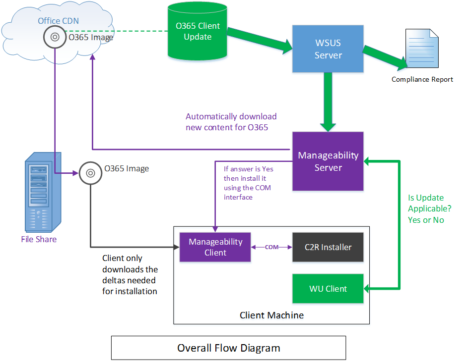

# <a name="integrating-manageability-applications-with-office-365-click-to-run-installer"></a><span data-ttu-id="85e01-103">使用 Office 365 即点即用安装程序的集成可管理性应用程序</span><span class="sxs-lookup"><span data-stu-id="85e01-103">Integrating manageability applications with Office 365 click-to-run installer</span></span>

<span data-ttu-id="85e01-104">了解如何使用软件管理解决方案集成 Office 365 单击以运行安装程序。</span><span class="sxs-lookup"><span data-stu-id="85e01-104">Learn how to integrate the Office 365 Click-to-Run installer with a software management solution.</span></span>
  
<span data-ttu-id="85e01-105">Office 365 单击以运行安装程序提供允许 IT 专业人员和软件管理解决方案进行编程控制更新管理的 COM 接口。</span><span class="sxs-lookup"><span data-stu-id="85e01-105">The Office 365 Click-to-Run installer provides a COM interface that allows IT Professionals and software management solutions programmatic control over update management.</span></span> <span data-ttu-id="85e01-106">此接口提供超出所提供的 Office 部署工具的其他管理功能。</span><span class="sxs-lookup"><span data-stu-id="85e01-106">This interface provides additional management capabilities beyond what is provided by the Office Deployment Tool.</span></span>
  
> [!NOTE]
> <span data-ttu-id="85e01-107">本文适用于 Office 2016 和更高版本，Office 365。</span><span class="sxs-lookup"><span data-stu-id="85e01-107">This article applies to Office 2016 and later, Office 365.</span></span> 
  
## <a name="integrating-with-the-click-to-run"></a><span data-ttu-id="85e01-108">单击运行集成</span><span class="sxs-lookup"><span data-stu-id="85e01-108">Integrating with the Click-to-Run</span></span>

<span data-ttu-id="85e01-109">若要使用此接口，可管理性应用程序调用 COM 接口和呼叫公开直接与单击即点即用安装服务进行通信的 Api。</span><span class="sxs-lookup"><span data-stu-id="85e01-109">To use this interface, a manageability application invokes the COM interface and calls exposed APIs that communicate directly with the Click-to-Run installation service.</span></span> 
  
> [!NOTE]
> <span data-ttu-id="85e01-110">单击以运行 Office 安装程序可以从命令行使用的参数运行可以控制的行为，在[单击即点即用 Office 部署工具](https://www.microsoft.com/en-us/download/details.aspx?id=49117)中所述。</span><span class="sxs-lookup"><span data-stu-id="85e01-110">The Office Click-to-Run installer can be run from the command-line with parameters that can control the behavior, as documented in [Office Deployment Tool for Click-to-Run](https://www.microsoft.com/en-us/download/details.aspx?id=49117).</span></span> 
  
<span data-ttu-id="85e01-111">**以下是 COM 接口的概念图**</span><span class="sxs-lookup"><span data-stu-id="85e01-111">**Following is a conceptual diagram of the COM interface**</span></span>

<span data-ttu-id="85e01-112"></span><span class="sxs-lookup"><span data-stu-id="85e01-112"></span></span>
  
<span data-ttu-id="85e01-113">Office 365 单击以运行安装程序的基于 COM 的实现接口**IUpdateNotify**注册到 CLSID **CLSID_UpdateNotifyObject**。</span><span class="sxs-lookup"><span data-stu-id="85e01-113">The Office 365 Click-to-Run installer implements a COM-based interface, **IUpdateNotify** registered to CLSID **CLSID_UpdateNotifyObject**.</span></span>
  
<span data-ttu-id="85e01-114">该接口可以调用，如下所示：</span><span class="sxs-lookup"><span data-stu-id="85e01-114">This interface can be invoked as follows:</span></span>
  
```cpp
hr = CoCreateInstance(CLSID_UpdateNotifyObject, NULL, CLSCTX_ALL,
       IID_IUpdateNotify, 
      (void **)&p); 
```

<span data-ttu-id="85e01-115">呼叫才会成功运行呼叫者所使用提升的权限，因为必须以提升的权限运行单击即点即用安装程序。</span><span class="sxs-lookup"><span data-stu-id="85e01-115">The call will only succeed if the caller is running under elevated privileges, as the Click-to-Run installation program must be run with elevated privileges.</span></span>
  
<span data-ttu-id="85e01-116">**IUpdateNotify** COM 接口将公开负责验证命令和参数和计划执行与单击即点即用安装服务三个异步函数。</span><span class="sxs-lookup"><span data-stu-id="85e01-116">The **IUpdateNotify** COM interface exposes three asynchronous functions responsible for validating the commands and parameters and scheduling execution with the Click-to-Run installation service.</span></span> 
  
```cpp
HRESULT Download([in] LPWSTR pcwszParameters) // Download update content.
HRESULT Apply([in] LPWSTR pcwszParameters) // Apply update content.
HRESULT Cancel() // Cancel the download action.

```

<span data-ttu-id="85e01-117">A 规定方法，**状态**，可用于获取的状态信息的上次执行的命令或当前正在执行命令 （即成功故障、 详细的错误代码） 的状态。</span><span class="sxs-lookup"><span data-stu-id="85e01-117">A forth method, **Status**, can be used to get information about the status of the last executed command or the status of the currently executing command (i.e. success, failure, detailed error codes).</span></span>
  
```cpp
HRESULT status([out] _UPDATE_STATUS_REPORT* pUpdateStatusReport) // Get status of current action. 
typedef struct _UPDATE_STATUS_REPORT  
{  
UPDATE_STATUS status;  
UINT error; 
BSTR contentid;  
} UPDATE_STATUS_REPORT;

```

<span data-ttu-id="85e01-118">共有四种状态单击即点即用安装服务可能位于在其生命周期期间可能会调用**IUpdateNotify**方法;重新启动，空闲，下载并应用。</span><span class="sxs-lookup"><span data-stu-id="85e01-118">There are four states that the Click-to-Run installation service may be in during its lifecycle, during which **IUpdateNotify** methods may be called; Rebooting, Idle, Downloading and Applying.</span></span> 
  
<span data-ttu-id="85e01-119">**以下是 COM 接口状态机关系图**</span><span class="sxs-lookup"><span data-stu-id="85e01-119">**Following is the COM Interface State Machine diagram**</span></span>

<span data-ttu-id="85e01-120"></span><span class="sxs-lookup"><span data-stu-id="85e01-120"></span></span>
  
> [!NOTE]
> <span data-ttu-id="85e01-121">**Rebooting**： 启动计算机时一段时间单击即点即用安装程序服务不可用。</span><span class="sxs-lookup"><span data-stu-id="85e01-121">**Rebooting**: When the machine is booting there is a period of time when the Click-to-Run installer service is not available.</span></span> <span data-ttu-id="85e01-122">成功调用后重新启动状态方法将返回 eUPDATE_UNKNOWN。</span><span class="sxs-lookup"><span data-stu-id="85e01-122">A successful call to the Status method after a reboot will return eUPDATE_UNKNOWN.</span></span> 
  
<span data-ttu-id="85e01-123">**空闲时间：** 当单击即点即用安装程序处于空闲状态时，您可以调用：</span><span class="sxs-lookup"><span data-stu-id="85e01-123">**Idle:** When the Click-to-Run installer is in the idle state, you can call:</span></span> 
  
- <span data-ttu-id="85e01-124">**应用**： 安装之前下载的内容。</span><span class="sxs-lookup"><span data-stu-id="85e01-124">**Apply**: Install previously downloaded content.</span></span>
    
- <span data-ttu-id="85e01-125">**取消**： 返回`0x800000e`，"调用的方法是在意外时间。"</span><span class="sxs-lookup"><span data-stu-id="85e01-125">**Cancel**: Returns  `0x800000e`, "A method was called at an unexpected time."</span></span>
    
- <span data-ttu-id="85e01-126">**下载**： 下载到客户端的更高版本安装的新内容。</span><span class="sxs-lookup"><span data-stu-id="85e01-126">**Download**: Downloads new content to the client for later installation.</span></span>
    
- <span data-ttu-id="85e01-127">**状态**： 如果操作结束中失败，则返回结果的最后一个已完成的操作或一条错误消息。</span><span class="sxs-lookup"><span data-stu-id="85e01-127">**Status**: Returns the result of the last completed action, or an error message if the action ended in failure.</span></span> <span data-ttu-id="85e01-128">如果没有上一操作，将返回**状态** `eUPDATE_UNKNOWN`。</span><span class="sxs-lookup"><span data-stu-id="85e01-128">If there is no previous action, **Status** returns  `eUPDATE_UNKNOWN`.</span></span>
    
<span data-ttu-id="85e01-129">**下载：** 下载状态单击即点即用安装程序后，您可以调用：</span><span class="sxs-lookup"><span data-stu-id="85e01-129">**Downloading:** When the Click-to-Run installer is in the downloading state, you can call:</span></span> 
  
- <span data-ttu-id="85e01-130">**应用**： 返回的值的**HRESULT** `0x800000e`，"调用的方法是在意外时间。"</span><span class="sxs-lookup"><span data-stu-id="85e01-130">**Apply**: Returns an **HRESULT** with the value  `0x800000e`, "A method was called at an unexpected time."</span></span>
    
- <span data-ttu-id="85e01-131">**取消**： 停止下载并删除部分下载的内容。</span><span class="sxs-lookup"><span data-stu-id="85e01-131">**Cancel**: Stops the download and removes the partially downloaded content.</span></span>
    
- <span data-ttu-id="85e01-132">**下载**： 返回的值的**HRESULT** `0x800000e`，"调用的方法是在意外时间。"</span><span class="sxs-lookup"><span data-stu-id="85e01-132">**Download**: Returns an **HRESULT** with the value  `0x800000e`, "A method was called at an unexpected time."</span></span> 
    
- <span data-ttu-id="85e01-133">**状态**： 返回**DOWNLOAD_WIP**来指示下载工作正在进行。</span><span class="sxs-lookup"><span data-stu-id="85e01-133">**Status**: Returns **DOWNLOAD_WIP** to indicate that download work is in progress.</span></span> 
    
<span data-ttu-id="85e01-134">**应用：** 当单击即点即用安装程序正在安装以前下载内容：</span><span class="sxs-lookup"><span data-stu-id="85e01-134">**Applying:** When the Click-to-Run installer is in the process of installing previously download content:</span></span> 
  
- <span data-ttu-id="85e01-135">**应用**： 返回的值的**HRESULT** `0x800000e`，"调用的方法是在意外时间。"</span><span class="sxs-lookup"><span data-stu-id="85e01-135">**Apply**: Returns an **HRESULT** with the value  `0x800000e`, "A method was called at an unexpected time."</span></span>
    
- <span data-ttu-id="85e01-136">**取消**： 返回`0x800000e`，不能取消应用操作。</span><span class="sxs-lookup"><span data-stu-id="85e01-136">**Cancel**: Returns  `0x800000e`, the Apply action cannot be canceled.</span></span>
    
- <span data-ttu-id="85e01-137">**下载**： 返回的值的**HRESULT** `0x800000e`，"调用的方法是在意外时间。"</span><span class="sxs-lookup"><span data-stu-id="85e01-137">**Download**: Returns an **HRESULT** with the value  `0x800000e`, "A method was called at an unexpected time."</span></span> 
    
- <span data-ttu-id="85e01-138">**状态**： 返回**APPLY_WIP**以指示的应用工作正在进行。</span><span class="sxs-lookup"><span data-stu-id="85e01-138">**Status**: Returns **APPLY_WIP** to indicate that apply work is in progress.</span></span> 
    
> [!NOTE]
> <span data-ttu-id="85e01-139">由于 OfficeC2RCOM 是 COM + 服务，并且是动态加载，您需要调用**CoCreateInstance**每次此类，以确保您得到的预期的结果上调用的方法。</span><span class="sxs-lookup"><span data-stu-id="85e01-139">Since OfficeC2RCOM is a COM+ service and is dynamically loaded, you need to call **CoCreateInstance** every time you call a method on this class to ensure that you get the expected result.</span></span> <span data-ttu-id="85e01-140">COM + 服务将处理根据需要创建的新实例。</span><span class="sxs-lookup"><span data-stu-id="85e01-140">The COM+ service will handle creating a new instance if necessary.</span></span> <span data-ttu-id="85e01-141">当第一次调用的方法之一时，COM + 将加载**IUpdateNotify**对象并运行一个 dllhost.exe 实例中。</span><span class="sxs-lookup"><span data-stu-id="85e01-141">When one of the methods is called for the first time, COM+ will load the **IUpdateNotify** object and run it within one of the dllhost.exe instances.</span></span> <span data-ttu-id="85e01-142">大约 3 分钟的空闲，新的对象将保持活动状态。</span><span class="sxs-lookup"><span data-stu-id="85e01-142">The new object will stay active for about 3 minutes in idle.</span></span> <span data-ttu-id="85e01-143">如果上次呼叫的三个分钟内进行后续呼叫， **IUpdateNotify**对象将保持加载，并且不创建一个新实例。</span><span class="sxs-lookup"><span data-stu-id="85e01-143">If a subsequent call is made within three minutes of the last call, the **IUpdateNotify** object will remain loaded and a new instance is not created.</span></span> <span data-ttu-id="85e01-144">如果没有呼叫由三个分钟内，将卸载 IUpdateNotify 对象，并进行下一次呼叫时，将创建一个新的**IUpdateNotify**对象。</span><span class="sxs-lookup"><span data-stu-id="85e01-144">If no call is made within three minutes, the IUpdateNotify object will be unloaded and a new **IUpdateNotify** object will be created when the next call is made.</span></span> 
  
## <a name="click-to-run-installer-com-api-reference-guide"></a><span data-ttu-id="85e01-145">单击即点即用安装程序 COM API 参考指南</span><span class="sxs-lookup"><span data-stu-id="85e01-145">Click-to-Run installer COM API reference guide</span></span>

<span data-ttu-id="85e01-146">在下面的 API 参考文档：</span><span class="sxs-lookup"><span data-stu-id="85e01-146">In the following API reference documentation:</span></span>
  
- <span data-ttu-id="85e01-147">参数在由空格分隔的键/值对格式。</span><span class="sxs-lookup"><span data-stu-id="85e01-147">Parameters are in a key/value pair format separated by a space.</span></span>
    
- <span data-ttu-id="85e01-148">参数不区分大小写。</span><span class="sxs-lookup"><span data-stu-id="85e01-148">The parameters are not case-sensitive.</span></span>
    
- <span data-ttu-id="85e01-149">没有可用的文档与[参数的列表](https://blogs.technet.microsoft.com/odsupport/2014/03/03/the-new-update-now-feature-for-office-2013-click-to-run-for-office365-and-its-associated-command-line-and-switches/)。</span><span class="sxs-lookup"><span data-stu-id="85e01-149">There is a [list of parameters](https://blogs.technet.microsoft.com/odsupport/2014/03/03/the-new-update-now-feature-for-office-2013-click-to-run-for-office365-and-its-associated-command-line-and-switches/) with documentation available.</span></span> 
    
- <span data-ttu-id="85e01-150">摘要 IUpdateNotify2 接口现包括。</span><span class="sxs-lookup"><span data-stu-id="85e01-150">Summary of IUpdateNotify2 interface is now included.</span></span>
    
### <a name="apply"></a><span data-ttu-id="85e01-151">Apply</span><span class="sxs-lookup"><span data-stu-id="85e01-151">Apply</span></span>

```cpp
HRESULT Apply([in] LPWSTR pcwszParameters) // Apply update content.
```

#### <a name="parameters"></a><span data-ttu-id="85e01-152">参数</span><span class="sxs-lookup"><span data-stu-id="85e01-152">Parameters</span></span>

-  <span data-ttu-id="85e01-153">_displaylevel_: **true**以显示安装状态，包括错误，在更新过程;**false**以隐藏错误，包括在更新过程中的安装状态。</span><span class="sxs-lookup"><span data-stu-id="85e01-153">_displaylevel_: **true** to show the installation status, including errors, during the update process; **false** to hide the installation status, including errors, during the update process.</span></span> <span data-ttu-id="85e01-154">默认值为 **false** 。</span><span class="sxs-lookup"><span data-stu-id="85e01-154">The default is **false**.</span></span>
    
-  <span data-ttu-id="85e01-155">_forceappshutdown_: **true**以强制关闭立即**应用**操作被触发; Office 应用程序**false**失败如果任何 Office 应用程序正在运行。</span><span class="sxs-lookup"><span data-stu-id="85e01-155">_forceappshutdown_: **true** to force Office applications to shut down immediately when the **Apply** action is triggered; **false** to fail if any Office applications are running.</span></span> <span data-ttu-id="85e01-156">默认值为 **false** 。</span><span class="sxs-lookup"><span data-stu-id="85e01-156">The default is **false**.</span></span> <span data-ttu-id="85e01-157">有关详细信息，请参阅[备注](#bk_ApplyRemark)。</span><span class="sxs-lookup"><span data-stu-id="85e01-157">See [Remarks](#bk_ApplyRemark) for more information.</span></span> 
    
  <span data-ttu-id="85e01-158">如果任何 Office 应用程序正在运行触发**应用**操作时，通常将失败**应用**操作。</span><span class="sxs-lookup"><span data-stu-id="85e01-158">If any Office application is running when the **Apply** action is triggered, the **Apply** action will usually fail.</span></span> <span data-ttu-id="85e01-159">传递`forceappshutdown=true`**应用**到方法将导致**OfficeClickToRun**服务若要立即关闭应用程序和应用更新。</span><span class="sxs-lookup"><span data-stu-id="85e01-159">Passing  `forceappshutdown=true` to the **Apply** method will cause the **OfficeClickToRun** service to immediately shut down the applications and apply the update.</span></span> <span data-ttu-id="85e01-160">在这种情况下，用户可能会遇到数据丢失。</span><span class="sxs-lookup"><span data-stu-id="85e01-160">The user may experience data loss in this case.</span></span> 
    
#### <a name="return-results"></a><span data-ttu-id="85e01-161">返回的结果</span><span class="sxs-lookup"><span data-stu-id="85e01-161">Return results</span></span>

|||
|:-----|:-----|
|<span data-ttu-id="85e01-162">**S_OK**</span><span class="sxs-lookup"><span data-stu-id="85e01-162">**S_OK**</span></span> <br/> |<span data-ttu-id="85e01-163">操作已成功提交到执行的即点即单击服务。</span><span class="sxs-lookup"><span data-stu-id="85e01-163">Action was successfully submitted to the Click-To-Run service for execution.</span></span>  <br/> |
|<span data-ttu-id="85e01-164">**E_ACCESSDENIED**</span><span class="sxs-lookup"><span data-stu-id="85e01-164">**E_ACCESSDENIED**</span></span> <br/> |<span data-ttu-id="85e01-165">呼叫者未使用提升的权限运行。</span><span class="sxs-lookup"><span data-stu-id="85e01-165">The caller is not running with elevated privileges.</span></span>  <br/> |
|<span data-ttu-id="85e01-166">**E_INVALIDARG**</span><span class="sxs-lookup"><span data-stu-id="85e01-166">**E_INVALIDARG**</span></span> <br/> |<span data-ttu-id="85e01-167">无效的参数传递。</span><span class="sxs-lookup"><span data-stu-id="85e01-167">Invalid parameters were passed.</span></span>  <br/> |
|<span data-ttu-id="85e01-168">**E_ILLEGAL_METHOD_CALL**</span><span class="sxs-lookup"><span data-stu-id="85e01-168">**E_ILLEGAL_METHOD_CALL**</span></span> <br/> |<span data-ttu-id="85e01-169">此时不允许操作。</span><span class="sxs-lookup"><span data-stu-id="85e01-169">Action is not allowed at this time.</span></span> <span data-ttu-id="85e01-170">有关详细信息，请参阅[备注](#bk_ApplyRemark)。</span><span class="sxs-lookup"><span data-stu-id="85e01-170">See [Remarks](#bk_ApplyRemark) for more information.</span></span>  <br/> |

<a name="bk_ApplyRemark"></a>

#### <a name="remarks"></a><span data-ttu-id="85e01-171">说明</span><span class="sxs-lookup"><span data-stu-id="85e01-171">Remarks</span></span>

- <span data-ttu-id="85e01-172">如果任何 Office 应用程序正在运行时将触发**应用**操作，则**应用**操作将失败。</span><span class="sxs-lookup"><span data-stu-id="85e01-172">If any Office application is running when the **Apply** action is triggered, the **Apply** action will fail.</span></span> <span data-ttu-id="85e01-173">传递`forceappshutdown=true`**应用**到方法将导致**OfficeClickToRun**服务若要立即关闭任何 Office 应用程序正在运行并应用更新。</span><span class="sxs-lookup"><span data-stu-id="85e01-173">Passing  `forceappshutdown=true` to the **Apply** method will cause the **OfficeClickToRun** service to immediately shut down any Office applications that are running and apply the update.</span></span> <span data-ttu-id="85e01-174">用户可能会遇到数据，它们不提示保存对打开的文档的更改。.</span><span class="sxs-lookup"><span data-stu-id="85e01-174">The user may experience data as they are not prompted to save changes to open documents..</span></span> 
    
- <span data-ttu-id="85e01-175">此操作只能触发 COM 状态时下列选项之一：</span><span class="sxs-lookup"><span data-stu-id="85e01-175">This action can only be triggered when the COM status is one of the following:</span></span> 
    
  - <span data-ttu-id="85e01-176">**eUPDATE_UNKNOWN**</span><span class="sxs-lookup"><span data-stu-id="85e01-176">**eUPDATE_UNKNOWN**</span></span>
    
  - <span data-ttu-id="85e01-177">**eDOWNLOAD_CANCELLED**</span><span class="sxs-lookup"><span data-stu-id="85e01-177">**eDOWNLOAD_CANCELLED**</span></span>
    
  - <span data-ttu-id="85e01-178">**eDOWNLOAD_FAILED**</span><span class="sxs-lookup"><span data-stu-id="85e01-178">**eDOWNLOAD_FAILED**</span></span>
    
  - <span data-ttu-id="85e01-179">**eDOWNLOAD_SUCCEEDED**</span><span class="sxs-lookup"><span data-stu-id="85e01-179">**eDOWNLOAD_SUCCEEDED**</span></span>
    
  - <span data-ttu-id="85e01-180">**eAPPLY_SUCCEEDED**</span><span class="sxs-lookup"><span data-stu-id="85e01-180">**eAPPLY_SUCCEEDED**</span></span>
    
  - <span data-ttu-id="85e01-181">**eAPPLY_FAILED**</span><span class="sxs-lookup"><span data-stu-id="85e01-181">**eAPPLY_FAILED**</span></span>
    
- <span data-ttu-id="85e01-182">如果不以前下载内容的情况下调用**Apply**方法， **Apply**方法将报告**成功**，因为它检测到任何应用并成功地完成**应用**过程。</span><span class="sxs-lookup"><span data-stu-id="85e01-182">If you call the **Apply** method without previously downloading content, the **Apply** method will report **Succeeded** as it detected nothing to apply and completed the **Apply** process successfully.</span></span> 
    
### <a name="cancel"></a><span data-ttu-id="85e01-183">Cancel</span><span class="sxs-lookup"><span data-stu-id="85e01-183">Cancel</span></span>

```cpp
HRESULT Cancel() // Cancel the download action.
```

#### <a name="return-results"></a><span data-ttu-id="85e01-184">返回的结果</span><span class="sxs-lookup"><span data-stu-id="85e01-184">Return results</span></span>

|||
|:-----|:-----|
|<span data-ttu-id="85e01-185">S_OK</span><span class="sxs-lookup"><span data-stu-id="85e01-185">S_OK</span></span>  <br/> |<span data-ttu-id="85e01-186">操作已成功提交到执行的即点即单击服务。</span><span class="sxs-lookup"><span data-stu-id="85e01-186">Action was successfully submitted to the Click-to-Run service for execution.</span></span>  <br/> |
|<span data-ttu-id="85e01-187">E_ILLEGAL_METHOD_CALL</span><span class="sxs-lookup"><span data-stu-id="85e01-187">E_ILLEGAL_METHOD_CALL</span></span>  <br/> |<span data-ttu-id="85e01-188">此时不允许操作。</span><span class="sxs-lookup"><span data-stu-id="85e01-188">Action is not allowed at this time.</span></span> <span data-ttu-id="85e01-189">请参阅[备注](#bk_CancelRemarks)部分的详细信息</span><span class="sxs-lookup"><span data-stu-id="85e01-189">See the [Remarks](#bk_CancelRemarks) section for more information</span></span>  <br/> |

<a name="bk_CancelRemarks"></a>

#### <a name="remarks"></a><span data-ttu-id="85e01-190">说明</span><span class="sxs-lookup"><span data-stu-id="85e01-190">Remarks</span></span>

- <span data-ttu-id="85e01-191">此方法仅可触发何时 COM 状态 id **eDOWNLOAD_WIP**。</span><span class="sxs-lookup"><span data-stu-id="85e01-191">This method can only be triggered when the COM status id **eDOWNLOAD_WIP**.</span></span> <span data-ttu-id="85e01-192">它将尝试取消当前下载操作。</span><span class="sxs-lookup"><span data-stu-id="85e01-192">It will attempt to cancel the current download action.</span></span> <span data-ttu-id="85e01-193">COM 状态将更改为**eDOWNLOAD_CANCELLING**和最终更改为**eDOWNLOAD_CANCELED**。</span><span class="sxs-lookup"><span data-stu-id="85e01-193">The COM status will change to **eDOWNLOAD_CANCELLING** and eventually change to **eDOWNLOAD_CANCELED**.</span></span> <span data-ttu-id="85e01-194">如果在其他任何时间触发，COM 状态将返回**E_ILLEGAL_METHOD_CALL** 。</span><span class="sxs-lookup"><span data-stu-id="85e01-194">The COM status will return **E_ILLEGAL_METHOD_CALL** if triggered at any other time.</span></span> 
    
### <a name="download"></a><span data-ttu-id="85e01-195">下载</span><span class="sxs-lookup"><span data-stu-id="85e01-195">Download</span></span>

```cpp
HRESULT Download([in] LPWSTR pcwszParameters) // Download update content.
```

#### <a name="parameters"></a><span data-ttu-id="85e01-196">参数</span><span class="sxs-lookup"><span data-stu-id="85e01-196">Parameters</span></span>

-  <span data-ttu-id="85e01-197">_displaylevel_: **true**以显示安装状态，包括错误，在更新过程;**false**以隐藏错误，包括在更新过程中的安装状态。</span><span class="sxs-lookup"><span data-stu-id="85e01-197">_displaylevel_: **true** to show the installation status, including errors, during the update process; **false** to hide the installation status, including errors, during the update process.</span></span> <span data-ttu-id="85e01-198">默认值为 **false** 。</span><span class="sxs-lookup"><span data-stu-id="85e01-198">The default is **false**.</span></span>
    
-  <span data-ttu-id="85e01-199">_updatebaseurl_： 备用下载源的 URL。</span><span class="sxs-lookup"><span data-stu-id="85e01-199">_updatebaseurl_: URL to the alternate download source.</span></span>
    
-  <span data-ttu-id="85e01-200">_updatetoversion_： 要更新到 Office 的版本。</span><span class="sxs-lookup"><span data-stu-id="85e01-200">_updatetoversion_: The version to update Office to.</span></span> <span data-ttu-id="85e01-201">定义此参数，如果您想要更新为比当前安装的版本较早版本。</span><span class="sxs-lookup"><span data-stu-id="85e01-201">Define this parameter if you want to update to an older version than the version that is currently installed.</span></span>
    
-  <span data-ttu-id="85e01-202">_downloadsource_： 自定义**IBackgroundCopyManager**实现 （位经理） 的 CLSID。</span><span class="sxs-lookup"><span data-stu-id="85e01-202">_downloadsource_: CLSID of the customized **IBackgroundCopyManager** implementation (BITS manager).</span></span> 
    
-  <span data-ttu-id="85e01-203">_contentid_： 标识要从自定义位经理通过内容服务器下载的内容。</span><span class="sxs-lookup"><span data-stu-id="85e01-203">_contentid_: Identifies the content to download from the content server through the customized BITS manager.</span></span> <span data-ttu-id="85e01-204">此值被通过 interpretation 的位界面。</span><span class="sxs-lookup"><span data-stu-id="85e01-204">This value is passed through the BITS interface for interpretation.</span></span>
    
#### <a name="return-results"></a><span data-ttu-id="85e01-205">返回的结果</span><span class="sxs-lookup"><span data-stu-id="85e01-205">Return results</span></span>

|||
|:-----|:-----|
|<span data-ttu-id="85e01-206">**S_OK**</span><span class="sxs-lookup"><span data-stu-id="85e01-206">**S_OK**</span></span> <br/> |<span data-ttu-id="85e01-207">操作已成功提交到执行的即点即单击服务。</span><span class="sxs-lookup"><span data-stu-id="85e01-207">Action was successfully submitted to the Click-To-Run service for execution.</span></span>  <br/> |
|<span data-ttu-id="85e01-208">**E_ACCESSDENIED**</span><span class="sxs-lookup"><span data-stu-id="85e01-208">**E_ACCESSDENIED**</span></span> <br/> |<span data-ttu-id="85e01-209">呼叫者未使用提升的权限运行。</span><span class="sxs-lookup"><span data-stu-id="85e01-209">The caller is not running with elevated privileges.</span></span>  <br/> |
|<span data-ttu-id="85e01-210">**E_INVALIDARG**</span><span class="sxs-lookup"><span data-stu-id="85e01-210">**E_INVALIDARG**</span></span> <br/> |<span data-ttu-id="85e01-211">无效的参数传递。</span><span class="sxs-lookup"><span data-stu-id="85e01-211">Invalid parameters were passed.</span></span>  <br/> |
|<span data-ttu-id="85e01-212">**E_ILLEGAL_METHOD_CALL**</span><span class="sxs-lookup"><span data-stu-id="85e01-212">**E_ILLEGAL_METHOD_CALL**</span></span> <br/> |<span data-ttu-id="85e01-213">此时不允许操作。</span><span class="sxs-lookup"><span data-stu-id="85e01-213">Action is not allowed at this time.</span></span> <span data-ttu-id="85e01-214">有关详细信息，请参阅[备注](#bk_DownloadRemark)。</span><span class="sxs-lookup"><span data-stu-id="85e01-214">See [Remarks](#bk_DownloadRemark) for more information.</span></span>  <br/> |

<a name="bk_DownloadRemark"></a>

#### <a name="remarks"></a><span data-ttu-id="85e01-215">说明</span><span class="sxs-lookup"><span data-stu-id="85e01-215">Remarks</span></span>

- <span data-ttu-id="85e01-216">您必须作为对指定_downloadsource_和_contentid_ 。</span><span class="sxs-lookup"><span data-stu-id="85e01-216">You must specify  _downloadsource_ and  _contentid_ as a pair.</span></span> <span data-ttu-id="85e01-217">如果没有，请**下载**方法将返回**E_INVALIDARG**错误。</span><span class="sxs-lookup"><span data-stu-id="85e01-217">If not, the **Download** method will return an **E_INVALIDARG** error.</span></span> 
    
- <span data-ttu-id="85e01-218">如果提供了_downloadsource_、 _contentid_和_updatebaseurl_ ， _updatebaseurl_将被忽略。</span><span class="sxs-lookup"><span data-stu-id="85e01-218">If  _downloadsource_,  _contentid_, and  _updatebaseurl_ are provided,  _updatebaseurl_ will be ignored.</span></span> 
    
- <span data-ttu-id="85e01-219">此操作只能触发 COM 状态时下列选项之一：</span><span class="sxs-lookup"><span data-stu-id="85e01-219">This action can only be triggered when the COM status is one of the following:</span></span> 
    
  - <span data-ttu-id="85e01-220">**eUPDATE_UNKNOWN**</span><span class="sxs-lookup"><span data-stu-id="85e01-220">**eUPDATE_UNKNOWN**</span></span>
    
  - <span data-ttu-id="85e01-221">**eDOWNLOAD_CANCELLED**</span><span class="sxs-lookup"><span data-stu-id="85e01-221">**eDOWNLOAD_CANCELLED**</span></span>
    
  - <span data-ttu-id="85e01-222">**eDOWNLOAD_FAILED**</span><span class="sxs-lookup"><span data-stu-id="85e01-222">**eDOWNLOAD_FAILED**</span></span>
    
  - <span data-ttu-id="85e01-223">**eDOWNLOAD_SUCCEEDED**</span><span class="sxs-lookup"><span data-stu-id="85e01-223">**eDOWNLOAD_SUCCEEDED**</span></span>
    
  - <span data-ttu-id="85e01-224">**eAPPLY_SUCCEEDED**</span><span class="sxs-lookup"><span data-stu-id="85e01-224">**eAPPLY_SUCCEEDED**</span></span>
    
  - <span data-ttu-id="85e01-225">**eAPPLY_FAILED**</span><span class="sxs-lookup"><span data-stu-id="85e01-225">**eAPPLY_FAILED**</span></span>
    
- <span data-ttu-id="85e01-226">如果调用不带以前下载内容**Apply**方法时， **Apply**方法将报告**成功**，因为它检测到任何应用并成功地完成**应用**过程。</span><span class="sxs-lookup"><span data-stu-id="85e01-226">If you call the **Apply** method without previously downloaded content, the **Apply** method will report **Succeeded** as it detected nothing to apply and completed the **Apply** process successfully.</span></span> 
    
#### <a name="examples"></a><span data-ttu-id="85e01-227">示例</span><span class="sxs-lookup"><span data-stu-id="85e01-227">Examples</span></span>

- <span data-ttu-id="85e01-228">若要从自定义的位经理下载内容： 调用**download()** 函数传递以下参数：</span><span class="sxs-lookup"><span data-stu-id="85e01-228">To download the content from the customized BITS manager: Call the **download()** function passing the following parameters:</span></span> 
    
  ```cpp
  "downloadsource=CLSIDofBITSInterface contentid=BITSServerContentIdentifier"
  ```

- <span data-ttu-id="85e01-229">若要下载 Microsoft CDN 中的内容： 在不指定_downloadsource_、 _contentid_或_updatebaseurl_参数的情况下调用**download()** 函数。</span><span class="sxs-lookup"><span data-stu-id="85e01-229">To download the content from the Microsoft CDN: Call the **download()** function without specifying the  _downloadsource_,  _contentid_, or  _updatebaseurl_ parameters.</span></span> 
    
- <span data-ttu-id="85e01-230">若要从自定义位置下载内容： 调用**download()** 函数传递以下参数：</span><span class="sxs-lookup"><span data-stu-id="85e01-230">To download the content from a customized location: Call the **download()** function passing the following parameter:</span></span> 
    
  ```cpp
  "updatebaseurl=yourcontentserverurl"
  ```

### <a name="status"></a><span data-ttu-id="85e01-231">Status</span><span class="sxs-lookup"><span data-stu-id="85e01-231">Status</span></span>

```cpp
typdef struct _UPDATE_STATUS_REPORT
{
    UPDATE_STATUS status;
    UINT error;
    LPCWSTR contentid;
}UPDATE_STATUS_REPORT;
HRESULT status([out] _UPDATE_STATUS_REPORT& pUpdateStatusReport) // Get status of current action
```

#### <a name="parameters"></a><span data-ttu-id="85e01-232">参数</span><span class="sxs-lookup"><span data-stu-id="85e01-232">Parameters</span></span>

|||
|:-----|:-----|
| <span data-ttu-id="85e01-233">_pUpdateStatusReport_</span><span class="sxs-lookup"><span data-stu-id="85e01-233">_pUpdateStatusReport_</span></span> <br/> |<span data-ttu-id="85e01-234">指向 UPDATE_STATUS_REPORT 结构。</span><span class="sxs-lookup"><span data-stu-id="85e01-234">Pointer to an UPDATE_STATUS_REPORT structure.</span></span>  <br/> |
   
#### <a name="return-results"></a><span data-ttu-id="85e01-235">返回的结果</span><span class="sxs-lookup"><span data-stu-id="85e01-235">Return results</span></span>

|||
|:-----|:-----|
|<span data-ttu-id="85e01-236">**S_OK**</span><span class="sxs-lookup"><span data-stu-id="85e01-236">**S_OK**</span></span> <br/> |<span data-ttu-id="85e01-237">**状态**方法始终返回此结果。</span><span class="sxs-lookup"><span data-stu-id="85e01-237">The **Status** method always returns this result.</span></span> <span data-ttu-id="85e01-238">检查`UPDATE_STATUS_RESULT`的当前操作状态的结构。</span><span class="sxs-lookup"><span data-stu-id="85e01-238">Inspect the  `UPDATE_STATUS_RESULT` structure for the status of the current action.</span></span>  <br/> |
   
#### <a name="remarks"></a><span data-ttu-id="85e01-239">说明</span><span class="sxs-lookup"><span data-stu-id="85e01-239">Remarks</span></span>

- <span data-ttu-id="85e01-240">状态字段中的`UPDATE_STATUS_REPORT`包含当前操作的状态。</span><span class="sxs-lookup"><span data-stu-id="85e01-240">The status field of the  `UPDATE_STATUS_REPORT` contains the status of the current action.</span></span> <span data-ttu-id="85e01-241">返回下的状态值之一：</span><span class="sxs-lookup"><span data-stu-id="85e01-241">One of the following status values is returned:</span></span> 
    
  ```cpp
  typedef enum _UPDATE_STATUS
  {
  eUPDATE_UNKNOWN = 0,
  eDOWNLOAD_PENDING,
  eDOWNLOAD_WIP,
  eDOWNLOAD_CANCELLING,
  eDOWNLOAD_CANCELLED,
  eDOWNLOAD_FAILED,
  eDOWNLOAD_SUCCEEDED,
  eAPPLY_PENDING,
  eAPPLY_WIP,
  eAPPLY_SUCCEEDED,
  eAPPLY_FAILED,
  } UPDATE_STATUS;
  
  ```

- <span data-ttu-id="85e01-242">如果的最后一个命令将导致出错错误字段中的`UPDATE_STATUS_REPORT`包含有关错误的详细的信息。</span><span class="sxs-lookup"><span data-stu-id="85e01-242">If the last command resulted in an error, the error field of the  `UPDATE_STATUS_REPORT` contains detailed information about the error.</span></span> <span data-ttu-id="85e01-243">从**状态**方法返回的错误代码的两种类型。</span><span class="sxs-lookup"><span data-stu-id="85e01-243">Two types of error codes are returned from the **Status** method.</span></span> 
    
- <span data-ttu-id="85e01-244">如果错误小于`UDPATE_ERROR_CODE::eUNKNOWN`，错误是预定义的错误代码之一：</span><span class="sxs-lookup"><span data-stu-id="85e01-244">If the error less than  `UDPATE_ERROR_CODE::eUNKNOWN`, the error is one of the following pre-defined error codes:</span></span>
    
  ```cpp
  typedef enum _UPDATE_ERROR_CODE
  {
  eOK = 0,
  eFAILED_UNEXPECTED,
  eTRIGGER_DISABLED,
  ePIPELINE_IN_USE,
  eFAILED_STOP_C2RSERVICE,
  eFAILED_GET_CLIENTUPDATEFOLDER,
  eFAILED_LOCK_PACKAGE_TO_UPDATE,
  eFAILED_CREATE_STREAM_SESSION,
  eFAILED_PUBLISH_WORKING_CONFIGURATION,
  eFAILED_DOWNLOAD_UPGRADE_PACKAGE,
  eFAILED_APPLY_UPGRADE_PACKAGE,
  eFAILED_INITIALIZE_RSOD,
  eFAILED_PUBLISH_RSOD,
  // Keep this one as the last
  eUNKNOWN
  } UPDATE_ERROR_CODE;
  
  ```

  <span data-ttu-id="85e01-245">如果返回的错误代码大于`UDPATE_ERROR_CODE::eUNKNOWN`它是**HRESULT**的失败的函数调用。</span><span class="sxs-lookup"><span data-stu-id="85e01-245">If the return error code is larger than  `UDPATE_ERROR_CODE::eUNKNOWN` it is the **HRESULT** of a failed function call.</span></span> <span data-ttu-id="85e01-246">提取 HRESULT 减去`UDPATE_ERROR_CODE::eUNKNOWN`的错误字段中返回的值从`UPDATE_STATUS_REPORT`。</span><span class="sxs-lookup"><span data-stu-id="85e01-246">To extract the HRESULT subtract  `UDPATE_ERROR_CODE::eUNKNOWN` from the value returned in the error field of the  `UPDATE_STATUS_REPORT`.</span></span>
    
  <span data-ttu-id="85e01-247">可以通过检查**IUpdateNotify**类型库中 OfficeC2RCom.dll 嵌入查看的状态和错误信息值的完整列表。</span><span class="sxs-lookup"><span data-stu-id="85e01-247">The complete list of status and error values can be viewed by inspecting the **IUpdateNotify** type library embedded in OfficeC2RCom.dll.</span></span> 
    
- <span data-ttu-id="85e01-248">**下载**已启动并返回传递给**下载**呼叫 contentid 之后，contentid 字段用于呼叫**状态**。</span><span class="sxs-lookup"><span data-stu-id="85e01-248">The contentid field is used for calls to **Status** after **Download** has initiated and returns the contentid that was passed in to the **Download** call.</span></span> <span data-ttu-id="85e01-249">它是一种最佳做法之前调用**状态**方法，然后检查的值之后在返回**状态**初始化此字段为**null** 。</span><span class="sxs-lookup"><span data-stu-id="85e01-249">It is a best practice to initialize this field to **null** before you call the **Status** method and then check the value after **Status** has been returned.</span></span> <span data-ttu-id="85e01-250">如果值仍为**空**，这意味着不没有返回任何 contentid。</span><span class="sxs-lookup"><span data-stu-id="85e01-250">If the value is still **null**, that means there is no contentid to return.</span></span> <span data-ttu-id="85e01-251">如果值不为**null**，则需要忙与**SysFreeString()** 调用。</span><span class="sxs-lookup"><span data-stu-id="85e01-251">If the value is not **null**, you need to free it with a call to **SysFreeString()**.</span></span> <span data-ttu-id="85e01-252">下面是如何**下载**后调用**状态**代码段。</span><span class="sxs-lookup"><span data-stu-id="85e01-252">Here is a code snippet of how to call **Status** after **Download**.</span></span>
    
  ```cpp
  std::wstring contentID;
  UPDATE_STATUS_REPORT statusReport;
  statusReport.status = eUPDATE_UNKNOWN;
  statusReport.error = eOK;
  statusReport.contentid = NULL;
  hr = p->Status(&statusReport);
  if (statusReport.contentid != NULL)
  {
  contentID = statusReport.contentid;
  SysFreeString(statusReport.contentid);
  }
  wprintf(L"ContentID: %s, Status: %d, LastError: %d", contentID.c_str(), statusReport.status, statusReport.error);
  
  ```

### <a name="summary-of-iupdatenotify2-interface"></a><span data-ttu-id="85e01-253">IUpdateNotify2 接口的摘要。</span><span class="sxs-lookup"><span data-stu-id="85e01-253">Summary of IUpdateNotify2 interface</span></span>

> [!NOTE]
> <span data-ttu-id="85e01-254">这段摘要是为[Integrating 可管理性与 Office 365 即点即用安装程序的应用程序](https://msdn.microsoft.com/EN-US/library/office/mt608768.aspx)提供补充信息。</span><span class="sxs-lookup"><span data-stu-id="85e01-254">This summary is provided as a compliment info to [Integrating manageability applications with the Office 365 click-to-run installer](https://msdn.microsoft.com/EN-US/library/office/mt608768.aspx).</span></span> <span data-ttu-id="85e01-255">一旦公共 doc 进行了更新，此 doc 可以被视为为已过时。</span><span class="sxs-lookup"><span data-stu-id="85e01-255">Once the public doc is updated, this doc can be considered as obsolete.</span></span> 
  
<span data-ttu-id="85e01-256">从 C2RTenant [16.0.8208.6352](http://oloop/BuildGroup/Details/tenantc2rclient#3519/1255278) (第一个公开生成应年 6 月分叉生成-8326.\*) 我们已添加新的**IUpdateNotify2**接口。</span><span class="sxs-lookup"><span data-stu-id="85e01-256">From C2RTenant [16.0.8208.6352](http://oloop/BuildGroup/Details/tenantc2rclient#3519/1255278) (First publicly available build should be June fork build -- 8326.\*) we have added a new **IUpdateNotify2** interface.</span></span> <span data-ttu-id="85e01-257">下面是一些有关此接口的基本信息：</span><span class="sxs-lookup"><span data-stu-id="85e01-257">Here is some basic info about this interface:</span></span> 
  
- <span data-ttu-id="85e01-258">CLSID_UpdateNotifyObject2，{52C2F9C2-F1AC-4021-BF50-756A5FA8DDFE}</span><span class="sxs-lookup"><span data-stu-id="85e01-258">CLSID_UpdateNotifyObject2, {52C2F9C2-F1AC-4021-BF50-756A5FA8DDFE}</span></span>
    
- <span data-ttu-id="85e01-259">此接口还承载着原始 IUpdateNotify 接口提供向后兼容性。</span><span class="sxs-lookup"><span data-stu-id="85e01-259">This interface also hosted the original IUpdateNotify interface to provide backward compatibility.</span></span> <span data-ttu-id="85e01-260">这意味着，如果您使用此接口，您有权访问所有**UpdateNotifyObject**界面中提供的方法。</span><span class="sxs-lookup"><span data-stu-id="85e01-260">Which means if you use this interface, you have access to all the methods provided in **UpdateNotifyObject** interface.</span></span> 
    
- <span data-ttu-id="85e01-261">添加到 IUpdateNotify2 的新方法：</span><span class="sxs-lookup"><span data-stu-id="85e01-261">New methods added to IUpdateNotify2:</span></span>
    
  - <span data-ttu-id="85e01-262">**HRESULT**GetBlockingApps ([输出] BSTR \* AppsList)。</span><span class="sxs-lookup"><span data-stu-id="85e01-262">**HRESULT** GetBlockingApps([out] BSTR \* AppsList).</span></span> <span data-ttu-id="85e01-263">获取更新阻止应用程序列表。</span><span class="sxs-lookup"><span data-stu-id="85e01-263">Get updates blocking apps list.</span></span> <span data-ttu-id="85e01-264">此呼叫将返回运行 Office 应用程序，其中将阻止继续从的更新过程。</span><span class="sxs-lookup"><span data-stu-id="85e01-264">This call will return running Office apps which will block the update process from proceeding.</span></span> 
    
  - <span data-ttu-id="85e01-265">**HRESULT**GetOfficeDeploymentData ([in] int 数据类型，[in]**一个 lpcwstr，** pcwszName，[out] BSTR \* OfficeData)。</span><span class="sxs-lookup"><span data-stu-id="85e01-265">**HRESULT** GetOfficeDeploymentData([in] int dataType, [in] **LPCWSTR** pcwszName, [out] BSTR \* OfficeData).</span></span> <span data-ttu-id="85e01-266">获取 Office 部署数据。</span><span class="sxs-lookup"><span data-stu-id="85e01-266">Get Office deployment Data.</span></span> 
    
- <span data-ttu-id="85e01-267">如果您想要使用的新方法，则需要以确保：</span><span class="sxs-lookup"><span data-stu-id="85e01-267">If you want to use the new methods, you need to make sure:</span></span>
    
  - <span data-ttu-id="85e01-268">是您 C2R 版本比上述生成高 (\>= 年 6 月分叉生成)。</span><span class="sxs-lookup"><span data-stu-id="85e01-268">Your C2R version is newer than the above build (\>= June fork build).</span></span>
    
  - <span data-ttu-id="85e01-269">使用 UpdateNotifyObject2，而不是**UpdateNotifyObject**调用**CoCreateInstance**。</span><span class="sxs-lookup"><span data-stu-id="85e01-269">Use UpdateNotifyObject2, instead of **UpdateNotifyObject** to call **CoCreateInstance**.</span></span>
    
<span data-ttu-id="85e01-270">如果您不使用任何新方法，您无需更改任何内容。</span><span class="sxs-lookup"><span data-stu-id="85e01-270">If you don't use any of the new methods, you don't need to change anything.</span></span> <span data-ttu-id="85e01-271">所有现有方法将用作确切与之前相同的方式。</span><span class="sxs-lookup"><span data-stu-id="85e01-271">All the existing methods will work as exact the same way as before.</span></span>
  
## <a name="implementing-the-bits-interface"></a><span data-ttu-id="85e01-272">实现位接口</span><span class="sxs-lookup"><span data-stu-id="85e01-272">Implementing the BITS interface</span></span>

<span data-ttu-id="85e01-273">[后台智能传输服务](https://msdn.microsoft.com/en-us/library/bb968799(v=vs.85).aspx)(BITS) 是由 Microsoft 客户端和服务器之间传输文件提供服务。</span><span class="sxs-lookup"><span data-stu-id="85e01-273">The [Background Intelligent Transfer Service](https://msdn.microsoft.com/en-us/library/bb968799(v=vs.85).aspx) (BITS) is a service provided by Microsoft to transfer files between a client and server.</span></span> <span data-ttu-id="85e01-274">单击以运行 Office 安装程序可用于下载内容的通道之一位。</span><span class="sxs-lookup"><span data-stu-id="85e01-274">BITS is one of the channels that Office Click-To-Run installer can use to download content.</span></span> <span data-ttu-id="85e01-275">默认情况下，单击以运行 Office 安装程序使用 Windows 的生成实现位 CDN 中下载内容中。</span><span class="sxs-lookup"><span data-stu-id="85e01-275">By default, the Office Click-To-Run installer uses the Windows' built in implementation of BITS to download the content from the CDN.</span></span> 
  
<span data-ttu-id="85e01-276">通过提供**IUpdateNotify**接口的自定义的位实现**download()** 方法，您可管理性软件可以控制客户端在何处以及如何下载内容。</span><span class="sxs-lookup"><span data-stu-id="85e01-276">By providing a customized BITS implementation to the **download()** method of the **IUpdateNotify** interface, your manageability software can control where and how the client downloads the content.</span></span> <span data-ttu-id="85e01-277">提供内置的单击即点即用的通道，如 Office CDN，IIS 服务器之外的自定义内容分发通道时有用的自定义的位界面或文件共享。</span><span class="sxs-lookup"><span data-stu-id="85e01-277">A customized BITS interface is useful when providing a custom content distribution channel other than the Click-to-Run built-in channels, such as the Office CDN, IIS servers, or file shares.</span></span> 
  
<span data-ttu-id="85e01-278">自定义的位接口来处理 Office C2R 服务的最低要求是：</span><span class="sxs-lookup"><span data-stu-id="85e01-278">The minimum requirement for a customized BITS interface to work with Office C2R service is:</span></span>
  
- <span data-ttu-id="85e01-279">为**IBackgroundCopyManager**:</span><span class="sxs-lookup"><span data-stu-id="85e01-279">For **IBackgroundCopyManager**:</span></span>
    
  ```cpp
  HRESULT _stdcall CreateJob(
                      [in] LPWSTR DisplayName, 
                      [in] BG_JOB_TYPE Type, 
                      [out] GUID* pJobId, 
                      [out] IBackgroundCopyJob** ppJob)
  HRESULT _stdcall GetJob(
                      [in] GUID* jobID, 
                      [out] IBackgroundCopyJob** ppJob)
  HRESULT _stdcall EnumJobs(
                      [in] unsigned long dwFlags, 
                      [out] IEnumBackgroundCopyJobs** ppenum)
  
  ```

- <span data-ttu-id="85e01-280">为**IBackgroundCopyJob**:</span><span class="sxs-lookup"><span data-stu-id="85e01-280">For **IBackgroundCopyJob**:</span></span>
    
  ```cpp
  HRESULT _stdcall AddFile(
                      [in] LPWSTR RemoteUrl, 
                      [in] LPWSTR LocalName)
  HRESULT _stdcall Resume()
  HRESULT _stdcall Complete()
  HRESULT _stdcall Cancel();
  HRESULT _stdcall GetState([out] BG_JOB_STATE* pVal);
  HRESULT GetProgress( [out] BG_JOB_PROGRESS *pProgress);
  
  ```

- <span data-ttu-id="85e01-281">为**IBackgroundCopyJob3**:</span><span class="sxs-lookup"><span data-stu-id="85e01-281">For **IBackgroundCopyJob3**:</span></span>
    
  ```cpp
  HRESULT _stdcall AddFileWithRanges(
                      [in] LPWSTR RemoteUrl, 
                      [in] LPWSTR LocalName,
                      [in] DWORD RangeCount,
                      [in] BG_FILE_RANGE Ranges[])
  
  ```

- <span data-ttu-id="85e01-282">为`Addfile`和`AddFileWithRanges`功能，远程 URL 时采用以下格式：</span><span class="sxs-lookup"><span data-stu-id="85e01-282">For the  `Addfile` and  `AddFileWithRanges` functions, the remote URL is in the following format:</span></span> 
    
  ```cpp
  cmbits://<contentid>/<relative path to target file>
  ```

  - <span data-ttu-id="85e01-283">cmbits 硬编码，并表示自定义比特。</span><span class="sxs-lookup"><span data-stu-id="85e01-283">cmbits is hard coded, and stands for customized BITS.</span></span>
    
  -  <span data-ttu-id="85e01-284">_ \<contentid\>_ 是_contentid_ **Download()** 方法的参数。</span><span class="sxs-lookup"><span data-stu-id="85e01-284">_\<contentid\>_ is the  _contentid_ parameter for the **Download()** method.</span></span> 
    
  -  <span data-ttu-id="85e01-285">_\<目标文件的相对路径\>_ 提供要下载的文件的位置和文件名称。</span><span class="sxs-lookup"><span data-stu-id="85e01-285">_\<relative path to target file\>_ provides the location and file name of the file to download.</span></span> 
    
    <span data-ttu-id="85e01-286">例如，如果您提供的_contentid_ `f732af58-5d86-4299-abe9-7595c35136ef`到**Download()** 方法和 Office C2R 想要下载版本 cab 文件，如`v32.cab`文件，它将与以下调用**AddFile()** `RemoteUrl`:</span><span class="sxs-lookup"><span data-stu-id="85e01-286">For example, if you have provided a  _contentid_ of  `f732af58-5d86-4299-abe9-7595c35136ef` to the **Download()** method, and Office C2R wants to download the version cab file, such as  `v32.cab` file, it will call **AddFile()** with the following  `RemoteUrl`:</span></span>
    
  ```cpp
  cmbits://f732af58-5d86-4299-abe9-7595c35136ef/Office/Data/V32.cab
  ```

- <span data-ttu-id="85e01-287">为**IBackgroundCopyError**:</span><span class="sxs-lookup"><span data-stu-id="85e01-287">For **IBackgroundCopyError**:</span></span>
    
  ```cpp
  HRESULT _stdcall GetErrorDescription(
        [in]  DWORD  LanguageId,
        [out] LPWSTR *ppErrorDescription);
  
  ```

- <span data-ttu-id="85e01-288">为**IBackgroundCopyFile**:</span><span class="sxs-lookup"><span data-stu-id="85e01-288">For **IBackgroundCopyFile**:</span></span>
    
  ```cpp
  HRESULT _stdcall GetLocalName([out] LPWSTR *ppName); 
  HRESULT _stdcall GetRemoteName([out] LPWSTR *ppName);
  
  ```

<!--## Automating content staging

IT administrators can choose to have desktop clients enabled to automatically receive updates when they are available directly from the Microsoft Content Delivery Network (CDN) or they can choose to control the deployment of updates available from the [update channels](https://support.office.com/en-us/article/Overview-of-update-channels-for-Office-365-ProPlus-9ccf0f13-28ff-4975-9bd2-7e4ea2fefef4?ui=en-US&rs=en-US&ad=US) using the [Office 2016 Deployment Tool](https://www.microsoft.com/en-us/download/details.aspx?id=49117) or [System Center Configuration Manager](https://support.office.com/en-us/article/Manage-updates-to-Office-365-ProPlus-with-System-Center-Configuration-Manager-b4a17328-fcfe-40bf-9202-58d7cbf1cede).
  
The service supports the ability for management tools to recognize and automate the download of the content when updates are made available.
  
**Following is a diagram showing the overview of downloading a custom image**


  
In the above diagram you see that a new Office 365 ProPlus image is available on the Office Content Distribution Network (CDN). Along with the Office 365 ProPlus image, an XML-formatted file list is also available which has the information needed to enable manageability software to directly create customized images replacing the need for using the Office Deployment Tool.
  
An enterprise configures their WSUS to sync the Office 365 Client Updates. These updates do not contain the actual image payload but does allow the manageability software to recognize when new content is available. The manageability software can then read the Client Update metadata to understand what version of Office the update applies to.
  
If the update is applicable, the manageability software can use the CDN content and the file list to create the custom image and store it onto the file share location that it is configured to use.
  
### Format of the XML file list

There are two file lists available in a cab file on the CDN. One lists the files for the 32-bit version of Office and one for the 64-bit version of Office. The URL of the location of the Office File List (OFL.CAB) file is [http://officecdn.microsoft.com/pr/wsus/ofl.cab](http://officecdn.microsoft.com/pr/wsus/ofl.cab). The two file lists are called:
  
- O365Client_32bit.xml
    
- O365Client_64bit.xml
    
Within the XML for each of the file lists is an  `UpdateFiles` node which contains a version attribute.  `UpdateFiles version="1.4"`.
  
This version is incremented if changes are made to the file lists.
  
There are two parameters that need to be combined with the XML to make a custom image: 
  
- Replace  _%version%_ with the build version of Office. This can be derived from the Client Update metadata  `MoreInfoURL` field, see below. 
    
- Define  _baseURL_ by using the URL value associated with the branch the image is being created for. This can be derived from the Client Update metadata, see below. 
    
The steps for creating an image are:
  
1. Open the XML file list.
    
2. Replace occurrences of  _%version%_ with the applicable Office build version. The build version can be acquired from releasehistory.xml as described later in this article. 
    
3. Read the URL attribute for the target branch.
    
4. Remove language nodes for any languages not required in the custom image.
    
   > [!NOTE]
   > Nodes with language='0' are language neutral and must be included in the image. 
  
5. Construct a local image of the CDN by iterating through the XML file list and copying the CDN files, while creating the folder structure as needed. 
    
   - If the  _rename_ attribute is provided, then rename the copied file to the value provided in the  _rename_ attribute. This used to create the top-level default v64.cab and v32.cab files. These are the renamed versions of the top-level build cab file and are used as the default installation version if the version is not specified. 
    
   - Use URL + relativePath + filename to construct the CDN location.
    
The following examples use the Monthly channel (as defined by the  `baseURL` node) and build version 16.0.4229.1004 from releasehistory.xml. 
  
```cpp
baseURL branch="Monthly" URL="http://officecdn.microsoft.com/pr/492350f6-3a01-4f97-b9c0-c7c6ddf67d60" /
```

- The following is a language neutral file needed for all languages. The name of the file is v64_16.0.4229.1004.cab and it should be copied from http://officecdn.microsoft.com/pr/492350f6-3a01-4f97-b9c0-c7c6ddf67d60/office/data/v64_16.0.4229.1004.cab and renamed to …/office/data/v64.cab.
    
  ```cpp
  baseURL branch="Business" URL="http://officecdn.microsoft.com/pr/7ffbc6bf-bc32-4f92-8982-f9dd17fd3114" /
  File name="v64_%version%.cab" rename="v64.cab" relativePath="/office/data/" language="0"/
  
  ```

- The following is a file to be included in the en-US image as designated by the language LCID=1033. The name of the file is s641033.cab and it should be copied from http://officecdn.microsoft.com/pr/492350f6-3a01-4f97-b9c0-c7c6ddf67d60/office/data/16.0.4229.1004/s641033.cab and not renamed.
    
  ```cpp
  File name="s641033.cab" relativePath="/office/data/%version%/" language="1033" /
  ```

### Hash verification of data files

Image creation tools may verify the integrity of the downloaded .dat files by comparing a computed HASH value with the supplied HASH value associated with each of the .dat files. Below is an example of a .dat file from the Monthly channel with build version 16.0.4229.1004 and language set to Bulgarian.
  
```cpp
File name="stream.x64.bg-bg.dat" hashLocation="s641026.cab/stream.x64.bg-bg.hash" hashAlgo="Sha256" relativePath="/office/data/%version%/" language="1026"
```

- The  _hashLocation_ attribute specifies the relative path location of the stream.x64.bg-bg.hash for the stream.x64.bg-bg.dat file. Construct the hash file location by concatenating URL + relativePath + hashLocation. In this example the stream.x64.bg-bg.hash location would be http://officecdn.microsoft.com/pr/492350f6-3a01-4f97-b9c0-c7c6ddf67d60/office/data/16.0.4229.1004/s641026.cab/stream.x64.bg-bg.hash 
    
- The  _hashAlgo_ attribute specifies what hashing algorithm was used. In this case the Sha256 algorithm was used. 
    
To validate the integrity of the stream.x64.bg-bg.dat file, open the stream.x64.bg-bg.hash and read the hash value from the first line of text in the hash file. Compare this to the has value that you computed using the specified hashing algorithm to verify that the values match. Use the following C# code to read the hash.
  
```cs
string[] readHashes = System.IO.File.ReadAllLines(tmpFile, Encoding.Unicode);
string readHash = readHashes.First();

```

### Office 365 Client Updates

Office 365 Client Updates enable manageability software to treat the Office 365 Client Updates in a manner very similar to any other WU update with one exception; the client updates do not contain an actual payload. The Office 365 Client Updates should not be installed on any clients but rather used to trigger the workflows with the manageability software replacing the installation command with the COM based installation mechanism shown above.
  
**Office 365 Client Update workflow**


  
Each Office 365 Client Update that is published includes metadata about the update. This metadata includes a parameter called  _MoreInfoUrl_ which can be used to derive the following information: 
  
-  _Ver_: Identifies the Office version associated with this update. For example 16.0.4229.1004.
    
-  _Branch_: Identifies the Update Channel for this update. Values include InsiderFast, Insiders, Monthly, Targeted, Broad. Additional values may be added in the future.
    
-  _Arch_: Identifies the processor architecture associated with this update.
    
-  _xmlVer_: Identifies the version of the XML file lists to use to construct the base image for this update.
    
-  _xmlPath_: Path to the OFL.CAB file that contains the XML file lists.
    
-  _xmlFile_: The name of the file list that should be used for this update. The value will be  `O365Client_32bit` or  `O365Client_64bit` and will match the value in  _Arch_.
    
The following is an example of the  _MoreInfoURL_ parameter which refers to the Office 365 Client Update for the 32-bit version of Office with build version of 16.0.2342.2343 on the Current channel. 
  
```http
http://officecdn.microsoft.com/pr/wsus/ofl.cab is the location of the XML file lists for this update, specifically the O365Client_32bit.xml from within the OFL.CAB.
http://go.microsoft.com/fwlink/?LinkId=626090&Ver=16.0.8326.2096&Branch=Current&Arch=64&XMLVer=1.4&xmlPath=http://officecdn.microsoft.com/pr/wsus/ofl.cab&xmlFile=O365Client_64bit.xml 

```
THE ABOVE SECTION APPEARS TO BE A DUPLICATE OF THE FOLLOWING SECTION; TEMPORARILY COMMENTING IT OUT.-->

## <a name="automating-content-staging"></a><span data-ttu-id="85e01-289">自动执行内容暂存</span><span class="sxs-lookup"><span data-stu-id="85e01-289">Automating content staging</span></span>

<span data-ttu-id="85e01-290">IT 管理员可以选择启用自动接收更新它们可直接从 Microsoft 内容交付网络 (CDN) 或他们可以选择控制从更新可用更新的部署时的桌面客户端使用 Office 部署工具或 System Center Configuration Manager 通道。</span><span class="sxs-lookup"><span data-stu-id="85e01-290">IT administrators can choose to have desktop clients enabled to automatically receive updates when they are available directly from the Microsoft Content Delivery Network (CDN) or they can choose to control the deployment of updates available from the update channels using the Office Deployment Tool or System Center Configuration Manager.</span></span>
  
<span data-ttu-id="85e01-291">该服务支持的功能的管理工具，以识别和可用进行更新时自动下载内容。</span><span class="sxs-lookup"><span data-stu-id="85e01-291">The service supports the ability for management tools to recognize and automate the download of the content when updates are made available.</span></span>
  
<span data-ttu-id="85e01-292">**下图是下载的自定义图像的概述**</span><span class="sxs-lookup"><span data-stu-id="85e01-292">**The following image is an overview of downloading a custom image**</span></span>

<span data-ttu-id="85e01-293"></span><span class="sxs-lookup"><span data-stu-id="85e01-293"></span></span>
  
### <a name="overview-of-downloading-a-custom-image"></a><span data-ttu-id="85e01-294">下载的自定义图像的概述</span><span class="sxs-lookup"><span data-stu-id="85e01-294">Overview of downloading a custom image</span></span>
  
<span data-ttu-id="85e01-295">在上图中，您看到新的 Office 365 ProPlus 图像是 Office 内容分发网络 (CDN) 上可用。</span><span class="sxs-lookup"><span data-stu-id="85e01-295">In the previous diagram, you see that a new Office 365 ProPlus image is available on the Office Content Distribution Network (CDN).</span></span> <span data-ttu-id="85e01-296">Office 365 ProPlus 的图像，以及一个 XML 格式的文件列表中也有其已启用直接创建自定义的图像替换需要使用 Office 部署工具的可管理性软件所需的信息。</span><span class="sxs-lookup"><span data-stu-id="85e01-296">Along with the Office 365 ProPlus image, an XML-formatted file list is also available which has the information needed to enable manageability software to directly create customized images replacing the need for using the Office Deployment Tool.</span></span>
  
<span data-ttu-id="85e01-297">企业配置其 WSUS 同步 Office 365 客户端更新。</span><span class="sxs-lookup"><span data-stu-id="85e01-297">An enterprise configures their WSUS to sync the Office 365 Client Updates.</span></span> <span data-ttu-id="85e01-298">这些更新不包含实际图像负载，但允许可管理性软件，以识别新的内容时可用。</span><span class="sxs-lookup"><span data-stu-id="85e01-298">These updates do not contain the actual image payload but does allow the manageability software to recognize when new content is available.</span></span> <span data-ttu-id="85e01-299">可管理性软件然后可以读取要了解哪些版本的更新适用于 Office 的客户端更新元数据。</span><span class="sxs-lookup"><span data-stu-id="85e01-299">The manageability software can then read the Client Update metadata to understand what version of Office the update applies to.</span></span>
  
<span data-ttu-id="85e01-300">可管理性软件适用更新时，可以使用 CDN 内容和文件列表创建自定义图像并将其存储到的文件共享位置配置为使用。</span><span class="sxs-lookup"><span data-stu-id="85e01-300">If the update is applicable, the manageability software can use the CDN content and the file list to create the custom image and store it onto the file share location that it is configured to use.</span></span>
  
### <a name="format-of-the-xml-file-list"></a><span data-ttu-id="85e01-301">XML 文件列表的格式</span><span class="sxs-lookup"><span data-stu-id="85e01-301">Format of the XML file list</span></span>

<span data-ttu-id="85e01-302">CDN 的 cab 文件中提供了两个文件列表。</span><span class="sxs-lookup"><span data-stu-id="85e01-302">There are two file lists available in a cab file on the CDN.</span></span> <span data-ttu-id="85e01-303">一个列出 32 位版本的 Office 文件和一个用于 64 位版本的 Office。</span><span class="sxs-lookup"><span data-stu-id="85e01-303">One lists the files for the 32-bit version of Office and one for the 64-bit version of Office.</span></span> <span data-ttu-id="85e01-304">Office 文件列表 (OFL 的位置 URL。CAB) 文件是[http://officecdn.microsoft.com/pr/wsus/ofl.cab](http://officecdn.microsoft.com/pr/wsus/ofl.cab)。</span><span class="sxs-lookup"><span data-stu-id="85e01-304">The URL of the location of the Office File List (OFL.CAB) file is [http://officecdn.microsoft.com/pr/wsus/ofl.cab](http://officecdn.microsoft.com/pr/wsus/ofl.cab).</span></span> <span data-ttu-id="85e01-305">两个文件列表称为：</span><span class="sxs-lookup"><span data-stu-id="85e01-305">The two file lists are called:</span></span>
  
- <span data-ttu-id="85e01-306">O365Client_32bit.xml</span><span class="sxs-lookup"><span data-stu-id="85e01-306">O365Client_32bit.xml</span></span>
    
- <span data-ttu-id="85e01-307">O365Client_64bit.xml</span><span class="sxs-lookup"><span data-stu-id="85e01-307">O365Client_64bit.xml</span></span>
    
<span data-ttu-id="85e01-308">在每个文件的 XML 列表中，<UpdateFiles>节点包含 version 属性。</span><span class="sxs-lookup"><span data-stu-id="85e01-308">Within the XML for each of the file lists is an <UpdateFiles> node which contains a version attribute.</span></span>  <span data-ttu-id="85e01-309">`<UpdateFiles version="1.4">`.</span><span class="sxs-lookup"><span data-stu-id="85e01-309"></span></span> <span data-ttu-id="85e01-310">如果的文件列表进行了更改，就会增加此版本。</span><span class="sxs-lookup"><span data-stu-id="85e01-310">This version is incremented if changes are made to the file lists.</span></span>
  
<span data-ttu-id="85e01-311">有两个参数所需的 xml，以使自定义图像组合：</span><span class="sxs-lookup"><span data-stu-id="85e01-311">There are two parameters that need to be combined with the XML to make a custom image:</span></span> 
  
- <span data-ttu-id="85e01-312">Office 的内部版本替换 *%版本 %* 。</span><span class="sxs-lookup"><span data-stu-id="85e01-312">Replace  *%version%*  with the build version of Office.</span></span> <span data-ttu-id="85e01-313">这可以派生客户端更新元数据 （下一节中所述）。</span><span class="sxs-lookup"><span data-stu-id="85e01-313">This can be derived from the Client Update metadata (explained in the next section).</span></span> 
    
- <span data-ttu-id="85e01-314">使用图像正在创建的分支相关联的 URL 值定义*baseURL* 。</span><span class="sxs-lookup"><span data-stu-id="85e01-314">Define  *baseURL*  by using the URL value associated with the branch the image is being created for.</span></span> <span data-ttu-id="85e01-315">这被从客户端更新元数据下, 一节中所述。</span><span class="sxs-lookup"><span data-stu-id="85e01-315">This is derived from the Client Update metadata, explained in the following section.</span></span> 
    
<span data-ttu-id="85e01-316">创建图像的步骤如下：</span><span class="sxs-lookup"><span data-stu-id="85e01-316">The steps for creating an image are:</span></span>
  
1. <span data-ttu-id="85e01-317">打开 XML 文件列表。</span><span class="sxs-lookup"><span data-stu-id="85e01-317">Open the XML file list.</span></span>
    
2. <span data-ttu-id="85e01-318">替换适用的 Office 内部版本 *%版本 %* 的匹配项。</span><span class="sxs-lookup"><span data-stu-id="85e01-318">Replace occurrences of  *%version%*  with the applicable Office build version.</span></span> <span data-ttu-id="85e01-319">可以从 releasehistory.xml 中获取的内部版本号，本文后面所述。</span><span class="sxs-lookup"><span data-stu-id="85e01-319">The build version can be acquired from releasehistory.xml as described later in this article.</span></span> 
    
3. <span data-ttu-id="85e01-320">阅读目标分支的 URL 属性。</span><span class="sxs-lookup"><span data-stu-id="85e01-320">Read the URL attribute for the target branch.</span></span>
    
4. <span data-ttu-id="85e01-321">删除自定义图像中不需要任何语言的语言节点。</span><span class="sxs-lookup"><span data-stu-id="85e01-321">Remove language nodes for any languages not required in the custom image.</span></span>
    
   > [!NOTE]
   > <span data-ttu-id="85e01-322">与语言的节点 ="0"的非特定语言和必须包含图像。</span><span class="sxs-lookup"><span data-stu-id="85e01-322">Nodes with language='0' are language neutral and must be included in the image.</span></span> 
  
5. <span data-ttu-id="85e01-323">通过循环访问 XML 文件列表并根据需要创建的文件夹结构时复制 CDN 文件，构建 CDN 本地图像。</span><span class="sxs-lookup"><span data-stu-id="85e01-323">Construct a local image of the CDN by iterating through the XML file list and copying the CDN files, while creating the folder structure as needed.</span></span> 
    
   - <span data-ttu-id="85e01-324">如果提供*重命名*属性，然后*重命名*文件复制到值中提供的重命名属性。</span><span class="sxs-lookup"><span data-stu-id="85e01-324">If the  *rename*  attribute is provided, then  *rename*  the copied file to the value provided in the rename attribute.</span></span> <span data-ttu-id="85e01-325">这用于创建 v64.cab 和 v32.cab 文件的顶级默认值。</span><span class="sxs-lookup"><span data-stu-id="85e01-325">This is used to create the top-level default v64.cab and v32.cab files.</span></span> <span data-ttu-id="85e01-326">这些是重命名顶级生成 cab 文件的版本，并将用作默认安装版本，如果未指定版本。</span><span class="sxs-lookup"><span data-stu-id="85e01-326">These are the renamed versions of the top-level build cab file and are used as the default installation version if the version is not specified.</span></span> 
    
   - <span data-ttu-id="85e01-327">使用 URL + relativePath + 文件名来构造的 CDN 的位置。</span><span class="sxs-lookup"><span data-stu-id="85e01-327">Use URL + relativePath + filename to construct the CDN location.</span></span>
    
<span data-ttu-id="85e01-328">以下是使用每月的通道示例 (由定义`<baseURL>`节点) 和内部版本 16.0.4229.1004 从 releasehistory.xml。</span><span class="sxs-lookup"><span data-stu-id="85e01-328">The following are examples that use the Monthly channel (as defined by the  `<baseURL>` node) and build version 16.0.4229.1004 from releasehistory.xml.</span></span> 
  
```xml
<baseURL branch="Monthly" URL="http://officecdn.microsoft.com/pr/492350f6-3a01-4f97-b9c0-c7c6ddf67d60" />
```

- <span data-ttu-id="85e01-329">下面是所需的所有语言的语言中性文件。</span><span class="sxs-lookup"><span data-stu-id="85e01-329">The following is a language neutral file needed for all languages.</span></span> <span data-ttu-id="85e01-330">文件的名称是 v64_16.0.4229.1004.cab，它应从复制`http://officecdn.microsoft.com/pr/492350f6-3a01-4f97-b9c0-c7c6ddf67d60/office/data/v64_16.0.4229.1004.cab`和重命名为`…/office/data/v64.cab`。</span><span class="sxs-lookup"><span data-stu-id="85e01-330">The name of the file is v64_16.0.4229.1004.cab and it should be copied from `http://officecdn.microsoft.com/pr/492350f6-3a01-4f97-b9c0-c7c6ddf67d60/office/data/v64_16.0.4229.1004.cab` and renamed to `…/office/data/v64.cab`.</span></span> 
    
  ```xml
  <File name="v64_%version%.cab" rename="v64.cab" relativePath="/office/data/" language="0"/>
  
  ```

- <span data-ttu-id="85e01-331">下面是指定的语言的 LCID 要包含在 EN-US 图像文件 = 1033年。</span><span class="sxs-lookup"><span data-stu-id="85e01-331">The following is a file to be included in the en-US image as designated by the language LCID=1033.</span></span> <span data-ttu-id="85e01-332">文件的名称是 s641033.cab，它应从复制`http://officecdn.microsoft.com/pr/492350f6-3a01-4f97-b9c0-c7c6ddf67d60/office/data/16.0.4229.1004/s641033.cab`，并且不重命名。</span><span class="sxs-lookup"><span data-stu-id="85e01-332">The name of the file is s641033.cab and it should be copied from `http://officecdn.microsoft.com/pr/492350f6-3a01-4f97-b9c0-c7c6ddf67d60/office/data/16.0.4229.1004/s641033.cab` and not renamed.</span></span>
    
  ```xml
  <File name="s641033.cab" relativePath="/office/data/%version%/" language="1033" />
  ```

### <a name="hash-verification-of-dat-files"></a><span data-ttu-id="85e01-333">.Dat 文件的哈希验证</span><span class="sxs-lookup"><span data-stu-id="85e01-333">Hash verification of .dat files</span></span>

<span data-ttu-id="85e01-334">图像创建工具可能与提供的每个.dat 文件相关联的哈希值计算哈希值进行比较，来确认下载的.dat 文件的完整性。</span><span class="sxs-lookup"><span data-stu-id="85e01-334">Image creation tools may verify the integrity of the downloaded .dat files by comparing a computed HASH value with the supplied HASH value associated with each of the .dat files.</span></span> <span data-ttu-id="85e01-335">以下是从内部版本 16.0.4229.1004 和语言设置为保加利亚语的每月通道.dat 文件的示例：</span><span class="sxs-lookup"><span data-stu-id="85e01-335">Following is an example of a .dat file from the Monthly channel with build version 16.0.4229.1004 and language set to Bulgarian:</span></span>
  
```xml
<File name="stream.x64.bg-bg.dat" hashLocation="s641026.cab/stream.x64.bg-bg.hash" hashAlgo="Sha256" relativePath="/office/data/%version%/" language="1026"/>
```

- <span data-ttu-id="85e01-336">**HashLocation**属性指定 stream.x64.bg bg.dat 文件 stream.x64.bg bg.hash 相对路径的位置。</span><span class="sxs-lookup"><span data-stu-id="85e01-336">The **hashLocation** attribute specifies the relative path location of the stream.x64.bg-bg.hash for the stream.x64.bg-bg.dat file.</span></span> <span data-ttu-id="85e01-337">通过将 URL + relativePath + hashLocation 构造的哈希文件位置。</span><span class="sxs-lookup"><span data-stu-id="85e01-337">Construct the hash file location by concatenating URL + relativePath + hashLocation.</span></span> <span data-ttu-id="85e01-338">在以下示例中，将为 stream.x64.bg bg.hash 位置：</span><span class="sxs-lookup"><span data-stu-id="85e01-338">In the following example, the stream.x64.bg-bg.hash location would be:</span></span> 
    
  ```http
  http://officecdn.microsoft.com/pr/492350f6-3a01-4f97-b9c0-c7c6ddf67d60/office/data/16.0.4229.1004/s641026.cab/stream.x64.bg-bg.hash 
  ```

- <span data-ttu-id="85e01-339">**HashAlgo**属性指定使用哪种哈希算法。</span><span class="sxs-lookup"><span data-stu-id="85e01-339">The **hashAlgo** attribute specifies what hashing algorithm was used.</span></span> <span data-ttu-id="85e01-340">在这种情况下使用 Sha256。</span><span class="sxs-lookup"><span data-stu-id="85e01-340">In this case Sha256 was used.</span></span> 
    
  <span data-ttu-id="85e01-341">若要验证 stream.x64.bg bg.dat 文件的完整性，请打开 stream.x64.bg bg.hash 并读取即哈希文件中的文本的第一行的哈希值。</span><span class="sxs-lookup"><span data-stu-id="85e01-341">To validate the integrity of the stream.x64.bg-bg.dat file, open the stream.x64.bg-bg.hash and read the HASH value which is the first line of text in the hash file.</span></span> <span data-ttu-id="85e01-342">这与计算哈希值 （使用指定的哈希算法） 验证下载的.dat 文件的完整性。</span><span class="sxs-lookup"><span data-stu-id="85e01-342">Compare this to the computed hash value (using the specified hashing algorithm) to verify the integrity of the downloaded .dat file.</span></span>
    
  <span data-ttu-id="85e01-343">下面的示例演示的 C# 代码读取哈希值。</span><span class="sxs-lookup"><span data-stu-id="85e01-343">The following example shows the C# code to read the hash.</span></span>
    
  ```cs
    string[] readHashes = System.IO.File.ReadAllLines(tmpFile, Encoding.Unicode);
    string readHash = readHashes.First();
  ```

### <a name="office-365-client-updates"></a><span data-ttu-id="85e01-344">Office 365 客户端更新</span><span class="sxs-lookup"><span data-stu-id="85e01-344">Office 365 Client Updates</span></span>

<span data-ttu-id="85e01-345">所有 Office 365 客户端更新都发布到[Microsoft Update 目录](http://www.catalog.update.microsoft.com/Search.aspx?q=office+365+client)。</span><span class="sxs-lookup"><span data-stu-id="85e01-345">All Office 365 Client Updates are published to the [Microsoft Update Catalog](http://www.catalog.update.microsoft.com/Search.aspx?q=office+365+client).</span></span>
  
<span data-ttu-id="85e01-346">Office 365 客户端更新启用可管理性软件非常类似于有一个例外; 任何其他 WU 更新方式处理 Office 365 客户端更新客户端更新不包含实际负载。</span><span class="sxs-lookup"><span data-stu-id="85e01-346">Office 365 Client Updates enable manageability software to treat the Office 365 Client Updates in a manner very similar to any other WU update with one exception; the client updates do not contain an actual payload.</span></span> <span data-ttu-id="85e01-347">Office 365 客户端更新不应在任何客户端上安装但而不显示用于的触发的工作流与可管理性软件的安装命令替换 COM 基于安装机制如上所示。</span><span class="sxs-lookup"><span data-stu-id="85e01-347">The Office 365 Client Updates should not be installed on any clients but rather used to trigger the workflows with the manageability software replacing the installation command with the COM based installation mechanism shown above.</span></span> 
  
<span data-ttu-id="85e01-348">**下图显示了 Office 365 客户端更新工作流的图表。**</span><span class="sxs-lookup"><span data-stu-id="85e01-348">**The following figure shows a diagram of the Office 365 Client Update workflow.**</span></span>

<span data-ttu-id="85e01-349"></span><span class="sxs-lookup"><span data-stu-id="85e01-349"></span></span>
  
<span data-ttu-id="85e01-350">每个 Office 365 客户端更新发布包括有关更新的元数据。</span><span class="sxs-lookup"><span data-stu-id="85e01-350">Each Office 365 Client Update that is published includes metadata about the update.</span></span> <span data-ttu-id="85e01-351">此元数据包括参数调用*MoreInfoUrl*可用于派生的以下信息：</span><span class="sxs-lookup"><span data-stu-id="85e01-351">This metadata includes a parameter called  *MoreInfoUrl*  which can be used to derive the following information:</span></span> 
  
-  <span data-ttu-id="85e01-352">*版本*： 标识与此更新关联的 Office 版本。</span><span class="sxs-lookup"><span data-stu-id="85e01-352">*Ver*: Identifies the Office version associated with this update.</span></span> 
    
-  <span data-ttu-id="85e01-353">*分支*： 标识更新通道的此更新。</span><span class="sxs-lookup"><span data-stu-id="85e01-353">*Branch*: Identifies the Update Channel for this update.</span></span> <span data-ttu-id="85e01-354">值 Broad 包括 InsiderFast、 内部人员、 每月、 目标。</span><span class="sxs-lookup"><span data-stu-id="85e01-354">Values include InsiderFast, Insiders, Monthly, Targeted, Broad.</span></span> <span data-ttu-id="85e01-355">可能将来添加其他值。</span><span class="sxs-lookup"><span data-stu-id="85e01-355">Additional values may be added in the future.</span></span> 
    
-  <span data-ttu-id="85e01-356">*弧*： 标识与此更新关联的处理器体系结构。</span><span class="sxs-lookup"><span data-stu-id="85e01-356">*Arch*: Identifies the processor architecture associated with this update.</span></span> 
    
-  <span data-ttu-id="85e01-357">*xmlVer*: XML 文件列表中，应使用构造基图像此更新的版本。</span><span class="sxs-lookup"><span data-stu-id="85e01-357">*xmlVer*: The version of the XML file lists that should be used to construct the base image for this update.</span></span> 
    
-  <span data-ttu-id="85e01-358">*xmlPath*: OFL 路径。列出其包含的 XML 文件的 CAB 文件。</span><span class="sxs-lookup"><span data-stu-id="85e01-358">*xmlPath*: Path to the OFL.CAB file which contains the XML file lists.</span></span> 
    
-  <span data-ttu-id="85e01-359">*mlFile*： 应将用于此更新文件列表的名称。</span><span class="sxs-lookup"><span data-stu-id="85e01-359">*mlFile*: The name of the file list that should be used for this update.</span></span> <span data-ttu-id="85e01-360">此值将是 O365Client_32bit 或 O365Client_64bit，并且将匹配弧。</span><span class="sxs-lookup"><span data-stu-id="85e01-360">The value will be O365Client_32bit or O365Client_64bit and will match the Arch.</span></span> 
    
<span data-ttu-id="85e01-361">下面的 URL 是 office 的指 32 位版本上当前信道 16.0.2342.2343 生成版本与 Office 365 客户端更新版本*MoreInfoURL*参数的示例。</span><span class="sxs-lookup"><span data-stu-id="85e01-361">The following URL is an example of the  *MoreInfoURL*  parameter which refers to the Office 365 client update releases for the 32-bit version of Office with build version of 16.0.2342.2343 on the Current channel.</span></span> 
  
<span data-ttu-id="85e01-362">http://officecdn.microsoft.com/pr/wsus/ofl.cab此更新，专门 O365Client_32bit.xml 从 OFL 中的 XML 文件列表的位置。CAB。</span><span class="sxs-lookup"><span data-stu-id="85e01-362">http://officecdn.microsoft.com/pr/wsus/ofl.cab is the location of the XML file lists for this update, specifically the O365Client_32bit.xml from within the OFL.CAB.</span></span>
  
[<span data-ttu-id="85e01-363">Office 365 客户端更新通道版本</span><span class="sxs-lookup"><span data-stu-id="85e01-363">Office 365 client update channel releases</span></span>](http://go.microsoft.com/fwlink/?LinkId=626090&Ver=16.0.8326.2096&Branch=Current&Arch=64&XMLVer=1.4&xmlPath=http://officecdn.microsoft.com/pr/wsus/ofl.cab&xmlFile=O365Client_64bit.xml)
  
### <a name="additional-metadata-for-automating-content-staging"></a><span data-ttu-id="85e01-364">用于自动执行内容暂存的其他元数据</span><span class="sxs-lookup"><span data-stu-id="85e01-364">Additional metadata for automating content staging</span></span>

<span data-ttu-id="85e01-365">除了发布的元数据的那里定义还其他 XML 文件发布到 CDN 的可帮助提供有关 Office CDN 中可用的 Office 365 客户端的其他信息。</span><span class="sxs-lookup"><span data-stu-id="85e01-365">In addition to the metadata that is published which defines there are also additional XML files published to the CDN that can help provide additional information about the Office 365 clients that are available from the Office CDN.</span></span>
  
<span data-ttu-id="85e01-366">**SKU。XML**</span><span class="sxs-lookup"><span data-stu-id="85e01-366">**SKUS.XML**</span></span>
  
<span data-ttu-id="85e01-367">签名 CAB 中包含此 XML 文件并将其发布到 Office CDN 的以下 url: [http://officecdn.microsoft.com/pr/wsus/skus.cab](http://officecdn.microsoft.com/pr/wsus/skus.cab)。</span><span class="sxs-lookup"><span data-stu-id="85e01-367">This XML file is contained within a signed CAB and published to the Office CDN at the following URL: [http://officecdn.microsoft.com/pr/wsus/skus.cab](http://officecdn.microsoft.com/pr/wsus/skus.cab).</span></span>
  
<span data-ttu-id="85e01-368">发布此 XML 文件中的元数据可用于确定可供部署哪些产品和服务从 Office CDN 以及每个的各种选项。</span><span class="sxs-lookup"><span data-stu-id="85e01-368">The metadata published in this XML file is useful for determining which products are available for deployment and servicing from the Office CDN along with various options for each.</span></span> 
  
```XML
<?xml version="1.0" encoding="utf-8"?>
<ReleaseInfo PublishedDate="08/07/2017 16:34">
  <!-- Suite / App catalog -->
  <Suite>
    <SKU Name="Office 365 ProPlus" ProductID="O365ProPlusRetail" Default="True">
      <Apps>
        <App Name="Access" AppID="Access" />
        <App Name="Excel" AppID="Excel" />
        <App Name="OneDrive for Business (Groove)" AppID="Groove" />
        <App Name="OneDrive for Business (Next Gen Sync Client)" AppID="OneDrive" />
        <App Name="OneNote" AppID="OneNote" />
        <App Name="Outlook" AppID="Outlook" />
        <App Name="PowerPoint" AppID="PowerPoint" />
        <App Name="Publisher" AppID="Publisher" />
        <App Name="Skype for Business" AppID="Lync" />
        <App Name="Word" AppID="Word" />
      </Apps>
      <Channels>
        <Channel ID="Monthly"/>
        <Channel ID="Insiders"/>
        <Channel ID="Targeted"/>
        <Channel ID="Broad"/>
      </Channels>
    </SKU>
```

<span data-ttu-id="85e01-369">** \<ReleaseInfo\>** 根节点包含 PublishedDate 属性，它标识发布此文件的日期。</span><span class="sxs-lookup"><span data-stu-id="85e01-369">**\<ReleaseInfo\>** root node contains the PublishedDate attribute which identifies the date which this file was published.</span></span> 
  
<span data-ttu-id="85e01-370">** \<SKU\>** 节点标识单个 SKU。</span><span class="sxs-lookup"><span data-stu-id="85e01-370">**\<SKU\>** node identifies an individual SKU.</span></span> 
  
- <span data-ttu-id="85e01-371">*ProductID*属性标识如果使用 ODT 作为 configuration.xml 中的 ID 属性传递的 ID。</span><span class="sxs-lookup"><span data-stu-id="85e01-371">The  *ProductID*  attribute identifies the ID that is passed as the ID attribute in the configuration.xml if using the ODT.</span></span> <span data-ttu-id="85e01-372">例如，`<Product ID="O365ProPlusRetail">`。</span><span class="sxs-lookup"><span data-stu-id="85e01-372">For example, `<Product ID="O365ProPlusRetail">`.</span></span> 
    
- <span data-ttu-id="85e01-373">如果*默认*属性设置为 true 时，标识建议的 SKU。</span><span class="sxs-lookup"><span data-stu-id="85e01-373">The  *Default*  attribute, if set to True, identifies the recommended SKU.</span></span> 
    
<span data-ttu-id="85e01-374">**\<应用程序\>** 节点用于定义的每个 SKU 支持单个 Office 应用程序。</span><span class="sxs-lookup"><span data-stu-id="85e01-374">**\<App\>** nodes are used to define the individual Office apps that each SKU supports.</span></span> 
  
- <span data-ttu-id="85e01-375">*Name*属性是显示应用程序名称。</span><span class="sxs-lookup"><span data-stu-id="85e01-375">The  *Name*  attribute is the displayed application name.</span></span> 
    
- <span data-ttu-id="85e01-376">*AppID*属性为 ID 属性中的 configuration.xml 传递**\<ExcludeApp\>** 如果使用 ODT 节点。</span><span class="sxs-lookup"><span data-stu-id="85e01-376">The  *AppID*  attribute is the ID attribute passed in the configuration.xml for the **\<ExcludeApp\>** node if using the ODT.</span></span> <span data-ttu-id="85e01-377">例如，`<ExcludeApp ID="Publisher" />`。</span><span class="sxs-lookup"><span data-stu-id="85e01-377">For example, `<ExcludeApp ID="Publisher" />`.</span></span> 
    
<span data-ttu-id="85e01-378">**RELEASEHISTORY。XML**</span><span class="sxs-lookup"><span data-stu-id="85e01-378">**RELEASEHISTORY.XML**</span></span>
  
<span data-ttu-id="85e01-379">签名 CAB 中包含此 XML 文件并将其发布到 Office CDN 的以下位置： [http://officecdn.microsoft.com/pr/wsus/releasehistory.cab](http://officecdn.microsoft.com/pr/wsus/releasehistory.cab)。</span><span class="sxs-lookup"><span data-stu-id="85e01-379">This XML file is contained within a signed CAB and published to the Office CDN at the following location: [http://officecdn.microsoft.com/pr/wsus/releasehistory.cab](http://officecdn.microsoft.com/pr/wsus/releasehistory.cab).</span></span> 
  
<span data-ttu-id="85e01-380">发布此 XML 文件中的元数据可用于确定支持哪些通道服务以及生成历史记录信息的受支持的通道的每个 Office CDN 中的更新。</span><span class="sxs-lookup"><span data-stu-id="85e01-380">The metadata published in this XML file is useful for determining which channels are supported for servicing updates from the Office CDN along with information about the build history for each of the supported channels.</span></span>
  
```XML
<?xml version="1.0" encoding="utf-8"?>
<ReleaseHistory PublishedDate="10/22/2017 00:48">
  <UpdateChannel Name="Current" ID="Monthly" DisplayName="Monthly Channel">
    <Update Latest="True" Version="1709" LegacyVersion="16.0.8528.2139" Build="8528.2139" PubTime="2017-10-16T19:45:50.743Z" />
    <Update Latest="False" Version="1708" LegacyVersion="16.0.8431.2107" Build="8431.2107" PubTime="2017-10-11T01:52:33.793Z" />
    <Update Latest="False" Version="1708" LegacyVersion="16.0.8431.2079" Build="8431.2079" PubTime="2017-09-18T22:26:13.673Z" />
    <Update Latest="False" Version="1707" LegacyVersion="16.0.8326.2107" Build="8326.2107" PubTime="2017-09-12T18:56:53.657Z" />
    <Update Latest="False" Version="1707" LegacyVersion="16.0.8326.2096" Build="8326.2096" PubTime="2017-08-30T00:10:25.253Z" />
    <Update Latest="False" Version="1707" LegacyVersion="16.0.8326.2076" Build="8326.2076" PubTime="2017-08-19T00:13:01.787Z" />
    <Update Latest="False" Version="1707" LegacyVersion="16.0.8326.2073" Build="8326.2073" PubTime="2017-08-11T19:35:42.173Z" />
  </UpdateChannel>
```

<span data-ttu-id="85e01-381">** \<ReleaseHistory\>** 根节点包含 PublishedDate 属性，它标识发布此文件的日期。</span><span class="sxs-lookup"><span data-stu-id="85e01-381">The **\<ReleaseHistory\>** root node contains the PublishedDate attribute which identifies the date which this file was published.</span></span> 
  
<span data-ttu-id="85e01-382">** \<UpdateChannel\>** 节点定义的受支持的通道。</span><span class="sxs-lookup"><span data-stu-id="85e01-382">The **\<UpdateChannel\>** node defines a supported channel.</span></span> 
  
- <span data-ttu-id="85e01-383">*Name*属性定义了用来传递给中作为通道属性 configuration.xml ODT 通道 ID。</span><span class="sxs-lookup"><span data-stu-id="85e01-383">The  *Name*  attribute defines the channel ID which is used to pass to the ODT in the configuration.xml as the Channel attribute.</span></span> 
    
  <span data-ttu-id="85e01-384">示例：`<Add SourcePath="\\Server\Share" OfficeClientEdition="32" Channel="Current">`</span><span class="sxs-lookup"><span data-stu-id="85e01-384">Example: `<Add SourcePath="\\Server\Share" OfficeClientEdition="32" Channel="Current">`</span></span> 
    
  > [!NOTE] 
  > <span data-ttu-id="85e01-385">此属性已被弃用并且用于向后兼容性。</span><span class="sxs-lookup"><span data-stu-id="85e01-385">This attribute has been deprecated and is used for backward compatibility only.</span></span> <span data-ttu-id="85e01-386">使用来代替名称属性的 ID 属性。</span><span class="sxs-lookup"><span data-stu-id="85e01-386">Use the ID attribute in place of the Name attribute.</span></span> 
    
- <span data-ttu-id="85e01-387">*ID*属性定义了用来传递给中作为通道属性 configuration.xml ODT 通道 ID。</span><span class="sxs-lookup"><span data-stu-id="85e01-387">The  *ID*  attribute defines the channel ID which is used to pass to the ODT in the configuration.xml as the Channel attribute.</span></span> 
    
  <span data-ttu-id="85e01-388">示例：`<Add SourcePath="\\Server\Share" OfficeClientEdition="32" Channel="Deferred">`</span><span class="sxs-lookup"><span data-stu-id="85e01-388">Example: `<Add SourcePath="\\Server\Share" OfficeClientEdition="32" Channel="Deferred">`</span></span> 
    
- <span data-ttu-id="85e01-389">**DisplayName**属性用作显示名称。</span><span class="sxs-lookup"><span data-stu-id="85e01-389">The **DisplayName**  attribute is used as the display name.</span></span> 
    
<span data-ttu-id="85e01-390">**\<更新\>** 节点用于定义已发布的特定频道的每个更新。</span><span class="sxs-lookup"><span data-stu-id="85e01-390">The **\<Update\>** node is used to define each update that has been published for that particular channel.</span></span> 
  
- <span data-ttu-id="85e01-391">**最新**属性，如果设置为 True，定义为该频道的最新版本的发行版。</span><span class="sxs-lookup"><span data-stu-id="85e01-391">The **Latest**  attribute, if set to True, defines the release that is the latest release for that channel.</span></span> 
    
- <span data-ttu-id="85e01-392">**Version**属性定义此特定的更新的版本号。</span><span class="sxs-lookup"><span data-stu-id="85e01-392">The **Version** attribute defines the version number for this particular update.</span></span> 
    
- <span data-ttu-id="85e01-393">**LegacyVersion**属性定义此特定更新完整的版本号。</span><span class="sxs-lookup"><span data-stu-id="85e01-393">The **LegacyVersion** attribute defines the full version number for this particular update.</span></span> 
    
- <span data-ttu-id="85e01-394">**构建**属性定义此特定更新内部版本号。</span><span class="sxs-lookup"><span data-stu-id="85e01-394">The **Build** attribute defines the build number for this particular update.</span></span> 
    
- <span data-ttu-id="85e01-395">**PubTime**属性定义的日期和时间 Office CDN 中发布此更新的频率。</span><span class="sxs-lookup"><span data-stu-id="85e01-395">The **PubTime** attribute defines the date and time at which this update was published to the Office CDN.</span></span> 
    

