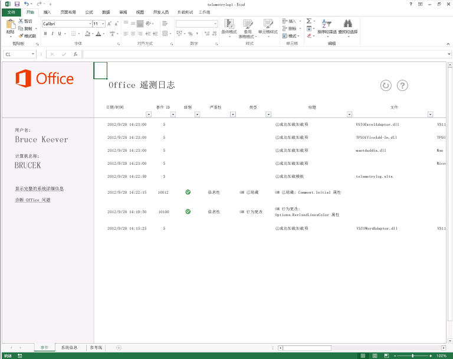

# 疑难解答遥测日志的 Office 文件和自定义解决方案

使用 Office 2013 遥测日志确定 Office 2013 的兼容性问题，并确定为 Office 的早期版本生成的解决方案。
  
以下文章介绍了遥测日志及其使用方法。有关遥测日志中显示的特定结果的详细信息，请参阅[Office 中的兼容性问题](compatibility-issues-in-office.md)。

在许多发行版的生命周期内，Microsoft 已提供了用于自定义、自动化和扩展 Office 的工具和框架。这让公司和用户能够为 Office 应用程序生成解决方案或外接程序以提高其工作效率和绩效。就复杂度而言，这些解决方案可以是简单的 Visual Basic for Applications (VBA) 宏，也可以是可靠的 .NET Framework 自定义。许多拥有这些解决方案的用户依赖它们完成关键业务任务，但是，他们甚至可能不知道他们正在使用已添加到其 Office 应用程序中的自定义。
  
使用如此大量的 Office 解决方案，升级 Office 的版本可能很复杂。公司和用户不知道其重要且颇具价值的解决方案是否完全与新版本兼容。他们的解决方案可能使用了在 Office 的上一个版本中可用却在更高版本中被弃用的功能和计算机代码。如果使用了弃用的功能的解决方案被加载到了"宿主"应用程序，那么该解决方案可能表现异常、引发错误、无法加载或使宿主应用程序失败。
  
Office 2013 遥测日志（基于 Excel 2013 构建的工具）帮助开发人员和有经验的用户通过显示所选 Microsoft Office 2013 应用程序内发生的事件来诊断兼容性问题。使用此工具，用户可以确定他们在其工作环境中使用的加载项的潜在问题，同时，向公司决策者提供他们需要的信息以决定是否升级到 Office 2013。遥测日志还提供有关 Office 2013 应用程序的对象模型中的特定更改或不推荐使用的情况的详细反馈，这可帮助开发人员可以迅速找出和重构有问题的代码或控件。IT 专业人员可以通过使用 Office 2013 遥测仪表板（遥测日志的辅助工具）查看多个客户端中的解决方案运行状况的趋势。
  
有关详细信息，请参阅[部署 Office 遥测仪表板](https://technet.microsoft.com/library/f69cde72-689d-421f-99b8-c51676c77717)。
  
## 遥测日志的工作方式

当加载、使用或关闭 Office 文件或解决方案，或它在所选的其中一个 Office 2013 应用程序中引发错误时，该应用程序将在本地数据存储区（同一计算机的数据库）中添加一个包括该事件的信息的记录。该记录包括事件的标题、记录该事件的应用程序、时间、文件或解决方案的名称、严重程度以及有关任何可能已发生的错误的简单描述。在刷新时，遥测日志工作簿将显示本地数据存储区中包含的一系列记录。
  
> [!NOTE]
> 本地数据存储区的默认位置是 %Users%\[Current user]\AppData\Local\Microsoft\Office\15.0\Telemetry。数据存储区默认的最大大小为 5 MB (5,120 KB)。 
  
所选的 Office 2013 应用程序具有一个运行时日志记录 API，每当文件或解决方案引发以下某个事件时，它便会在本地数据存储区中创建一个记录：
  
- **OnLoad**：文件或解决方案加载到特定 Office 2013 应用程序时在本地数据存储区中记载的记录。该运行时错误日志记录会在发生 **OnLoad** 事件时，在本地数据存储区中记录文件名称、位置和其他信息。 
    
- **OnClose**：在应用程序内关闭文件或解决方案时记载的记录。该记录包括解决方案或文件的名称、位置以及记录该事件的应用程序。
    
- **OnError**：在特定的 Office 2013 应用程序的解决方案中发现错误时记载的记录。该记录包括该解决方案或文件的名称，以及用户遇到的运行时故障或兼容性问题。 如果可能，这些错误将被映射到已知的兼容性问题，并在遥测日志中作为兼容性问题显示。
    
遥测日志显示有关所选 Office 2013 应用程序的文件和解决方案类型的一个大型列表的信息。由运行时日志记录 API 监视的文件和解决方案的类型因应用程序而异。有关哪些种类的解决方案被监视的详细信息，请参阅表 1。
  
### 表 1. 遥测日志中跟踪的 Office 文件和解决方案的类型

|**解决方案类型**|**应用程序**|**说明**|
|:-----|:-----|:-----|
|任务窗格应用程序    |Excel 2013、Word 2013 和 Project 2013    |它们是承载在客户端应用程序内的任务窗格中的 Office 外接程序。    |
|内容应用程序    |Excel 2013    |它们是集成到 Office 文件的内容中的 Office 外接程序。    |
|邮件应用程序    |Outlook 2013    |它们是满足特定条件（电子邮件正文或主题包括特定单词或词组）时会出现在 Outlook 2013 中的应用。    |
|活动文档    |Word 2013    PowerPoint 2013    Excel 2013    | 活动文档是除了此表列出的其他解决方案类型的任何 Office 文档文件，包括以下这些：     Office 二进制格式文件 （.doc、 .ppt、 .pps 和 .xls）。     Office OpenXML 格式文件 （.docx、 .pptx、 .ppsx 和 .xlsx）。     包含 VBA 代码的启用了宏的文件 （.docm、 .dotm、 .pptm、 .potm、 .xlsm 和 .xltm）。     包含 ActiveX 控件的文件。     具有"外部数据连接"的文件    |
|COM 加载项    |Word 2013    PowerPoint 2013    Excel 2013    Outlook 2013    |COM 外接程序包括 Visual Studio 2010 中的 Office 开发工具 应用程序级外接程序。    |
|Excel 自动化加载项    |Excel 2013    |此解决方案类型包括上一个版本的支持 Excel 的自动化加载项，它是在 COM 加载项上生成的。自动化加载项中的功能可以从 Excel 工作表的公式中调用。    |
|Excel XLL 加载宏    |Excel 2013    |XLL 加载宏 (.xll) 特定于 Excel，是使用任何支持生成 DLL（动态链接库）的编译器生成的。它们不是必须安装或注册的。XLL 加载宏也包括包含用户定义的命令和功能的 DLL。    |
|Excel XLS RTD 外接程序    |Excel 2013    |XLS 实时数据 (RTD) 加载项是使用 **RealTimeData** 工作表函数调用"自动化"服务器以检索实时数据的 Excel 工作表。    |
|Word WLL 加载项    |Word 2013    |WLL (.wll) 加载项特定于 Word，它是使用任何支持构建 DLL 的编译器构建的。    |
|应用程序加载项    |Word 2013    PowerPoint 2013    Excel 2013    |应用程序加载项是包含 VBA 代码的应用程序特定的文件，其中包括启用了宏的 Word 模板 (.dotm)、Excel 加载项（.xla, .xlam）和 PowerPoint 加载项（.ppa, .ppam）。    |
|模板    |Word 2013    PowerPoint 2013    Excel 2013    |模板包括附加到 Office 文件的文档（.dot 和 .dotx）、工作表（.xlt 和 .xltx）或演示文稿（.pot 和 .potx）模板。    |
   
## 使用 Office 遥测日志

当您安装 Office 2013 时，将会安装遥测日志，在同一计算机上创建本地数据存储区，并在先前列出的 Office 2013 应用程序中启用运行时日志记录 API。但是，必须先在应用程序中加载或打开解决方案或文件，遥测日志才可以开始监视它。
  
使用以下过程显示遥测日志中记录的 Office 问题。 
  
### 使用遥测日志

1. 若要打开遥测日志，请执行以下操作之一：
    
   - **在 Windows 7 上：** 在“开始”**** 菜单上，选择“所有程序”****。 然后，在程序列表中，展开“Microsoft Office 2013”****，接着展开“Office 2013 工具”****，然后单击“Office 2013 遥测日志”****。
    
     打开 Excel 2013 中的新工作簿。 工作簿含有三个工作表，名称分别为“事件”****、“系统信息”**** 和“指南”****。
    
   - **在 Windows 8 上：** 向上轻扫以显示 AppBar，选择“所有应用”****，然后选择“Office 2013 遥测日志”****。
    
     打开 Excel 2013 中的新工作簿。 工作簿含有三个工作表，名称分别为“事件”****、“系统信息”**** 和“指南”****。
    
2. 若要查看最新的事件列表，请在“事件”**** 工作表中，在工作表顶部选择“刷新”****。
    
3. 若要查看从 Office 2013 应用程序收集的事件数据，请查看“事件”**** 工作表上显示的表。 
    
4. 若要查看有关安装了 Office 2013 和遥测日志的计算机的信息，请审阅“系统信息”**** 工作表上显示的信息。 
    
> [!NOTE]
> 没有必要为了保留结果记录而在 Excel 2013 中保存遥测日志工作簿，因为信息存储在本地数据存储区（它和遥测日志是分开的）中。不过，保存该工作薄不会损坏遥测日志。 
  
遥测日志显示一些有关已记录事件的简单信息。遥测日志中显示的每个记录都包含一个标题，并列出所显示事件的严重性。对于错误，记录还包括错误的描述，以及解决该问题的步骤。请注意，并非所有显示的记录都表示 Office 解决方法引发的错误；遥测日志还会显示解决方案和文件何时成功加载或关闭。 
  
例如，如果 Word 2013 中打开的解决方案或启用了宏的文件试图获取与某评论相关联的评论员的缩写，那么将会出现标题为"OM 已隐藏: Comment.Initial 属性"的问题。Word 2013 提供了一项改进的评论功能体验，即默认情况下不显示评论员缩写。与较早的评论功能模型关联的 API 在 Word 2013 对象模型中已被隐藏，但仍出于向后兼容性目的而保持可用。中的"OM 已隐藏: Comment.Initial"问题表示试图使用该 API 的文件、引发事件的应用程序 (Word 2013)、事件的时间和日期以及有关错误和如何修复错误的简短描述。
  
**图 1. Office 遥测日志**
  

  
> [!NOTE]
>  遥测日志中的“系统信息”**** 工作表包含有关安装 Office 2013 的计算机的信息。 此工作表显示以下信息： 
> - 用户名。
> - 计算机全名。
> - 操作系统（x64/64 位或 x86/32 位）的体系结构
> - 该计算机上安装的 Windows 版本。
> - 计算机的内部时钟的时区。
> - 遥测日志的版本。
> - 在计算机上安装的 Office 版本。
> 
> 解释“事件”**** 工作表上列出的问题和事件时，此信息可能有用。 
  
在遥测日志中，严重性级别和已知问题显示在一起。从上一个示例可以看出，其中一部分对象模型已隐藏的问题大多数情况下具有"信息"级别的严重性。另一方面，其他已知问题可能更严重，需要立即采取行动。遥测日志中显示的问题的严重性可以是以下其中一种。
  
- **信息**该问题可能对应用程序的兼容性没有直接的影响，但是稍后用户必须采取措施。"OM 已隐藏"类型的许多问题都具有此严重性级别。 
    
- **警告**该问题可能导致数据丢失或导致外观一致性降低。 
    
- **关键**该问题可能导致功能的重大缺失或使得该应用程序崩溃。 
    
### 表 2. 遥测日志中显示的事件的类型

使用下表（表 2）解释遥测日志中显示的记录。
  
|**事件 ID**|**标题**|**严重性**|**说明**|
|:-----|:-----|:-----|:-----|
|1    |文档已成功加载    ||“文件”**** 列中列出的文件在 Office 应用程序中打开，未出现任何问题。    |
|2    |文档无法加载    |警告    | 该应用程序不能加载该文件。可能有一些基础兼容性问题。    有关如何修复 Excel 2013 中损坏的工作簿的详细信息，请参阅[修复损坏的工作簿](https://office.microsoft.com/en-us/excel-help/repairing-a-corrupted-workbook-HA102749554.aspx)。  有关如何修复 Word 2013 中损坏的文档的详细信息，请参阅 [保存和恢复文档的备份副本](https://office.microsoft.com/en-us/word-help/save-and-recover-a-backup-copy-of-a-document-HA010121250.aspx)。   |
|3    |模板已成功加载    ||“文件”**** 列中列出的模板文件在 Office 应用程序中打开，未出现任何问题。    |
|4    |模板无法加载    |警告    | 应用程序不能加载模板文件。可能有一些基础兼容性问题，或者该模板的可用性可能已改变。    有关如何修复 Excel 2013 中损坏的工作簿的详细信息，请参阅[修复损坏的工作簿](https://office.microsoft.com/en-us/excel-help/repairing-a-corrupted-workbook-HA102749554.aspx)。  有关如何修复 Word 2013 中损坏的文档的详细信息，请参阅 [保存和恢复文档的备份副本](https://office.microsoft.com/en-us/word-help/save-and-recover-a-backup-copy-of-a-document-HA010121250.aspx)。   |
|5    |加载项成功加载    ||在 Office 应用程序中成功加载了“文件”**** 列内列出的加载项。没有检测到兼容性问题。  |
|6    |外接程序无法加载    |关键    | 应用程序无法加载“文件”**** 列中列出的加载项。    有关如何修复 Excel 2013 中损坏的工作簿的详细信息，请参阅[修复损坏的工作簿](https://office.microsoft.com/en-us/excel-help/repairing-a-corrupted-workbook-HA102749554.aspx)。     有关如何修复 Word 2013 中损坏的文档的详细信息，请参阅 [保存和恢复文档的备份副本](https://office.microsoft.com/en-us/word-help/save-and-recover-a-backup-copy-of-a-document-HA010121250.aspx)。   |
|7    |外接程序清单已成功下载    ||主机应用程序成功加载 Office 外接程序清单。    |
|8    |外接程序清单未下载    |关键    |主机应用程序无法从 SharePoint 目录、企业目录或 Office 外接程序加载 Office 商店的清单文件。    |
|9    |无法分析外接程序清单    |关键    |主机应用程序加载了外接程序的 Office 外接程序清单，但不能读取 XML。    |
|10    |外接程序占用了太多 CPU    |关键    |在有限的时间内，Office 外接程序使用了超过 90% 的 CPU 资源。    |
|11    |加载时应用程序崩溃    |关键    |当 Office 应用程序启动时，它试着加载文档或解决方案，但是该文档或解决方案的问题阻止了应用程序启动。    |
|12    |由于出现问题，应用程序已关闭    |关键    |应用程序中引发了关键错误，需要关闭它。    |
|13    |文档已成功关闭    ||“文件”**** 列中列出的文件成功关闭。    |
|14    |应用程序会话的时间已延长    ||打开特定文档或解决方案的应用程序会话应该只持续 24 小时。如果会话超过了 24 小时，宿主应用程序将创建一个新会话。    |
|15    |由于字符串搜索超时，外接程序已被禁用    ||邮件加载项搜索主题行和电子邮件中的信息以确定是否应通过使用正则表达式将其显示。 Outlook 2013 禁用“文件”**** 列中列出的邮件应用，因为在尝试匹配正则表达式期间其会反复超时。    |
|16    |应用程序崩溃时，文档已打开    |关键    |当（应用程序列中列出的）应用程序发生故障时，“文件”**** 列列出的文件是打开的。该文件可能应对“应用程序”**** 故障负责，也可能不需要负责。  |
|17    |外接程序已成功关闭    |信息    |应用程序能够成功关闭加载项。    |
|18    |应用程序已成功关闭    ||主机应用程序能够成功关闭 Office 外接程序。    |
|19    |外接程序遇到运行时错误    |关键    |Office 外接程序 遇到一个导致它失败的问题。有关详细信息，请使用遇到错误的计算机上的 Windows 事件查看器查看 Microsoft Office 警报日志。    |
|20    |外接程序未能验证许可    |关键    |Office 外接程序 的许可信息无法验证，或者可能已过期。有关详细信息，请使用遇到错误的计算机上的 Windows 事件查看器查看 Microsoft Office 警报日志。    |
|各种    |"OM 行为更改: ..."    |信息    |该加载项或启用了宏的文档代码使用了与在上一个 Office 版本中表现不同的对象、成员、集合、枚举或常数。   有关详细信息，请参阅[Office 中的兼容性问题](compatibility-issues-in-office.md)。    |
|各种    |"OM 已移除: …"    |关键    |加载项或启用了宏的文档代码使用了已从对象模型中删除的对象、成员、集合、枚举或常数。  有关详细信息，请参阅[Office 中的兼容性问题](compatibility-issues-in-office.md)。    |
|各种    |"OM 已隐藏: …"    |信息    |加载项或启用了宏的文档代码使用了在对象模型中已隐藏的对象、成员、集合、枚举或常数。  有关详细信息，请参阅[Office 中的兼容性问题](compatibility-issues-in-office.md)。    |
|各种    |"控件: …"    ||该文件包含一个在 Office 2013 或计算机的操作系统中可能不被支持的控件。  有关详细信息，请参阅[Office 中的兼容性问题](compatibility-issues-in-office.md)。    |
   
## 结论

遥测日志向大企业、单个用户以及开发人员提供了简单的工具来监视其关键的 Office 解决方案。通过在大规模升级之前找出存在问题的 Office 解决方案，企业可以更合理地预测采用 Office 2013 的成本。
  
## 另请参阅

- [Office 开发人员中心](https://msdn.microsoft.com/office/aa905340.aspx)
- [Office 中的兼容性问题](compatibility-issues-in-office.md)
- [部署 Office 遥测仪表板](https://technet.microsoft.com/library/f69cde72-689d-421f-99b8-c51676c77717)
- [Office 开发人员中心](https://msdn.microsoft.com/office/aa905340)
    

