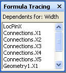

# 关于公式跟踪窗口

**“公式跟踪”** 窗口用来向形状开发人员提供与单元格之间相互依赖关系有关的信息 — 这些单元格既包括从属单元格（与给定单元格有从属关系的单元格），也包括引用单元格（给定单元格所依赖的单元格）。 
  
Microsoft Visio ShapeSheet 中的单元格包含值和公式。 公式反过来，可以为您提供的强大功能来计算中基于另一个单元格的值的一个单元格的值，其他单元格的引用。 在创建或维护复杂的形状，但是，它可能很难确定所有这些依赖关系，因为公式可以引用在绘图中，任何单元格的单元格中相同的 ShapeSheet 或在绘图中，另一个对象所属于的单元格是否例如，页面、 样式、 master 或另一个形状。 
  
**公式跟踪**窗口提供信息以帮助您理解对单元格所做的更改的含义。 
  
## 显示公式跟踪窗口

若要查看**公式跟踪**窗口处于活动状态，在**ShapeSheet 工具**下在 ShapeSheet 窗口 * * 设计 * * 选项卡的**公式跟踪**组中，单击**显示的窗口**。 **公式跟踪**窗口停靠在 ShapeSheet 窗口中默认情况下显示，但可停靠、 浮动或合并与其他可用锚定 ShapeSheet 窗口，例如，**样式资源管理器**窗口锚定的窗口。 
  
## 追踪从属单元格

要查看从属于某个特定单元格的单元格的列表，请在 ShapeSheet 窗口中选择该单元格。在本例中，选择了 Width 单元格。 
  

  
若要查看其从属单元格，在**公式跟踪**组中，单击**追踪从属单元格**。
  
从属于 Width 单元格的所有单元格的列表将出现在 **“公式跟踪”** 窗口中。通过双击 **“公式跟踪”** 窗口中的条目，您可以浏览到该列表中的任何单元格。 
  

  
## 跟踪 precendent 单元格

要查看某个特定单元格所依赖的单元格列表，请在 ShapeSheet 窗口中选择该单元格。在本例中，选择了 Geometry1.X2 单元格。 
  

  
若要查看其引用单元格，在**公式跟踪**组中，单击**追踪引用单元格**。
  
在**公式跟踪**窗口中显示的所有单元格 Geometry1.X2 单元格所依赖于列表。 通过双击在**公式跟踪**窗口中的条目，您可以导航到列表中的任意单元格。 
  

  

