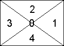

# RECTSECT 函数

计算矩形*x*和*y*相关联的扇区并返回一个指示扇区的整数 0 到 4。 
  
## 语法

RECTSECT (* **宽度** *，* **高度** *，* * *x* * *，* * *y* * *，* **选项** *) 
  
### 参数

|**名称**|**必需/可选**|**数据类型**|**说明**|
|:-----|:-----|:-----|:-----|
| _width_   |必需    |**字符串**   |矩形的宽度。    |
| _height_   |必需    |**字符串**   |矩形的高度。    |
| _x_   |必需    |**字符串**   |x 坐标。    |
| _y_   |必需    |**字符串**   |y 坐标。    |
| _选项_   |必需    |**Boolean**   |指定如何处理对角线上的点。将该值设置为 0，表示将左右部分用作对角线上的点。将该值设置为 1，表示将上下部分用作对角线上的点。    |
   
## 注解

请考虑矩形的*宽度*和*高度*，从该矩形的中心点点 （*x，y*）。 绘制通过要划分为四个部分和中心点的矩形的对角线。 扇区 0 到 4 表示中心点、 右、 top、 左，并分别下。 
  

  
## 示例

RECTSECT(1 in, 2 in, 1 in, -7 in, 0) 
  
返回 4。 
  

