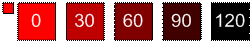

# SHADE 函数SHADE Function

通过按_int_参数中指定的量 (正数或负数) 降低亮度来修改颜色。Modifies the color by decreasing its luminosity by the amount (positive or negative) specified in the  _int_ parameter. 
  
## 语法Syntax

底纹 (\* **颜色** \*, \* \* *int* \* \*)SHADE(\*\* *color* \*\*, \*\* *int* \*\* ) 
  
### 参数Parameters

|**名称****Name**|**必需/可选****Required/Optional**|**数据类型****Data Type**|**说明****Description**|
|:-----|:-----|:-----|:-----|
| _color__color_   |必需Required    |**Numeric****Numeric**   |Microsoft Visio 颜色的颜色索引或 RGB 值。The Microsoft Visio color index or RGB value of the color.    |
| _int__int_   |必需Required    |**Integer****Integer**   |颜色发光度降低的数量。The amount by which to decrease the luminosity of the color. 可以是正数或负数。Can be positive or negative.    |
   
### 返回值Return value

 **RGB****RGB**
  
## 注解Remarks

发光度的上限和下限分别为 0 和 240。The upper and lower limits of luminosity are 0 and 240 respectively. 对于可以传递给_int_参数的整数大小没有限制, 但发光度不会超过这些限制。There is no limit on the size of the integer you can pass for the  _int_ parameter, but luminosity never exceeds these limits. 
  

  

