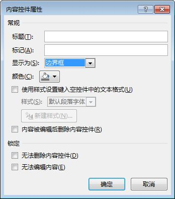
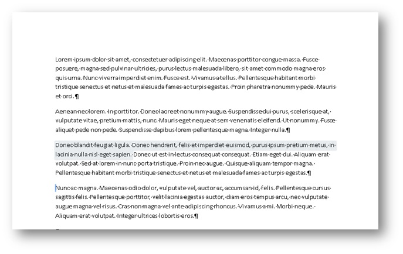
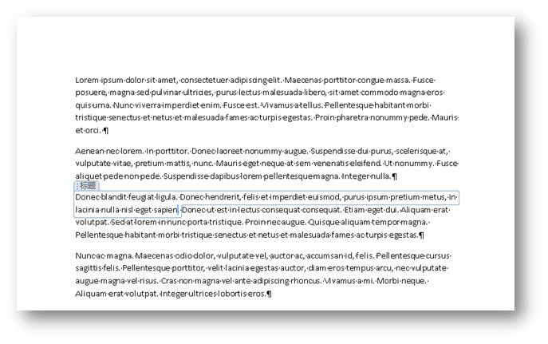
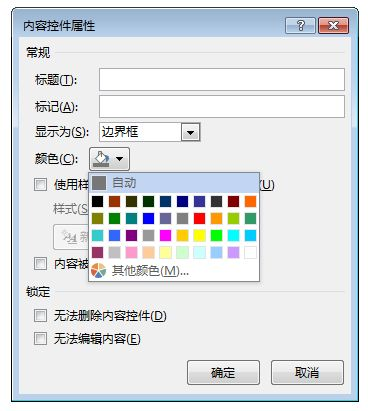
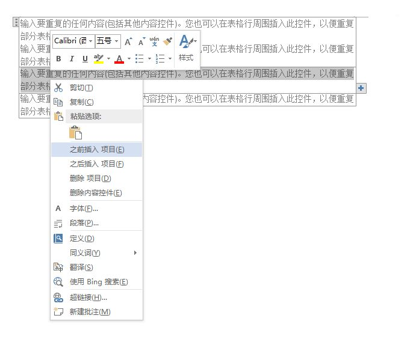
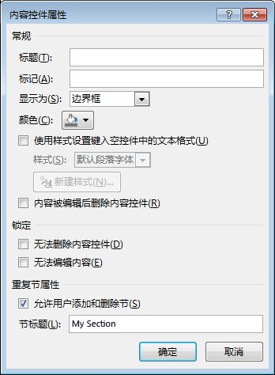
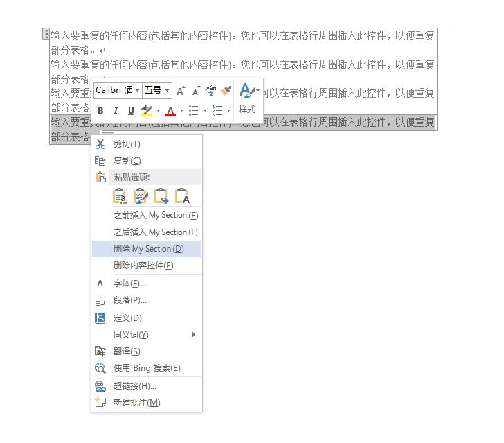
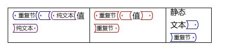
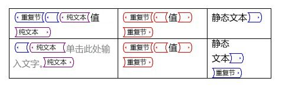

# <a name="content-controls-in-word"></a>Word 中的内容控件

了解 Microsoft Word 2013 内容控件如何启用较大范围的结构化文档方案。

本主题提供有关 Microsoft Word 2013 中内容控件的更改以及启用这些更改的文档方案的信息。
  
### <a name="structured-documents"></a>结构化文档
<a name="WordCC_StructuredDocs"> </a>

结构化文档是这样一种文档，控制内容可以在文档的何处显示，文档中可以显示的内容类型以及能否编辑此内容。
  
下面是 Microsoft Word 中结构化内容的一些常见应用场景：
  
- 法律公司需要创建一些文档，其中包含用户不应更改的法律用语。
    
- 企业需要创建用户只可以输入标题、作者和日期的计划书封面。
    
- 企业需要创建一些发票，其中客户数据包含在发票预定义区域中。
    
### <a name="using-content-controls-to-structure-a-document"></a>使用内容控件来整理文档
<a name="WordCC_StructuredDocs"> </a>

内容控件是指 Microsoft Word 实体，它们用作文档中特定内容的容器。 单个内容控件可包含诸如日期、列表或格式化文本段落之类的内容。 内容控件可以帮助你创建丰富而结构化的内容基块，这些控件设计用于在文档中插入定义明确基块的模板当中，以此创建结构化的文档。
  
内容控件非常适合创建结构化的文档，因为内容控件可以帮助您修复内容的位置，指定内容类型（例如，日期、图片或文本），限制或启用编辑，以及将语义含义添加到内容中。
  
### <a name="content-controls-in-word-2010"></a>Word 2010 中的内容控件
<a name="WordCC_StructuredDocs"> </a>

以下内容控件可以在 Word 2010 中使用：
  
- 格式文本
    
- 纯文本
    
- 图片
    
- 构建基块库
    
- 组合框
    
- 下拉列表
    
- 日期
    
- 复选框
    
- 组
    
Word 2010 内容控件支持各种潜在的结构化文档解决方案，但在 Word 2013 中的内容控件可以支持更多的方案。
  
## <a name="content-control-improvements-in-word-2013"></a>Word 2013 中的内容控件改进
<a name="WordCC_WhatsNew"> </a>

在 Word 2013 中，内容控件提供了三个重要的改进：改进的可视化、支持格式文本内容控件的 XML 映射以及适用于重复内容的新内容控件。
  
### <a name="improved-visualization"></a>改进的可视化

Word 2013 允许单个内容控件以三种可能的状态之一显示：
  
- 边界框
    
- 开始/结束标记
    
- 无
    
> [!NOTE]
> 如果不是另有声明，本节讨论了当此文档无法在“**设计模式**”下查看时，内容控件的可视化。通过使用“**内容控件属性**”对话框中的“**显示为**”下拉列表控件来设置内容控件的显示模式。 
  
**图 1. 内容控件属性对话框**


  
你还可以通过使用 Word 2013 对象模型（稍后将在[新的 Word 2013 内容控件对象模型成员](#WordCC_NewOM)中进行讨论）来设置内容控件的显示模式。
  
### <a name="bounding-box"></a>边界框
<a name="WordCC_DefaultRendering"> </a>

对 Word 2013 中内容控件的默认呈现是为了保留在 Word 2007 和 Word 2010 中显示的内容控件的外观；即，作为一个边界框显示。 将内容设置为显示为“**边界框**”时，显示的效果会随以下用户交互而改变：
  
- 在内容控件没有焦点时，无可视化效果
    
- 鼠标悬停在内容控件上时，显示为阴影矩形
    
**图 2. 鼠标悬停在内容控件上**


  
- 在内容控件有焦点时（在用户选择此内容控件时），该控件显示为“边界框”（如果设置了标题，则围绕着内容和标题显示一行）
    
**图 3. 具有焦点的内容控件**


  
### <a name="startend-tags"></a>开始/结束标记
<a name="WordCC_StartEndTags"> </a>

在设置内容控件显示为“**开始/结束标记**”时，不管用户如何交互，都会显示标记，始终不显示标题；但是在鼠标悬停时会显示按钮，如“**下拉列表**”按钮。 
  
**图 4. 设置内容控件显示为开始/结束标记**


  
### <a name="none"></a>无
<a name="WordCC_Invisible"> </a>

在设置内容控件显示为“**无**”时，不显示内容控件。
  
### <a name="content-control-colorization"></a>内容控件着色
<a name="WordCC_CCColorization"> </a>

除了支持不同的内容控件显示方式外，Word 2013 还可以帮助你设置单个内容控件的颜色。 可以使用“**内容属性**”对话框中的“**颜色**”按钮来设置内容控件的颜色。 
  
还可以通过使用 Word 2013 对象模型（稍后将在[新的 Word 2013 内容控件对象模型成员](#WordCC_NewOM)中进行讨论）来设置内容控件的颜色。
  
**图 5. 内容控件属性对话框**


  
### <a name="support-for-xml-mapping-for-rich-text-content-controls"></a>支持格式文本内容控件的 XML 映射
<a name="WordCC_XMLMapping"> </a>

Word 2013 可帮助你将格式文本内容控件和文档构建基块内容控件的内容映射到 XML 数据存储区。 若要执行此操作，你要设置用于内容控件的 *XML 映射*。 可以通过使用此对象模型中现有的 **XMLMapping.SetMapping** 方法来设置此属性。 在自定义的 XML 部件中，自定义的 XML 存储为（通过使用标准 XML 编码）转换成字符串的 Flat Open XML 标记，因此，在自定义的 XML 部件中可以将其存储为文本节点。 但是，此映射继续受到一个限制，即它只能成功映射到叶节点或属性。 
  
> [!NOTE]
> 格式文本内容控件不能包含其他格式文本内容控件。如果一个格式文本内容控件位于另一个格式文本内容控件之中（例如，由于文件格式操作、复制和粘贴等），则它处于未链接的状态，直到它不再包含在一个映射的格式文本控件之中。 
  
有关如何设置 XML 映射的详细信息，请参阅本主题后面的[新的 Word 2013 内容控件对象模型成员](#WordCC_NewOM)一节。 
  
### <a name="supporting-repeating-content"></a>支持重复内容
<a name="WordCC_SupportingRepeating"> </a>

除了可视化增强功能和支持对格式文本内容控件的 XML 映射外，Word 2013 还添加了新的内容控件，使你能够重复内容。 重复节内容控件重复所包含的内容，包括其他内容控件。
  
您可以围绕整个段落或表行插入重复的节内容控件。一旦此控件包围一节，您可以在所包含的节的上方或下方插入该节的副本。
  
**图 6. 重复节内容控件上下文菜单**


  
你可以通过使用此内容控件结尾的控件（显示为带有一个加号（）的按钮）或通过选择上下文菜单上的命令来重复插入的节，如图 6 所示。 重复的内容成为此控件的单独一节，通过使用“**内容控件属性**”对话框，你可以为此节指定标题。 
  
**图 7. 在内容控件属性对话框中指定节标题**


  
为此节指定标题后，如果在“**内容控件属性**”对话框中选择“**允许用户添加和删除节**”，则用户可以按名称来添加或删除节。 
  
**图 8. 使用重复节内容控件上下文菜单来删除节**


  
当重复节内容控件包围其他内容控件时，封装的内容控件在每个新项中重复；但是任何此类内容控件都将其内容重置为占位符文本。有两个保留了子控件内容的例外情况： 
  
- 当子控件为重复节控件时。
    
- 当子控件为 XML 映射到的重复节内容控件外部的节点时。
    
**图 9. 在重复前包含子控件的重复节内容控件**


  
**图 10. 在重复后包含子控件的重复节内容控件**


  
### <a name="repeating-section-content-controls-around-xml-mapped-controls"></a>围绕 XML 映射的控件的重复节内容控件
<a name="WordCC_RepeatingSectionCCs"> </a>

对于重复节中所包含的 XML 映射，Word 2013 对它们的映射如下所示。
  
如果该映射不与作为其父链一部分的节点集中的某个项交叉，则此绑定是“绝对绑定”，并在所有的重复节项中显示相同内容。
  
如果该映射与作为其父链一部分的节点集中的某个项交叉，则此绑定是“相对绑定”，并重新映射，如下所示：
  
- 确定节点的绝对绑定（延展任何查询表达式）─ 这应该在初始映射时发生
    
- 删除与节点集交叉的绑定轴
    
- 相对于 XPath 的重复节内容项评估 XPath 的其余部分
    
例如，可能发生以下映射：
  
- 重复节映射到 \root\next\path
    
- 示例项中的控件映射到 \root\next\path[2]\baz
    
- Word 将 \root\next\path[2] 匹配到节点集中的某个项
    
因此，将此绑定作为 .\baz 进行评估，其中的基础是重复内容项的节点。
  
使用重复内容控件的以下建议可以帮助您防止数据丢失，并避免产生挫折感。
  
### <a name="working-with-repeating-section-content-controls-that-are-mapped-to-xml-data"></a>使用映射到 XML 数据的重复节内容控件
<a name="WordCC_RepeatingSectionCCs"> </a>

如果你插入一个映射到 XML 数据的重复节内容控件，在用户每次重新打开此文档时，Word 会根据数据存储区中的信息，重新创建重复节项。 即使你保存了文档，用户在此没有映射到数据存储区的文档的重复节项中所做的任何更改都会丢失。
  
若要有助于防止这种情况发生，请锁定重复节内容控件，并允许用户只在映射到 XML 的未锁定子内容控件中进行编辑。
  
### <a name="binding-a-repeating-section-content-control-to-a-table"></a>将重复节内容控件绑定到表
<a name="WordCC_RepeatingSectionCCs"> </a>

如果想将重复节内容控件绑定到表，请插入表，*然后*插入重复节内容控件，而不能颠倒这两者的插入顺序。 （否则，你无法只选择表）。 
  
### <a name="nesting-repeating-section-content-controls-within-a-table"></a>在表中嵌套重复节内容控件
<a name="WordCC_RepeatingSectionCCs"> </a>

当添加或删除内部节的一个项时，在表中紧密地嵌套重复节内容控件（例如，当父和子的重复节内容控件的末尾位于同一单元格时）会导致删除外部重复节。
  
你可以通过在一个重复节内容控件的末尾和下一个重复节内容控件之间添加一个段落标记来防止这一情况发生。 要隐藏段落标记，请在功能区的“**主页**”选项卡上取消选中“**显示/隐藏**”。 
  
### <a name="open-xml-file-format-schema-additions"></a>Open XML 文件格式架构的添加项
<a name="WordCC"> </a>

以下元素添加到 WordprocessingML Open XML 文件格式架构中。
  
**表 1. 适用于内容控件的 WordprocessingML Open XML 文件格式架构中的新元素**

|**元素**|**说明**|
|:-----|:-----|
|\<w:appearance\>  <br/> |\<w:appearance\> 是 \<w:sdtPr\> 的子元素。  <br/> 以下值对 val 属性有效：  <br/> \<w:appearance val= boundingBox|标记|已隐藏。  <br/> 默认值为 boundingBox。  <br/> |
|\<w:color\>  <br/> |\<w:color\> 是 \<w:sdtPr\> 的子元素。  <br/> 此内容模型与现有的 CT_Color 复杂类型相匹配。默认值是 Word 2010 中所使用的颜色。  <br/> |
   
## <a name="new-word-2013-content-control-object-model-members"></a>新的 Word 2013 内容控件对象模型成员
<a name="WordCC_NewOM"> </a>

通过 Word 2013 中内容控件的新增强功能和添加项，更新了 Word 的对象模型，以便进行新功能集的编程操作。 此外，还对 Word 处理文档的基础 Open XML 文件格式进行了更改。
  
以下几节提供与每个内容控件增强功能相关的特定对象模型更改的详细信息。
  
### <a name="visualization-enhancements"></a>可视化增强功能
<a name="WordCC_VisEnhancements"> </a>

Word 2013 中包含多个对象模型添加项，以便实现内容控件的可视化增强功能。 下表列出了用于可视化的 **ContentControl** 对象的新成员。 
  
**表 2. 新 ContentControl 对象成员**

|**成员**|**说明**|
|:-----|:-----|
|. **Appearance** 为 **WdContentControlAppearance** <br/> |获取或设置内容控件的可视化。  <br/> |
|. **Color** 为 **WdColor** <br/> |获取或设置内容控件的颜色。  <br/> |
   
下表列出了新 **WdContentControlAppearance** 枚举中的常量。 
  
**表 3. 新 WdContentControlAppearance 枚举的常量**

|**常量**|**说明**|
|:-----|:-----|
|**wdContentControlBoundingBox** <br/> |表示显示为阴影矩形/边界框（带可选标题）的内容控件。  <br/> |
|**wdContentControlTags** <br/> |表示显示为开始/结束标记的内容控件。  <br/> |
|**wdContentControlHidden** <br/> |表示未显示的内容控件。  <br/> |
   
### <a name="code-sample"></a>代码示例
<a name="WordCC_VisEnhancements"> </a>

以下代码示例说明如何创建格式文本内容控件以及如何以编程方式设置可视化。
  
```vb
Sub testVisualization()
   Dim objcc As ContentControl
   Dim objRange As Range
   
   ' Get the first paragraph as a range object.
   Set objRange = ActiveDocument.Paragraphs(1).Range
   ' Create a rich text content control around the first paragraph.
   Set objcc = ActiveDocument.ContentControls.Add(wdContentControlRichText, objRange)
   objcc.Title = "Default Bounding Box"
   ' Set visualization to the default.
   objcc.Appearance = wdContentControlBoundingBox
   
   ' Create a new paragraph.
   objRange.InsertParagraphAfter
   Set objRange = ActiveDocument.Paragraphs(2).Range
   ' Create a rich text content control around the second paragraph.
   Set objcc = ActiveDocument.ContentControls.Add(wdContentControlRichText, objRange)
   objcc.Title = "Non Bounding"
   ' Set visualization to invisible.
   objcc.Appearance = wdContentControlHidden
   
   ' Create a new paragraph.
   objRange.InsertParagraphAfter
   Set objRange = ActiveDocument.Paragraphs(3).Range
   ' Create a rich text content control around the third paragraph.
   Set objcc = ActiveDocument.ContentControls.Add(wdContentControlRichText, objRange)
   objcc.Title = "Tags Only with Pink color"
   ' Set visualization to Start/End tags with pink color.
   objcc.Appearance = wdContentControlTags
   objcc.Color = wdColorPink
End Sub
```

### <a name="xml-mapping"></a>XML 映射
<a name="WordCC_XMLMappingOM"> </a>

没有对 Word 2013 对象模型添加任何操作来适应将格式文本映射到文档数据存储区中的 XML 节点。 而是使用现有对象模型来将格式文本内容控件映射到文档数据存储区中的 XML 节点。 此外，没有对基础 Open XML 文件格式 WordprocessingML 架构进行任何更改，此架构作为格式文本内容控件新包含的一部分，专用于支持 XML 映射。
  
#### <a name="code-sample"></a>代码示例

以下代码示例说明如何以编程方式将格式文本内容控件映射到 XML 节点。
  
```vb
Sub testRichBinding()
   Dim objRange As Range
   Dim objcc As ContentControl
   Dim objCustomPart As CustomXMLPart
   Dim blnMap As Boolean
   
   ' Add a custom XML part to the data store.
   Set objCustomPart = ActiveDocument.CustomXMLParts.Add
   ' Load XML fragment into the custom XML part.
   objCustomPart.LoadXML ("<x>Rich Text Databinding</x>")
   ' Get the first paragraph as a range object.
   Set objRange = ActiveDocument.Paragraphs(1).Range
   ' Create a rich text content control around the first paragraph.
   Set objcc = ActiveDocument.ContentControls.Add(wdContentControlRichText, objRange)
   ' Bind the XML node to the rich text content control.
   blnMap = objcc.XMLMapping.SetMapping("/x")
   ' Return whether mapping worked.
   MsgBox objcc.XMLMapping.IsMapped
End Sub
```

### <a name="repeating-section-content-controls-represented-in-the-object-model"></a>在对象模型中表示的重复节内容控件
<a name="WordCC_RepeatingSection"> </a>

通过使用 **ContentControl** 对象和新 **RepeatingSectionItem** 和 **RepeatingSectionItemColl** 对象的以下添加项，重复节内容控件在对象模型中可用。表 4 列出了 **ContentControl** 对象中针对重复节内容控件的最重要新成员。 
  
**表 4. ContentControl 对象成员**

|**成员**|**说明**|
|:-----|:-----|
|**AllowInsertDeleteSection** 为 **Boolean** <br/> |获取或设置用户是否可以使用 UI 添加或删除内容控件中的节。 如果对不是重复节类型的内容控件调用此属性，则调用失败并显示以下错误消息：“此属性只能用于重复节内容控件。”  <br/> |
|**RepeatingSectionItemTitle** 为 **String** <br/> |获取或设置上下文菜单中使用的重复节项的名称。 如果对不是重复节类型的内容控件调用此属性，则调用失败并显示：“此属性只能用于重复节内容控件。”  <br/> |
|**InsertRepeatingSectionItemBefore** 为 **ContentControl** <br/> |在当前项前面添加一个重复节项，并返回新的重复节项。 如果对不是重复节项类型的内容控件调用此方法，则调用失败并显示：“此属性只能用于重复节项内容控件。”  <br/> |
|**InsertRepeatingSectionItemAfter** 为 **ContentControl** <br/> |在当前项后面添加一个重复节项，并返回新的重复节项。 如果对不是重复节项类型的内容控件调用此方法，则调用失败并显示：“此属性只能用于重复节项内容控件。”  <br/> |
   
表 5 列出了 **RepeatingSectionItem** 对象最重要的成员。 
  
**表 5. RepeatingSectionItem 对象成员**

|**成员**|**说明**|
|:-----|:-----|
|**Range** 为 **Range** <br/> |返回指定重复节项的范围，不包括开始和结束标记。  <br/> |
|**Delete** <br/> |删除指定的重复节项。  <br/> |
|**InsertItemAfter** 为 **RepeatingSectionItem** <br/> |在指定项后面添加一个重复节项，并返回新项。  <br/> |
|**InsertItemBefore** 为 **RepeatingSectionItem** <br/> |在指定项前面添加一个重复节项，并返回新项。  <br/> |
   
表 6 列出了 **RepeatingSectionItemColl** 对象最重要的成员。 
  
**表 6. RepeatingSectionItemColl 对象成员**

|**成员**|**说明**|
|:-----|:-----|
|**Item** 为 **RepeatingSectionItem** <br/> |返回一个单独的重复节项。  <br/> |
   
表 7 显示了重复节内容控件 **WdContentControlType** 枚举的新成员。 
  
**表 7. WdContentControlType 枚举添加项**

|**常量**|**说明**|
|:-----|:-----|
|**wdContentControlRepeatingSection** <br/> |表示包含重复节中单个项的内容控件。  <br/> |
   
### <a name="code-sample"></a>代码示例
<a name="WordCC_RepeatingSection"> </a>

以下代码示例说明如何以编程方式使用重复节内容控件。
  
```vb
Sub testRepeatingSectionControl()
   Dim objRange As Range
   Dim objTable As Table
   Dim objCustomPart As CustomXMLPart
   Dim objCC As ContentControl
   Dim objCustomNode As CustomXMLNode
   
   Set objCustomPart = ActiveDocument.CustomXMLParts.Add
   objCustomPart.LoadXML ("<books>" & _
       "<book><title>Everyday Italian</title>" & _
       "<author>Giada De Laurentiis</author></book>" & _
       "<book><title>Harry Potter</title>" & _
       "<author>J K. Rowling</author></book>" & _
       "<book><title>Learning XML</title>" & _
       "<author>Erik T. Ray</author></book></books>")
   
   Set objRange = ActiveDocument.Paragraphs(1).Range
   Set objTable = ActiveDocument.Tables.Add(objRange, 2, 2)
   With objTable.Borders
       .InsideLineStyle = wdLineStyleSingle
       .OutsideLineStyle = wdLineStyleDouble
   End With
   Set objRange = objTable.Cell(1, 1).Range
   Set objCustomNode = objCustomPart.SelectSingleNode("/books[1]/book[1]/title[1]")
   Set objCC = ActiveDocument.ContentControls.Add(wdContentControlText, objRange)
   objCC.XMLMapping.SetMappingByNode objCustomNode
   Set objRange = objTable.Cell(1, 2).Range
   Set objCustomNode = objCustomPart.SelectSingleNode("/books[1]/book[1]/author[1]")
   Set objCC = ActiveDocument.ContentControls.Add(wdContentControlText, objRange)
   objCC.XMLMapping.SetMappingByNode objCustomNode
   Set objRange = objTable.Rows(1).Range
   Set objCC = ActiveDocument.ContentControls.Add(wdContentControlRepeatingSection, objRange)
   objCC.XMLMapping.SetMapping ("/books[1]/book")
End Sub
```

### <a name="open-xml-file-format-changes-for-repeating-section-content-controls"></a>Open XML 文件格式因重复节内容控件而异
<a name="WordCC_RepeatingSection"> </a>

通常，重复节内容控件的文件格式表示形式使用与现有 XML 标记相同的元素名称、值等；但 \<sdt\> 元素表示存在于 Word 2013 命名空间中的外部重复节容器，以确保与 Word 早期版本的兼容性。
  
使用现有的 WordprocessingML 表示形式将重复节内容控件（即包围每个单独项）中的单个重复项保存为格式文本内容控件。表 8 列出了 WordprocessingML 架构中针对重复节内容控件的新元素。
  
**表 8. 适用于重复节内容控件的 WordprocessingML 架构中的新元素**

|**元素**|**说明**|
|:-----|:-----|
|\<w15:repeatingSection\>  <br/> |指定一个重复节内容控件。此元素与所有其他控件类型相互排斥，且没有子元素或属性。  <br/> |
|\<w15:repeatingSectionItem\>  <br/> |指定一个重复节项内容控件。此元素与所有其他控件类型相互排斥，且没有子元素或属性。  <br/> |
|\<w15:doNotAllowInsertDeleteSection\>  <br/> |通过使用 Word 2013 中的用户界面，指定此用户无法添加或删除节。  <br/> |
|\<w15:sectionTitle\>  <br/> |指定重复节项（当选定此控件时，在上下文菜单中使用此重复节项）的名称。  <br/> |
   

  

